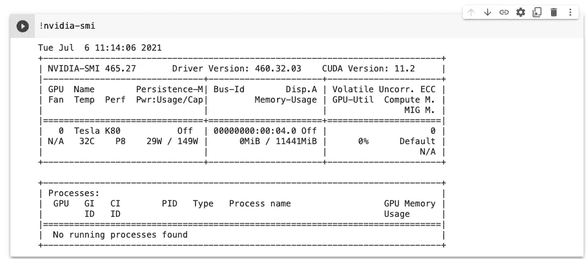
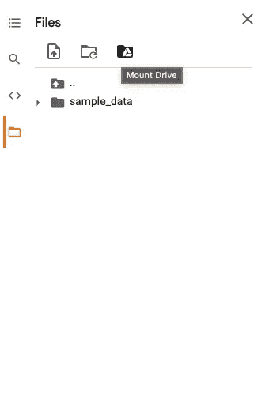
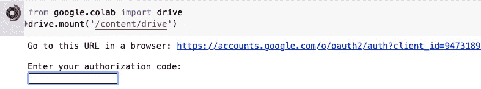

# 我在大多数人都能使用的计算资源上的不公平优势

> 原文：<https://towardsdatascience.com/my-unfair-advantage-in-computing-resources-that-are-accessible-to-most-people-5bb95932f247?source=collection_archive---------26----------------------->

## 如何将 Google Colab 推向极限

照片由[帕特里克·福尔](https://unsplash.com/@patrickian4?utm_source=medium&utm_medium=referral)在 [Unsplash](https://unsplash.com?utm_source=medium&utm_medium=referral) 拍摄

我在参加研究生机器学习课程时，开始使用谷歌协作实验室(Colab)，这是一个附带免费计算资源的 python 笔记本。

在最初的一两个月里，这是相当毁灭性的，因为相当比例的学生可以从他们的实验室或系里访问计算资源。试图通过免费 GPU 获得更高结果的学生看到并感受到了这种差异。

起初我也在其中，但幸运的是，有从前的学生传下来的提示和技巧，或在同龄人之间分享，大多数人都愿意帮助。我也开发了一些我自己的技术，为泳池做出了贡献。

最终 Colab 成了我手中越来越强大的工具，我也能过得去了。我甚至幸运地在我们的几个 Kaggle 比赛中连续几天名列第一。

# 知道你在做什么图形处理器

您可以通过运行`!nvidia-smi`来实现这一点。举个下面的例子，我正在用一辆特斯拉 K80。

跑步！尼维迪亚-斯米

在撰写本文时，Colab 提供了 4 种类型的 GPU，下面按照一般性能从高到低列出了它们。

1.  V100
2.  T4
3.  P100
4.  K80

GPU 会在每次会话时重新启动，并且通过单击左上角工具栏上的运行时>恢复出厂设置运行时来重新启动会话。

# 并非所有时段都生来平等

人们发现，获得更好的 GPU 和更长的运行时间的可能性并不固定。从我和我周围的人分享的经验来看，一些客户享受更长的会话，长达 3 到 9 个小时，而其他人在达到略高于 1 个小时后就停止了。

通过跨不同帐户的测试，我发现允许的运行时间与两个因素最相关。

## 1.哪个谷歌账号在用 Colab

查看了 20 多个谷歌账户和 100 多次运行，发现谷歌对每个账户使用该服务的时间有不同的标准。

我没有找到任何可靠的预测一个帐户的持久性。起初，人们很容易认为活跃了一段时间的账户比新创建的实体更持久，教育账户也比免费的谷歌账户更持久。令人惊讶是，这些假设没有一个被证明是正确的，我经常看到类似的客户资料以非常不同的方式处理。

基于它的不可预测性，我会说，最好的方法来找出一个帐户是否是好的，将得到你的手脏，只是测试自己。通过比较不同的账户，你应该能够决定哪个账户是你的深度学习项目的最佳选择。

## 2.客户多久使用一次 Colab

谷歌似乎也采用了一种“冷静”的政策:最近在 Colab 中使用较多的账户通常比最近被滥用的账户训练时间更长。

请注意，前一点仍然适用，每个帐户在冷却之前使用 GPU 的起始配额是不同的。一些帐户在最初的几次会议后就被禁止了，而其他人则喜欢默认分配到 T4 GPU，可以训练 8 或 9 个小时进行多次跑步。

简而言之，如果你在 Colab 上遇到了使用问题，考虑改变使用帐户，这可能会有所帮助。

# 用一点编码保存训练进度

在默认设置中，会话中发生的一切，包括训练参数或检查点，都只是临时存储在 colab 上，会话结束后就会消失。以下是一些防止悲剧发生的措施。

## 在 Google drive 上安装您的内容

在 Colab 的左侧，点击“文件”>“安装驱动器”,并按照说明将文件保存或加载到您的 google drive。

文件>安装驱动器

装载驱动器提示

使用`%cd content/drive/MyDrive/the_name_of_folder`在你的驱动器中移动目录。

完成后，会话期间创建的所有文件都将自动保存到帐户的 Google drive 中，并且不会在会话结束后立即消失。

## 客户对客户的培训

只需在 Colab 上登录不同的 Google 帐户，就可以持续不断地进行培训，但要安装在同一个帐户的 Google drive 上。

然而，这是假设你熟悉如何保存训练检查点，从我的角度来看，这对初学者来说并不容易。我建议从 [Pytorch](https://pytorch.org/tutorials/beginner/saving_loading_models.html) 的指南开始。

# 我最喜欢的订阅:Colab Pro

Colab 为更快的 GPU 和更长的运行时间提供每月 9.99 美元的订阅计划，这通常是一笔相当不错的交易，除非你遇到问题。

简而言之，您选择升级订阅的帐户对您将获得的体验至关重要。

我是吃了苦头才知道的。一听到这个计划，我立即掏出我的卡，骑了上去。令人发指的是，用了不到 1 个小时，我的会话就被切断了，连不上 GPU。

冷却一段时间后，我仍然可以使用它，但我在使用 1 小时左右后被切断。(与免费计划中的 3-9 小时相比)

另外，我甚至没有得到最好的图形处理器。虽然通常分配给 T4，但 Colab Pro 的默认分配是 P100。

话虽如此，我还是想训练我的神经网络。我决定用一个不同的帐户再次订阅 Pro，结果是体验好得多。在这个帐户下，我可以用以下好处进行训练。

## 使用 V100 加快训练速度

V100 很好。虽然很难量化有多好，但在我的一些 NLP 项目中，我可以看到它比 T4 快 10 倍。

快速不仅节省时间，有时还能发挥很大作用。有一次，我的最后期限是 23 小时，但通常需要 24 小时才能完成培训。我几乎要放弃了，但在最后的 10 个小时里，我上了 V100，按时完成了。

## 通宵训练

只有在使用正确的帐号登录 Pro 后，我才能在训练过程中睡足 8 个小时。

## 不稳定互联网下的训练

这也很难量化，但是当我的互联网被切断时，培训仍在继续，这在我的印象中与我们在免费计划中获得的不同。

## 打开多个会话

在免费版中，你一次只能训练一个笔记本，而在付费版中，你有时可以训练多达三个标签。这同样不适用于每个账户，在我看来，这增加了被 GPU 禁止的几率。因此，我通常做一两个标签，它工作得很好。

# 柯基和凯蒂

最后，Colab 附带了这个可爱的功能，除了让你保持愉快的心情工作更长时间之外，它什么也没做，我认为这是一个优势。你可以在设置>杂项中找到它，然后点击 Corgi 模式/Kitty 模式。

# 最后的话

Colab 让我的数据科学之旅变得有趣和可能，我希望你也会喜欢你的旅程。

中级会员资格使我有可能学到足够的知识，并为数据科学写作。[用我的个人链接](https://twanchen.medium.com/membership)报名，然后在下面评论，我会给你发一个分享我全程的 pdf。