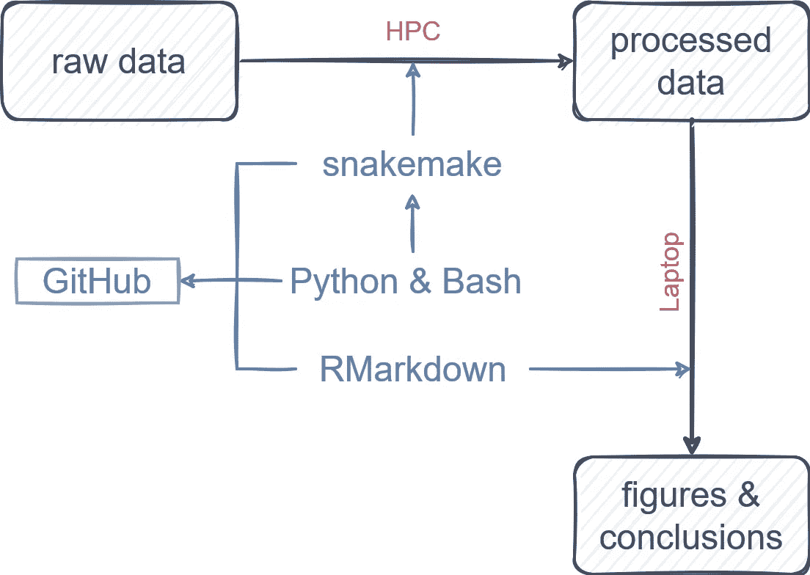
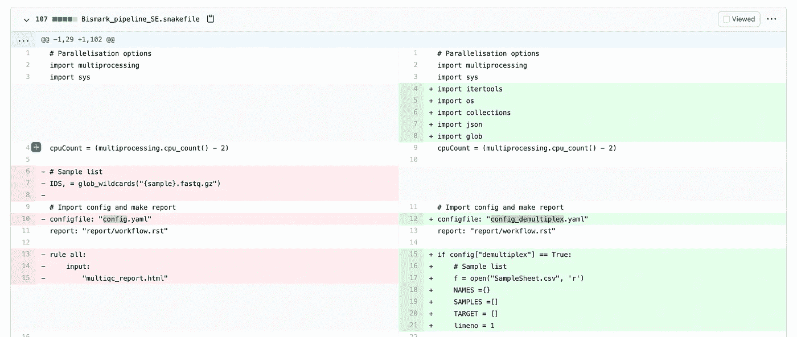
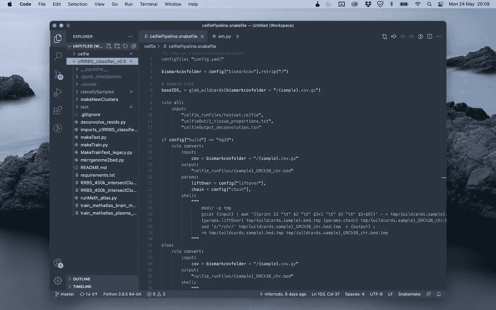
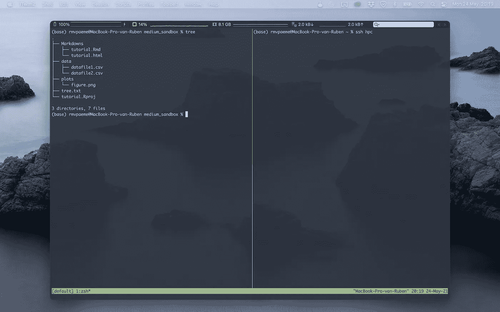

# 作为一名生物医学领域的学术研究者，我为开放和可复制科学的工作流程

> 原文：<https://towardsdatascience.com/my-workflow-for-open-and-reproducible-science-as-an-academic-researcher-in-biomedicine-b41eaabcd420?source=collection_archive---------28----------------------->


夕阳下我们的实验室。

## [行业笔记](https://towardsdatascience.com/tagged/notes-from-industry)

## *目标受众:完成一门或几门编程课程的硕士生或博士生。*

*这篇文章的目的是提供一个资源的概述，这些资源可以用来使生物医学科学和数据分析更具可重复性，我个人认为是有用的。它并不意味着全面或解释太多细节。如果你有问题或补充，请在评论中留下。*

到目前为止，我在博士期间做得最好的一件事是在我刚刚起步的时候学习编程。它节省了我无数的时间，并帮助我在更深的层次上理解科学。我在 2018 年初写了这个，在我关于编程和生物信息学的速成课程[中。现在，三年多过去了，是时候更新一下我作为一名学术研究者如何在日常工作中整合编码和生物信息学了。](/my-journey-into-data-science-and-bio-informatics-749ece4d8860)

首先，我认为很重要的一点是，无论如何，我仍然不是一名高级程序员——我最多认为自己是一名中上程序员。我花了整整两年时间才明白编程是实现目标的一种手段，而不是目标本身。换句话说，从“我希望能够使用 R 和 Python”到“我希望能够使用 R 和 Python 从我的数据中获得有意义的见解”，用了 2 年时间。在那之后，它再次花费了大量的时间来发展到“我希望能够使用 R 和 Python 从我的数据中获得有意义的见解，这样其他人就可以完全复制我是如何获得这些见解的”。

我说 R 和 Python 是因为这是我最常用的两种语言。我使用 Python 编写必须在计算集群/HPC 上运行的脚本。然后，我将 Python 的输出下载到我的计算机上，并使用 R 进行下一部分的数据分析(可视化、注释)，其中交互性(例如，改变图形的外观)更重要。

虽然学习额外的编程语言既有趣又有挑战性，但一天也就那么几个小时。最后，你必须自己决定你想把时间投入到什么事情上。我个人有一瞬间想尝试 Java 或者 Julia 语言。我感觉自己处于 R 和 Python 的平台期:停滞不前，因为我没有开始时提高得那么快，学习一门新语言会有所帮助。但是在对了解 Julia 和 Java 可能带来的好处进行批判性评估之后，我不确定这是否会提高我的生产率。相反，我专注于提高我已经掌握的技能，而不是学习新的东西。

# 开放和可复制的科学

不可复制的科学更像科幻小说而不是科学。通常这种缺乏再现性并不是因为不良意图，而是因为固有的难以再现的不良实践。通过在 Excel 表中单击来清理数据。或者改变表中的值，几周或几个月后忘记为什么这些变量被改变了。认为完美的再现性存在是天真的，但是通过一些工具你可以非常接近。伴随着可再现性，通常会有一个代价，那就是需要更多的时间来配置所有的东西，但是从长远来看，这些时间是可以赚回来的。



我的工作流程草图

## 制蛇

工作流管理器的目标是使数据分析(1)可重复，(2)可扩展。工作流管理器有很多，其中最受欢迎的是 [Nextflow](https://www.nextflow.io/) 和 [snakemake](https://snakemake.readthedocs.io/en/stable/) 。我选择使用 snakemake 是因为它的直观语法，以及它与 Python 和我们大学的 HPC 基础设施的完美集成——但 Nextflow 可能是满足您需求的同样好或更好的替代方案。官方的 snakemake [教程](https://snakemake.readthedocs.io/en/stable/tutorial/tutorial.html)非常好，如果你刚刚开始，我强烈推荐它。

什么时候我使用 snakemake 而不是简单的 python 或 bash 脚本？自动化总是在投入的时间和节省的时间之间取得平衡。由于 snakemake 的用户友好性，当我注意到必须在两个或更多文件上运行一行代码时，我会快速编写一个 snakemake 管道。这样，我就不必在 shell/python 脚本中修改和删除变量，而且通过使用 snakefile，代码可以在一个或一千个输入文件上运行。

用 snakemake 制作的 [bcl2fastq 片段。即使您不熟悉 snakemake，也应该清楚这段代码是做什么的。](https://github.com/rmvpaeme/demux_snakemake)

## Git 和 GitHub

Git 是另一个可重复数据分析的重要工具。这是一种版本控制的形式，这意味着您可以轻松地回到不同版本的代码，比较版本，并在不同的设备上同步您的代码。我推荐[这个关于数据营](https://www.datacamp.com/courses/introduction-to-git-for-data-science)的教程。

我经常遇到这样的情况，我的代码必须在集群/HPC 上运行。我在笔记本电脑上编写代码，将其推送到 Github，并在 HPC 上提取存储库。为了避免合并冲突，我将这个目录设为只读目录。虽然我可以通过 SSH 连接 Visual Studio 代码，直接在 HPC 上编写代码，但是这个额外的步骤允许对每个修改进行完全跟踪，并且如果出现问题，我可以很容易地返回到早期版本。

**我什么时候做一个 Github 库？**每当我开始一个新项目时，我都会将其连接到我们的 Github Enterprise。如果我的电脑、time machine backup 和 Dropbox 都出现故障，它还可以作为额外的备份。



Github 上相同脚本的两个版本之间的差异

## RMarkdown 和 R 项目

snakemake 的输出通常不是结束，而是生成表格或文件，为 r 的进一步处理做好准备。当开始一个新项目时，我首先创建一个新的*Rproj，并像这样构建我的文件夹:

```
$ cd ~/tutorial
$ treetutorial
├── .git
│   └── HEAD
├── .gitignore
├── code
│   ├── processRaw.snakefile
│   └── config.yaml
├── Markdowns
│   ├── annotation.csv
│   ├── tutorial.Rmd
│   └── tutorial.html
├── raw_data # this can be a remote folder to save space
├── processed_data
│   ├── datafile1.csv
│   └── datafile2.csv
├── plots
│   └── figure.png
└── tutorial.Rproj
```

我的哲学是，如果我的电脑现在坏了，我不得不重新安装，那么重新配置的时间应该越短越好。换句话说，记住不同计算机和操作系统之间的可移植性，因为如果你和其他人一起工作(其他人可以包括手稿的审阅者或读者)，这将导致很多挫折。

当您使用 RStudio 打开 Rproj 文件时，工作目录会自动分配给 Rproj 的目录。如果您在另一台计算机上工作，并且将目录与 Onedrive 或 Dropbox 同步，那么如果您使用相对路径，一切应该仍然正常:

```
library(tidyverse)df <- read_csv("./data/datafile1.csv")
df$SampleID <- "datafile1"
```

这让我想到了另一个重要的提示。我曾经尽可能多地给文件名添加注释(类似于`sample1_DNA_plasma_72hincubation.csv`)，但这很容易出错(在重命名过程中出错)，别人也不总是清楚。我现在创建包含所有元数据的注释文件。

```
annotation <- read_csv("./Markdowns/annotation.csv")
annotation
    SampleID    biomaterial    incubation_time_hours
    datafile1   plasma         72
df_annotated <- merge(df, annotation, on = "SampleID")
```

RMarkdown 有很多定制选项，请参阅 Yan Holtz 的指南了解更多信息。

**我什么时候用 RMarkdown 而不用 R？**也总是如此——除非在极少数情况下，我编写一个脚本在集群上运行。如果你更习惯使用 Python，你可以用 Jupyter 笔记本代替 RMarkdown 文件。

## 关于 Docker

如果没有提到 Docker 的使用，一篇关于可再现数据分析的文章是不完整的。简而言之，Docker 允许您使用和编写的任何软件在计算机之间(甚至在 macOS 和 Windows 之间)完全可移植。我在 Docker 上学习过教程，但是到目前为止我还没有使用过它。为什么不呢？我们的集群使用 [easybuild](https://easybuild.io) ，每当我们想要使用一个软件包(比如说 FastQC)时，我们必须用`ml FastQC/0.11.9_Java-11`显式地加载它，它也加载它所有的依赖项。这在某种程度上使 Docker 对我来说是多余的，但在任何其他情况下，我都建议查看 Docker。

# 出版可复制的科学

让你的数据分析对你未来的自己来说是可理解和可复制的是一回事，但让它对整个科学界来说是可复制的是另一回事。即使对你来说一切都很清楚，清理你的代码和数据并将其公之于众也是一项巨大的时间投资。发布可重复的研究有三个主要组成部分:原始数据、处理过的数据和脚本/代码(第四部分:编写文档和提供元数据)。

## 原始数据

在我的生物医学和基因组学领域，原始数据通常是测序数据，可能会占用大量存储空间，并且可能是机密的。测序数据可以通过[欧洲基因组-现象档案](https://ega-archive.org)提供给社区。但是根据数据的大小和性质，原始数据也可以作为补充数据添加到手稿中。

## 处理过的数据

经过处理的数据可以采取多种形式。也可以选择将处理后的数据发布到公共存储库中(例如 [ArrayExpress](https://www.ebi.ac.uk/arrayexpress/) )，将其作为补充数据文件添加到发布中，或者将其托管在 Github 存储库中，您将在那里添加代码。避免由你自己或你的大学托管，因为这在几年内更容易出现 404“未找到”错误。

## 剧本

这些脚本要么将原始数据转化为经过处理的数据，要么将经过处理的数据转化为手稿中呈现的图形和结论。从原始数据和经过处理的数据中复制手稿的代码可以在 Github 上获得。如果您使用如上所述的文件夹结构进行数据分析，就像上传文件夹一样容易(如果文件太大，不需要原始/处理过的数据，将这些数据添加到。gitignore)。许多杂志也接受你从编织你的博客中得到的 html 文件。此外，您可以将 html 文件[作为网页](https://rmvpaeme.github.io/PIMS_MISC_SR/)发布在 Github 页面上。

<https://gfycat.com/sillythirstybangeltiger>  

对于这些 Github 库来说，编写文档通常是最具挑战性的。当我发布我的代码时，我并不打算每次都发布一个适用于所有人的现成软件包。对于熟悉 R 和/或 Python 的用户来说，我更多地将这些脚本视为扩展的数据分析部分。我试着给出每个脚本做了什么的简要总结，并以一种清晰的方式评论我的 Python 代码或 RMarkdowns。

# 工具

我下面列出的工具通过使用提高我的生产率的扩展的组合来帮助加速我的编码过程。一个很好的经验法则是，如果你在编程过程中遇到一些困难，并且认为“这可以更有效地完成”，那么很有可能有人已经做得更有效了。

## 文本编辑器:Visual Studio 代码



Visual Studio 代码

除了 RMarkdown 之外，我对所有东西都使用 Visual Studio 代码(对此我使用 RStudio)。我的(有限的)扩展列表是:

*   [诺德](https://marketplace.visualstudio.com/items?itemName=arcticicestudio.nord-visual-studio-code):我最喜欢的调色板
*   [Excel 查看器](https://marketplace.visualstudio.com/items?itemName=GrapeCity.gc-excelviewer)
*   Git lens:Git 与 VS 代码的无缝集成
*   [Jupyter](https://marketplace.visualstudio.com/items?itemName=ms-toolsai.jupyter) :交互式 Python 编码
*   [MarkdownLint](https://marketplace.visualstudio.com/items?itemName=DavidAnson.vscode-markdownlint) :降价文件的错误报告
*   PyLance 和 Python:Python 的提示和错误报告
*   [彩虹 CSV](https://marketplace.visualstudio.com/items?itemName=mechatroner.rainbow-csv) :彩色列，便于查看 CSV
*   [Snakemake 语言](https://marketplace.visualstudio.com/items?itemName=Snakemake.snakemake-lang):snake make 的语法高亮

## 终端:iTerm2

我仍然在 tmux 中使用 iTerm2，正如我在关于使用 [Nord](https://github.com/arcticicestudio/nord-iterm2) 调色板编程的速成班中所写的。

定制你的`.bashrc`或`.zprofile`也可以节省你大量的打字时间。我最重要的别名是给 ls 的输出上色，但是还有[很多其他的小技巧](https://serverfault.com/questions/3743/what-useful-things-can-one-add-to-ones-bashrc)。

```
cat ~/.bashrc
    # Color for grep and ls
    alias ls="ls --color=auto"
    alias grep='grep --color=auto'
```



iTerm2 和 tmux

## 其他工具

**RStudio 用于编写 RMarkdown** —除了 [Nord 调色板](https://github.com/lusignan/Nord-RStudio)之外，我对 RStudio 没有任何定制。对于可视化，我总是使用 ggplot2。

**背页—** [在线 LaTeX 作者](http://overleaf.com)同步到 GitHub，我完全用 LaTeX 写了我的博士论文，这是一次非常愉快的经历，避免了我在 Word 中可能遇到的许多挫折。

# 最后的想法

分享你的代码可能会令人害怕，尤其是如果你刚刚开始。试着从目标是做好科学和做出有效结论的角度来看。一个开放和透明的工作流程使其他研究人员能够进一步发展和改进您的工作。如果他们发现了一个错误，那么你会学到一些新的东西，在某些情况下，这可能会对你的数据产生新的见解。最后，要意识到每个人都会犯错误，科学研究是一个终身学习的过程。开放的、可复制的科学和其他任何东西一样是一种技能，你做得越多，你就会做得越好(当你犯更多的错误时，你就会知道要注意什么)。

*如果没有我从转化肿瘤组学和生物信息学(TOBI)实验室和*[*OncoRNAlab*](https://oncornalab.ugent.be)*的计算博士生、博士后和生物信息学家那里获得的灵感，这篇文章是不可能完成的，特别是 Pieter-Jan Volders、Celine Everaert、Jasper Anckaert、Annelien Morlion 和 Francisco Avila Cobos。*

*关于作者:*

*我是 Ruben Van Paemel 博士，2017 年从医学院毕业后，我开始在根特大学(医学遗传学中心)担任儿科肿瘤学的博士研究员。我得到了弗兰德斯研究基金会的资助。我也是根特大学医院的儿科住院医师。可以在推特上关注我:*[*@ RubenVanPaemel*](http://www.twitter.com/RubenVanPaemel)