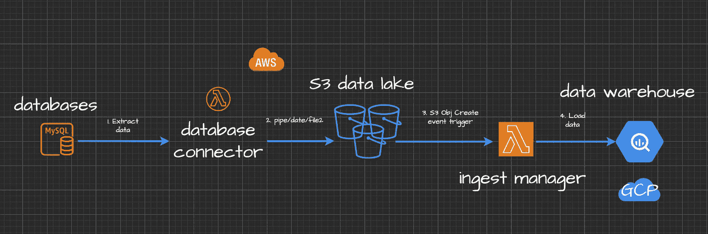

# 适用于数据仓库解决方案的 MySQL 数据连接器

> 原文：<https://towardsdatascience.com/mysql-data-connector-for-your-data-warehouse-solution-db0d338b782d?source=collection_archive---------26----------------------->

## 如何构建一个数据库，并以块的形式导出数百万行，流式传输，捕获实时数据更改或提取数据并将其保存到云中

由[丽塔·塞内卡](https://unsplash.com/@rseneca?utm_source=medium&utm_medium=referral)在 [Unsplash](https://unsplash.com?utm_source=medium&utm_medium=referral) 拍摄的照片

# 为您的数据仓库构建 MySQL 数据连接器

假设您是一名**数据工程师**，您的任务是从您的 ***MySQL*** 数据库实例和您的 ***数据仓库*** 中同步数据。这是一个非常常见的**场景**，其中您需要连接最流行的数据源和您的数据仓库解决方案，即雪花、红移或 BigQuery。

这篇文章详细总结了如何在不使用任何第三方应用程序的情况下从关系数据库(MySQL)中提取和保存数据。是用 ***AWS Lambda*** 函数构建的**node . js*****server less***应用的详细教程。这个微服务将从 MySQL 数据库中提取数据，并可以在您的机器上本地运行或/和按计划从 AWS 帐户运行。同样的应用程序还有一个更高级的例子，它创建了**节点。JS** `streams`从 MySQL 提取数据并保存到你的 ***AWS S3 数据湖*** 。

# 概述

你将学习如何:

*   用 **AWS Lambda** 创建一个简单的 **Node.js** app。
*   使用 Node.js **streams** 来优化内存消耗。
*   提取数据并以 CSV 和 JSON 格式保存在本地。
*   导出到云存储中。
*   使用`yaml` config 进行查询。
*   部署和安排它。

> `*$ npm run test*` *命令会将一亿行数据批量导出到云存储中。*

作者图片[💡迈克·沙克霍米罗夫](https://medium.com/u/e06a48b3dd48?source=post_page-----db0d338b782d--------------------------------)

本教程可能对数据工程师和所有使用 MySQL 数据库或想学习如何连接各种任意数据源和数据仓库解决方案的人有用。

# 先决条件、库和设置

**工具**

*   已安装 Node.js 和节点包管理器
*   对云计算(Amazon Web Services 帐户)、AWS CLI 和 AWS SDK 有基本的了解
*   Google Cloud Platform 或 AWS 帐户，具体取决于您使用的云存储。
*   Shell(命令行界面)命令和脚本(高级)。

**技巧**

*   良好的节点知识。JS(中级)。您将创建一个 Lambda 函数。
*   你必须了解 Node。JS 基本概念，即异步函数、节点包和代码如何工作。
*   基本调试(控制台、打印报表)
*   循环:即用于
*   分支:if、if/else、开关
*   Shell 命令和脚本，就像您希望从命令行使用 AWS CLI 部署 Lambda 并能够在本地测试它一样。

# 如何使用 MySQL 原生特性导出数据

您可能希望使用`[SELECT * INTO 'file.csv'](https://dev.mysql.com/doc/refman/5.7/en/select-into.html)`来实现这一点:

稍加调整和改变，你就会获得想要的结果。

> 但是，这是手动操作…

请记住，您可能希望使用索引列来限制`where`子句中的范围。否则，您的数据库将会遇到困难。

# 带有节点的非常基本的 MySQL 数据连接器。射流研究…

> ***跳过*** 这部分如果你是在用 node.js `streaming`、数据转换和`S3 upload`等更高级的例子之后。

*   为你的 Lamda 微服务新建一个文件夹:
    `$ mkdir mysql-connector`
    `$ cd mysql-connector` `$ npm init`
*   使用`npm`为其安装 [mysql](https://www.npmjs.com/package/mysql2) 包:
    `$npm i mysql2@2.0.0`
*   安装 run-local-lambda 包。我们将使用它在本地触发和测试 Lambda:
    `$ npm i run-local-lambda@1.1.1`
*   在您的 Lambda 根目录中创建一个`config`文件来定义要使用的管道配置和表:

*   在主应用程序文件`./app.js`中创建一个`async`函数，从`./config.json`文件运行 **SQL 查询**。

**你的应用程序文件夹现在应该是这样的:**

**您的主应用程序文件** `**./app.js**` **应该是这样的:**

> 这是如何以编程方式从 MySQL 导出数据的要点。很简单。

在命令行中运行`$ npm run test`，这将从 MySQL 数据库中导出数据。请确保您的凭据和数据库主机地址正确无误。

> 现在您可以在您的`./config.json`文件中更改 SQL 查询，并以编程方式运行它。

# 如何使用 Node.js `stream`并从 MySQL 导出数据

> *首先，为什么要用 node . js*[*stream*](https://nodejs.org/api/stream.html)*？*

如果你的数据集超过了你的内存，那么你应该像我们在**步骤 1** 中所做的那样分块提取数据。那`stream`是干什么用的。**它可以帮助你优化应用程序的内存并导出数据，而无需将所有行加载到内存中。**

> 如果你使用 AWS Lambda 或 GCP 云功能，这有助于节省资金，并且不会过度配置内存资源。

通常，128 Mb 的分配内存**足以**导出几百万行。

> *所以有了 Node.js* `*stream*` *你可以更高效的把 MySQL 连接到你的数据仓库。*

**它的要旨**

假设您想从 MySQL 中逐行提取数据，并在本地保存为 CSV 格式。以下示例适用于 npm 包`mysql2`和`csv-stringify`。

尝试创建一个函数，并用 lambda 的`npm run test`命令运行它。

# 如何用`stream`高效地从 MySQL 导出数据并在本地保存为 CSV

你所需要的只是一个`queryDbAndSave()`函数。尝试将下面的`async`示例添加到您的`processEvent()`函数中。

**把这个加到你的** `**processEvent()**` **函数里，就像这样:**

**下一个**在你的命令行运行:`$ npm run test`。

> *有想法了？酷毙了。让我们继续举更多的例子。*

# 如何将数据从 MySQL 导出，并通过管道`stream`传输到 GCP 的云存储或 AWS S3

这个例子将把你的 SQL 查询结果保存到 **AWS S3** 或者 **GCP 云存储**中，不需要过度配置内存资源。

在我的场景中，我希望将结果查询到我的 ***S3 数据湖桶*** ，并将 JSON 转换为 [ndJSON](http://ndjson.org/) 。

这样，当文件在云存储中被创建时，我可以很容易地用其他的*服务* 进一步触发 ***数据摄取*** 。如果你想学习如何做，请查看我的教程**如何处理数据加载到你的数据仓库**。

</how-to-handle-data-loading-in-bigquery-with-serverless-ingest-manager-and-node-js-4f99fba92436>  

对于`stream-save`查询结果，您可能想要向您的`queryDbAndSave()`函数添加一个新的**分支**:

此示例适用于相同的模块，但您可能也想包括这些模块:

*   `npm i aws-sdk@2.1001.0`撰写本文时，AWS Lambda 环境中使用的。检查当前环境[这里的](https://docs.aws.amazon.com/lambda/latest/dg/lambda-runtimes.html)，这样您就可以简单地将其从部署工件中排除。
*   `through2@4.0.2"`一个更容易构建的包装库`streams`。

所以现在如果再添加一个 ***MySQL 管道*** 到你的`./config.json`:

> *在你的命令行运行* `*$ npm run test*` *。*

> *它将从 MySQL 中导出数据，并以* `*stream*` *模式将其* ***保存为一个文件*** *到您的云存储中。*

# 如何将数据导出为一个`stream`并将其分块保存到云存储中

您可能还想将数据**保存在本地**或保存到 **AWS S3** 中，即保存在 ***批处理模式*** 中。下面的片段解释了如何做到这一点。

您可能希望在`./app.js` : `const BATCH_SIZE = process.env.BATCH_SIZE || 3000;`的顶部声明输出文件的批量大小

那么您可能想要评估 SQL 查询的大小。您可以为此使用另一个异步函数:

向您的`queryDbAndSave()`函数添加另一个分支，并在每次检查是否到了结束时间时分块导出数据:

**最终解决方案为**`**./app.js**`**`**processEvent()**`**功能:**别忘了运行`$npm i moment`。`./app.js`将使用构造文件的键来保存对象。**

# 如何使用 yaml 配置

最终的解决方案可以在这个[仓库](https://aws.amazon.com/blogs/database/capturing-data-changes-in-amazon-aurora-using-aws-lambda/)中找到，为你的 MySQL 管道使用`npm config`和`yaml`定义。

> 我更喜欢使用 `*yaml*` *只是因为当你添加那些长的 SQL 查询时更容易阅读。*

样品`./config/staging.yaml`通常会看起来:

在我看来，当你需要区分`live`和`staging`环境时，这也更直观。在你的命令行运行`$ npm i config`。所以你最终的应用程序文件夹用`./config/`代替`./config.json`看起来会像这样:

# 如何部署解决方案

有三种方法可以做到。

1.  初学者可能会选择使用 web UI，要么将解决方案部署为 **AWS Lambda** 或 **GCP 云功能**
2.  更高级的用户可能想要创建一个部署 shell 脚本`./deploy.sh`,如下所示。在命令行中运行`$ ./deploy.sh`，它将部署 Lambda:

3.使用 Tarraform 或 AWS Cloudformation 部署代码为的**基础设施。方便的 AWS Cloudformation 模板可以在 github 上的这个项目的资源库中找到。**

在部署期间，确保您正确配置了所有访问**角色**和**安全组**。例如，当您的 MySQL 数据库在 AWS 中时，您的 Lambda 函数必须部署在同一个 VPC 中才能访问它。一旦你在 Lambda 中启用了 VPC 支持，你的函数就不能再访问 VPC 之外的任何东西，包括 S3。具体到 S3，你可以使用[VPC 端点][15]来解决这个问题。

# 结论

这是一个简单可靠的 ***数据导出*** 解决方案，允许你以低内存使用的方式从 **MySQL 数据库**中提取数据。这样你就可以创建一个快速可靠的 ***MySQL 数据连接器*** 并拥有一些令人敬畏的特性:

*   通过从命令行运行`$npm run test`以编程方式提取 MySQL 数据。
*   使用`yaml`定义来描述你的 ***MySQL 管道*** 。
*   执行`dryRun`来评估 SQL 大小。
*   使用`Node.js streams`导出数据，以避免内存过度配置。
*   在本地设备上保存数据导出。
*   将数据作为一个文件或成块保存到**云**中。
*   以**基础设施为代码的一键式部署和调度**

查看 [Github 库](https://github.com/mshakhomirov/pipelinetools)了解更多信息。

一些实时集成可能会很昂贵，而且通常依赖于你拥有的数据量。想象一下，插入到 MySQL 中的每一行都会触发 Lambda 导出并插入到您的数据仓库中。有一种更好的方法来像这样监视和控制数据摄取。

就在几天前，我用它从 MySQL 中导出了 5600 万行。然后我将它们分块保存到 AWS S3 的数据湖中。例如，我有一个数据加载管理器，每次文件进入数据湖时，它都会将数据发送到我的 BigQuery 数据仓库。

</how-to-handle-data-loading-in-bigquery-with-serverless-ingest-manager-and-node-js-4f99fba92436>  

因此，导出我的 MySQL 数据并将其加载到我的数据仓库既快又容易。

# 资源

[1]:[https://towardsdatascience . com/how-to-handle-data-loading-in-big query-with-server less-ingest-manager-and-node-js-4f 99 FBA 92436](/how-to-handle-data-loading-in-bigquery-with-serverless-ingest-manager-and-node-js-4f99fba92436)

[2]:[https://dev.mysql.com/doc/refman/5.7/en/select-into.html](https://dev.mysql.com/doc/refman/5.7/en/select-into.html)

[3]:[https://docs . AWS . Amazon . com/Amazon rds/latest/aurora user guide/aurora MySQL。Integrating.SaveIntoS3.html](https://docs.aws.amazon.com/AmazonRDS/latest/AuroraUserGuide/AuroraMySQL.Integrating.SaveIntoS3.html)

[4]:[https://www.npmjs.com/package/mysql2](https://www.npmjs.com/package/mysql2)

【5】:【https://nodejs.org/api/stream.html 

[6]:【http://ndjson.org/ 

[7]:[https://docs . AWS . Amazon . com/lambda/latest/DG/lambda-runtimes . html](https://docs.aws.amazon.com/lambda/latest/dg/lambda-runtimes.html)

[8]:[https://AWS . Amazon . com/blogs/database/captureing-data-changes-in-Amazon-aurora-using-AWS-lambda/](https://aws.amazon.com/blogs/database/capturing-data-changes-in-amazon-aurora-using-aws-lambda/)

[9]:[https://stack overflow . com/questions/12333260/export-a-MySQL-table-with-亿万记录分块](https://stackoverflow.com/questions/12333260/export-a-mysql-table-with-hundreds-of-millions-of-records-in-chunks)

[10]:[https://stack overflow . com/questions/1119312/MySQL-export-into-outfile-CSV-escaping-chars/1197023](https://stackoverflow.com/questions/1119312/mysql-export-into-outfile-csv-escaping-chars/1197023)

[11]:[https://joshuaotwell . com/select-into-outfile-examples-in-MySQL/](https://joshuaotwell.com/select-into-outfile-examples-in-mysql/)

[12]:[https://github.com/sidorares/node-mysql2/issues/677](https://github.com/sidorares/node-mysql2/issues/677)

[13]:[https://AWS . Amazon . com/blogs/database/best-practices-for-export-and-import-data-from-Amazon-aurora-MySQL-to-Amazon-S3/](https://aws.amazon.com/blogs/database/best-practices-for-exporting-and-importing-data-from-amazon-aurora-mysql-to-amazon-s3/)

[14]:[https://blog . rising stack . com/node-js-MySQL-example-handling-Bai-gigabytes-of-data/](https://blog.risingstack.com/node-js-mysql-example-handling-hundred-gigabytes-of-data/)

*原载于*[*https://mydataschool.com*](https://mydataschool.com/blog/mysql-data-connector-for-your-data-warehouse/)*。*