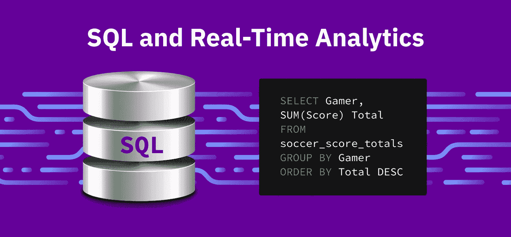

# 流言终结者:古老的 SQL 数据库和今天的实时分析

> 原文：<https://towardsdatascience.com/mythbusting-the-venerable-sql-database-and-todays-real-time-analytics-a6abfa35728e?source=collection_archive---------20----------------------->

## 不是你父亲的甲骨文集群，但更好。

图片作者。

我们都知道软件创新的闪电般的速度。

给我看一个已经存在十年的技术或平台，我会给你看一个过时的遗迹，它已经被更快、更高效的竞争对手超越了。因此，我不会责怪你抵制我的信息，即在 80 年代成熟的 SQL 数据库今天仍然在将数据驱动的公司从批量分析转向实时分析方面发挥着关键作用。

这可能会令人吃惊。在许多技术领域，SQL 数据库仍然是 Oracle 或 DB2 等传统本地数据库的同义词。许多组织已经放弃了 SQL 数据库，认为它们不可能满足现代数据应用程序的苛刻要求。但是没有什么比这更偏离事实了。

在本文中，我们将探讨一些关于 SQL 数据库的常见误解。希望我们能够理解 SQL 数据库如何不必受过去的限制所束缚，使它们在实时分析的时代仍然非常重要。

来自 [Pixabay](https://pixabay.com/photos/once-upon-a-time-writer-author-719174/) 的[拉姆德隆](https://pixabay.com/users/ramdlon-710044/)的照片

## SQL 数据库简史

SQL 最初是由 IBM 的研究人员在 1974 年开发的，用于其开创性的关系数据库 System R。System R 只能在 IBM 的大型机中运行，这些大型机在当时非常强大，而且非常昂贵，除了 NASAs 和 NOAAs(国家海洋和大气管理局，负责国家气象局)之外，任何人都无法使用。

SQL 真正腾飞是在 20 世纪 80 年代，当时 Oracle 公司推出了基于 SQL 的数据库，可以在更便宜的小型计算机和服务器上运行。其他竞争对手如微软(SQL Server)和 Teradata 也紧随其后。随着时间的推移，不同风格的 SQL 数据库被添加进来。数据仓库出现在 20 世纪 90 年代，开源数据库，如 MySQL 和 PostgreSQL，在 90 年代末和 21 世纪初开始使用。

我们不要掩盖这样一个事实:SQL 作为一种语言，仍然非常流行，是数据世界的通用语言。根据 2020 年栈溢出调查，它在所有编程语言[中排名第三，54.7%的开发者使用](https://insights.stackoverflow.com/survey/2020#most-popular-technologies)。

鉴于他们丰富的遗产，您可能会认为工程团队会倾向于尽可能多地构建 SQL 数据库。然而，当我与首席技术官和工程副总裁交谈时，我不断听到关于 SQL 数据库不可能很好地支持实时分析的三个神话。让我们逐一解决这些神话。

## 误解 1: SQL 数据库不支持大的流写速率

在实时分析成为梦想之前，第一批 SQL 数据库是在单台机器上运行的。随着数据库规模的增长，供应商对它们进行了重写，以便在服务器集群上运行。但这也意味着数据必须分布在多个服务器上。面向列的数据库将按列进行分区，每列存储在特定的服务器上。虽然这使得从列的子集检索数据变得高效，但是写入一条记录将需要写入多个服务器。面向行的数据库可以进行范围分区，并将所有记录保存在一台服务器上。然而，一旦使用了由不同键划分的辅助索引，我们将再次面临这样的问题，即必须向存储主表和辅助索引的不同服务器写入单个记录。

因为单个数据记录被发送到许多机器上进行写入，所以这些分布式数据库，无论是面向行还是面向列的，都必须确保数据在多个服务器上以正确的顺序得到更新，以便较早的更新不会覆盖较晚的更新。这通过两种技术之一来保证:分布式锁或两阶段锁和提交。虽然它确保了数据完整性，但分布式两阶段锁给 SQL 数据库写入带来了巨大的延迟——如此之大，以至于激发了针对快速数据写入进行优化的 NoSQL 数据库的兴起，如 HBase、Couchbase 和 Cassandra。

较新的 SQL 数据库以不同的方式构建。它们针对实时分析进行了优化，通过使用一种称为*文档分片*的替代存储技术，避免了 SQL 数据库过去的问题。当一个新的文档被接收时，一个文档分片的数据库会立刻将整个文档写到最近的可用机器上，而不是将其分割开来，然后将不同的字段发送到不同的服务器上。文档的所有二级索引都本地驻留在同一服务器上。这使得存储和写入数据非常快。当一份新文件到达系统时，该文件的所有字段和该文件的所有二级索引都存储在一台服务器上。不需要为每次更新进行分布式跨服务器事务。

这也让我想起了亚马逊如何以最快的速度在仓库中存储物品。[不是把所有的笔记本电脑放在一个过道里，把所有的吸尘器放在另一个过道里，而是把大多数物品存放在最近的随机位置](https://www.allaboutlean.com/amazon-fulfillment-3/)，与不相关的物品相邻，尽管会被亚马逊的库存软件跟踪。

除了文档分片，新的实时 SQL 数据库支持超快的数据写入速度，因为它们可以使用 NoSQL 数据库中首次出现的日志结构化合并()树结构，而不是以前的 SQL 数据库使用的高度结构化的 B 树。我将跳过 LSM 和 B 树数据库如何工作的细节。可以说，在 B 树数据库中，数据是以存储页面的形式组织的，存储页面以 B 树的形式组织，更新会对相关的 B 树页面进行读-修改-写操作。这会在写入阶段产生额外的 I/O 开销。

相比之下，基于 LSM 的数据库可以立即将数据写入任何空闲位置—不需要先进行读取-修改-写入 I/O 循环。LSM 还有其他功能，如压缩(通过删除不使用的部分来压缩数据库)，但它能够灵活地立即写入数据，从而实现极高的速度。这里有一篇[研究论文](https://vldb.org/pvldb/vol13/p3217-matsunobu.pdf)，展示了 RocksDB LSM 引擎相对于基于 B 树的 InnoDB 存储引擎的更高写入速率。

通过使用文档分片和 LSM 树，基于 SQL 的实时数据库可以[接收和存储大量数据](https://conferences.oreilly.com/strata/strata-ca-2019/cdn.oreillystatic.com/en/assets/1/event/290/ROCKSET_%20The%20design%20and%20implementation%20of%20a%20data%20system%20for%20low-latency%20queries%20for%20search%20and%20analytics%20Presentation.pdf)，并在几秒钟内使其可用。

## 误解 2: SQL 数据库无法处理不断变化的流数据模式

这个神话也是基于对 SQL 数据库的过时认知。

确实，所有的 SQL 数据库都要求数据结构化，或者以模式的形式组织。过去，SQL 数据库要求预先定义这些模式。任何摄取的数据都必须完全符合模式，因此需要 ETL(提取、转换、加载)步骤。

然而，流数据通常以 JSON、Avro 或 Protobuf 的形式原始和半结构化地到达。这些流还不断地传递可能与现有模式不兼容的新字段和数据列。这就是为什么传统的僵化的 SQL 数据库不能接收原始数据流的原因。

但是*一些*较新的 SQL 数据库*可以*通过实时检查数据来接收流数据。它们检查半结构化数据本身，并自动从中构建模式，不管数据是如何嵌套的。

数据类型化似乎是流数据和 SQL 数据库的另一个障碍。作为对模式承诺的一部分，SQL 要求数据是*强类型的*——每个值必须被分配一个数据类型，例如整数、文本字符串等。强数据类型有助于防止在查询中混合不兼容的数据类型并生成不好的结果。

传统的 SQL 数据库在创建时为数据表/模式中的每一列分配一种数据类型。像模式的其余部分一样，数据类型是静态的，永远不会改变。这似乎排除了原始数据馈送，在原始数据馈送中，由于其动态特性，数据类型会不断变化。

然而，一些实时 SQL 数据库支持一种更新的方法，叫做 [*【强动态类型化】*。](https://rockset.com/blog/dynamic-typing-in-sql/)这些数据库仍然为所有数据分配一种数据类型，只不过现在它们可以在*极细的级别上进行分配*。可以为单个列中的每个单独的值分配它自己的数据类型，而不仅仅是为整个数据列分配相同的数据类型。仅仅因为 SQL 是强类型的并不意味着数据库必须是静态类型的。编程语言(PL)已经表明，强动态类型是可能的，而且是强大的。PL 编译器和运行时的许多最新进展证明它们也可以非常高效；看看 [V8 Javascript 引擎](https://v8.dev/blog/real-world-performance)这几年的性能提升就知道了！

并非所有较新的 SQL 数据库都支持半结构化实时数据。一些数据仓库可以提取 JSON 文档数据，并将其分配给不同的列。但是，如果检测到一个空值，操作就会失败，迫使数据仓库将文档的其余部分转储到一个[单一通用‘Other’数据类型](https://docs.snowflake.com/en/user-guide/semistructured-considerations.html)中，这种数据类型很慢，不便于查询。其他数据库甚至不会尝试模式化半结构化数据流，而是将整个摄取的文档转储到具有一种数据类型的单个 blob 字段中。这也使得它们运行缓慢，难以查询。

## 误解 3: SQL 数据库无法在不影响查询的情况下扩展写入

这又是一个过时的神话，对新的实时 SQL 数据库是不真实的。传统的内部 SQL 数据库将用于接收和查询数据的资源紧密耦合在一起。这意味着，每当一个数据库同时增加读取和写入时，就会产生争用，从而导致两个功能都受到影响。解决方案是过度配置您的硬件，但这既昂贵又浪费。

因此，许多人转向基于 NoSQL 的系统，如键值存储、图形数据库和其他大数据工作负载，NoSQL 数据库因其在处理大规模数据集方面的性能而闻名。事实上，NoSQL 数据库也面临着与传统 SQL 数据库相同的争用问题。用户只是没有遇到它，因为大数据和机器学习往往是面向批处理的工作负载，数据集在实际查询之前就被摄取了。事实证明，当 NoSQL 数据库集群试图同时读写大量数据时，它们也容易变慢。

新的云原生 SQL 数据库服务通过将用于接收的资源与用于查询的资源分离，完全避免了这一问题，因此公司*可以*同时享受快速读写速度和复杂分析查询的能力。最新的提供商明确地将他们的系统设计为将接收和查询功能分开。这完全避免了资源争用问题，并使读取或写入速度在另一个扩展时不受影响。

## 结论

SQL 数据库已经走过了漫长的道路。最新版本融合了 SQL 久经考验的能力和效率、NoSQL 的大规模功能以及云原生技术的灵活可扩展性。先进的 SQL 数据库可以使用最新数据提供实时分析。您可以同时运行许多复杂的查询，并且仍然可以立即获得结果。也许最被低估的功能是:SQL 在数据工程师和开发人员中的持久流行使其成为贵公司最务实的选择，因为它实现了从批处理到实时分析的飞跃。

如果这篇博文有助于打破您长期以来对 SQL 的误解，那么也许是时候重新审视一下 SQL 数据库能够为您的用例带来的好处和能力了。