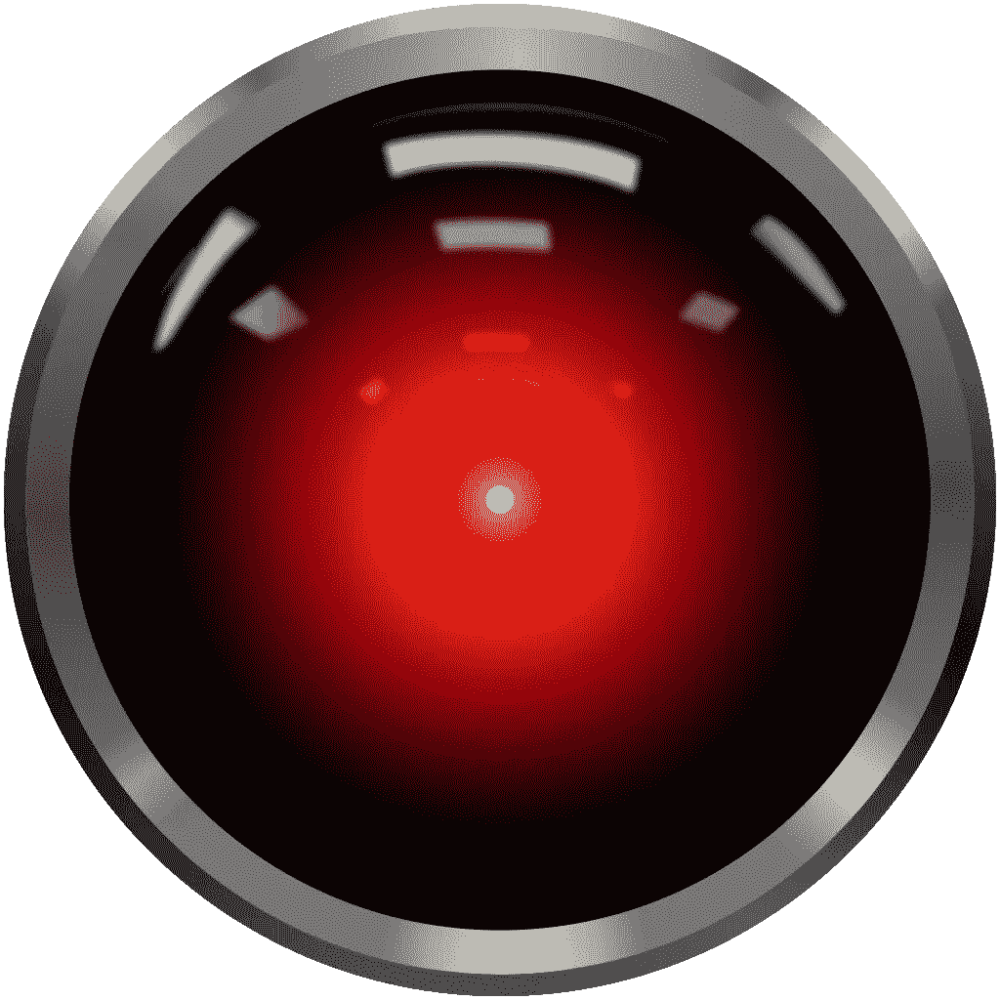
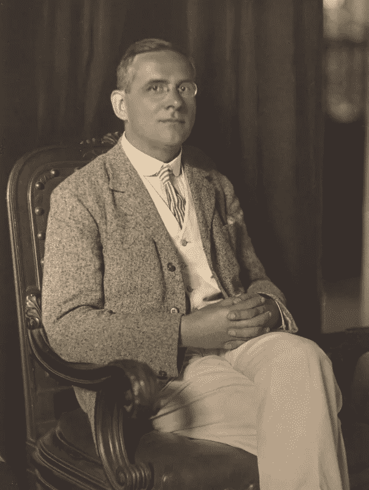

# 建模的神话:数据说话

> 原文：<https://towardsdatascience.com/myths-of-modelling-data-speak-358805890baa?source=collection_archive---------47----------------------->

Cryteria，CC 由 3.0<[https://creativecommons.org/licenses/by/3.0](https://creativecommons.org/licenses/by/3.0)>，通过维基共享

## 数据让我们保持诚实，但它们不会说话；它们不是客观的，也从未摆脱理论的污染。

# 神话

说话数据的神话有很多相关的形式

*   数据是调查和分析的自然起点，人们应该用纯洁的头脑处理数据，清除所有理论的污点
*   数据是客观的，或者至少在某种程度上比模型更客观，没有数据的模型只是带有强烈观点气味的故事。
*   我们通过公正地收集数据并让数据“说话”来确保模型的客观性。
*   数据客观地指导我们构建公正的模型，只受“事实”的驱使

这是数据至上和诚实的神话。

# 神话的起源

莫里茨·施利克，哲学家，物理学家，[逻辑实证主义](https://en.wikipedia.org/wiki/Logical_positivism)的创始人。照片由西奥多·鲍尔拍摄(公共领域)

这个神话深深植根于逻辑实证主义贫瘠的哲学土壤中，这是一场围绕着 30 年代一个名为维也纳圈的排他性思想家俱乐部的哲学运动。逻辑实证主义者相信经验观察的首要地位，以至于任何陈述，如果它本身不是一个经验数据或通过对应原则与一个数据紧密联系，就会被宣布为无意义的。只有数据和逻辑，分析关系是值得讨论的，后者只有通过他们与前者的对应。

逻辑实证主义的哲学基础在第二次世界大战后遭到致命的破坏，首先是奎因对数据和分析话语之间的区别的分解，然后是波普尔对无理论观察的毁灭性驳斥，最后是库恩对科学范式在科学理解演变中的作用的描述。到 1960 年，这场运动“就像一场哲学运动一样死去了”。

但是，尽管从未打算作为对科学实践的哲学检查(更确切地说，作为对哲学实践的科学检查)，科学实践者已经深深地从实证主义的毒泉中汲取了养分。具有讽刺意味的是，冲刷实证主义(奎因、库恩和社会建构主义)支柱的哲学运动巩固了实证主义作为良好科学实践典范的地位(至少在那些从未读过波普尔、奎因或库恩的科学实践者中)。

关于逻辑实证主义死亡的报道被严重夸大了。事实上，逻辑实证主义仍然存在，并且活跃在全球高中和大学的工程和物理教科书中。

# 为什么我们继续坚持这个神话

大多数建模神话都是由一种认真的、善意的努力伪造和助长的，这种努力是为了保护我们自己免受虚假、欺骗和自欺的伤害，数据至上和诚实的神话也不例外。

这个神话试图防范波普尔所谓的理论偏差，但最近被称为 T2 确认偏差。波普来了

> …如果我们不加批判，我们总会找到我们想要的:我们会寻找，并找到证实，我们会远离，而不是看到，任何可能对我们钟爱的理论有危险的东西。用这种方法，很容易获得压倒性的证据来支持一个理论，如果批判性地对待这个理论，这个理论就会被驳倒。

我们很有理由害怕明智地选择和扭曲经验数据，为自己钟爱的理论或隐藏的议程服务，或者为了延续现有理论的主导地位并压制勇敢的挑战者。

不幸的是，我们并没有通过否认理论在数据的发现、选择和呈现中的重要作用来修正我们的理论不可避免的主观性和我们选择模型时不可避免的利己主义。

# 为什么这是一个神话

关于数据的首要性和真实性的神话的第一个问题是，如果没有承诺或至少愿意接受一个理论或模型，我们根本不知道观察什么或如何观察任何东西。

数据的存在要求有人发现、收集并在某种程度上处理和呈现这些数据。但是为什么是这些数据呢？如果我们真的清除了理论的污点，我们如何决定什么可能是相关的？在没有一些理论概念的情况下，我们如何处理和呈现这些数据，这些理论概念是什么，以及它们如何与手头的问题相关联？

第二个问题是，我们无法知道所有与理解和解决手头问题相关的数据对我们来说都是现成的，如果没有一些理论或模型来指导我们的搜索，我们就无法去寻找它们。

因此，没有理论，我们有太多的数据和太少的数据，但还有更多。

逻辑实证主义的根本失败不是哲学上的，而是实践上的。无论是实证主义者还是他们的科学实践辩护者都无法给出一个客观、透明的过程，更不用说一个演绎过程，通过数据的积累产生一个理论或假设。数据不会说话。如果不借助于一些理论背景，我们甚至无法解释数据。如果构建假说的手沾染了观点和理论偏见，那么清洗理论数据就毫无意义。

# 为什么这是个问题

当我们认为我们可以从理论承诺中独立地获取数据时，欺骗自己有什么关系吗？

我认为这很重要，原因有三。首先，理论偏差的问题仍然没有解决。最好的情况是，我们和以前一样有偏见，但是——确信我们自己有良好的数据卫生——我们说服自己没有偏见；最糟糕的情况是，我们学会了在收集数据和产生假设的过程中玩游戏，我们在一个秘密的、欺骗性的奴役中以中立和不偏不倚的方式呈现这个过程，以隐藏议程和宠物理论。

其次，这是驱动有缺陷的实践。例如，流行的“无模型”统计实践源于通过盲目坚持完全根据数据和实验进行推理来争取客观性。许多非数学学科(医学、公共卫生和经济学，仅举几个例子)的常用数学方法是统计测试，旨在揭示因果关系，而不会因致力于因果模型而污染其数据的假定纯度。

问题是，所有这些测试实际上都是建立在简单且通常非常不恰当的因果模型上的，但断然否认这一点会妨碍我们评估这些模型的适用性，并阻止我们将它们与我们的专业知识和理解相结合。

最后，这个神话阻止我们去做真正有效的事情:构建多重(最好是因果)模型，解决我们面临的问题，与我们拥有的数据保持一致，最重要的是，激发新数据和新见解的发现，从而加强我们的理解和干预。

# 我们应该做什么

这又是波普尔，来自他的书《客观知识:进化方法》。

> 每当一个理论对你来说似乎是唯一可能的，把它当作一个信号，表明你既没有理解这个理论，也没有理解它要解决的问题。

确保客观性的关键是将客观性的审查从数据的获取转移到多种理论或模型之间的竞争。

数据必然是我们的理论与世界相交的节点。它们对于理论之间的裁决是必不可少的，我们必须尽我们所能确保它们不被故意扭曲或压制。但是，通过将我们追求客观性、公正性和现实世界一致性的重点转移到多种理论之间的竞争，我们将数据从独立的幻觉中解放出来，并在理论和启发并规范它们的数据之间建立更丰富、更富有成效的关系。