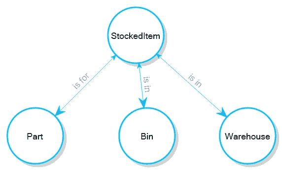
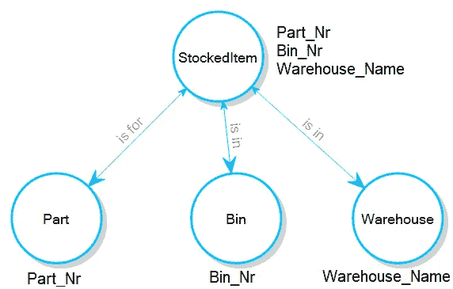
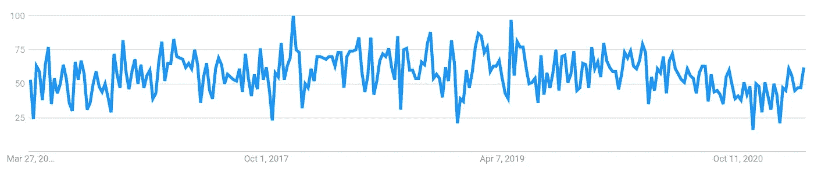
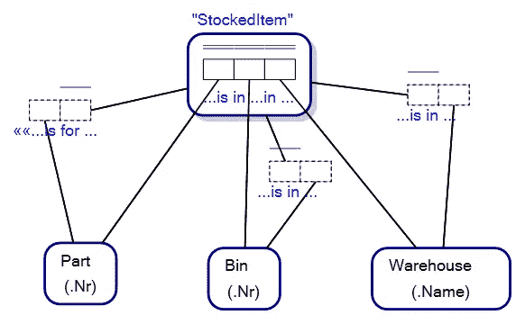
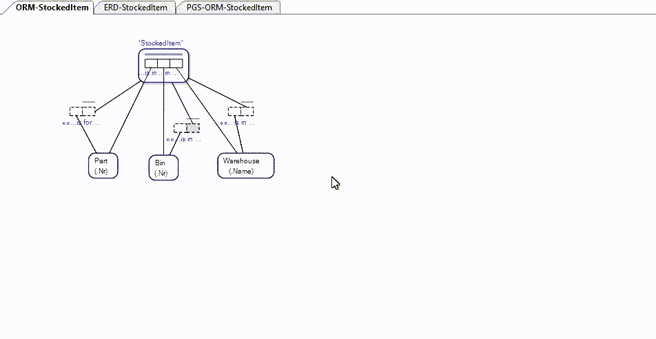

# 图数据库中的 n 元关系

> 原文：<https://towardsdatascience.com/n-ary-relationships-in-graph-databases-81ca596dac48?source=collection_archive---------23----------------------->

## 为什么超图数据库有优势

属性图模式中隐含的三元关系。图片作者。

对[有向图](https://en.wikipedia.org/wiki/Directed_graph)进行操作的专用[图数据库](https://en.wikipedia.org/wiki/Graph_database)处理三进制或更多(n 进制)关系非常糟糕，即使 n 进制关系在许多严肃的数据建模练习中表现出来。以上图为例，其中每个库存商品代表仓库中某个仓位的一部分。三元关系是由一系列三个二元关系(如有向图)暗示的，如 ***库存项目是针对*** 零件的。

为了有助于形象化场景，想象一个仓库，其中存放着仓库管理员必须打包和挑选的物品(零件)，如下所示:

一名仓库保管员在仓库的箱子里寻找零件。图片经由[Dreamstime.com](https://www.dreamstime.com/side-view-portrait-young-shop-assistant-inspecting-stock-doing-inventory-industrial-tools-store-man-doing-stock-image102810076)授权给维克多摩根特。ID 102810076 七十四张图片| Dreamstime.com

我们的仓库管理员正在取某个仓库中被称为*箱*的零件。注意每个箱子都有一个数字。我们的数据模型涵盖了一个假设的情况，即一家公司有多个仓库，一个零件编号为“123”的零件可能存储在不同仓库的不同编号的箱子中…从而在我们的数据模型/属性图模式中形成了一个称为 *StockedItem* 的三元唯一关系。

如果我们将*属性*添加到 StockedItem，我们的图形模式就变成了*属性图形*，如下所示:

属性图架构。图片作者。

一个典型的图形数据库并不复杂，因为如果你知道一个 StockedItem 的 *Part_Nr* 你并不知道它是否支持一个关系， *StockedItem 是用于 Part* 的，即使它被模式的可视化所暗示。事实上，许多图形数据库甚至没有提供查看模式的工具。这是因为典型图形数据库的内部管道( [*元模型*](https://en.wikipedia.org/wiki/Metamodeling) )不够复杂，不足以映射属性和关系之间的关系，和/或图形数据库被吹捧为*无模式*…这基本上意味着您可以对数据库做您想做的事情，并且没有强制实施许多规则来确保您的数据是一致的，并且对数据范围内的一些常见模式有意义。

这是典型图形数据库的一个已知问题，迫使人们寻找变通方法来弥补元模型中的不足。

例如，当您想要将数据插入数据库时，问题就出现了。如果你想说“123”零件在“H1”仓库中，在“悉尼”仓库中，你不能只说 ***和*** 与 Part_Nr 有关系(图表)【123】表示“123”零件在“Part_Nr”仓库中，以此类推，因为 ***StockedItem 在“T6”***仓库中，而 ***StockedItem 在仓库*** *、*中，而没有太大的区别

我觉得在这里展示如何用典型的图形查询语言将三进制/多进制关系导入典型的图形数据库是没有意义的，因为典型的图形数据库已经过了它们的宣传周期高峰。本文提供了一个更适合数据建模者的解决方案。

全世界对图形数据库的兴趣正在下降，并在 2017 年达到顶峰。来源谷歌趋势，“图形数据库”。

## 超图数据库具有优势…

超图是这样一种图，其中图中的边/关系的概念被扩展，使得每条边可以连接两个以上的节点/顶点，并且边可以连接其他边。我在《走向数据科学》的中写了这些[。](/knowledge-hypergraphs-object-role-modeling-ef0f58f38066)

例如，概念建模语言[对象-角色建模](/why-learn-object-role-modelling-4eebd93dcda2) (ORM)，可以被概念化为超图建模语言。我们在 ORM 中的 StockedItem 模型看起来像…

仓库中箱柜零件的对象-角色模型。图片作者。

请注意，StockedItem 不仅是图中一个表面上的节点，而且还是一个超边，它连接着源自真正边的关系。我们 ORM 图中的 StockedItem 是对象化的事实类型，虚线事实类型是[链接事实类型](/link-fact-types-in-object-role-modeling-3c68c15eec92)。在语言学中，我们说仓库中的关系部分在 Bin 中已经被[具体化](https://en.wikipedia.org/wiki/Reification_(linguistics))为 *StockedItem* 。

也就是说，对象-角色建模和具有映射到对象-角色模型的元模型的数据库，具有将图的属性链接到它们各自的关系所需的所有丰满度。比如说，“123”在 Bin，“H1”，在 Warehouse，“悉尼”，自动映射到超图中相应的关系/边。

## 那么…我们的超图数据库在哪里？

你已经以这样或那样的方式使用它们很多年了……它们被称为 [*关系数据库*](https://en.wikipedia.org/wiki/Relational_database) 。关系数据库是为连接的数据而制造的，因为在关系数据库中*关系*是一等公民……关系属性与它们的关系联系在一起。关系数据库是关系重要的地方。

在之前的一篇文章中，我解释过关系数据库和图形数据库在概念上几乎是一样的……在概念层次上，同态接近同构。如果我们在这种情况下看我们的例子，我们得到这个原则的形象化…

对象-角色模型、实体关系图和属性图模式之间的同态。图片作者。

## 一种方便的图形查询/操作语言…

当您将关系数据库概念化为图形数据库时，非凡的事情是可能的。如果您可以在关系数据库上进行图形查询，那么专用图形数据库的优势就会有所减弱。

让我们看一些例子。我们把对象-角色建模超图数据库作为一个两层实现，在关系数据库上有一个对象-角色模型知识图。

当您想要将数据插入到对象-角色模型超图数据库中的 n 元关系中时，它应该不比在专用图数据库中插入属性信息更困难。例如，要确定一个零件 123 在一个名为“悉尼”的仓库中的“H1”箱柜中，应该很容易:

基于对象角色建模的超图数据库中的插入语句。图片作者。

因为关系是 hypergraph 数据库中的一等公民，所以我们应该能够立即通过节点和关系查询数据库，如下所示:

基于对象-角色建模的超图数据库的图查询。图片作者。

同样，如果我们想知道零件 123 在悉尼仓库的哪个箱子里(返回箱子，“H1”):

使用对象-角色模型知识图覆盖对关系数据库进行基于图的查询。图片作者。

因为我们的数据库将关系与属性联系在一起，所以我们可以通过引用关系来插入相同的 StockedItem 数据。

基于对象角色建模的超图数据库中 n 元关系的替换插入语法。图片作者。

也就是说，在对象角色建模 hypergraph 数据库中，您可以选择如何引用数据和关系。典型的图形数据库不提供这种选择。

## 图数据库中的 n 元关系

本文不是诱饵和开关，而是旨在表达一些关于图形数据库的事情:

1.  典型的图数据库*可以存储 n 元关系(边和属性)，但是如果对 n 元关系使用边和属性的组合，典型的图数据库的元模型不会将属性链接到它们各自的边/关系。*
2.  *关系数据库可以被概念化和查询，就像它们是一个图形数据库一样。如果您做了本文之外的功课，您会发现一些证据表明，一些关系数据库的图形查询速度比典型的图形数据库更快；*
3.  *超图数据库 ***是*** 图数据库，顾名思义，当涉及到 n 元关系时，它们以一种超高效的方式做到这一点；*
4.  *因为任何关系数据库都可以被概念化为对象-角色模型，并且因为对象-角色模型是有效的超图…你可以(再次)将任何关系数据库可视化为超图/图形数据库。*

*那么典型的图形数据库和 n 元关系在哪里呢？*

*没有什么可以阻止图形数据库供应商支持将属性链接到关系…他们可以做到这一点。在某种程度上，它改变了他们的底层数据模型，他们可能最终得到一个混合的关系/图形数据库…如果你愿意的话，一个*图形*数据库，或者更普遍地称为多模型数据库。然而，我们在这里看到的是，实际上任何数据库都可以被概念化为多模型数据库…但是缺少一个更复杂的元模型和图形查询/定义语言。*

*非常感谢阅读。如果时间允许，我会写更多关于图形数据库、对象角色建模、超图数据库和多模型数据库的文章。*

*   *对于感兴趣的人来说，本文中的所有查询和数据定义都是在 SQLite 关系数据库上进行的，在元模型级别上有一个对象-角色建模超图覆盖。*