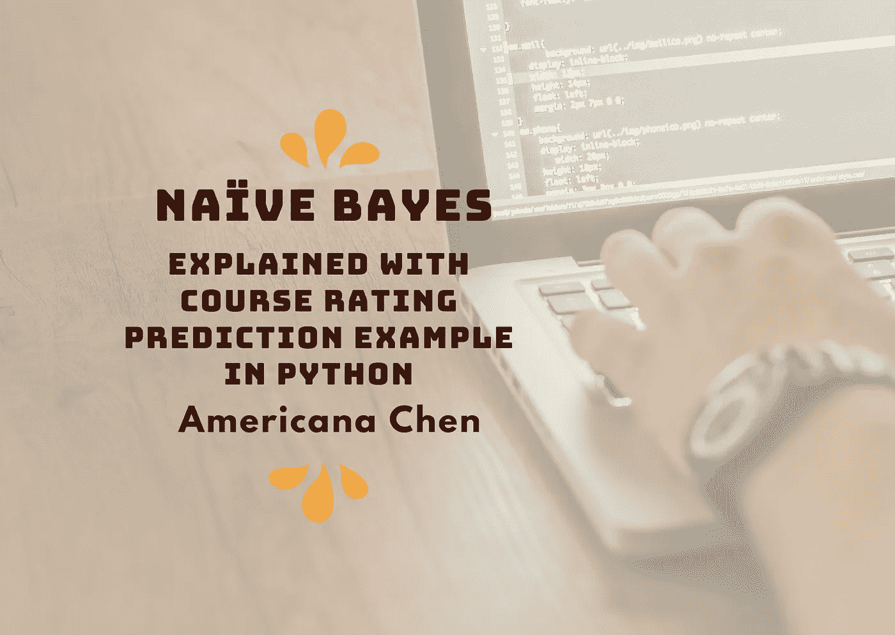
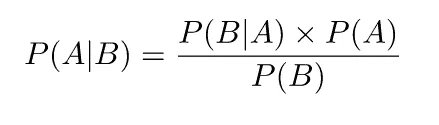
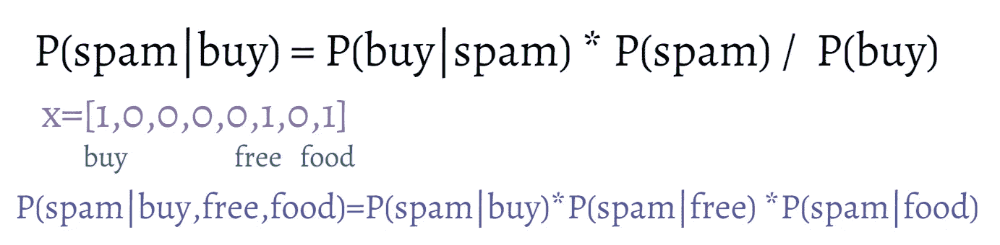

# 朴素贝叶斯用 Python 解释课程评分预测实例

> 原文：<https://towardsdatascience.com/na%C3%AFve-bayes-explained-with-course-ratings-prediction-example-in-python-cb7d46f5ffca?source=collection_archive---------41----------------------->

Americana 使用 Canva 创建的图像

# 朴素贝叶斯简介

## 贝叶斯定理

图片截图由 Americana

贝叶斯定理是一个数学公式，它允许我们计算“反向”条件概率。当我们对一个事件发生的概率有一些先验的信念，并且想要结合这些信息来计算一个结果的条件概率时，通常会用到它。我们可以将术语定义如下:

*   P(A|B)被称为后验概率
*   P(A)是先验概率
*   P(B|A)是可能性
*   P(B)就是证据。
*   然后，我们可以将公式重新表述为:

**后验=可能性*先验/证据**

## 朴素贝叶斯

*   给定一组数据{(x1，y1) …… (xn，yn)}
*   y 取从 1 到 k 的一组有限的离散值(类别)

朴素贝叶斯应用贝叶斯定理的概念来计算 **P(yi=1|xi)，P(yi=2|xi) …。P(yi=k|xi)** 从**的值 P(xi|yi=1)，P(xi|yi=2)…。P(xi|yi=k)和 P(x) & P(y=1)…P(y=k)**

我们的预测仅仅是给出所有 P(yi=1|xi)，P(yi=2|xi) …中最大值的 y 值。P(yi=k|xi)。

当处理所有这些符号时，它可能会变得混乱，将它放入分类示例将使计算更清晰。

想象一下，我们有一个经典的垃圾邮件分类问题，我们收到一封写着“购买免费食物”的邮件。与可能出现的单词列表相比，我们将 x 向量化为行向量，其中 1 出现在对应于“购买”、“免费”和“食物”的位置，否则为 0。

美国人陈使用 Canva 创建的图像

当使用贝叶斯定理时，我们可以**简单地使用我们的样本估计 P(垃圾邮件)、P(购买)和 P(购买|垃圾邮件)**:

*   p(垃圾邮件)=样本中垃圾邮件的数量/样本邮件的总数
*   p(购买)=样本中出现“购买”的电子邮件总数/样本电子邮件总数
*   P(Buy|Spam) = P(Buy 和 Spam) / P( Spam) = **包含“Buy”一词的垃圾邮件数量/样本中的垃圾邮件总数**

最后，我们取每个个体后验概率的**乘积，这将给出给定电子邮件内容的特定电子邮件是垃圾邮件的概率。注意，这是模型“幼稚”的地方，**它假设每个后验概率是独立的**。在这种情况下，我们假设我们知道“购买”出现在电子邮件中的事实并没有给我们任何关于“免费”是否也会出现在电子邮件中的额外信息。**

凭直觉思考，这个假设可能不成立。事实上，如果我们知道电子邮件包含“购买”、“食物”，我们可能会本能地将其与“销售”、“免费”、“折扣”等词联系起来。所以当我们使用这个模型时，我们需要意识到它的假设的不完美性。

# 使用 python 进行课程评分预测的示例

我们在这个例子中使用的数据集是 Kaggle 的“Coursera 课程回顾”数据集，可以通过下面的链接访问:

<https://www.kaggle.com/imuhammad/course-reviews-on-coursera/notebooks?datasetId=915988&sortBy=dateRun&tab=profile>  

在我们决定如何处理这个问题之前，看看我们的数据并了解它的总体结构总是很有帮助的。上传者提供的数据集描述表明，它由学生和参与者在 Coursera(最大的在线课程提供商之一)上发布的 145 万条课程评论组成。考虑到我们有一个很大的数据集，删除缺少条目的行不太可能导致有很大偏差的结果。在删除丢失的值后，我们的数据集最终有 1，454，571 行 5 列。

为了预测课程的用户评分，**我们将重点使用“评论”列作为预测器，使用“评分”列作为目标**，但首先让我们探索我们的预测适合多少类别。下面的代码简单地告诉我们，数据集涵盖了 604 门课程，有 5 种可能的评级。

Sklearn 对于初学者来说非常友好，可以处理这种机器学习任务。只需使用几行代码，我们就可以轻松地构建一个模型，使用我们的训练数据对其进行训练，并根据测试数据进行预测。

首先，我们需要**使用计数矢量器将评论转换成稀疏的行向量**，对于没有出现在特定评论中的单词，其值为 0，如果出现在评论中，则值为 1。在这种情况下， **x 变成了一个 1*108508 的稀疏矩阵，以压缩的稀疏行格式存储了 30 个元素，**这为我们节省了一些内存。

然后，我们将 Xs(记录每个评论中单词出现的稀疏矩阵)和 Ys(评分)分成训练集和测试集。

最后，我们**使用 MutinomialNB 来拟合我们的训练数据，并返回测试数据的分数**。该模型的准确性为 **81%** ，乍一看可能不太令人信服，但考虑到我们本质上是使用简短的评论进行情感分析，并且人们对课程表达积极或消极态度的方式存在很大差异，这个简单算法达到的 81%是非常令人信服的。

观察分类的分布，我们可以看到大多数评级被预测在 4 和 5 左右，这是合理的，人们倾向于给予更多的正面评级而不是负面评级。

你也可以试着写一些注释的例子，测试算法是否能正确预测它！这是一个明显的 5 星评级，但如果我们加入更多模糊的词，如“令人困惑”、“干燥”，结果可能会有所不同。

我们可以**通过使用 stop_words= 'english '，**来尝试改进我们的模型，它删除了常用的单词，如' the '，' a '，' an '，使我们能够专注于那些实际上可以传达意思的单词。然而，最终的准确率只有 80.6%。对此的一个可能的解释是，因为大多数评级在 4 & 5 左右，在测试集注释中频繁遇到这些停用词可能会导致最终结果中有偏见的预测。因此，如果我们只是因为有相似的停用词而盲目猜测 4 或 5，那么很容易获得更高的准确性。使用 stop_word 降低准确性的事实揭示了我们原始模型中的问题。

我们可以指定的另一个试图提高模型性能的参数是 **min_df，这意味着这个词只有在所有评论中出现至少 30 次时才会被考虑。**这可能会使模型更具普遍性，并且**避免受到错别字、俚语或特例的影响。**

原来这也降低了我们模型的精度！

在这种情况下，提高模型性能的最佳方法就是**查看我们在哪里分类错误，以及我们离正确答案有多远:**

仔细观察前 100 个样本中的错误分类的具体情况，我们可以看到，在有些情况下，用户的评论确实非常模糊，甚至对于人来说也很难预测准确的评级，例如:

> 评论:考试中的一些语法错误让我看了两遍，但总的来说还不错。
> 
> 预测:[3]
> 
> 实际:4

该模型可能会预测较低的评级，因为它认识到了工作错误和糟糕的负面情绪内涵。

> 评论:很好的课程，提供的培训非常详细，易于掌握。
> 
> 预测:[5]
> 
> 实际:4

这个评论传达了强烈的积极情绪，我相信人类也会将其解释为五星评级。

另一方面，也存在模型预测与实际评级相差甚远的情况:

> 备注:ProctorU.com 系统花了两倍于本课程 3 天时间的时间才完成。在我 20 多年的 It 生涯中，这是我用过的最糟糕的生产用户系统。你应该换一个供应商。
> 
> 预测:[1]
> 
> 实际:5

对于人类来说，这显然是一个负面评价，但模型实际上预测它是 5 星！

## ***总而言之，学习过程并不是一件困难的任务，几行代码就能为我们完成这项工作。更具挑战性的部分和数据科学家的工作是评估模型，查看错误分类的具体情况，找出句子的哪一部分可能会产生误导，并仔细调整我们的模型，以适应不确定性。***

# 关注我/连接到:

领英:[美国陈](https://www.linkedin.com/in/americana-chen-94432219a/)

insta gram:[@ africccana](https://www.instagram.com/africcccana/)

陈