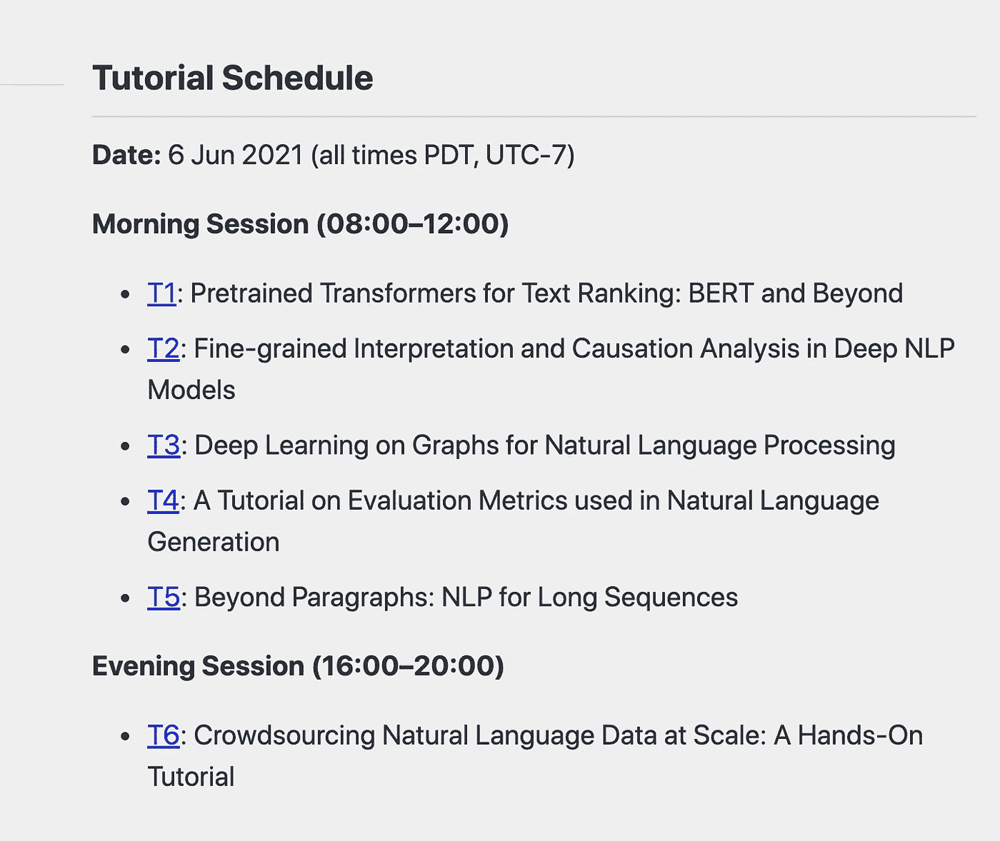

# NAACL-HLT 2021:不容错过的六个教程

> 原文：<https://towardsdatascience.com/naacl-hlt-2021-six-tutorials-you-cant-afford-to-miss-36bfe4908e?source=collection_archive---------43----------------------->

## 计算语言学协会(NAACL-HLT)北美分会拥有 2000 名与会者、50 多名知名研究员和 22%的论文接受率，是一支不可忽视的科学力量。

由 [Manuel Arroyo](https://unsplash.com/@manuarr?utm_source=unsplash&utm_medium=referral&utm_content=creditCopyText) 在 [Unsplash](https://unsplash.com/?utm_source=unsplash&utm_medium=referral&utm_content=creditCopyText) 上拍摄的照片

自 1998 年成立以来，NAACL-HLT 一直处于当代计算语言学的前沿，促进了全球科学家和专业协会之间的研究和信息交流。今年的 NAACL-HLT 定于 6 月 6 日至 11 日在墨西哥城举行。

教程时间表截图。来源:[https://2021.naacl.org/program/tutorials/#t1](https://2021.naacl.org/program/tutorials/#t1)

六个备受期待的 NLP(自然语言处理)教程已经提上日程，让我们简单看看每一个都提供了什么:

## **文本排序的预训练变形器:BERT 和 Beyond**

**❓Content.**本教程将概述使用神经网络架构的文本排序，即 BERT(来自变压器的双向编码器表示)。排序的目的是从语料库中生成一个有序的文本列表，BERT 和自我监督的预训练为 NLP 提供了许多可能性。具体来说，演讲者将着眼于多阶段和直接文本排名架构，重点是处理长文档的技术，以及解决有效性与效率之间的权衡。

**💡关键见解。排序问题是信息检索和问题回答的基础。由于基于 Transformer 的表示在各种 NLP 任务中表现出令人印象深刻的结果，因此应用[预训练 BERT](https://arxiv.org/abs/2010.06467) 进行排序以及[减少模型参数的数量](https://arxiv.org/abs/2008.09093)可能会很有趣。**

## **深度 NLP 模型中的细粒度解释和原因分析**

**❓Content.**深度神经网络(DNNs)在许多自然语言处理任务中起着至关重要的作用，其中包括机器翻译、问题回答和摘要。在本教程中，演讲者将从两个角度研究如何解释神经网络模型的组件:1 .内在分析(关于期望的语言任务)；第二。因果关系分析(关于模型做出的决策)。我们将讨论模型预测的可解释性以及有助于精细解释的相关工具包。

**💡关键见解。**dnn 学习自然语言现象的隐式表示，这需要付出巨大努力才能在性能分析期间正确解释。该研究领域在[black Xbox NLP 研讨会](https://blackboxnlp.github.io)系列中进行调查。通过[分析神经网络中的单个神经元](https://ojs.aaai.org/index.php/AAAI/article/view/4592)和[冗余](https://www.aclweb.org/anthology/2020.emnlp-main.398.pdf)，有可能揭示神经元中各种语言属性的有意义分布。

## **NLP 中的深度学习和图形神经网络**

**❓Content.**图形神经网络(GNNs)为许多 NLP 问题提供了受欢迎的解决方案；然而，将原始文本序列数据转换成图结构数据仍然存在一系列障碍。本教程将向您展示如何使用 Graph4NLP，一个最近开发的开源库，通过基于 GNN 的高级模型来克服这些 NLP 挑战。这种方法有助于在机器翻译、NLG(自然语言生成)和语义分析等领域取得进展。

**💡关键见解。**最近，图形神经网络受到了机器学习社区的极大关注，而 NLP 领域则专注于基于转换器的表示。类似于 [TextGraphs workshop](http://textgraphs.org) 系列，本教程提供了一个不同的观点，通过使用语言图和网络中的结构化信息以及现成的开源库来增强您的模型。

## **自然语言生成中的自动评估指标**

**❓Content.**有了 DL(深度学习)，对 NLG 的研究大大加速；然而，促进 DL 研究改进的 AEMs(自动评估指标)需要调整。在本教程中，演讲者将研究 AEMs 的演变以及最新的新兴趋势，并试图回答最紧迫的问题，包括:如何将 AEMs 组织成一个连贯的分类法；现有 AEMs 的缺点是什么；有什么可能的新的改善途径？

**💡关键见解。**评估非结构化领域中的对话代理并不简单，因为模型需要与人类的判断相匹配。幸运的是，有像 [ADEM](https://doi.org/10.1609/aaai.v33i01.33016220) 和 [AQG](https://www.aclweb.org/anthology/D18-1429/) 这样的方法来处理这个问题。如果你开发了一个对话系统，本教程将为改善对话流程提供可行的见解。

## **自然语言处理中的长序列处理**

**❓Content.**处理长序列文档的能力对于许多自然语言处理任务至关重要，其中包括文档分类、摘要、问题回答和共指消解。同时，许多变压器(BERT 型)型号对于此目的来说太贵了。在这个带编码练习的实践教程中，演讲者将评估长序列处理和文档级表示学习的分层、基于图和基于检索的方法；概述不同的转换器和内存节省方法；并深入研究该领域正在出现的新研究。

**💡关键见解。**基于变压器的表示显示了大量 NLP 基准和下游应用的最新结果。然而，这些模型的训练和推理都很昂贵，考虑其他强有力的信号是有帮助的，如 [SciBERT](https://www.aclweb.org/anthology/D19-1371/) 、 [SPECTER](https://www.aclweb.org/anthology/2020.acl-main.207/) 等。

## **大规模众包自然语言数据**

**❓Content.**在基于 Toloka 六年行业经验的本教程中，我们的团队将关注使用公共众包市场的数据标记，重点关注任务设计和分解、质量控制技术和注释者选择。相关的数学背景以及许多有用的行业技巧将被揭示，随后是动手制作任务，在此期间，观众成员将能够在最大的众包平台之一上启动他们的标签收集项目，并相互分享他们的注释想法。

**💡关键见解。**由于机器学习方法需要越来越多的标记数据，我们需要使用大规模产生这种数据的方法。流行的评估数据集，如[小队](https://rajpurkar.github.io/SQuAD-explorer/)、[多民族](https://cims.nyu.edu/~sbowman/multinli/)和其他已经使用众包建立了——这是一个值得考虑的选择。构建众包管道是一项特殊的技能，需要练习任务分解和质量控制。动手练习给了你提高这一技能的机会。

多么棒的一套教程。还有很多东西需要探索。你呢？你对大会最期待的是什么？欢迎在评论中分享一些建议👇

# 参考

[1]文本排名的预训练变形金刚:伯特和超越，林志颖等 2020。

[2] PARADE:面向文档重排序的段落表征聚合，李灿佳等，2020 .

[3]沙漠中的一粒沙是什么？在深度 NLP 模型中分析单个神经元，Dalvi 等人，2019 年。

[4]分析预训练变压器模型中的冗余，Dalvi 等人，2020 年。

[5]图神经网络综述，吴等. 2020 .

[6]重新评估 ADEM:更深入地了解对话回应评分，Sai 等人，2019 年。

[7] [迈向评估问题生成系统的更好指标](https://www.aclweb.org/anthology/D18-1429.pdf)、 [Nema 和](https://www.aclweb.org/anthology/people/p/preksha-nema/) [Khapra](https://www.aclweb.org/anthology/people/m/mitesh-m-khapra/) 2018。

[8] [SciBERT:科学文本的预训练语言模型](https://www.aclweb.org/anthology/D19-1371.pdf)，Beltagy et al. 2019。

[9] [SPECTER:使用引用通知转换器的文档级表示学习](https://www.aclweb.org/anthology/2020.acl-main.207.pdf)，Cohan 等人，2020。