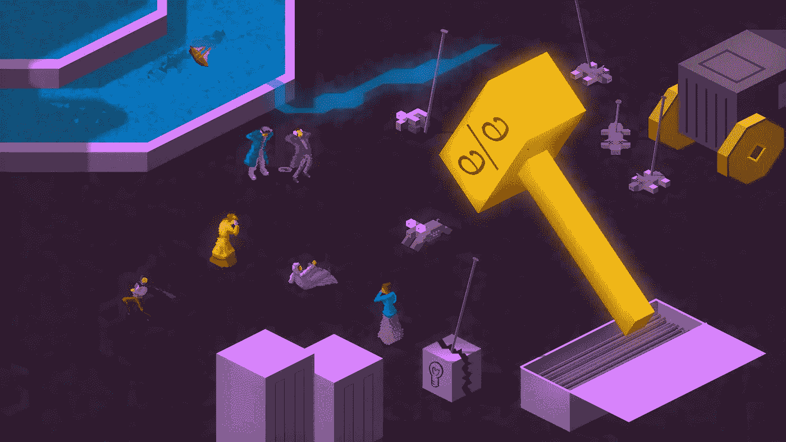
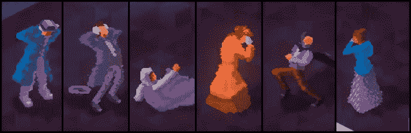
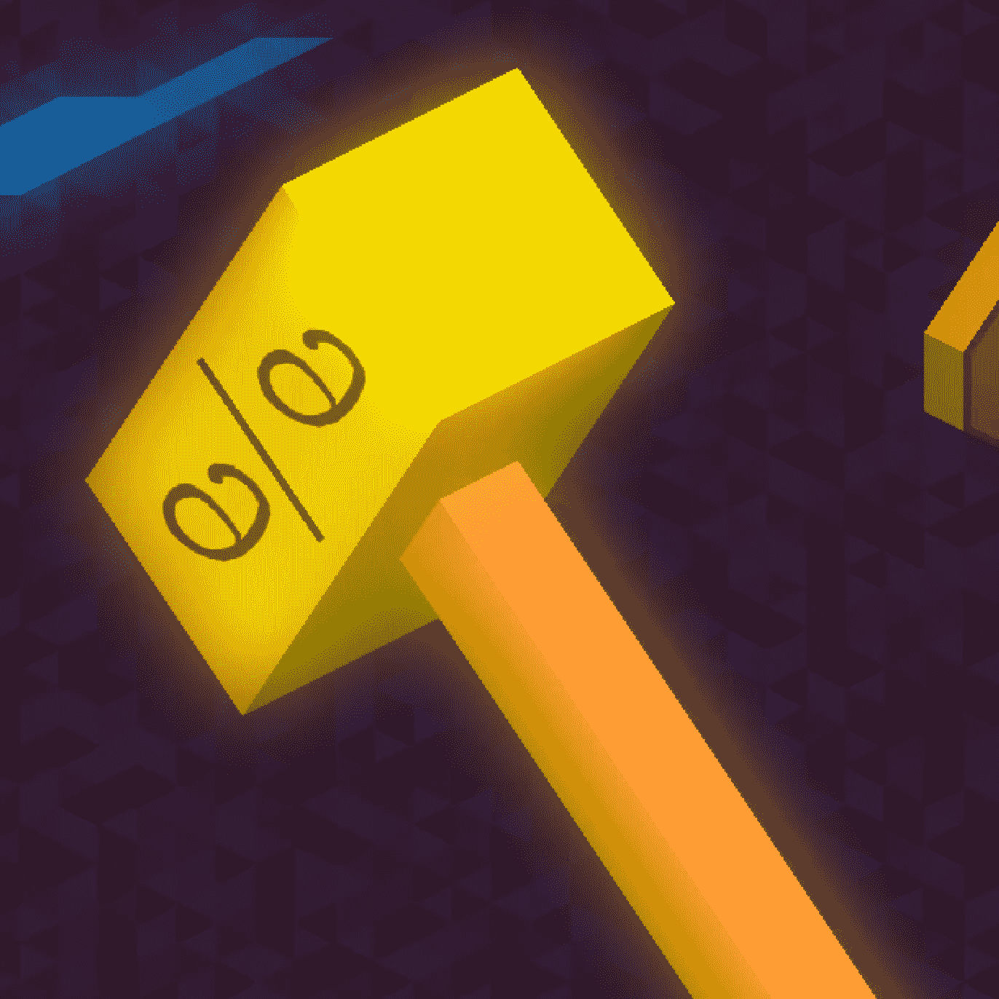
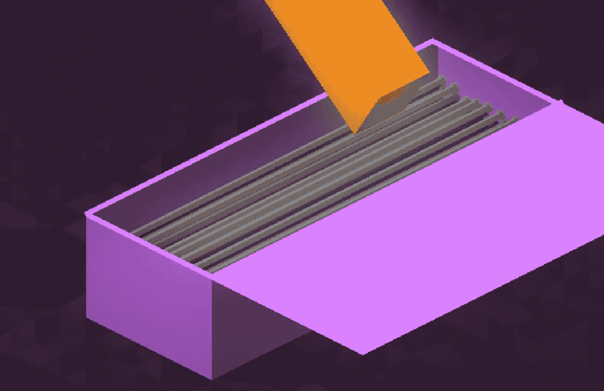
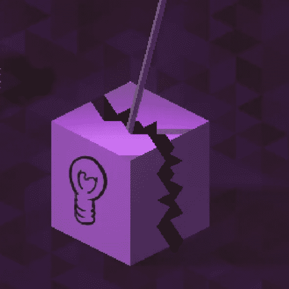
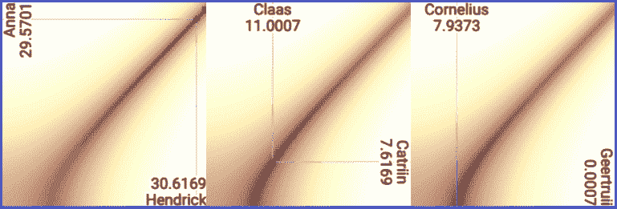
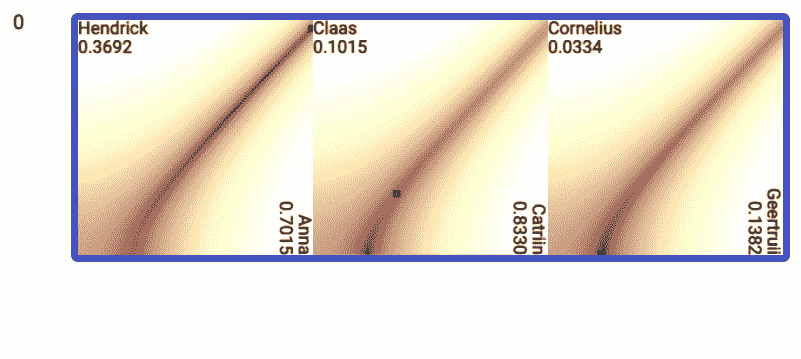

# 用我的金锤钉荷兰猪

> 原文：<https://towardsdatascience.com/nailing-dutch-hogs-with-my-golden-hammer-f01dc86cb92d?source=collection_archive---------32----------------------->

## AutoDiff 的乐趣

## 我偶然发现了三个荷兰人的难题。对自动微分和梯度下降有点熟悉，这立即给了我一个想法。这当然不容易，但能有多难呢？

感谢 VK 博士向我介绍了这个有趣的三个荷兰人的谜题。

拼图中不同角色和猪的插图。图片由作者提供。

# 关于

这篇文章描述了使用梯度下降解决三个荷兰人难题的一种方法。这不是最有效的解决方法。这只是为了好玩:)文章后面的一个应用程序可以让你使用不同的优化器来处理这个问题。

我们不会深究自动微分或梯度下降的细节，而是用它们来解决数学难题。它展示了一种在机器学习之外使用梯度下降的愚蠢方法。

# 荷兰人和他们的猪

谜题中的人物(排名不分先后):亨德里克、克拉斯、卡特琳、吉尔特鲁伊、科尼利厄斯和安娜。图片由作者提供。

荷兰人是一个数学难题。下面是一个简短的版本:

> 有三对已婚夫妇。他们是:
> -丈夫:**亨德里克、克拉斯和科尼利厄斯** -妻子:**吉尔特鲁伊、卡特琳和安娜**
> 
> 你不知道这些夫妇的配对，但这里有一些提示:亨德里克买了 23 头猪，比卡特琳多
> 
> **问:谁和谁结婚了？**

我们将通过使用自动微分和梯度下降来解决这个问题，类似于神经网络的训练。我们将需要以下内容:

1.  当给每个人一组猪数时，测量它离答案有多远/多近:*一个误差函数*
2.  从误差函数中找出每头猪的数量如何影响误差:*自动微分*
3.  一种修改输入猪数的方法，知道它们对误差的影响:梯度下降算法，*优化器*

本文中嵌入的应用程序包含了所有这些内容。你可以在帖子后面试试。

# 黄金分化锤

闪亮的金锤。图片由作者提供。

自动微分，或简称为 *autodiff* ，是一种计算函数导数的算法[1]。给定一个具有一组输入变量和结果输出值的可微分函数，它可以计算输出相对于每个输入的偏导数，这样做不需要任何手动推导代码。我喜欢把这些导数值看作是每个输入如何影响输出的*度量。*

在我看来，自学是一把巨大的锤子。它在许多领域都发挥着重要的作用。你可能熟悉它在训练神经网络时计算导数的应用。当有一个以上的值时，我们也可以称梯度的导数值为[4]。

在我们的例子中，给定每个人的猪数，我们需要找出:

1.  误差有多大？
2.  最重要的是，每个人的猪数是如何影响误差的？

结合自动识别功能的合理误差函数可以回答这两个问题。我们的误差函数的框架可以这样定义:

误差函数的结构。

这个误差函数中的计算可以是所有提示的实现。正如我们将看到的，我们还可以添加更多适合这个问题的规则。

# 闪亮的下降指甲

图片由作者提供。

Autodiff 为每个输入值计算一个导数值，统称为*梯度*。它告诉我们每个输入变量对主计算的最终输出的影响，在我们的例子中，是误差函数的误差值。就其本身而言，它什么也不做。我们需要以某种方式将其应用于输入猪计数。

有许多不同的算法将梯度应用于输入变量[5]。这些算法或*优化器*的一个共同主题是，它们以小步骤迭代工作，每次都微小地改变输入变量。如果处理得当，误差会随着时间的推移而减小。下面是一个简单的优化/训练循环的例子:

简单训练/优化循环的例子。

我们将尝试三种不同的优化器。分别是带动量的梯度下降，RMSProp，Adam，各有特点。关于优化器的讨论超出了本文的范围，但是您可以在应用程序中尝试一下。你可能对每一个都有感觉，至少和这个谜题有关。

# 多维误差海洋

水中的一艘船。波高可以代表误差量，而 x，y 坐标可以代表两个独立变量，比如这个拼图中妻子和丈夫的猪数。

我们的问题由六个变量组成，每个人一只猪(暂时忽略夫妇的配对)。假设我们有一个六维空间。每个计数都可以映射到这个超空间中它自己的轴上。这个空间中的一个点将代表一组可能的 hog 值。在每个点上应用误差函数给我们一个超空间，其中每个位置的值代表给定的猪数集合的误差量。

当使用梯度下降时，我们可以把这个空间看作一个多维的误差海洋。我们随机选择一个点来放置我们想象中的船。自动挖掘的坡度用于转向。它具有这种独特的属性，可以将我们从当前位置指向误差更小的水域。我们向上冲浪，但大部分时间是在错误的多维波浪、山丘和山谷中冲浪。希望我们会在误差的小宇宙中找到一个最低值。

自动挖掘和梯度下降可以训练具有数千甚至数百万个变量的神经网络。这些微不足道的六个变量不应该是这些终极技术的对手，对吗？

# 给第一个想法钉钉子

我的第一个破主意。图片由作者提供。

丈夫和妻子之间的关系是答案的重要组成部分。我试图用 softmax 值来建模，这样每个丈夫最终都会有一个唯一“正确”的妻子。在优化过程中找到正确的配对很有挑战性，我无法让它工作。我们将跳过这一失败的尝试，以保持这篇博文更短。

相反，我们将通过硬连线所有可能的关系，以更直接的方式对问题建模。

# 正在逼近那些猪

三只雄性和三只雌性，总共有六种可能的配对:

这个谜题的所有潜在丈夫和妻子配对列表。

我们应该通过求解上述所有选项来找到正确的配对。所有六个配对选项都将被优化，但我们将只关注第五个**，因为它是来自已知解决方案*【7】的正确配对。其他的配对不会汇聚成一个解决方案，但是如果你感兴趣的话，本文后面的嵌入式应用程序允许你研究它们。*

*让我们再次回顾一下这些提示:*

> *1) **亨德里克**买了 **23 头猪**多了**卡特琳**多了
> 2) **克拉斯**买了 **11 头猪**多了**格尔崔伊**
> 3)**shillingsPaidByPerson**(hogs boundt byperson)= hogs boundt byperson
> 4)**各夫***

*前三个提示都是一样的，不管是哪对情侣。这种关系只影响最后一个暗示"*每个男人比他的妻子多付 21×3 先令*。*

*误差函数由所有可能配对的误差平方和表示。每种配对可能性都基于所有四种提示计算误差:*

*错误函数的伪代码。*

*如果我们的输入猪数和夫妻关系是正确的，误差函数将输出零，否则输出正值。*

# *躲避的猪*

**

*一只幸运的猪。图片由作者提供。*

*现在我们已经有了误差计算，我们可以编写训练/优化循环:*

*优化循环的伪代码。*

*第一次训练一个模型总是令人兴奋的，这很少奏效。我持谨慎乐观的态度。结果如下:*

**

*用我们的第一个误差函数优化的动画。它接近解决方案，但从来没有达到正确的数字。*

*动画显示了真实解配对的误差图。误差接近于零，但从未完全达到零(标签只显示两位小数)。每对夫妇都在他们各自的误差地图中显示出来。x 轴和 y 轴分别代表丈夫和妻子的猪数。通过使用坐标作为对的猪计数来计算误差值，每个地图被着色。其他对在当前迭代中保持不变。颜色是*不是*普通误差而是*视野中的最小误差。*换句话说，黑色是所示区域内的最小误差(我们稍后将在这些地图中移动)。绿色小方块显示每对夫妇已知的正确答案。*

*理想情况下，我们应该看一个六维误差图。尽管如此，我希望这些 3 x 2d 地图能给我们提供一些有帮助的情况。*

*不用说，它不起作用。我尝试了不同的优化器，也改变了它们的参数。我找不到解决办法。你可以自己试试:*

***(移动用户:使用 0.5x/0.25x 按钮缩小。使用鼠标以获得最佳体验)**用于优化第一个错误函数的实时应用程序，该函数未能找到正确的猪数。*

*通过放大，我们可以看到这个:*

**

*放大每对已婚夫妇的动画。显示值被卡住的区域。(结尾的像素化很可能是由 javascript 中十进制数的精度引起的。)*

*如前所述，真正的问题在于一个六维空间。因此，查看三张 2d 地图并不完全正确，但是我们可以*尝试*使用它们来理解问题。似乎所有三对夫妇都发现自己处于“局部最小值”[6]。我的假设是:夫妇在一个低误差值的口袋里。没有地方可以将它们从当前位置移开，从而进一步减小误差。我和解决方案都卡住了。*

# *更好地瞄准猪*

*我们的猪数不再趋向于一个解决方案。这可能是因为我们的误差函数不能充分区分真实答案和第一个结果。我们需要误差函数中的附加要求。*

*我们知道最小猪数必须有一些特定的值才有效，付款也是如此。考虑到这一点，我们可以添加一个新的需求。当成本低于有效阈值时，它将强制成本与提示一致。第四个提示，“丈夫比妻子多支付 63”，分别具有(丈夫，妻子)的最小有效猪数(8，1)，这导致一对夫妇的价格值为(64，1)，给我们 63 的请求差。*

*改进的误差函数:*

*改进的误差函数的伪代码。当值太低时，它的目标是使每对的支付达到有效的最小值。*

# *钉猪*

**

*是的，钉死了他们，没有血。图片由作者提供。*

*使用修改后的误差函数进行优化，如下所示:*

**

*修正错误函数后的优化动画。*

*最后，我们得到了解决方案:
- (32，31)猪换(亨德里克，安娜)
- (12，9)猪换(班，卡特林)
- (8，1)猪换(科尼利厄斯，吉尔特鲁伊)*

*所有优化者都设法找到答案，有些人比其他人更快。与训练神经网络不同，亚当是收敛最快的优化器之一，这里我们有最快的标准*动量梯度下降*。很可能是我没有为优化器找到合适的参数(或者可能在我的代码中引入了错误)。尽管*带动量的梯度下降*在这里更快，但它需要仔细选择其参数(学习速率和动量)。Adam 和 RMSProp 对它们的参数都不太敏感。*

*尝试自己寻找解决方案:*

***(移动用户:用 0.5x/0.25x 按钮缩小。使用鼠标获得最佳体验)**使用修复错误功能的实时应用程序优化应用程序。*

# *余波*

*当所有钉着钉子的猪都被运走，市场清理干净后，我们终于有了答案。使用梯度下降来解决这个难题可能是不传统的，有点复杂，特别是当我们使用现代工具，甚至可以使用移动设备来暴力破解它的时候。更好的方法无疑是运用一些分析技巧。*

*但不管它是否复杂，人们可能会将这个问题视为一系列方程和一个误差函数。这告诉我，有机会通过优化找到答案。这并不容易，至少对于像我这样的业余自学爱好者来说是这样:)有趣的是，它最终成功了。每当你只是在找乐子的时候，使用你闪亮的金锤是完全可以接受的。*

# *关于实现*

*自动微分需要每个变量和值的额外数据。在类似***【a+b】***的计算中，我们需要用附加信息来标记两个变量。实现是通过将这些变量建模为对象来实现的。*

*正文中的所有伪代码都显示了使用常规数学运算符的计算。实现是在 javascript 中完成的，它不支持运算符重载，因此 ***"y = a + b"*** 必须这样编程:*

*实际实现中的计算必须使用自定义函数，而不是常规的数学运算符。*

*如果您检查(代码)笔中的代码，请记住这一点。*

*自动区分的代码可以从笔的资源中查看。这是一个简单的实现，只支持标量值。你可以在这里读到它:*

* [## 重建链式法则以自动微分

### 从链规则到自动差异有一个链接。让我们跨越从数学到计算机科学的桥梁…

towardsdatascience.com](/rebuild-the-chain-rule-to-automatic-differentiation-d77afaa361c4) 

# 额外收获:用蛮力解决

我提到，用今天的设备，答案可以是蛮力的。

暴力搜索的动画效果。在我的小米米 A1 移动设备上拍摄的。

一个简单的程序可以检查每个人所有可能的猪数，并对所有六个可能的配对选项进行检查。下面的应用程序正是这样做的。一个附加条件是提前停止；如果已经得到的少数几个值(比如只有两个参与者的值)违反了要求，代码将停止尝试其余的排列。否则，这是一个简单的实现。

尝试一下点击按钮和观看进度条的快感:

使用蛮力方法解决难题的现场应用程序。

抱歉无聊的应用程序。也许它可以作为一个粗略的性能基准？:)

我想知道这个 1739 年的谜题的创造者会对这个谜题在几秒钟内被人用从我们口袋里取出的装置强行破解作何反应。我们生活在一个神奇的时代。* 

*[1][https://en.wikipedia.org/wiki/Automatic_differentiation](https://en.wikipedia.org/wiki/Automatic_differentiation)*

*[http://www.autodiff.org/?module=Applications](http://www.autodiff.org/?module=Applications)*

*[3][https://www.jmlr.org/papers/volume18/17-468/17-468.pdf](https://www.jmlr.org/papers/volume18/17-468/17-468.pdf)*

*[4][https://www . khanacademy . org/math/multivariable-calculus/multivariable-derivatives/partial-derivatives-and-gradient-articles/a/the-gradient](https://www.khanacademy.org/math/multivariable-calculus/multivariable-derivatives/partial-derivative-and-gradient-articles/a/the-gradient)*

*[5][https://ruder.io/optimizing-gradient-descent](https://ruder.io/optimizing-gradient-descent/)*

*[6]https://en.wikipedia.org/wiki/Local_optimum*

*[7]https://www.cantorsparadise.com/three-dutchmen-f9f08ac19d73*