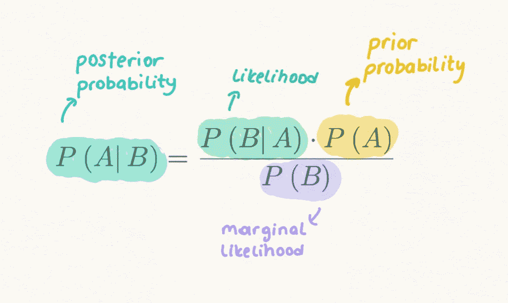
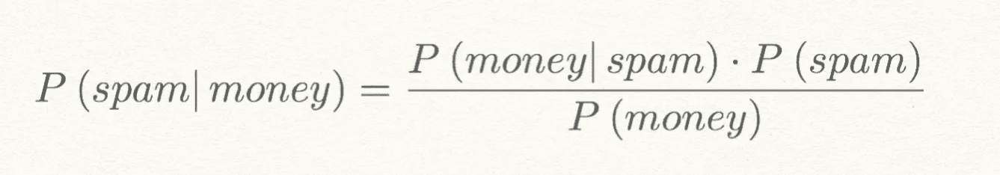
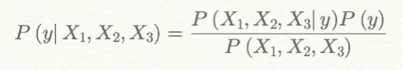
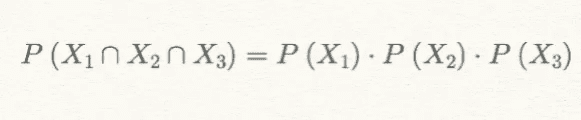
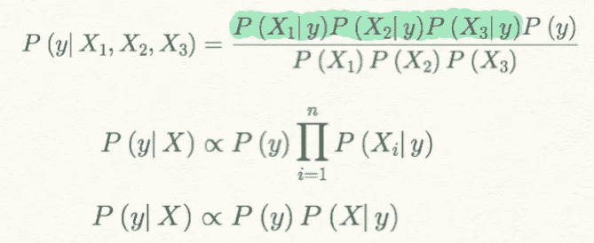
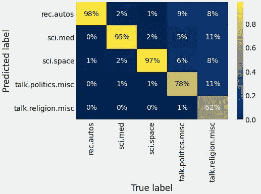

# 朴素贝叶斯分类算法

> 原文：<https://towardsdatascience.com/naive-bayes-algorithm-for-classification-bc5e98bff4d7?source=collection_archive---------9----------------------->

## 多项式朴素贝叶斯模型及其 Python 实现


[来源](https://unsplash.com/photos/VAJEea9u6k8?utm_source=unsplash&utm_medium=referral&utm_content=creditShareLink)

分类是最常用的预测形式之一，其目标是预测记录的类别。对于**二元分类，**我们的目标是预测记录是 1 还是 0，如垃圾邮件/非垃圾邮件或流失/非流失，对于**多类分类**，我们的目标是预测记录的类别，如将邮件分类为主要/社交/促销等。

除了大部分时间预测我们记录的类别，我们还想知道属于感兴趣类别的预测概率。这些概率值也被称为**倾向得分**。我们可以为感兴趣的类别设置截止概率，对于倾向分数低于该值的记录，我们认为该记录属于该类别，反之亦然。

对于分类问题，这是一种**监督学习**的形式，我们从记录类别已知的标记数据开始，我们使用该数据训练我们的模型，然后将该模型应用于类别未知的新数据。

在本文中，我们将通过在 Python 中实现来了解如何使用朴素贝叶斯算法来解决多类分类问题。

> 我鼓励任何人查看我的 GitHub 上的 [Jupyter 笔记本](https://github.com/Idilismiguzel/Machine-Learning/blob/master/Classification/Naive_Bayes_Classifier.ipynb)以获得完整的分析和代码。

# 贝叶斯定理

贝叶斯定理提供了一种在已知先验知识的情况下计算假设*的概率的方法。*



作者图片

**先验概率**是在收集新数据之前事件的概率，即 P(垃圾邮件)是在看到任何新邮件之前垃圾邮件的概率。

**边际可能性**也称为**证据**是证据事件发生的概率，即 P(money)是邮件文本中包含“money”的概率。

**可能性**是假设事件为真，证据发生的概率，即 P(money|spam)是假设邮件是垃圾邮件，邮件包含“money”的概率。

**后验概率**是在证据信息已经被合并之后的结果的概率，即 P(垃圾邮件|金钱)是给定邮件在文本中包括“金钱”的情况下邮件是垃圾邮件的概率。



我们可以看到，我们是用 P(金钱)和 P(金钱|垃圾邮件)从先验概率 P(垃圾邮件)计算后验概率 P(垃圾邮件|金钱)。

**最大后验概率(MAP)** 是后验概率最高的假设。在计算了几个假设的后验概率后，我们选择概率最高的假设。

例如:如果 P(spam|money) > P(not spam|money)那么我们可以说该邮件可以归类为垃圾邮件。这是最大可能的假设。

# 如何在分类中使用贝叶斯定理？

答案是**天真的解决方案**。

精确的贝叶斯分类在技术上是不切实际的，因为我们的数据集中有许多证据变量(预测值)。当预测值的数量增加时，我们想要分类的许多记录将不会有精确的匹配。



> 上述等式仅显示了我们有 3 个证据变量的情况，即使只有 3 个，也不容易找到精确匹配。

**天真的假设**介绍了给定类变量是独立的。所以我们可以计算条件概率如下:



天真的假设



朴素贝叶斯定理

通过假设变量之间的条件独立性，我们可以将贝叶斯方程转换成一个更简单和朴素的方程。即使假设变量之间的独立性听起来很肤浅，朴素贝叶斯算法在许多分类任务中表现得相当好。

让我们看一个例子👀


[来源](https://unsplash.com/photos/vJritQGOFvc?utm_source=unsplash&utm_medium=referral&utm_content=creditShareLink)

# 多项式模型的 1️⃣朴素贝叶斯分类器

多项式朴素贝叶斯分类器适用于具有离散特征的分类，例如用于文本分类的字数。它需要整数特征计数，例如应用于文本的词袋或 tf-idf 特征提取。

对于这个例子，我将使用名为[“Twenty news groups”](http://qwone.com/~jason/20Newsgroups/)的数据集，它是大约 20，000 个新闻组文档的集合，平均分布在 20 个不同的新闻组中。

```
**from** sklearn.datasets **import** fetch_20newsgroups# import dataset
data = fetch_20newsgroups()
data.target_names
```

为了简化我们的示例，我将选择一些类别来过滤数据集。

```
# Selected categories
categories = [**'talk.politics.misc'**, **'talk.religion.misc'**, **'sci.med'**, **'sci.space'**, **'rec.autos']**# Create train and test dataset 
train = fetch_20newsgroups(subset=**'train'**, categories=categories)
test = fetch_20newsgroups(subset=**'test'**, categories=categories)
```

让我们来看一个数据例子:

```
**print**(train.data[5])>>>
From: rts@nwu.edu (Ted Schreiber)
Subject: Opinions on recent Alfa Spiders
Nntp-Posting-Host: mac178.mech.nwu.edu
Organization: Mechanical Engineering
Lines: 15

Anyone have any opinions on fairly recent model Alfa Spiders (86-> ) 

Reliablilty for what their class ( I'm not talking Alfa vs. Toyota corrola which is more relaible ) 

As far as I can discern, in recent years, there are 3 levels with all basically the same mechanical aspects.

Please email any responses 

Ted Schreiber
Mechanical Enginering 
Northwestern University
Tel: 708.491.5386 FAX 708.491.3915 Email: rts@nwu.edu
```

为了将文本数据用于任何机器学习任务，我们需要将每个字符串转换为数字向量。这一步被称为**特征工程**，一种方法是使用 tf-idf 矢量器。我们可以创建一个将 tf-idf 向量附加到多项式朴素贝叶斯分类器的管道。

```
**from** sklearn.feature_extraction.text **import** TfidfVectorizer
**from** sklearn.naive_bayes **import** MultinomialNB
**from** sklearn.pipeline **import** make_pipeline# Create a pipelinemodel = make_pipeline(TfidfVectorizer(), MultinomialNB(alpha=1))
```

📢多项式中的 **alpha** 表示加法平滑参数。如果是 0，那么就没有平滑。

**⚡为什么要磨平？**平滑解决了朴素贝叶斯算法中的**零概率问题**，即给测试集中每一个**新**数据点分配概率等于零的问题。

```
# Fit the model with training set
model.fit(train.data, train.target)#Predict labels for the test set
labels = model.predict(test.data)
```

在用训练集拟合模型并预测测试集的标签之后，我们可以绘制混淆矩阵来评估我们的模型。

```
**from** sklearn.metrics **import** confusion_matrix
**import** seaborn **as** sns
**import** matplotlib.pyplot **as** plt# Create the confusion matrix
conf_mat = confusion_matrix(test.target, labels, normalize=**"true"**)# Plot the confusion matrix
sns.heatmap(conf_mat.T, annot=**True**, fmt=**".0%"**, cmap=**"cividis"**, xticklabels=train.target_names, yticklabels=train.target_names)
plt.xlabel(**"True label"**)
plt.ylabel(**"Predicted label"**)
```



在列上标准化的混淆矩阵(真值)

从混淆矩阵中，我们看到朴素贝叶斯分类器对于一些新闻类别表现得相当好，例如汽车、医学和空间，其中正确预测真实标签的时间为 98%、95%和 97%。然而，正如你所想象的，它在政治和宗教类别中取得了较低的结果..

如果你对文本分类感兴趣，你可以阅读我下面的文章，我展示了文本挖掘技术，并使用逻辑回归对亚马逊的美食评论数据集进行了分类。

<https://medium.com/analytics-vidhya/applying-text-classification-using-logistic-regression-a-comparison-between-bow-and-tf-idf-1f1ed1b83640>  

# 结论

朴素贝叶斯分类器通常适用于初始基线分类。它们速度快，易于实现和解释。话虽如此，但它们在复杂模型中表现不佳，比如没有很好的分类。

尽管朴素贝叶斯是一个简单的分类器，但它被用于许多基于文本数据的应用中，如文本分类(如我们在示例中所做的)、情感分析(即理解一个人是正面还是负面思考)和推荐系统(即在协作过滤中，不管客户是否对特定的产品组感兴趣)。

总而言之，我们可以列出朴素贝叶斯的几个优点和缺点。

✅快速训练和预测

✅易于实现，只有几个可调参数，如α

✅很容易解释，因为他们提供了一个概率预测

❌天真地假设所有预测者都是独立的，在现实生活中并不成立

当平滑技术使用不当时，❌零概率问题会引入错误的结果。

❌:它会产生高度偏颇的估计。

我希望您喜欢阅读这篇文章并了解朴素贝叶斯算法。

*如果你喜欢这篇文章，你可以**[***在这里阅读我的其他文章***](https://medium.com/@idilismiguzel)**和* [***关注我上媒***](http://medium.com/@idilismiguzel/follow)*如果您有任何问题或建议，请告诉我。✨***

***喜欢这篇文章吗？ [**成为更多会员！**](https://idilismiguzel.medium.com/membership)***