# 朴素贝叶斯分类器——如何在 Python 中成功使用？

> 原文：<https://towardsdatascience.com/naive-bayes-classifier-how-to-successfully-use-it-in-python-ecf76a995069?source=collection_archive---------2----------------------->

## 机器学习

## 算法背后的理论的详细解释，以及 6 个 Python 例子

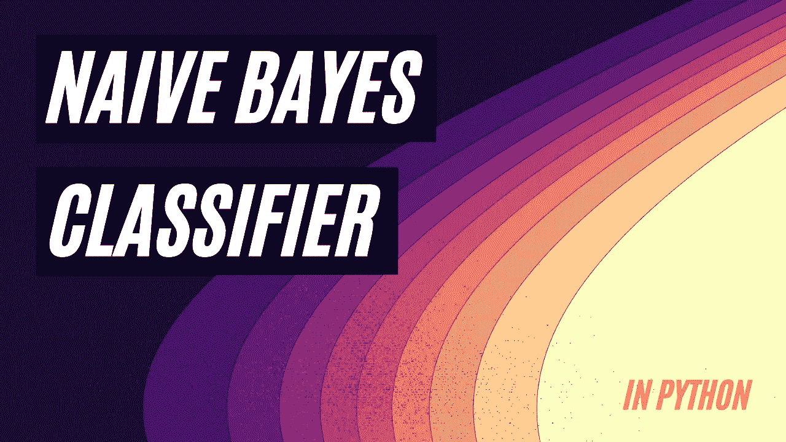

朴素贝叶斯模型决策边界。图片由[作者](https://solclover.medium.com/)提供。(参见第 5 节，了解该图表是如何制作的)。

# 前言

*只是让你知道你正在进入什么，这是一个* ***长故事*** *包含了 6 个不同的 Python 例子的朴素贝叶斯分类器的数学解释。请查看* *下方的* ***主题列表，并随意跳转到您最感兴趣的部分。***

# **简介**

机器学习正在取得巨大的进步，越来越多的算法使我们能够解决复杂的现实世界问题。

这个故事是解释机器学习算法机制的深度系列的一部分。除了让您了解 ML 算法如何工作，它还为您提供了构建自己的 ML 模型的 Python 示例。

# **本故事涵盖以下主题:**

*   朴素贝叶斯分类器所属的**类**算法
*   关于朴素贝叶斯分类器如何工作的解释
*   **Python 示例**如何构建朴素贝叶斯分类模型，包括:
    1 .**高斯 NB** 带 2 个自变量
    2。**具有 3 个类别标签**和 2 个自变量
    3 的高斯 NB。**分类 NB** 带 2 个自变量
    4。**伯努利 NB** 带 1 个自变量
    5。**混合 NB** (高斯+分类)**方法 1** —通过宁滨将连续变量转化为分类变量，然后训练一个分类模型
    6 .**混合 NB** (高斯+分类)**方法 2** —使用连续和分类变量训练两个独立的模型，然后根据前两个模型的预测训练最终模型

# **朴素贝叶斯分类器属于哪一类算法？**

朴素贝叶斯分类器基于贝叶斯定理，适用于不同的机器学习问题。其中包括**分类**、**聚类**、**网络分析**。这个故事将解释朴素贝叶斯如何用于机器学习树的监督分支下的分类问题。

谈到监督学习，快速提醒一下回归和分类之间的区别:

*   **回归**旨在预测连续目标变量的值(例如，房屋价格)
*   **分类**旨在预测分类目标变量的类别标签(例如，垃圾邮件/非垃圾邮件)

下图是**交互式的，**所以请确保点击不同的类别以**放大并展示更多的**👇。

机器学习算法分类。由[作者](https://solclover.com/)创建的互动图表。

***如果你喜欢数据科学和机器学习*** *，请* [*订阅*](https://solclover.com/subscribe) *每当我发布一个新故事时，你都会收到一封电子邮件。*

# 朴素贝叶斯分类器是如何工作的？

我们先从回答下面这个问题开始。

## **为什么朴素贝叶斯是朴素的？**

朴素贝叶斯的基本假设是预测值(属性/独立变量)**彼此独立**。这是一个很大的假设，因为它很容易表明，在现实生活中，变量之间往往至少存在某种相关性。正是这种独立性假设使得贝叶斯分类显得“幼稚”

尽管如此，朴素贝叶斯算法已经一次又一次地被证明在分类问题中表现得非常好，尽管假设是独立的。同时，这是一种快速算法，因为它很容易扩展到包括许多预测器，而不必处理多维相关性。

## **条件概率**

要理解朴素贝叶斯，我们首先需要理解条件概率。为此，让我们使用下面的例子。

假设我们有一个装满红色和黑色球的桶。总共有 15 个球:7 个红色和 8 个黑色。

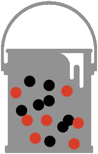

黑色和红色球桶。图片由[作者](https://solclover.medium.com/)提供。

从桶里随机挑出一个红球的概率是 7/15。可以写成`P(red) = 7/15.`

如果我们一次抽一个球而不替换它们，在第一次抽一个红球后，第二次抽一个黑球的概率是多少？

你可以看到上面这个问题的措辞是给我们提供了第二次尝试之前需要先满足的条件。条件是在第一次尝试中必须抽出一个红球。

如前所述，第一次尝试得到红球的概率(P(red))为 7/15。桶里还有 14 个球，6 个红色，8 个黑色。因此，下一次得到黑球的概率是 8/14 = 4/7。

```
We can write this as a **conditional probability**:
**P(black|red) = 4/7\.** *(read: probability of black given red)*We can also see that 
P(red and black) = P(red) * P(black|red) = 7/15 * 8/14 = 4/15.Similarly,
P(black and red) = P(black) * P(red|black) = 8/15 * 7/14 = 4/15.
```

## **贝叶斯定理**

当我们知道一个反向事件的可能性时，贝叶斯定理帮助我们计算一个事件的条件概率。使用上面的例子，我们可以这样写:

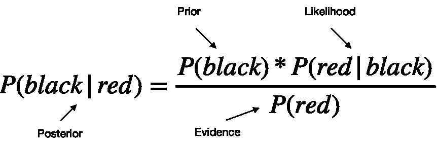

如果你想检查这个的正确性，你可以把上面例子中的数字代入条件概率，你会发现两边都等于 4/7。

## **朴素贝叶斯分类器**

现在让我们来看看上面的等式，并改变符号，使其与分类问题更加相关。

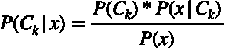

其中:

*   **P(C|x)** 是给定预测因子 x(属性/自变量)的 C 类(目标变量)的后验概率；
*   **P(C)** 是 C 类的先验概率；
*   **P(x|C)** 是似然，是给定 C 类的预测器 x 的概率；
*   **P(x)** 是预测值 x 的先验概率；
*   **小 k** 只是区分不同类别的符号，因为在分类场景中至少有两个独立的类别(例如，垃圾邮件/非垃圾邮件，红球/黑球)。

实际上，只对上述等式的分子感兴趣，因为分母不依赖于 c。此外，因为属性 x 的所有值都是已知的，所以分母实际上是一个常数。

因此，将上述内容与独立性假设相结合，并考虑多个预测因素，分类方程变为:

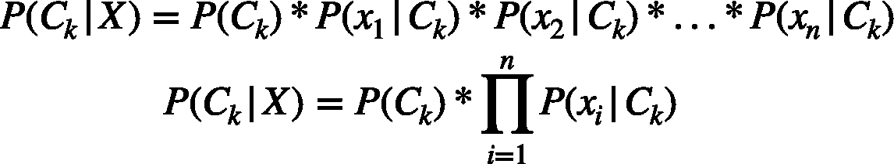

```
Note, the class label predicted by the model is the one with the highest probability. E.g., if P(Class_red|X) = 0.6 and P(Class_black|X) = 0.4 then the predicted class label is 'red' since 0.6 > 0.4.
```

## **高斯朴素贝叶斯—连续属性的适应**

处理连续数据时，一个典型的假设是每个类的连续值都按照正态分布(也称为高斯分布)分布。

虽然我们可以使用频率来计算分类属性的出现概率，但我们不能对连续属性使用相同的方法。相反，我们首先需要计算每个类中 x 的平均值和方差，然后使用以下公式计算 P(x|C ):

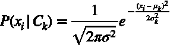

## **伯努利朴素贝叶斯—布尔属性的适应**

如果您有二进制值属性(伯努利、布尔)，那么您可以使用伯努利 NB 模型，该模型利用以下公式来计算 P(x|C):

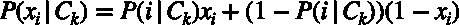

注意属性 x 只能取值 1 或 0(真或假)。因此，根据 x 是 0 还是 1，上述条件概率结果是 P(i|C)或 1-P(i|C)。

## **朴素贝叶斯用法**

我们已经列出了很多方程，在这一点上可能显得有些力不从心。不过，别担心。您仍然可以成功地构建朴素贝叶斯模型，而无需记住算法中使用的确切公式。

重要的部分是根据你所拥有的属性类型(独立变量),确定使用哪种朴素贝叶斯变异。这将在下一节中介绍。

[](https://solclover.com/membership)[](https://www.linkedin.com/in/saulius-dobilas/)

# **如何用 Python 建立朴素贝叶斯模型？**

把理论放在后面，让我们用 Python 建立一些模型。在我们进入分类和伯努利之前，我们将从高斯开始。但是首先，让我们导入数据和库。

## **设置**

我们将使用以下内容:

*   [来自 Kaggle 的棋局数据](https://www.kaggle.com/datasnaek/chess)
*   [Scikit-learn 库](https://scikit-learn.org/stable/index.html)，用于将数据拆分为[训练测试](https://scikit-learn.org/stable/modules/generated/sklearn.model_selection.train_test_split.html?highlight=train_test_split#sklearn.model_selection.train_test_split)样本，[编码](https://scikit-learn.org/stable/modules/generated/sklearn.preprocessing.OrdinalEncoder.html#sklearn.preprocessing.OrdinalEncoder)分类变量，构建[朴素贝叶斯](https://scikit-learn.org/stable/modules/naive_bayes.html#categorical-naive-bayes)模型，以及[模型评估](https://scikit-learn.org/stable/modules/generated/sklearn.metrics.classification_report.html?highlight=classification_report#sklearn.metrics.classification_report)
*   [Plotly](https://plotly.com/python/) 用于数据可视化
*   [熊猫](https://pandas.pydata.org/docs/)和 [Numpy](https://numpy.org/) 进行数据操作

让我们导入所有的库:

然后我们从 Kaggle 获得**象棋游戏**的数据，你可以通过这个链接下载:[https://www.kaggle.com/datasnaek/chess](https://www.kaggle.com/datasnaek/chess)。

将数据保存到机器上后，使用以下代码接收数据:


来自 [Kaggle 的国际象棋数据集](https://www.kaggle.com/datasnaek/chess)的数据片段。图片由[作者](https://solclover.medium.com/)提供。

由于我们希望对因变量(目标变量)使用“赢家”字段，因此让我们检查它的分布情况:


象棋比赛数据赢家分布。图片由[作者](https://solclover.medium.com/)提供。

我们可以看到白棋和黑棋的胜率相当均衡。然而，抽奖发生的频率要低得多，这使得模型更难预测。

然而，让我们通过创建几个新字段来准备数据，以便稍后在模型中使用。

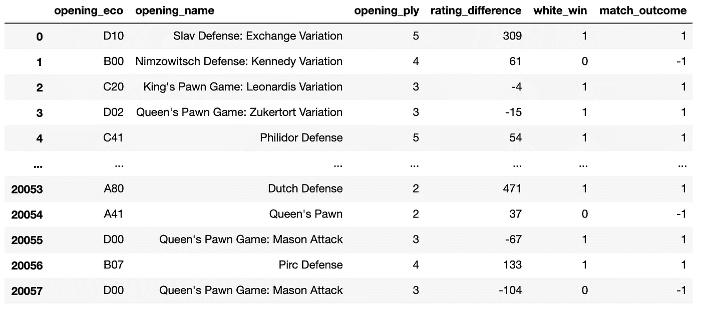

三个新派生的列被添加到 DataFrame 中。图片由[作者](https://solclover.medium.com/)提供。

在我们构建模型之前，最后要做的一件事是定义一个处理样本分割、模型拟合和结果报告打印的函数。调用这个函数将使我们避免重复相同的代码，因为我们将在下面的例子中构建多个模型。

## **1。具有 2 个独立变量的高斯 NB**

让我们从一个简单的高斯朴素贝叶斯模型开始。为此，我们将使用“rating_difference”和“turns”字段作为我们的独立变量(属性/预测值)，并将“white_win”标志作为我们的目标。

请注意，我们在这里有点作弊，因为总移动次数只有在比赛后才知道。因此，如果我们要在比赛开始前做出预测，我们就无法获得“回合”。然而，这仅仅是为了说明的目的，所以我们将继续使用它。

在选择了要使用的字段之后，我们将数据和算法名称传递给我们之前定义的“mfunc”函数。然后，我们打印模型性能结果以供评估。


模拟性能指标。图片作者[作者](https://solclover.medium.com/)。

绩效指标的快速回顾:

*   **准确度** =正确预测/总预测
*   **精度** =真阳性/(真阳性+假阳性)；精度越低意味着假阳性的数量越多
*   **回忆** =真阳性/(真阳性+假阴性)；低召回率意味着该模型包含许多假阴性，即，它不能正确地识别大部分类别成员。
*   **F1-得分** =精确度和召回率之间的平均值(对于特定用例，如果一个指标比另一个更重要，则可以应用权重)
*   **支持** =该类中实际观测的数量

对测试样本的验证告诉我们，使用该模型，我们可以在 66%的情况下正确预测白棋是否获胜，这比随机猜测要好(有 50%的机会猜对)。然而，如前所述，我们使用“回合”作为预测因素之一，实际上，在比赛结束之前，我们无法使用它。

因为我们只使用了 2 个独立变量(预测值)，所以我们可以使用下面的代码创建一个图形来轻松地可视化决策边界。

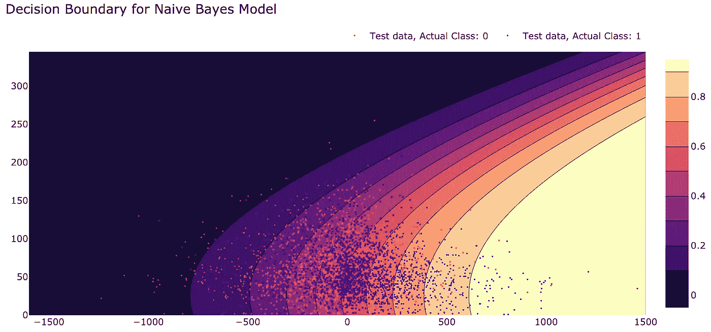

朴素贝叶斯分类模型的决策边界图。图片由[作者](https://solclover.medium.com/)提供。

这是一张漂亮的图表，显示了以下内容:

*   不同的颜色代表“白色胜利”(class=1)的不同**概率**。
*   圆点代表**实际结果**，蓝色代表‘白方赢’(class = 1)，红色代表‘白方没赢’(class = 0)。
*   x 轴是“评级差异”，y 轴是“圈数”。

如你所见，离中心越远，预测越准确。这是意料之中的，因为排名的显著差异代表了技能水平的巨大差异。同时，围绕决策边界(prob=0.5)的预测不太准确，因为玩家势均力敌，并且有相似的获胜机会。

## **2。具有 3 个类别标签和 2 个独立变量的高斯 NB**

接下来，让我们使用相同的自变量，但将目标改为“match_outcome”，它有三个类:

*   -1:黑方获胜
*   0:绘制
*   1:白方获胜

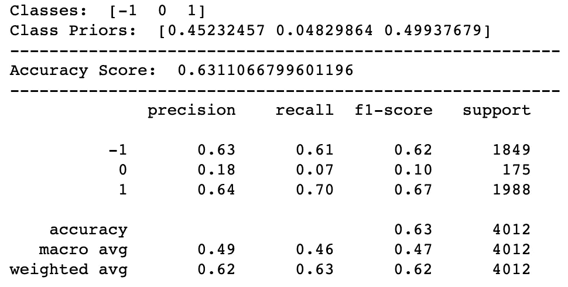

模拟性能指标。图片作者[作者](https://solclover.medium.com/)。

正如预期的那样，该模型在预测 class=0 (draw)时遇到了一些困难，因为该类别的可用观测值数量少得多(测试样本中只有 175 个)。因此，准确率和召回率都非常低，分别为 0.18 和 0.07。

处理不平衡数据有多种方法，其中一种方法是对少数类进行过采样(在本例中，class=0)。这里就不赘述了。然而，如果你对过采样感兴趣，你可以在我之前关于逻辑回归的文章中找到一节:

[](/logistic-regression-in-python-a-helpful-guide-to-how-it-works-6de1ef0a2d2) [## Python 中的逻辑回归——如何工作的有用指南

### 算法的详细解释以及如何用 Python 构建模型的有用示例

towardsdatascience.com](/logistic-regression-in-python-a-helpful-guide-to-how-it-works-6de1ef0a2d2) 

## **3。具有两个独立变量的分类 NB**

接下来是使用分类独立变量建立一个模型。我们将使用‘opening _ eco’和‘white _ id’，前者告诉我们比赛的开局棋步，后者是玩白棋的玩家的 ID。

构建分类 NB 模型与构建高斯 NB 模型非常相似，但有一个例外。Sklearn 的包要求变量为数值格式；因此，我们需要一个额外的步骤来将 type='string '的变量编码为' numeric '使用 sklearn 的顺序编码器只用几行代码就完成了。

*快速注意，顺序编码器通常用于编码具有特定顺序的数据。然而，当使用 CategoricalNB 时，sklearn 中的朴素贝叶斯分类器不假定独立变量的值的顺序。因此，我们可以在这里使用顺序编码器。否则，必须使用替代编码器(例如，“OneHotencoder”)。*


模拟性能指标。图片由[作者](https://solclover.medium.com/)提供。

我们得到了一个精度为 0.6 的模型，这比我们之前建立的高斯模型要差一些。然而，我们可以通过将连续变量和分类变量合并到一个模型中来改进它。

## **4。带 1 个独立变量的伯努利 NB**

当我们有二元预测变量时，我们希望使用伯努利 NB 模型。对于这个例子，我们将采用一个名为“rated”的字段，它告诉我们匹配是否被评级。它是一个布尔型字段，取值为“真”或“假”

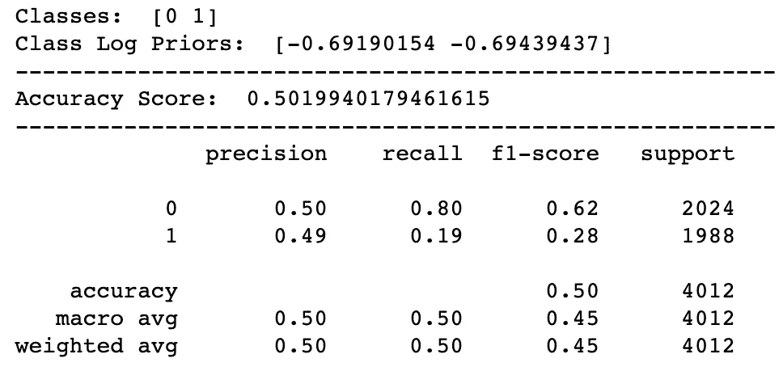

模拟性能指标。图片由[作者](https://solclover.medium.com/)提供。

如你所见，比赛是否被评分并不影响比赛结果。该模型的准确度和精确度都在 0.5，这意味着该模型与随机猜测一样好。

## **5。混合 NB(高斯+分类)方法 1**

在这个例子中，我们将通过宁滨把连续变量转换成分类变量。然后，我们将根据所有这些特征训练一个分类模型。

除了使用 Pandas‘qcut’方法将连续变量绑定到 20%分位数的额外步骤之外，代码保持非常相似。


模拟性能指标。图片由[作者](https://solclover.medium.com/)提供。

使用这种方法将连续变量和分类变量结合起来，我们设法建立了迄今为止准确率为 65%的最佳模型。

## **6。混合 NB(高斯+分类)方法 2**

这种方法需要更多的工作，因为我们将使用连续和分类自变量训练两个独立的模型。然后，我们将从这两个模型中获取预测概率，并使用它们来训练我们的最终模型。

由于这种方法中有几个步骤是不同的，我们将不使用我们先前定义的“mfunc”函数。这将导致代码稍微长一点。

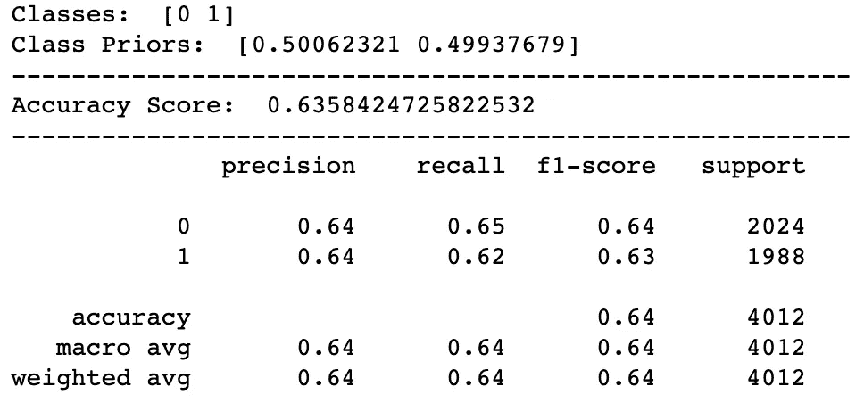

模拟性能指标。图片由[作者](https://solclover.medium.com/)提供。

虽然模型结果不如前一个好，但这种方法工作得相对较好，准确率为 63.5%。我建议在构建模型时尝试这两种方法，并选择最适合您的数据的方法。

## 最后

朴素贝叶斯分类算法非常灵活和快速，尽管它有“朴素”的假设，但它在许多情况下确实工作得很好。这绝对是你决策科学“工具箱”里的好东西。

请随意将这个故事中的代码和其他材料用于您自己的项目。我希望我传达了朴素贝叶斯的精髓。如果没有，请让我知道如何为其他读者改进这个故事。

干杯！👏
**索尔·多比拉斯**

***如果你已经花光了这个月的学习预算，下次请记得我。*** *我的个性化链接加入媒介是:*

[](https://solclover.com/membership) [## 通过我的推荐链接加入 Medium 索尔·多比拉斯

### 作为一个媒体会员，你的会员费的一部分会给你阅读的作家，你可以完全接触到每一个故事…

solclover.com](https://solclover.com/membership) 

你可能喜欢的相关故事:

[](/bbn-bayesian-belief-networks-how-to-build-them-effectively-in-python-6b7f93435bba) [## BBN:贝叶斯信念网络——如何用 Python 有效地构建它们？

### 使用真实生活数据在 Python 中构建模型的贝叶斯信念网络的详细解释

towardsdatascience.com](/bbn-bayesian-belief-networks-how-to-build-them-effectively-in-python-6b7f93435bba) [](/gmm-gaussian-mixture-models-how-to-successfully-use-it-to-cluster-your-data-891dc8ac058f) [## GMM:高斯混合模型——如何成功地使用它对你的数据进行聚类？

### GMM 的直观解释和有用的 Python 示例

towardsdatascience.com](/gmm-gaussian-mixture-models-how-to-successfully-use-it-to-cluster-your-data-891dc8ac058f)