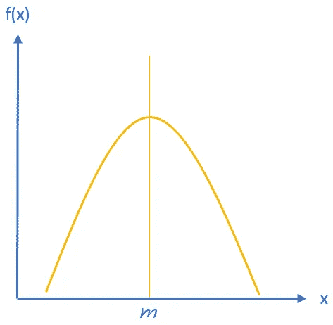

# 用于文本分类的朴素贝叶斯分类器

> 原文：<https://towardsdatascience.com/naive-bayes-classifiers-for-text-classification-be0d133d35ba?source=collection_archive---------17----------------------->

## 不同文本处理情况下的朴素贝叶斯分类器类型


([来源](https://pixabay.com/photos/office-regulation-paper-paper-goods-1466390/))

文本分类可以被描述为自然语言处理领域的主要分支之一。基于文本的数据集由非结构化格式化内容组成。这种本性导致他们很难提取有意义的片段。为了能够处理这项任务，选择相应的技术是至关重要的。为此，*朴素贝叶斯分类器*方法可以通过考虑算法的结构类型来执行。

贝叶斯定理的一般公式可以简单地强调如下。

```
**P (X|Y) = ( P(Y|X) * P(X) ) / P(Y)**
```

通过观察公式，X 和 Y 可以被接受为事件，假设 X 正在出现，而 Y 已经发生。借助于这种方法，可以提出一个事件的单个占用不影响另一个事件的推论，也称为**朴素**方法。

本文接下来的部分包括三种不同的方法，如*多项式、伯努利、*和*高斯朴素贝叶斯*。

# 1.多项式朴素贝叶斯

在确认特定单词在文本文档中的频率的情况下，多项式朴素贝叶斯可以被接受为分类文档的概率方法。

术语“*单词包*”[[1](https://www.inf.ed.ac.uk/teaching/courses/inf2b/learnnotes/inf2b-learn-note07-2up.pdf)]被广泛用作在朴素贝叶斯的上下文中要处理的所选文档，同时通过允许多次出现，将文档本身描述为一个包，并将纹理中的每个词汇描述为包中的项目。

为了能够正确地分类，应该预先知道该词在给定文本中的存在。这个分类器在文档中找到的单词数量的**离散**类型上实现得很好。这种方法的使用领域的一个例子可以是借助于在文档中分配的单词的出现来预测文档的匹配类别。

该算法的输出产生由单词集的整数频率值组成的向量。

```
**P(M|N) = ( P(M) * P(N|M) ) / P(N)**
```

# 2.伯努利朴素贝叶斯

伯努利或*“多元伯努利”* [ [2](https://qiyanjun.github.io/2019f-UVA-CS6316-MachineLearning//Lectures/L17c-NBCtext.pdf) ]朴素贝叶斯可被表达为通过利用期望文本的存在在布尔基础上生成输出的统计方法。该分类器从具有**离散**性质的*伯努利分布* [ [3](http://hyperphysics.phy-astr.gsu.edu/hbase/Math/gaufcn.html) 中获取信息。

```
**P(M) = *1-p for M = 0, 
       p   for M = 1*****P(Mi|N)= P(i|N) * Mi + ( 1 - P(i|N) ) * (1 - Mi)**
```

当在给定的文档中想要检测不想要的单词或者想要标记特定类型的单词时，这种朴素贝叶斯分类器是有用的。此外，它通过生成二进制输出*1–0、真-假或是-否*来区别于多项式方法。

# 3.高斯朴素贝叶斯

对文本格式的数据进行分类的概念更倾向于使用分类类型。除了离散数据，朴素贝叶斯也可以应用于**连续**类型。

高斯朴素贝叶斯可用于应用于*真实*或*连续* - *值*数据集，而非*分类*或*离散值*特征。

在公式中，带下划线的*概率密度函数*通过生成任何附加输入单词的概率计算而属于高斯分布。

```
**Probability Density Function (x, mean, stdDev) = 
(1 / (sqrt(2 * PI) * stdDev)) * exp(-((x-(mean^2))/(2*(stdDev^2))))**
```

原因是通过考虑一个*高斯分布* [ [4](http://hyperphysics.phy-astr.gsu.edu/hbase/Math/gaufcn.html) ]来实现相应的分类。



高斯/正态分布(归作者所有)

对于使用区域，具有对应连续值的单词的数据集，如高度*或宽度*的数据集，适合于执行高斯朴素贝叶斯算法。**

# **结论**

朴素贝叶斯分类器在文本上下文[ [5](https://web.stanford.edu/~jurafsky/slp3/4.pdf) ]中的 ***检测情感*** 和 ***垃圾邮件*** 领域提供了有见地的结果。对于不同的领域，对分类器的需求也有所不同，因为算法背后的数学是变化的。为了能够准确地产生正确的词类和类别，定义问题的类型是非常必要的。

非常感谢您的阅读！

# 参考

1.  [*利用朴素贝叶斯进行文本分类*](https://www.inf.ed.ac.uk/teaching/courses/inf2b/learnnotes/inf2b-learn-note07-2up.pdf)
2.  [*多元伯努利分布*](https://qiyanjun.github.io/2019f-UVA-CS6316-MachineLearning//Lectures/L17c-NBCtext.pdf)
3.  [*伯努利分布*](https://mathworld.wolfram.com/BernoulliDistribution.html)
4.  [*高斯分布函数*](http://hyperphysics.phy-astr.gsu.edu/hbase/Math/gaufcn.html)
5.  [*朴素贝叶斯和情感分类*](https://web.stanford.edu/~jurafsky/slp3/4.pdf)