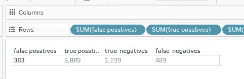

# 朴素贝叶斯-在 Tableau 上从头开始预测客户流失

> 原文：<https://towardsdatascience.com/naive-bayes-customer-churn-predictor-from-scratch-on-tableau-bb74d2fc8418?source=collection_archive---------29----------------------->

## 概念和编程语言，哪个更重要？

Jorge Franganillo 在 [Unsplash](https://unsplash.com/photos/QJCJYfC1uzw) 上的照片

人们争论 R、python 和 Julia 哪种语言更适合统计建模。但是如果你知道自己在做什么，那么任何语言或者软件都只是一个工具。任何语言的流利程度都不如概念本身重要。下面是朴素贝叶斯学习解释清楚，并实现了 Tableau 从零开始与数据使用- [预测银行客户流失](https://www.kaggle.com/adammaus/predicting-churn-for-bank-customers)。

**朴素贝叶斯**是一种概率模型，通过计算变量的个体概率来分配事件的概率。

**P(a|b):** A 是 B 发生时客户的流失预测，其中 B 是我们数据集中的变量，如任期、年龄、信用评分。
例如，如果客户年龄为 30 岁，信用评分为 350 分，任期为 2 年，则会发生客户流失。

P(a|b) :基于个人概率计算，这就是为什么它被称为天真，因为它假设每个变量独立于其他变量。

**P(b|a):** 是 A 已经发生的情况下事件 B 的概率(例如，如果客户 18 岁，我们有一个已经离开银行的老客户数据集，我们可以创建一个概率，反映客户 18 岁时客户流失的概率)。这适用于所有变量，如任期，信用，分数等。

**P(A)** :客户流失的概率:如果我们知道 1000 个客户中有 100 个会离开银行，那么概率就是 100/1000。

**P(B):** 变量本身发生的概率。例如，与所有其他客户相比，某个客户 18 岁的概率是多少？

我们需要以同样的方式计算流失和保留的概率 P(a/b ),然后将两个数字归一化。所以数字较大的概率就是答案。如果**规格化 P(a|b)(流失)>规格化 P(a|b)(留存)**那么客户会放弃银行。

## 此外，我们可以修改 Tableau 上更简单的实现公式。

1-P(B)是分母，对所有变量都是相同的常数，所以我们不必计算它，因为它不会影响分析。
2-乘以多个概率(例如，P(年龄|流失)*P(任期|流失)*P(a)将得到一个很小的数字，并且需要大量的计算能力。一种解决方案可能是使用数学技巧，通过使用对数函数来加法而不是乘法:

`Churn: LOG(P age|churn) +LOG((P tenure|churn)+LOG(P churn)
Retained:LOG(P age|retained) +LOG((P tenure|retained)+LOG(P retained)`

## Tableau 上的实现

1 **数据探索和特征工程**:第一步是探索数据，找到客户流失的相关信息，并根据“偏差方差权衡”使用这些变量。因此，我们不希望使用太多变量，这会增加方差和**过度拟合**模型，我们也不希望基于单个变量建立一个愚蠢的模型，这会增加偏差和**欠拟合。**
根据我的结果，我使用了这些变量:

`Income to Debt={FIXED [Credit Score],[Tenure] :sum([Estimated Salary])}
Credit Score by Age= [Credit Score]/[Age]`

2 我们的目标是最大限度地减少假阳性和增加真阴性，或者最大限度地减少假阴性和增加真阳性，这取决于我们希望通过分析实现的目标。
我的模型得到 5889 + 383 个不会离开银行的人，其中 5889 代表准确的预测，389 代表不正确的预测，1239+489 也是如此，其中 1239 是正确的预测，489 是不正确的预测。

## 表格上的逐步计算-

1.  `**Churn**- if [Exited]=1 then 1 ELSE 0 END`
2.  `**Retained**-if [Exited]=0 then 1 ELSE 0 END`
3.  `**Income to Debt**={FIXED [Credit Score],[Tenure] :sum ( [ Estimated Salary])}`
4.  `**Credit Score by Age**= [Credit Score]/[Age]`
5.  `**P Churn (P(A))=**{SUM([Churn])}/{COUNT([Customer Id])}`
6.  `**P Retained (P(A))**={SUM([Retained])}/{COUNT([Customer Id])}`
7.  `**P(Income to Debt|Churn)**={ FIXED [Income to debt]:SUM([Churn])}/{SUM([Churn])}`
8.  `**P(Income to Debt|Retained)**={ FIXED [Income to debt]:SUM([Retained])}/{SUM([Retained])}`
9.  `Repear step 7 and 8 for all the selected variables,in my case**(Income to Debt and Credit score by age)**`
10.  `**Naive Bayes Churn**=LOG(P(Income to Debt|Churn))+LOG(P(Credit score by age|Churn))`
11.  `**Naive Bayes Retained**=LOG(P(Income to Debt|Retained))+LOG(P(Credit score by age|Retained))`
12.  `**Normalize Naive bayes Churn**=[Naive Bayes Churn]/[Naive Bayes Churn ]+[Naive Bayes Retained]`
13.  `**Normalize Naive bayes Retained**=[Naive Bayes Retained]/[Naive Bayes Churn ]+[Naive Bayes Retained]`
14.  `**Predizione**=IF [Normalize Naive bayes Churn]>[Normalize Naive bayes Retained ] THEN 1 ELSE 0 END`

## 模型准确性检查

运行公式后，我们可以计算模型精度:

`Retained Prediction=if [Prediction]=0 then 1 ELSE 0 END
Churn Prediction=if [Prediction]=1 then 1 ELSE 0 END`

1- **假阳性:**模型预测的客户不会离开银行，但实际上确实离开了。

`if { FIXED [Customer Id]:sum([Retained])} < {FIXED [Customer Id]:SUM([Retained Prediction])} THEN 1 ELSE 0 END`

2- **假阴性:**模型预测会离开银行，但实际上没有离开的客户。

`if { INCLUDE [Customer Id],[Exited]:sum([Retained])}=1 AND zn({include [Customer Id],[Prediction]:SUM([Retained Prediction])})=0 THEN 1 ELSE 0 END`

3- **真阳性:**模型正确识别的未离开银行的客户数量；

`if {INCLUDE [Customer Id],[Exited]:sum([Retained])}=1 AND {include [Customer Id],[Prediction]:SUM([Retained Predictor ])}=1 THEN 1 ELSE 0 END`

4- **真负值** =模型正确识别的离开银行的客户数量。

`if {INCLUDE [Customer Id],[Exited]:sum([Churn])}=1 AND {INCLUDE [Customer Id],[Prediction]:SUM([Churn prediction])}=1 THEN 1 ELSE 0 END`

在平衡误报和漏报并根据我们的业务需求获得最佳模型后，我们可以创建一个仪表板，通过创建**参数**进行预测，用户可以在其中输入要使用的变量(如年龄、任期、信用评分)，模型将为输入的数据计算 **P(A/B)** 。

**参数变量的计算**--

1.  `**Income to Debt**={ FIXED [Parameters].[Credit Score]=[Credit Score],[Parameters].[Tenure]=[Tenure]:sum([Estimated Salary])}`
2.  `**Credit Score by Age**= { FIXED [Parameters].[Credit Score]=[Credit Score],[Parameters].[Age]=[Age]:sum([Credit Score])/sum([Age])}`

所以最后，我们应该知道我们在做什么，关于模型制作和模型调整的概念应该由数学直觉支持，那么编程语言趋势的任何进步或变化都没有意义。在我看来，数据科学家的工作是使用任何可用的工具来研究和实现概念。

原文由我用意大利语发布在这里->[https://www . theinformationlab . it/2021/02/25/naive-Bayes-classifier-customer-churn-predictions-da-scratch-sul-tableau/](https://www.theinformationlab.it/2021/02/25/naive-bayes-classifier-customer-churn-predictions-da-scratch-sul-tableau/)