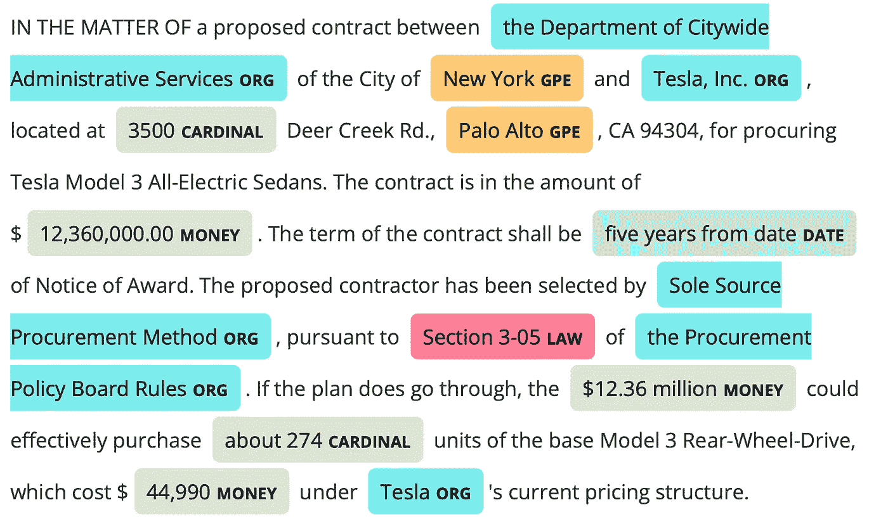
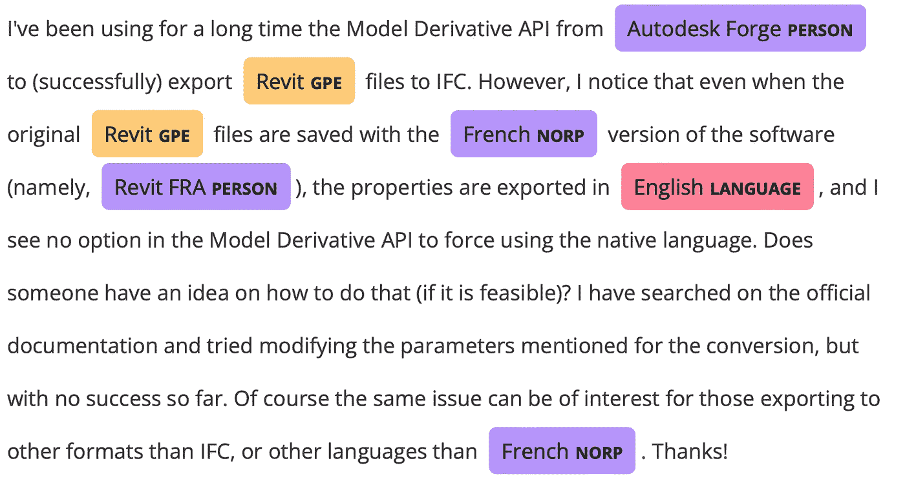
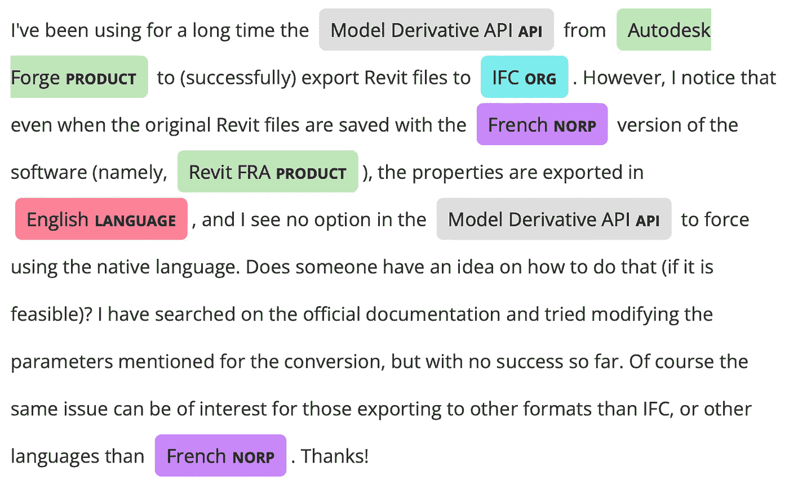

# 命名实体识别的简易指南

> 原文：<https://towardsdatascience.com/named-entity-recognition-5324503d70da?source=collection_archive---------28----------------------->

## 如何使用自然语言处理从文本中自动识别适当的实体


鲍勃·鲍伊在 [Unsplash](https://unsplash.com/s/photos/washington-dc?utm_source=unsplash&utm_medium=referral&utm_content=creditCopyText) 上的照片

# 什么是命名实体识别？

[命名实体识别](https://en.wikipedia.org/wiki/Named-entity_recognition)或 NER 是一种对文本中的命名实体进行识别和分类的技术。这些实体是在[词性标注](https://www.dataknowsall.com/pos.html)和[名词短语分块](https://www.dataknowsall.com/nounphrase.html)之上的一个级别，其中代替识别语法部分；它将单词识别和分类为它们真正的实体。公认的主要类别有:

```
PERSON:      People, including fictional.
NORP:        Nationalities or religious or political groups.
FAC:         Buildings, airports, highways, bridges, etc.
ORG:         Companies, agencies, institutions, etc.
GPE:         Countries, cities, states.
LOC:         Non-GPE locations, mountain ranges, bodies of water.
PRODUCT:     Objects, vehicles, foods, etc. (Not services.)
EVENT:       Named hurricanes, battles, wars, sports events, etc.
WORK_OF_ART: Titles of books, songs, etc.
LAW:         Named documents made into laws.
LANGUAGE:    Any named language.
DATE:        Absolute or relative dates or periods.
TIME:        Times smaller than a day.
PERCENT:     Percentage, including ”%“.
MONEY:       Monetary values, including unit.
QUANTITY:    Measurements, as of weight or distance.
ORDINAL:     “first”, “second”, etc.
CARDINAL:    Numerals that do not fall under another type.
```

有很多库可以选择；这些天我选择的工具是 SpaCy。它强大的 API 和模型只需几行代码就可以使用，正如我们将在后面看到的，我们可以用它来训练我们的模型。为了展示它的威力，让我们来看看它的运行情况。

# 有空间的 NER

我们先从一篇 **Teslarati** 文章中的一段开始:[特斯拉可能从纽约市获得价值 1236 万美元的 Model 3 订单](https://www.teslarati.com/tesla-new-york-city-12-million-model-3-order/)。

```
import spacy
from spacy import displacy
nlp = spacy.load("en_core_web_sm")

text = "IN THE MATTER OF a proposed contract between the Department of Citywide Administrative Services of the City of New York and Tesla, Inc., located at 3500 Deer Creek Rd., Palo Alto, CA 94304, for procuring Tesla Model 3 All-Electric Sedans. The contract is in the amount of $12,360,000.00\. The term of the contract shall be five years from date of Notice of Award. The proposed contractor has been selected by Sole Source Procurement Method, pursuant to Section 3-05 of the Procurement Policy Board Rules. If the plan does go through, the $12.36 million could effectively purchase about 274 units of the base Model 3 Rear-Wheel-Drive, which cost $44,990 under Tesla's current pricing structure."

doc = nlp(text)
displacy.render(doc, style="ent")
```

Spacy 有一个奇妙的能力来渲染 **NER** 标签与文本一致，这是一个奇妙的方式来查看在原始文章的上下文中被识别的内容。



作者图片

# 培训自定义实体

如果你是一名在 DC 报道华府的记者，训练有素的 NER 模特是非常棒的。然而，我们大多数人都不是。如果你在一个产品团队中，你想**更新**模型，以包含**新的实体**来映射你的业务，那该怎么办？幸运的是，这可以通过**空间**实现。我将使用一个开发人员在 StackOverflow 上的帖子来说明这个过程，他正在使用我公司的一个 API。在重新训练模型之前，让我们看看输出。

# 以前



作者图片

# 训练模型

从头开始训练一个新的模型或者更新现有的模型是可能的。以下示例将向您展示如何使用新实体**和新现有实体下的新单词**更新现有模型。我所在的行业，像许多其他行业一样，有许多特定的语言需要被涵盖，以给 NER 提供适当的背景。产品名称、新组织，对我来说，我甚至要教它什么是 API。

我们需要建立一个**训练集**，它可以由你创建的句子构成，或者你可以从数据集中提取它们。您可以为您想要培训的每个**新实体**添加**一个**或**两个**示例。我还构建了一个实用函数，它简化了 Spacy 所需的`tuple`格式的创建。

```
def built_spacy_ner(text, target, type):
    start = str.find(text, target)
    end = start + len(target)

    return (text, {"entities": [(start, end, type)]})
```

我们可以用上面的函数传入`text`、`target`和`type`来获得正确格式化的元组。结果是一个列表。

```
TRAIN_DATA = []
TRAIN_DATA.append(
  built_spacy_ner("I work for Autodesk.", "Autodesk", "ORG")
  )
```

最终的格式是一个带有原始`string`的`tuple`和一个带有实体的`start`和`end`位置的`dictionary`在`string`及其`type`中。下面是我在例子中使用的全套训练数据。我们可以看到添加了新的实体类型`API`、`SERVICE`和`FORMAT`，现有的实体`ORG`和`PRODUCT`有了新的条目。

```
[('Model Derivative API provides translation', 
  {'entities': [(0, 20, 'API')]}),
 ('I want to create a cloud-based service to Revit Server.',
  {'entities': [(61, 73, 'PRODUCT')]}),
 ("I'm new to the Forge API unsure where a design parameter is",
  {'entities': [(15, 24, 'API')]}),
 ('I would like to automate Revit with the Design Automation API',
  {'entities': [(40, 61, 'API')]}),
 ("I've uploaded a Revit model to my OSS bucket.",
  {'entities': [(34, 37, 'SERVICE')]}),
 ('Autodesk Forge is my Platform of choice',
  {'entities': [(0, 14, 'PRODUCT')]}),
 ('The native file format for Revit is RVT.',
  {'entities': [(36, 39, 'FORMAT')]}),
 ('I work for Autodesk.', 
  {'entities': [(11, 19, 'ORG')]}),
 ('The Model Derivative API used in conjunction with the Viewer',
  {'entities': [(4, 24, 'API')]}),
 ('Changes are sent to a central BIM 360 server.',
  {'entities': [(30, 37, 'PRODUCT')]}),
 ('All of this is possible on IFC.', 
  {'entities': [(27, 30, 'FORMAT')]})]
```

**注:**我经历(和阅读)的一件事是，如果你提供了太多的文本示例，它会过拟合，最终除了你训练过的示例之外，什么也认不出来。我开始尝试训练整个`DataFrame`，但是它基本上消除了预先训练的实体。

有了训练数据后，我们需要用新的实体更新可用的实体。

```
# adding a named entity label
ner = nlp.get_pipe('ner')

# Iterate through training data and add new entitle labels.
for _, annotations in TRAIN_DATA:
  for ent in annotations.get("entities"):
    ner.add_label(ent[2])
```

接下来，我们需要训练模型。我们首先要确保我们只通过选择与`ner`相关的`pipe_names`来更新 **NER** 型号。然后，我们遍历训练数据，利用`Example`函数，并用每个新实体更新 NER 模型。

```
# creating an optimizer and selecting a list of pipes NOT to train
optimizer = nlp.create_optimizer()
other_pipes = [pipe for pipe in nlp.pipe_names if pipe != 'ner']

with nlp.disable_pipes(*other_pipes):
    for itn in range(10):
        random.shuffle(TRAIN_DATA)
        losses = {}

        # batch the examples and iterate over them
        for batch in spacy.util.minibatch(TRAIN_DATA, size=2):
            for text, annotations in batch:
                doc = nlp.make_doc(text)
                example = Example.from_dict(doc, annotations)
                nlp.update([example], drop=0.35, sgd=optimizer, losses=losses)

print("Final loss: ", losses)
```

这是它的基础。在为您的生产全面训练模型时，您应该阅读 Spacy 文档，以了解如何将其部署到生产环境中。

# 在...之后

最后，让我们尝试使用**新模型**再次处理我们的文本。

```
doc = nlp(text)
displacy.render(doc, style="ent", jupyter=True)
```



作者图片

我们可以看到更新后的结果正确地标记了`APIs`，它现在正确地捕捉了 **Autodesk Forge** 和 **Revit** 的`PRODUCTS`，最后， **IFC** 被列为`ORG`，这应该是基于训练的。这些结果显示了调整 **NER 模型**以满足你的短期实验的特定需求的前景。

# NER 与 NLTK

**自然语言工具包** (NLTK)也提供了 **NER** 功能。让我们看看上面的原始段落，并通过 NLTK 的 NER 运行它。

```
for sent in sent_tokenize(text):
   for chunk in ne_chunk(pos_tag(word_tokenize(sent))):
      if hasattr(chunk, 'label'):
         print(chunk.label(), ' '.join(c[0] for c in chunk))
```

```
ORGANIZATION Department
ORGANIZATION Citywide Administrative Services
ORGANIZATION City
GPE New York
PERSON Tesla
PERSON Palo Alto
PERSON Tesla Model
PERSON Award
PERSON Sole Source
ORGANIZATION Procurement Policy Board Rules
PERSON Tesla
```

**NLTK** 似乎没有为这个特定的文本标记项目以及空间。几个区别只有三种类型的标签被识别，其中 spacy 有`cardinal`、`date`、`money`和`law`都从相同的文本中被识别。此外，**帕洛阿尔托**和**特斯拉**被错误地识别为人和其他几个被错误标记的物品。我的经验是，虽然 NLTK 肯定功能齐全，但 Spacy**总体表现更好。**

# 结论

我希望您喜欢这个快速浏览，尤其是用不同的实体来训练 NER 模型的能力，这些实体为您的用例改进了 NER。本文中使用的完整源代码可以在 [GitHub](https://github.com/broepke/NER) 上获得。

如果你喜欢阅读这样的故事，并想支持我成为一名作家，可以考虑报名成为一名媒体成员。一个月 5 美元，让你可以无限制地访问成千上万篇文章。如果你使用[我的链接](https://medium.com/@broepke/membership)注册，我会赚一小笔佣金，不需要你额外付费。