# IEEE 文摘的命名实体识别

> 原文：<https://towardsdatascience.com/named-entity-recognition-of-ieee-abstracts-be57d5e881d7?source=collection_archive---------30----------------------->

## [实践教程](https://towardsdatascience.com/tagged/hands-on-tutorials)

## 哈佛 IACS 顶点报告

**作者:** [宝琳娜·托罗·伊萨](https://medium.com/u/80fbc37785fb?source=post_page-----be57d5e881d7--------------------------------)，[约翰·阿林](https://medium.com/u/2944daeeb653?source=post_page-----be57d5e881d7--------------------------------)，吴悠，贾斯汀·克拉克

顾问:克里斯托弗·坦纳教授，艾萨克·斯拉维特

[https://www.capstone.iacs.seas.harvard.edu/](https://www.capstone.iacs.seas.harvard.edu/)

海报展示链接:[https://drive . Google . com/file/d/1d 9 D1 omeamahf 6 qhdlsqjuzps 6 kxdgxfr/view？usp =共享](https://drive.google.com/file/d/1D9d1OmeamAHF6QhdLSQJUZPS6kxDGxfR/view?usp=sharing)

# 问题陈述

电气和电子工程师协会(IEEE)在电气和电子工程、电信、计算机工程和相关学科方面出版了世界上令人震惊的 30%的文献。这些出版物往往包含有特色的实体，如科学概念、技术产品和研究机构的名称。提取这些实体可以为其大型文本语料库提供高水平的概述，这将使研究人员能够快速发现具有高度相关或相似内容的论文，并允许商业利益相关者检测出版趋势。

我们的项目旨在解决两个任务:

**命名实体识别**

我们将使用命名实体识别(NER)自然语言处理任务来识别 IEEE *Xplore* 摘要中的命名实体。三个感兴趣的实体类型是:*方法*、*产品*和*组织*。图 1 展示了随机抽取的抽象上的任务。

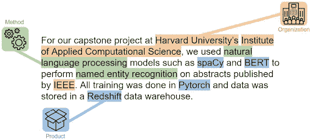

**图一**。标有方法、产品和组织实体的示例文本(作者提供照片)

**共指消解**

我们将通过共指解析从上面发现的实体中提取唯一的实体，共指解析是一种 NLP 技术，它将引用同一实体的表达式聚集在一起。

# 探索性数据分析

IEEE Xplore 是 IEEE 的数字白皮书存储库，包含大约 500 万份出版物。这些论文分布在许多研究领域，从计算机科学到病毒学。对于这个项目，我们只看这些出版物的摘要。我们通过托管在关系数据库实例上的 Microsoft Academic Graph (MAG)的快照来获取摘要。MAG 是一个包含出版物元数据的学术出版物异构图形数据库。MAG 上总共有 478 万份 IEEE 摘要。我们还收到了 1，300 份摘要，上面标有方法、产品和组织。在本文的其余部分，我们将把它称为继承数据集。

对数据集的探索性分析表明，IEEE 出版物在研究领域(如计算机科学、政治学)方面严重倾斜。超过 94%的 IEEE 论文涉及计算机科学、工程、材料科学和物理学。图 2 和图 3 比较了在 MAG 数据库和继承数据集中 IEEE 出版物按研究领域的分布情况。继承的数据集从工程领域过度采样，从不太常见的领域(如艺术、历史和哲学)采样不足。

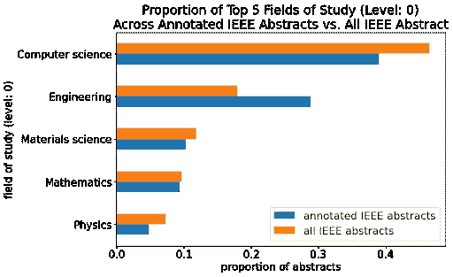

**图二**。继承摘要与所有 IEEE 摘要中前 5 个领域的比例(作者照片)

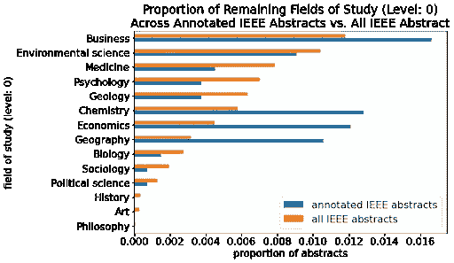

**图三**。继承摘要与所有 IEEE 摘要中剩余字段的比例(作者照片)

我们将继承数据集中的标记摘要映射到它们的出版研究领域(例如，计算机科学、医学)，并绘制每个领域中标记实体的数量。图 4 显示了每个实体类的出现在不同学科之间有显著差异的证据。例如，注释者倾向于选择数学、生物学或地质学摘要中的方法，而产品更可能出现在计算机科学或化学摘要中。

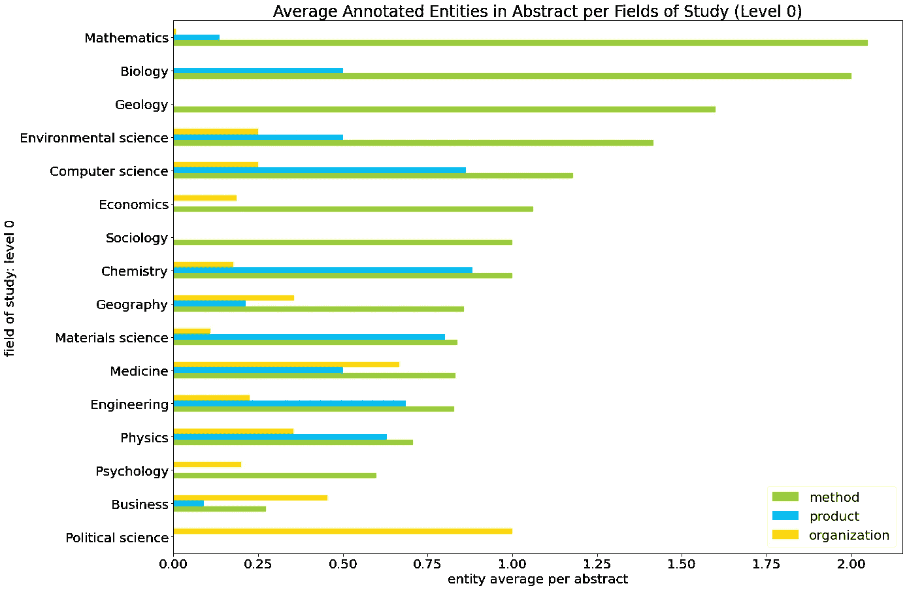

**图 4** 。每个研究领域摘要中的平均注释实体(作者照片)

图 5 显示了从 1879 年到 2019 年每年的 IEEE 摘要数量。自 2000 年以来，出版物的数量急剧增加，而且这一趋势没有减缓。科学研究领域的快速发展意味着旧论文中的技术术语和语言使用会很快过时。为了具有前瞻性，我们的目标是在数据库中更新的摘要上训练我们的模型。

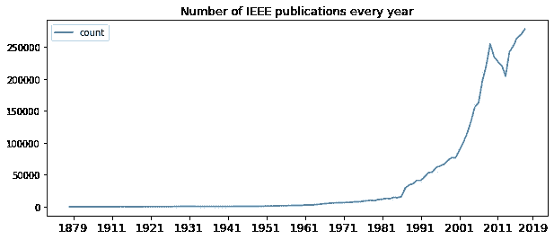

**图 5** 。每年 IEEE 出版物数量(1879–2019)(作者照片)

我们的探索性数据分析使我们确信，1，300 个继承的摘要并不构成 IEEE 数据库的代表性样本。更大的研究领域被过度采样，我们发现证据表明实体并不是均匀分布在各个领域。这激发了创建具有出版领域代表性的样本的需求。我们还希望将我们的分析集中在更新的抽象上，这是继承的数据集所不具备的。此外，在查看了带注释的数据集并与 IEEE 讨论后，我们发现标记方案不一致，并且不完全可重复。因此，IACS 团队决定创建一组新的标记数据。

# 新 IACS 标注数据集

我们标记的数据集有两个目标:

1.  在研究领域代表 IEEE 摘要
2.  具有可重复的一致标签方案

对于第一个目标，我们确保从数据库中取样，使得研究领域的样本分布遵循实际分布。

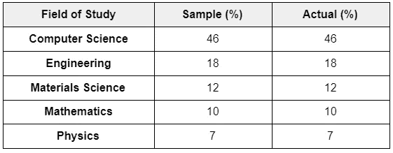

**表 1** 。每个研究领域提取样本的百分比(作者照片)

我们还希望将我们的分析集中在较新的摘要上，同时仍然考虑较旧的摘要。

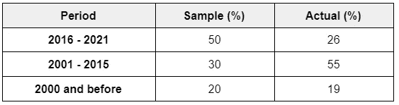

**表二**。每个时间段提取的样本百分比(作者照片)

对于第二个目标，我们与 IEEE 密切合作来定义实体类，并创建了一套注释指南。然而，正如我们将在后面讨论的，这是一项具有挑战性的任务，对模型性能有着重大的影响。

IACS 数据集总共有 1050 个由 4 个标注者标注的摘要。

# 命名实体识别

**建模方法**

对于命名实体识别(NER)任务，我们采用了基于 BERT 的模型。BERT(来自变压器的双向编码器表示)[1]，顾名思义，是一个基于*变压器的*语言模型，利用*双向训练*。该模型是根据对大量文本的自我监督训练开发的，特别是来自图书语料库的 8 亿个单词和来自英语维基百科的 2500 万个单词。它接受了掩蔽语言模型(MLM)和下一句话预测(NSP)任务的训练，在训练过程结束时，BERT 具有语言处理能力，可以实现下游监督学习任务，如 NER。

转换器包含两种机制:一种是读取文本输入的编码器，另一种是为任务做出预测的解码器。BERT 仅使用编码器机制来生成单词之间的上下文关系。一系列单词(记号)被传递到模型中，嵌入到向量中，并在神经网络中进行处理。输出是一个向量序列，每个向量对应一个令牌。双向训练指的是与从左到右顺序读取输入文本的定向转换器相反，BERT 读取输入文本的左右上下文。(图 6)

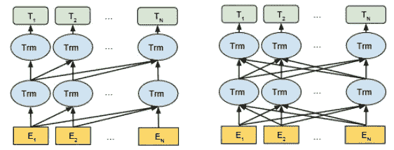

**图 6** 。左至右转换器的预训练架构(左)与 BERT(右)。在所有层中，BERT 表示由左右上下文共同决定。[1](照片由德夫林等人拍摄。铝)

对于 MLM 任务的训练，伯特屏蔽了输入中 15%的单词来进行预测。由于用于评估损失函数的输入百分比如此之小，因此与其他方法相比，BERT 趋于收敛得更慢。BERT 还通过将两个句子配对在一起来训练下一句预测，50%的时间是后续句子，50%的时间是随机配对。这允许模型学习句子连续性。

我们评估了两个模型:(1)根据来自书籍语料库和英语维基百科的通用文本进行预训练的 BERT，以及(2)根据来自语义学者的科学文本进行预训练的 SciBERT [2]。18%的数据集来自计算机科学领域，82%的数据集来自广泛的生物医学领域。在基于 BERT 的词汇和 SciBERT 词汇之间有 42%的重叠，说明了科学和一般领域文本之间在常用词方面的实质性差异。

**多类别到多标签场景**

对于我们的 NER 任务，我们在预训练的 BERT 模型之上添加了一个令牌级分类器。分类器为每个单词标记预测一个实体类(方法、产品、组织或无)。我们从一个多类 NER 任务开始，但是后来意识到我们的问题是一个多标签的问题。也就是说，我们应该能够将一个单词标记分为多个类别。例如,“IEEE Xplore”中的“IEEE”应同时标注为组织(因为它是组织的名称)和产品(因为它是正式产品名称的一部分)。我们重新注释了数据集，并对原始的多类模型做了一些修改。我们现在预测一组类，而不是为每个单词标记预测一个单独的类。数组中的每个元素都是一个二进制标志，表示该类中的成员。我们还将损失函数从交叉熵损失改为二元交叉熵损失。

**结果**

对于 BERT-Base 和 SciBERT 模型，我们将 60%的标记数据用于训练，20%用于验证，20%用于测试。我们使用 Optuna 来调整训练集和验证集上的模型超参数，并使用最佳超参数集来评估测试集上的模型。图 7 绘出了训练步骤中的二元交叉熵损失。

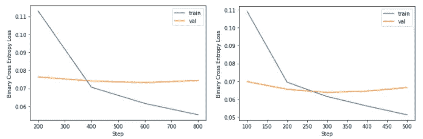

**图** **7** 。BERT-Base(左)和 SciBERT(右)在训练步骤中的损失(作者拍摄)

表 3 报告了每个实体类别的 F1 分数。我们在包含 200 个测试样本的 IACS 多标签数据集上报告了 BERT-Base 和 SciBERT 模型的 10 倍交叉验证 F1 分数。

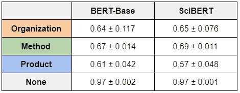

**表**T2 3。每个实体类的 BERT-Base 和 SciBERT 模型的 F1 分数。报道了超过 10 倍的平均值和标准偏差。(作者供图)

表 3 中的交叉验证结果表明，我们的模型性能在运行中通常是一致的，尽管 BERT-Base 模型在组织类的性能方面有较大的差异。

# 共指消解

**建模方法**

共指解析是指对同一实体的引用的解析。这些参考资料有多种形式。对于这个项目，我们感兴趣的是通过名称或缩写来引用同一个实体，例如"*麻省理工学院*"和"*麻省理工学院*"或*" k-最近邻*"和" *kNN* "。

在回顾 IEEE 摘要时，很明显这些缩写中的许多至少在文本中定义过一次。定义几乎都是“*我们使用 k-nearest neighbors (kNN)来对我们的记录进行聚类*”的形式，其中缩写在它缩写的短语后面的括号中。在我们的注释指南中，我们决定当这些缩写出现时，应该选择它们作为实体的一部分。这意味着在我们带注释的摘要中识别这种模式并解析出缩写和完整形式是一项相当容易的任务。我们在 Method 类的 3，074 个标签中发现了 339 个这种形式的实例。

对于每个实体类，我们然后获取所有标记的实体加上这些解析的实体，并成对地进行比较，以找到彼此相似的实体和缩写。我们需要执行的比较的数量大致与实体标签的数量成二次方关系，所以我们需要一个非常高效的方法。我们考虑了一种对位置敏感的散列方法，例如 [datasketch](http://ekzhu.com/datasketch/lsh.html) ，但是最终使用了一种更快更精确的解决方案【3】，就像在 Python 包 [SetSimilaritySearch](https://github.com/ekzhu/SetSimilaritySearch) 中实现的那样。这个实现要求每个实体标签被表示为一个无序的集合，我们选择通过向下压缩和基于字符的 2-瓦片区来构造它。比如“马尔可夫”就变成了(“ma”、“ar”、“rk”、“ko”、“ov”)。然后我们使用上面的包找到所有 Jaccard 相似度大于 0.85 的对。为了将所有这些成对比较转化为聚类，我们创建了实体标签的网络图，并将每个发现的对添加为边。为了提取聚类，我们简单地提取了图的连通分量。

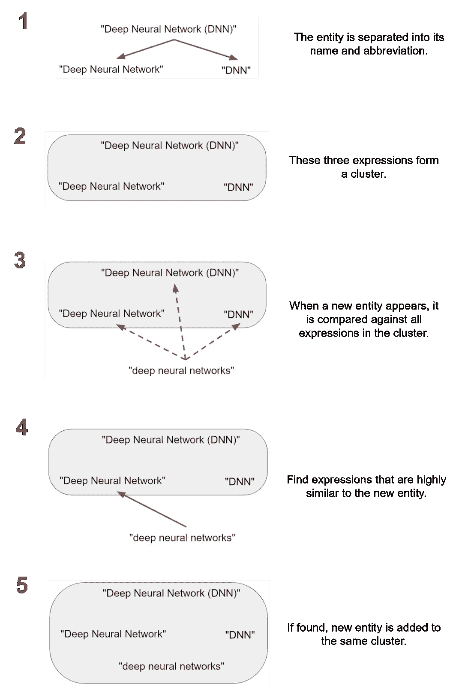

**图**图**图**。我们的共指解决程序的图解(由作者拍摄)

**结果**

为了评估性能，我们检查了为每个实体类创建的所有分类，并识别了错误分类的实体标签。作为错误聚类的一个例子，考虑这种方法聚类:“SA”、“模拟退火”、“模拟退火(SA)”、“球面像差”和“球面像差(SA)”。很明显，“模拟退火”和“球面像差”不是指同一个过程，但我们的方法将它们聚集在一起，因为它们都缩写为“SA”。对于每个实体类，只有不到 4%的实体被错误聚类，我们认为这是很好的性能。详情参见表 4。

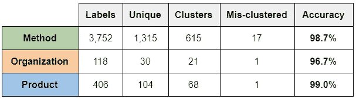

**表 4。**共指消解的聚类性能(作者图片)

# 讨论

**回顾伯特模型预测**

我们回顾了基于 BERT 的模型对人类标签的预测。图 9 显示了我们的模型做出的良好预测的示例。BERT-Base 和 SciBERT 都成功地将相同的实体及其对应的类识别为人类注释器。

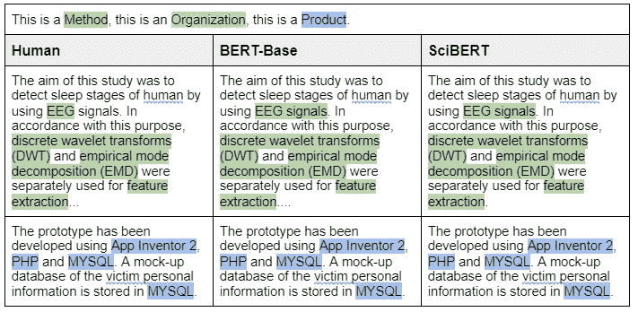

**图九。**BERT 和 SciBERT 预测准确的样本摘要(作者提供照片)

当我们查看模型的故障模式时，我们注意到 BERT 和 SciBERT 都特别容易在标点符号(例如破折号或括号)和结尾的“s”处出错。很可能这些术语在文本中出现得更频繁，因此它们在模型的失败中出现得更频繁。也有可能模型在解析实体的边缘时有困难。图 10 显示了模型造成的一些错误。

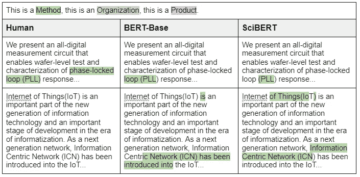

**图 10。**BERT 和 SciBERT 错误的样本摘要(作者照片)

在第一个例子中，BERT-Base 和 SciBERT 都只捕获了实体的一部分。在第二个样本中，人类没有在这个摘要中标记任何东西，但是 BERT-Base 和 SciBERT 都选择了“*信息中心网络(ICN)* ”，这可能是一个实体。

**基于 BERT 的研究领域预测**

探索性分析的一个发现是，不同的研究领域(如计算机科学、历史)在词汇、语境和语言使用上有所不同。出于这个原因，我们确保我们的标记数据集包括人文科学、社会科学和科学的例子，以确保该模型可以适用于提交给 IEEE 的任何论文。

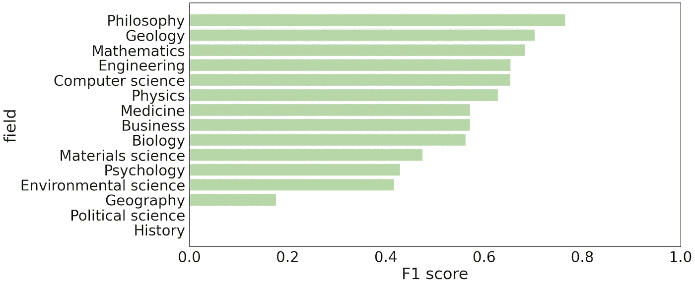

**图 11。**验证集研究领域的 F1 分数(作者照片)

上面的图 11 显示了该模型在不同的研究领域中的不同表现。我们看到，对于历史和政治科学这两个研究领域，没有方法实体，因此 F1 值为 0。在训练场上也是如此。这表明，如果我们希望更好地评估模型的特定领域性能，我们需要增加此类领域的训练样本数量。

我们也看到了依赖于注释者团队专业知识的趋势。方法实体的最高 F1 分倾向于注释团队具有丰富专业知识的领域:数学、工程和计算机科学。(哲学和地质学是离群值。)这表明注释者的专业知识对模型性能有影响。

因为像计算机科学、工程、数学和材料科学这样的领域构成了所有 IEEE 摘要以及所有训练和验证样本的大约 85%,所以这些领域对模型性能和度量具有最大的影响。method 的总体 F1 分数为 0.64，计算机科学、工程和数学的 F1 分数分别为 0.65、0.65 和 0.68。同时，材料科学的 F1 分数为 0.47。

**内部标注者协议**

即使在用 IEEE 定义了实体类并创建了注释指南之后，团队仍然发现很难标记摘要。有歧义(指导方针并不涵盖所有情况)和难懂的术语，团队都在努力解决。为了量化这些困难，我们测量了注释者对 50 个摘要的注释达成一致的程度。

为了使我们的注释者间协议(IAA)度量与我们的模型性能度量相当，我们将实体标签与来自我们模型的标记器的标记边界对齐。这使得我们可以将一个人类注释者与另一个人类注释者进行比较，就像我们将模型的输出与人类注释者进行比较一样。在[4]之后，我们查看了四个注释器的所有六个可能的对。对于每一对，我们任意选择一个注释器作为“基础事实”，并根据这个基础事实计算每个实体类的第二个注释器的 F1 值。(选择注释者作为基础事实并不重要——无论哪种方式，得到的 F1 分数都是一样的。)这个 F1 分数可以解释为第二个注释者在恢复第一个注释者的标签的任务中的表现。这实际上是模型正在执行的相同任务。

这个过程为每个实体类产生了六个 F1 值——每对标注器一个。在图 12 中，我们将这六个 F1 分数与我们最佳模型的 F1 分数进行了比较。我们可以看到，对于 Organization 和 Method 类，我们的模型比一些注释器对执行得更好，但比其他的差。None 类比其他类大得多，每个人做的都差不多。对于 Product 类，我们的模型的性能比最不一致的那对标注器稍差。从表 3 的标准偏差中可以看出，该模型的一些运行表现得比产品类别的最不一致的人对更好，尽管该模型对其他类别的表现稍差。

图 12 说明了我们的模型与人类表现相当。对于产品类来说，可能会有一些小的性能提升，但是我们已经达到了数据质量所强加的性能上限。为了进一步发展这个模型，任务和类的定义很可能需要显著的改进。

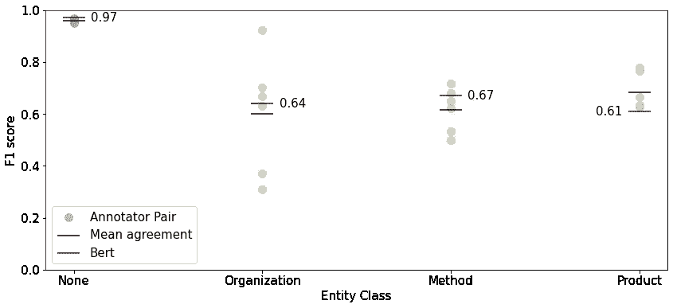

**图 12。** BERT 模型 F1 性能相对于注释者对之间的 F1 协议(由作者拍摄)

# 参考

[1] J. Devlin，M.-W. Chang，K. Lee，K. Toutanova，“BERT:用于语言理解的深度双向转换器的预训练”，*arXiv:1810.04805【cs】*，2018 年 10 月，访问日期:2021 年 03 月 04 日。【在线】。可用:【http://arxiv.org/abs/1810.04805】T4。

[2] I. Beltagy，K. Lo，A. Cohan，“SciBERT:一种用于科学文本的预训练语言模型”，*arXiv:1903.10676【cs】*，2019 年 9 月，访问日期:2021 年 3 月 04 日。【在线】。可用:[http://arxiv.org/abs/1903.10676.](http://arxiv.org/abs/1903.10676.)

[3] R. J. Bayardo、Y. Ma 和 R. Srikant，“扩大所有配对的相似性搜索”，载于第 16 届国际万维网会议论文集*WWW ' 07*，加拿大阿尔伯达省班夫，2007 年，第 131 页，doi:[10.1145/1242572.1242591](https://doi.org/10.1145/1242572.1242591)。

[4] G. Hripcsak 和 A. S. Rothschild，“信息检索中的协议、F-Measure 和可靠性”，*美国医学信息学协会杂志*，第 12 卷，第 3 期，第 296-298 页，2005 年 5 月，doi: [10.1197/jamia。M1733](https://doi.org/10.1197/jamia.M1733) 。

[5] J. Huang *等*，《少镜头命名实体识别:综合研究》，*arXiv:2012.14978【cs】*，2020 年 12 月，访问时间:2021 年 03 月 04 日。【在线】。可用:【http://arxiv.org/abs/2012.14978】T4。

[6] M. Joshi，D. Chen，Y. Liu，D. S. Weld，L. Zettlemoyer，O. Levy，“SpanBERT:通过表示和预测跨度来改进预训练”，*《计算语言学协会汇刊》*，第 8 卷，第 64–77 页，2020 年 12 月，doi:[10.1162/tacl _ a _ 00300](https://doi.org/10.1162/tacl_a_00300)。

[7] H. Lee、Y. Peirsman、A. Chang、N. Chambers、M. Surdeanu 和 D. Jurafsky，“斯坦福大学在 CoNLL-2011 共享任务中的多遍筛选共指消解系统”，访问日期:2021 年 3 月 4 日。【在线】。可用:[https://nlp.stanford.edu/pubs/conllst2011-coref.pdf](https://nlp.stanford.edu/pubs/conllst2011-coref.pdf)

[8] J. Lee *等*，“BioBERT:一种用于生物医学文本挖掘的预训练生物医学语言表示模型”，*生物信息学*，第 36 卷第 4 期，第 1234–1240 页，2020 年 2 月，doi:[10.1093/bio informatics/btz 682](https://doi.org/10.1093/bioinformatics/btz682)。

[9] V. Stoyanov 和 J. Eisner，“简易优先共指消解”，载于 2012 年印度孟买的*COLING 会议录，2012 年 12 月，第 2519-2534 页，访问日期:2021 年 3 月 4 日。【在线】。可用:[https://www.aclweb.org/anthology/C12-1154](https://www.aclweb.org/anthology/C12-1154)。*

[10] R. B. Tchoua *等人*，“用最小的人类 Effort 为科学命名实体识别创建训练数据”，访问日期:2021 年 3 月 4 日。【在线】。可用:[https://tsapps.nist.gov/publication/get_pdf.cfm?pub_id=926228](https://tsapps.nist.gov/publication/get_pdf.cfm?pub_id=926228)