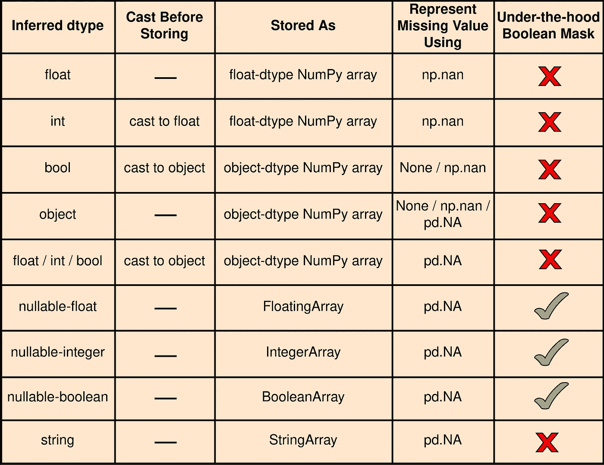

# NaN、None 和实验 NA

> 原文：<https://towardsdatascience.com/nan-none-and-experimental-na-d1f799308dd5?source=collection_archive---------21----------------------->

## 熊猫价值观缺失的图解指南

现代技术创新经常涉及处理和分析带有*缺失值*的数据集。而且，为了有效地处理这些数据集，不同的库选择以不同的方式表示缺失的值。鉴于它们的重要性和频繁出现，我们将从当前的艺术状态开始，讨论它们的属性，然后按时间顺序说明在*熊猫*中使用的可用缺失值惯例。

图片由作者制作，使用[图](https://apps.diagrams.net)。

为了让**表示缺失值**，我们看到**有两种方法**，它们通常应用于表格或数据帧中的数据。第一种方法包含一个*掩码*来指出缺失值，而第二种方法使用特定于数据类型的*标记值*来表示缺失值。

当**屏蔽**时，*屏蔽*可以是全局屏蔽，也可以是局部屏蔽。全局掩码由每个数据数组的一个单独的布尔数组组成(图 1)，而局部掩码利用元素的逐位表示中的一位。例如，一个*有符号整数*也保留了一个单独的位，用作本地掩码来指示整数的正/负*符号*。

图 1:全局布尔掩码方法。请注意，MV 表示缺失值。图片由作者使用[图](https://apps.diagrams.net)制作。

另一方面，在**标记**方法中，定义了特定于数据类型的*标记值*。这可以是基于最佳实践的典型值，也可以是唯一定义的逐位表示。对于浮点类型的缺失值，库通常会选择标准的 [IEEE 754](https://en.wikipedia.org/wiki/IEEE_754) 浮点表示，称为 [NaN](https://en.wikipedia.org/wiki/NaN) (不是数字)，例如，参见图 2。类似地，有些库也为其他数据类型定义了独特的位模式，例如 *R* 。

图 2:说明了一个逐位的 IEEE 754 单精度(32 位)NaN 表示。根据维基百科，[IEEE 754](https://en.wikipedia.org/wiki/IEEE_754)nan 编码为指数字段填充 1(类似于无穷大值表示)，有效位字段中有一些非零数字“x”(“x”等于零表示无穷大)。这允许多个不同的 NaN 值，具体取决于有效位域中设置了哪些位，但也取决于前导符号位“s”的值。[似乎](https://stackoverflow.com/questions/19800415/why-does-ieee-754-reserve-so-many-nan-values)IEEE 754 标准将 16，777，214 ( ⁴-2)浮点值定义为 NaNs，或所有可能值的 0.4%。减去的两个值是正无穷大和负无穷大。另请注意，x 的第一位用于确定 NaN 的类型:“安静 NaN”或“发信号 NaN”。其余位用于编码有效载荷(在应用中最常被忽略)。图片由作者提供，使用[图](https://apps.diagrams.net)制作。

尽管上述**屏蔽和哨兵方法**被广泛采用，但它们也有各自的**权衡**。单独的全局布尔*掩码*在存储和计算方面增加了额外的负担；然而，位样式的*标记*限制了可能丢失条目的有效值的范围。除此之外，用于标记的类型特定的逐位模式也需要实现附加的逻辑来执行比特级操作。

由于 ***pandas*** 是基于 NumPy 构建的，所以它只是将 IEEE 标准 *NaN* 值合并为浮点数据类型的 *sentinel 值*。然而，NumPy 没有针对非浮点数据类型的内置*标记*。因此，这意味着*熊猫*可以利用*掩码*或者*哨兵*来处理非浮点类型。也就是说， *pandas* 既可以有一个全局布尔掩码，也可以在元素的逐位表示中本地保留一位，或者有唯一的特定类型的逐位表示，比如 IEEE 的 *NaN* 。

然而，如前所述，上述三种可能性[ *布尔掩码、位级掩码和哨兵码* ( *位模式* )]中的每一种都是有代价的。说到利用全局布尔掩码，*熊猫*可以基于 NumPy 的*掩码数组* ( *ma* )模块。但是，所需的代码库维护、内存分配和计算工作量使其不太实用。类似地，在本地级别上， *pandas* 也可以在其元素的每个位表示中保留一个位。但话说回来，对于较小的 8 位数据单元，丢失一位用作本地掩码将显著减少它可以存储的值的范围。因此，认为全局和局部*屏蔽*是不利的。也就是说，这让我们想到了第三个选项，即特定类型的 *sentinels* 。虽然这是一个可能的解决方案，但是熊猫对 NumPy 的依赖使得特定类型的哨兵变得不可行。例如，该包支持 14 种不同的整数类型，包括精度、字符顺序和有符号性。因此，如果要为 NumPy 支持的所有不同数据类型指定和维护独特的类似 IEEE 的标准位表示，那么 *pandas* 将再次面临艰巨的开发任务。

[由于上述实际考虑，并且作为计算效率和维护](https://pandas.pydata.org/docs/user_guide/gotchas.html#nan-integer-na-values-and-na-type-promotions)之间的良好折衷， ***熊猫*利用两个**现有的 **Python 哨兵来表示空**。分别是 IEEE 的标准浮点值 ***NaN*** (可用作为 *numpy.nan* )，Python 的[singleton](https://en.wikipedia.org/wiki/Singleton_pattern)object***None***(如 Python 代码中所用)。

然而，**从 v1.0** 开始，在【2020 年 1 月 *熊猫*为*标量*缺失值引入了一个内部 ***实验 NA*** 值(单例对象)🎉[根据文档](https://pandas.pydata.org/pandas-docs/stable/user_guide/missing_data.html#missing-data-na)，这个新**的目标是*熊猫。NA*** [singleton](https://en.wikipedia.org/wiki/Singleton_pattern) 提供了一个通用的“缺失值”指示器，可以在所有数据类型中一致使用。也就是用*熊猫。那*总的来说不是跳来跳去的*numpy nan*、 *None* 或*熊猫。NaT* ，这是特定于类型的。注意*熊猫。NaT* 用于表示 *datetime* 缺失值。

说到 *NaN* 和 *None* ， *pandas* 就是为了在这两个哨兵之间方便地切换(转换)，在需要的时候。例如，在下图中，我们从包含一个缺失值的**浮点值**的列表中构造了一个简单的数据帧，我们用 *numpy.nan* 或 *None、*来表示

图 3:说明了一个简单的单列数据帧，它由一个包含一个缺失值的浮点值列表构成。注意，默认情况下，pandas 将浮点值推断为 float64。图片由作者提供，使用[图](https://apps.diagrams.net)。

虽然我们知道浮点缺失值将使用 *numpy.nan* 来表示，但是为了方便起见，我们也可以使用 *None* 来表示缺失值。在这种情况下，如上图所示， *pandas* 隐式地从 *None* 切换到 *NaN* 值。

类似地，让我们考虑另一个例子，其中我们从一列**整数**中构造一个数据帧，只缺少一个值，见下文。

图 4:说明了一个简单数据帧中隐含的 int 到 float 类型转换现象，该数据帧由一个包含缺失值的整数列表构成。图片由作者提供，使用[图表](https://apps.diagrams.net)。

上图中有两件事需要注意。首先，在使用 *numpy.nan* 、*熊猫*表示整数型缺失值时，将整数型数据(默认推断为 *int64* )类型强制转换为浮点型数据(默认为 *float64* )。其次， *pandas* 再次允许我们利用两个哨兵中的任何一个来表示整数类型的缺失值。也就是说，当 *None* 用于表示缺失值时，它会隐式地将其转换为浮点值 *NaN* ，参见上面的结果数据帧。然而，将整数自动类型转换为浮点值并不总是很方便。尤其是当我们希望整数保持为整数的时候。因为有时整数也作为标识符用于索引目的。别担心😉因为熊猫已经解决了这个问题😎

再次截止到 2020 年 1 月发布的 **v1.0** 中，所有*熊猫【*现有的*可空整数*dtype，如(<https://pandas.pydata.org/pandas-docs/stable/reference/api/pandas.UInt64Dtype.html>*)[*int 64*](https://pandas.pydata.org/pandas-docs/stable/reference/api/pandas.Int64Dtype.html)，使用新的实验用*熊猫。NA* 作为缺失值指示器，代替 *NaN* 值。这太棒了😃因为通过使用任何 *pandas 的*扩展 integer 类型，我们可以在需要时避免整型到浮点型的类型转换。请注意，为了区别于 NumPy 的整数类型，例如“int64”，extension-dtypes 的字符串别名中的第一个字母是大写的，例如“Int64”。因此，作为一个例子，让我们使用扩展类型 *Int64* 和包含缺失值的一列**整数**来构造一个简单的数据帧，见下文*

**

*图 5:展示了一个单列数据帧，它由包含缺失值的整数列表构成，使用 Int64 扩展类型作为推断的数据类型。注意，您也可以将 dtype 别名“Int64”指定为 pd。Int64Dtype()。此外，您还可以使用更小的位大小变量，如 Int16 或 Int8。图片由作者提供，使用[图表](https://apps.diagrams.net)。*

*如上图所示，当 *Int64* 被指定为 *dtype* 时， *pandas* 不会将整数类型转换为浮点数据，它使用新的实验 *NA* 值来表示所有标量缺失值，而不是 *NaN* 。*

***1.0**版本还为我们提供了两种新的实验性扩展类型，类似于*整数<位长> Dtype* 。这些是完全专用于字符串和布尔数据的*字符串*和*可空布尔*数据类型。新的 Dtype 可用作[*string type*](https://pandas.pydata.org/pandas-docs/stable/whatsnew/v1.0.0.html#dedicated-string-data-type)和 [*BooleanDtype*](https://pandas.pydata.org/pandas-docs/stable/whatsnew/v1.0.0.html#boolean-data-type-with-missing-values-support) 以及它们相应的别名“string”和“boolean”。作为一个例子，下面我们举例说明一个简单的数据帧，该数据帧是使用新的实验扩展类型[*string type*](https://pandas.pydata.org/pandas-docs/stable/whatsnew/v1.0.0.html#dedicated-string-data-type)以及一列带有缺失值的**字符串**构建的，*

**

*图 6:展示了一个使用 pd 从包含缺失值的字符串列表构建的单列数据帧。[string type](https://pandas.pydata.org/pandas-docs/stable/whatsnew/v1.0.0.html#dedicated-string-data-type)()扩展数据类型别名“string”。图片由作者使用[图](https://apps.diagrams.net)制作。*

*即使对于新的扩展*字符串*类型，当我们使用 *numpy.nan* 或 *None* 来表示一个缺失值时， *pandas* 会隐式地将其转换为结果数据帧中新的实验 *NA* 标量值。是从 [**v1.1**](https://pandas.pydata.org/pandas-docs/stable/whatsnew/v1.1.0.html#all-dtypes-can-now-be-converted-to-stringdtype) 开始，在***2020 年 7 月*** 发布，这里所有的 Dtype 都可以转换成*string type*。*

*类似地，如图 6 所示，我们也可以使用新的扩展类型[*BooleanDtype*](https://pandas.pydata.org/pandas-docs/stable/whatsnew/v1.0.0.html#dedicated-string-data-type)*从一列 **bool** 和缺失值中构造一个 dataframe，如下所示**

****

**图 7:展示了一个使用新扩展 pd 从一列 bool 和缺失值构建的单列数据帧。BooleanDtype() dtype 别名“boolean”。图片由作者使用[图](https://apps.diagrams.net)制作。**

**并且，截至【2020 年 12 月随着[发布**v1.2**](https://pandas.pydata.org/pandas-docs/stable/whatsnew/v1.2.0.html?highlight=float64dtype#experimental-nullable-data-types-for-float-data) ， *pandas* 支持两个额外的实验性*float 32d type*/*float 64d type*扩展数据类型，它们完全专用于浮点数据。两种*可空浮动*类型都可以容纳实验用的*熊猫。NA* 值。虽然 NumPy 的 *float* 使用 *NaN* 值来表示一个缺失值，但是这些新的扩展*dtype*现在与已经存在的*可空整数*和*布尔*dtype 内联。下面的例子展示了工作中的*可空 float*d type*float 64*，**

****

**图 8:说明了使用 pd 的数据帧结构。Float64Dtype()别名 Float64，它是 NumPy 的 float64 数据类型的扩展，支持 pd。不单身。注意，作为一种选择，只有一种更小的位尺寸变体可用，即 Float32。图片由作者提供，使用[图表](https://apps.diagrams.net)。**

**除了上面提到的扩展数据类型，即*可空整数*、*、布尔*、*、浮点*和*字符串* dtype、*熊猫*也带有它们对应的扩展*数组*数据类型。这些是 [*IntegerArray*](https://pandas.pydata.org/pandas-docs/stable/reference/api/pandas.arrays.IntegerArray.html) (自 *v0.24 起可用，*更新于 *v1.0* )，[*string array*](https://pandas.pydata.org/pandas-docs/stable/reference/api/pandas.arrays.StringArray.html)(*v 1.0*)，[*boolean array*](https://pandas.pydata.org/pandas-docs/stable/reference/api/pandas.arrays.BooleanArray.html)(*v 1.0*)，以及 *FloatingArray* ()因此，当 *dtype* 被指定为“boolean”时，所有 *BooleanDtype* 数据都存储在一个 *BooleanArray* 中。类似地，当要推断的 *dtype* 被指定为“Int64”时，它将所有的 *Integer64Dtype* 数据存储在一个 *IntegerArray* 中。**

**仔细观察，使用扩展数据类型作为其推断的 *dtype* 构造的 dataframe 实际上使用相应的扩展数组数据类型来存储(系列)数据。实际上，这些扩展数组数据类型由两个 NumPy 数组表示，见图 1。第一个用于存储数据，而第二个用作*全局布尔掩码*，指示第一个数组中缺失的值(布尔值*真*表示缺失)。但是，请注意， *StringArray* 只存储*string type*对象，没有第二个 NumPy 数组用作布尔掩码。另一方面，请注意，当扩展数组数据类型不用于构建数据帧时，默认情况下，所有带有缺失值的类似数组的数据都使用默认 NumPy *float* -或 *object* -dtype NumPy 数组进行存储。这些数组使用 *NaN* 或 *None* 来表示缺失的值。因此，下面我们列出了*熊猫*中所有缺失的价值观惯例，**

****

**表 1:熊猫缺失的价值观。请注意，可空和字符串 dtype 是一种扩展数据类型。字符串通常存储在 object-dtype NumPy 数组中，这里读。然而，随着 string dtype 的引入，它们现在可以存储在 StringArray 中，参见这里的。图片由作者提供，使用[图](https://apps.diagrams.net)制作。**

**这就是我们的结局。希望上面的讨论和插图系统地展示了*熊猫*中常规的和实验性的缺失值表示。虽然新的*熊猫。NA* 标量值被标记为实验性的，最近发布的特性和增强确实显示了库的驱动力和制造*熊猫的意图。NA* 通用缺失值指示器。谢谢，继续和熊猫们玩得开心😃 🙏**

## **构建数据帧的另一种方式**

**我们也可以使用传统的 *pandas.arrays()* 来构建数据帧，而不是使用缺失值的数据列表和指定的特定(扩展)数据类型来进行推断。从 **v1.0** ，[*pandas . arrays()*](https://pandas.pydata.org/docs/reference/api/pandas.array.html)开始，默认情况下，为整数、布尔值、字符串、浮点数等类似数组的输入推断扩展 dtype，参见[这里的](https://pandas.pydata.org/pandas-docs/stable/reference/api/pandas.array.html)。**

## **进一步阅读**

*   **[熊猫价值观缺失背后的原因](https://pandas.pydata.org/docs/user_guide/gotchas.html#nan-integer-na-values-and-na-type-promotions)**
*   **[处理缺失数据](https://pandas.pydata.org/docs/user_guide/missing_data.html)**
*   **[处理文本数据](https://pandas.pydata.org/pandas-docs/stable/user_guide/text.html#)**