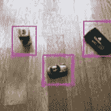

# “纳米 YOLO”——对简化 YOLO v1 多部分损失函数的见解

> 原文：<https://towardsdatascience.com/nano-yolo-insights-on-the-multi-part-loss-function-of-a-simplified-yolo-v1-5104bdee7ff1?source=collection_archive---------41----------------------->

## [实践教程](https://towardsdatascience.com/tagged/hands-on-tutorials)

## 当开始实验物体检测时，我们想知道什么


(*图片作者*)

在本文中，我们将描述我们训练简化的 YOLO v1 模型(我们称之为“纳米”)来检测物体的方法和学习。我们这样做的主要驱动力是“好奇心”——我们想看看我们是否能够成功地深入到对象检测中，利用我们自己的数据建立和训练我们自己的模型。
我们使用 Tensorflow 2.3.0 建立和训练模型。

因为我们想学习和尝试一些东西，所以每当我们不能完全理解最初的 YOLO v1 论文的目的时，我们就选择自己做决定。我们选择 112×112 像素的输入尺寸来训练模型(YOLO v1 使用 448×448)，我们使模型架构适应变化的尺寸，并且我们改变损失函数的部分。我们的目标是检测桌子上的三个简单物体——一辆玩具车、一个卷笔刀和一套工具。

在以下部分中，我们将描述如何

*   生成了用于训练和验证的数据集，包括自动标记，
*   建立了模型并实现了损失函数，
*   训练模型以达到我们期望的精度。

通过我们的“纳米 YOLO”模型，我们能够在一个恒定的平面背景(我们的公寓地板)上检测三个不同的物体(玩具车、卷笔刀和工具集)，精确度为 0.81 (VOC2007 mAP@.80)。这并不多，但对我们来说——这让我们对物体检测的工作原理有了大量的见解和理解，我们想与尚未迈出这一步的人分享这一点。

# YOLO v1 上的一些话(如果你以前没听过)

YOLO v1 试图通过单次向前穿过模型来检测图像中的对象。预测图像中的对象类别、中心位置及其边界。

这是通过将整个图像分解成网格单元(通常为 7×7)来完成的，并且为这些网格单元中的每一个回答它持有哪个对象类，以及(从该单元的角度来看)该对象在该单元内居中并且跨越整个图像的最佳猜测。由于许多网格单元可能要求更大的图像，因此需要后处理来抑制声称检测到对象但与其他相比不是最佳对象的网格单元。

导致图像内物体的相当好的检测。

# 创建训练集

我们创建了自己的训练集，包括物体的图片(玩具车、工具集和卷笔刀)和不同的背景图片(公寓地板)。因为我们想使用最少的一组图像，所以我们使用数据生成将相同的对象放置在背景上的随机位置，以创建一组 6000 张图像。

为了实现这一点，我们使用 OpenCV 方法(不是本文的一部分)剪切对象，选择背景图片的随机部分，并将对象放置在该图片的随机位置。对象位置、放置的对象类型和边界框的信息存储在一个文本文件中，以便稍后用作我们的标签。

此外，我们增强了创建的图像，以增加训练模型的鲁棒性。我们使用了 ***imgaug*** 库，它有一个非常好的文档，显示了不同类型的增强的效果。注意不要以使创建的标签过时的方式增加，例如透视变换。或者生成在模型的预期用途中永远不会出现的图像，例如，因为我们的玩具车不会粘在天花板上而上下翻转。

我们使用了以下增强功能:

*   将对象从左向右翻转(放在背景上之前)
*   运动模糊将运动效果应用到图像
*   亮度稍微改变颜色，使其出现在不同的光线设置中
*   锐化对象的边缘。

下图显示了创建的原始图像和增强模糊，颜色，锐化


图像:原始、运动模糊、色彩亮度和锐化(*作者的图像*)

每个增强以一定的概率应用于每个图像。每个生成的图像都很有可能是唯一的。

对于我们的示例训练，我们使用了 4 幅原始图像——一幅公寓地板的图像，一幅每个对象的图像。为了实现高质量的图像生成，图像以 448×448 像素生成，然后缩小到所需的 112×112 的图像尺寸。

# 模型设置

我们大致按照最初的 YOLO v1 论文(链接)中描述的那样实现了模型架构——尽管我们应用了一些更改:

1.  我们减少了图像的输入尺寸，并相应地调整了层数和最大池数，从 112x112(图像尺寸)到 7x7(网格尺寸)
2.  我们为“empty”添加了一个类来描绘没有任何对象的背景，并相应地改变了损失函数
3.  我们移除了损失函数中的大部分超参数，并用基于当前批次统计数据计算出的参数替换了这些超参数

下面，我们将详细描述我们如何建立模型，以及我们如何理解和实现损失函数。

# 模型架构

我们建立了两个模型:

*   “分类”，用于分类预处理
*   “检测”，用于检测物体

两个模型共享一个“公共基础”模型，这构成了图表的最大部分。而用于分类或检测的头部只是添加到公共基础模型中(注意:生成模型输出的“头部”通常显示在所绘制的模型图的底部，或者如果该图是水平绘制的，则显示在右侧)。


用于分类和检测的“公共基础”模型(*作者图片)*

我们的公共基础模型在卷积中使用步长 1，然后使用最大池来减少矩阵。这是在最初的 YOLO v1 论文中使用的简化技术。也可以通过使用步长 2 卷积来实现这种减少。

## 添加分类头

对于分类模型，我们展平了公共基础模型的输出，并在使用激活的 *softmax* 完成密集的 4 层(我们的类“无”、“玩具车”、“削笔器”、“工具集”)之前应用了 0.5 的 dropout。

softmax 是可行的，因为我们不会生成包含多个对象的图像。

最初的 YOLO v1 论文为头部添加了一个额外的密集层和一个平均池层，这是我们首先尝试但跳过的——在我们的数据集上训练期间，我们没有看到这些额外层的任何好处或改进。

## 添加探测头

对于检测模型，我们向基本模型添加了以下层:

1.  两个卷积层，具有*泄漏 relu* 激活函数、权重衰减和滤波器大小 512 和 128
2.  0.6 的展平和下降
3.  具有 *tanh* 激活功能的尺寸为 1024 的密集层(完全连接)
4.  大小为 686 的密集层(这是 7 个垂直网格单元* 7 个水平网格单元*每个网格 4 个热编码每类单元+ 2 个具有 1 个置信度和 4 个框尺寸的框)
5.  自定义重塑图层以输出具有不同值范围的类、盒和盒置信度(具有 *softmax 的类、具有 *sigmoid 的盒和盒置信度*)*

卷积层需要学习用于基于公共基础模型的特征进行检测的特征。这种学习必须有一定的空间，这些额外的回旋将完成这个任务。
密集层将所有数据收集在一起，并提供学习预测所需检测输出的能力。

# 损失函数

现在，我们来看看损失函数。对于基于 YOLO v1 的物体检测，预测将首先远非完美，并且将以三种不同的方式产生误差:

1.  对象类的错误预测
2.  对象的位置和边界框的错误预测
3.  错误的置信度哪个内部盒子表示是对象的正确表示

每个错误都需要用一个损失来惩罚，以训练模型，因此总损失由这三部分组成，即所谓的多部分损失函数。

在每个训练步骤中，计算该损失，并且计算模型函数的梯度(朝向最优的方向)。现在，在梯度方向上前进一步会减少损失。

在构建我们的“纳米 YOLO”时，我们深入研究的一件事是这三个部分的损失函数的组成以及这些部分如何相互作用。事实证明，为 YOLO v1 描述的大多数超参数只是将这三个部分混合成单个损失值的加权。

## 可视化损失函数的各个部分

由于训练历史中的典型“损失”值将仅显示多部分损失函数的组合损失，我们添加了额外的数据写入器来记录这些部分损失。

在我们保存实际损失函数“yolo_loss”的类中，我们添加了一个属性“self.lastClassLoss ”,该属性在实际损失函数“yolo_loss”的末尾将该损失与所有其他部分损失相加之前获取类损失的最后一个值。

```
class YOLOLossFunction ():
   def __init__(self, …):
      ...
      self.lastClassLoss = 0
      ... def yolo_loss(self, groundtruth, prediction):
      ...
      self.lastClassLoss = class_loss
      ...
      return (classloss + … )
```

为了能够在训练时将这个“lastClassLoss”写入历史，我们需要一个简单的函数，将标签和预测作为输入，并只返回这个属性:

```
class YOLOLossFunction ():
   ... def classLoss(self, y_true, y_pred):
      return self.lastClassLoss ...
```

在编译模型时，我们只需将此函数添加到我们的度量参数中，以便在每个训练步骤中将返回值写入历史:

```
yololoss = YOLOLossFunction(...)detmodel.compile(
  ...,
  metrics=[..., yololoss.classLoss, ...]
)
```

我们对多部分损失函数的每一部分都这样做了。


多部分损失函数各部分的验证损失图(*作者图片)*

有了这些信息，您可以清楚地看到多部分损失函数是如何工作的——哪个部分首先被优化，哪个部分根本不移动。当优化器努力寻找最简单的方法来降低损失时，如果不进行均衡，某些部分的数量可能会超过其他部分。有了这些见解，您可以根据您的特定数据集的需要来操纵超参数，并控制应该首先优化的内容。在我们的损失函数中，我们设法在移动到中心位置之前开始优化类预测，然后是盒子及其置信度(置信度在我们的例子中仍然不能正确工作，但可能是因为没有必要像在最初的 YOLO v1 论文中提到的那样，在不同类的网格单元中“专门化”两个盒子)。

## 阶级损失

损失函数首先优化的是类损失，这是最容易的部分，因为所有特征在公共基础模型中已经可用，新的头只需要学习这些特征的一些新的“路线”。我们试图塑造我们的数据集，通过在数据集中几乎没有太大变化的几乎统一的背景来使这变得更加容易。这使我们能够引入一个空类来描述没有对象的背景。

我们也有数据集中没有任何对象的图像。

我们实现了类预测，包括在最后一层激活 *softmax* 的空类，而不是 YOLO v1 论文中描述的 sigmoid 或线性。

由于图片的大部分包含空的网格单元(在我们的训练数据中只有一个网格单元是热的)，我们不想让模型猜测所有单元都是“空的”以最小化损失。因此，我们计算了一个物体和“空”之间的超参数。我们通过将“空”类预测损失除以空网格单元的数量，并将任何其他类的类损失除以负责对象(包含其中心)的网格单元的数量来实现这一点，当然是针对一批中的所有项目。

## 盒子损失

提醒一下，框损失描述了找到的对象中心有多好，以及预测的边界框覆盖对象有多好。第二部分让我们想起了 IoU(并集上的交集)和中心点之间欧几里德距离的第一部分——这正是我们实现它的方式。只有 IoU 不能完成这项工作，因为在训练开始时可能根本没有重叠，所以最小化距离将导致随后可以优化的重叠。

在训练中，您可以看到如何首先最小化距离损失，在学习边界框的高度和宽度之前估计对象的正确中心。导致结果更喜欢正确的中心位置而不是正确的边界框。同样，我们通过只计算该批中确实包含对象的图像来衡量损失。

## 信心丧失

置信度表示算法对估计的确信程度。在 YOLO v1 中，这用于编码网格单元中的盒子是否包含物体。我们已经用“空”类的概念代替了它，所以置信度将只指示每个网格单元的两个框中的哪一个应该最后被评估。

如前所述，YOLO v1 的论文认为，这也使细胞能够“专门化”某些类别。我们已经看到了这样的例子(看看另一个框的值)，而我们的总体结果显示，大多数时候这个框的置信度只是回答一个“你选择哪个框都没关系，因为两个都很好”。

我们再次用一批中的对象数量来加权该参数。

## 根据图像/对象中的对象对部分损失进行加权

在对我们的模型和数据集进行实验时，我们发现不平衡的对象数量(图像上的存在、类的类型)会导致不平衡的损失。因此，我们添加了(我们称之为)“数据组合丢失标准化”的概念，这确实改善了我们的结果，而且更重要的是，对于我们来说，理解模型试图了解的内容是很自然的:由于在一个图像中有许多空网格单元，甚至在整批图像中有更多的空网格单元(可能包含完全空的图像)，因此预测某些内容为“空”是没有意义的，因此需要根据图像中小对象的单次出现来权衡。大大增加了发生在这些小物体上的损耗。

## 将零件合计为每批一个损耗

最后，损失函数总结了三个损失值——预测类别标签的损失、预测对象位置和大小的损失(盒损失)和预测盒置信度值的损失。

# 培养

用我们自己的数据从头开始训练“纳米 YOLO”是一个两步走的方法——首先，我们训练分类模型来对不同的对象进行分类(“无”、“玩具车”、“卷笔刀”、“工具集”)，然后我们继续进行检测(对象位置和大小)。

## 预训练分类器

我们使用“ADAM”优化器和 Tensorflow 预定义的稀疏分类交叉熵损失函数来训练分类器。我们将 ADAM optimizer 的配置设置保留为默认值，这意味着学习率为 0.001，第一动量的指数衰减率为 0.9，第二动量的指数衰减率为 0.999，数值稳定性常数ε为 1e-07。我们没有使用优化器的 AMSGrad 变体。

经过 6 个时期(6000 张图像，批次大小为 64) —我们达到了 0.99 的验证精度。该模型可以对相似但看不见的图像进行分类。

这个结果看起来令人印象深刻，但必须谨慎对待，因为我们是从很少的实际图像中生成数据集的。

## “纳米 YOLO”——检测

我们保留了训练好的“共基”模型，并增加了探测头来训练我们的“纳米 YOLO”。

我们用随机梯度下降(SGD)优化器和前面解释的损失函数来训练该模型。对于所有的训练时期，我们使用具有初始设置值的优化器——动量为 0.6，学习率为 0.003。所有其他设置都保留默认值。

经过 250 个时期，一批 32 个和 6000 个图像，我们达到了 0.81 的精度(VOC 2007[mAP @ 0.80](mailto:mAP@.80)= 0.81)。

为了达到这个训练结果，我们尝试了从 0.001 到 0.01 的几个学习率以及从 0.3 到 0.8 的动量。此外，我们还尝试使用 ADAM 优化器对学习率进行类似的调整。我们经历了 ADAM 优化器在开始时相当不稳定，并且——一旦损失很小并且接近最佳值——损失值随机地突然爆炸(“爆炸梯度”的问题是众所周知的并且被描述了，但是我们还没有深入研究它，并且想要继续我们的对象检测方法)。

# 结果

对象检测工作得很好，尽管工具集和玩具车的分类可以更准确和鲁棒。尤其是使用“真实世界”的图像，上面有一个以上的对象。例如，下面的结果图像是用不同的闪电设置以及一个图像中的三个对象拍摄的，这是模型在训练期间没有看到的。在这张图片中，模型可以正确地检测和分类“sharper”和“toolset”——尽管玩具车的分类是“toolset”。



在训练期间从未见过的图像上检测到边界框(作者的*图像)*

汽车的视角完全不同于其他图像上所有先前训练的汽车视角。尽管这个盒子仍然很准确。

为了测量我们的 Nano Yolo 模型的准确性，我们将 VOC challenge(2007 年)的平均精度作为张量流度量(矢量化计算)来实施，考虑到我们的特殊情况，即每个图像只有一个对象。

根据这一指标，我们的纳米 YOLO 版本具有 0.81 的精度，最低 IoU 阈值要求为 0.8(VOC 2007[mAP @ 0.80](mailto:mAP@.80)= 0.81)。该图显示了平均精度如何根据 IoU 的不同选定阈值在所有类别中以 0.1 为步长变化。我们没有像通常在文章和论文中看到的那样，对每个阈值的精确值绘制不同的召回。


为 0 到 1 之间的几个 IoU 阈值绘制的平均精度(*图片由作者提供)*

# 学习

> “已为特定数据集/挑战选择了描述的超参数—估计您自己的参数或动态计算它们。”

对于我们的数据集，超参数取决于每批中所选的图像，并且需要根据批中对象和“无对象”的数量来采用。此外，物体对图像的覆盖也很重要——与我们的小物体相比，VOC2007 的图像覆盖范围更大。我们尝试了 Yolo v1 论文中的原始超参数，但在我们的数据集上没有得到好的结果。

> "如果背景一直是空的，那么“空”类会使事情变得更容易."

对于我们的数据集和方法，它简化了使用空类的事情。

在其他数据集(如 VOC2007 数据集)上，不同的背景将不符合我们的空类概念。在这里，使用 sigmoid 激活的原始 YOLO v1 行为可能会更好-允许所有类预测接近零的置信度，以指示在图像单元中无法识别任何已知对象。

> "从一个小模型开始快速实验."

我们的整体方法——用一个小模型处理一个小数据集——帮助我们深入了解对象检测的概念，并学习编写自定义损失函数的技巧。特别是，它使我们能够尝试不同的优化器、学习率以及快速采用超参数和模型层。一个带有小图像的小模型帮助我们在几分钟内完成了大多数实验，并且在不到一小时的时间内在我们自己的机器上完成了一个完整的训练。

> “你得试试。”

我们一停止复制就开始学习，开始自己开发东西。我们鼓励每个人也这样做。尝试愉快。