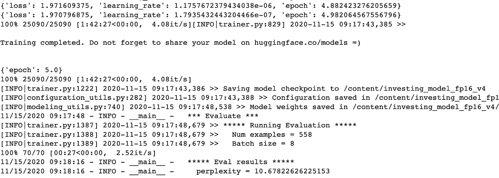

# 自然语言生成第 2 部分:GPT2 和 Huggingface

> 原文：<https://towardsdatascience.com/natural-language-generation-part-2-gpt-2-and-huggingface-f3acb35bc86a?source=collection_archive---------7----------------------->

## 学习使用 Huggingface 和 GPT-2 来训练语言模型以用于 Tensorflow


照片由 [Aliis Sinisalu](https://unsplash.com/@aliissinisalu?utm_source=unsplash&utm_medium=referral&utm_content=creditCopyText) 在 [Unsplash](https://unsplash.com/s/photos/tech?utm_source=unsplash&utm_medium=referral&utm_content=creditCopyText)

距离我的上一篇文章已经有一段时间了，很抱歉。工作，然后疫情抛出了一个扳手在很多事情上，所以我想我会回来一个小教程，对文本生成与 [GPT-2](https://openai.com/blog/better-language-models/) 使用[拥抱脸](https://huggingface.co/)框架。这将是一个 [Tensorflow](https://www.tensorflow.org/) 重点教程，因为我在谷歌上发现的大多数内容都倾向于 [Pytorch](https://pytorch.org/) 重点，或围绕 Tensorflow 使用它的细节。如果你不想看完我的整篇帖子，只是看看它是如何工作的，我有下面的 Colab 笔记本作为大纲，供人们参考[这里](https://gist.github.com/GeorgeDittmar/5c57a35332b2b5818e51618af7953351)。这篇文章基本上会回顾笔记本上的内容，所以应该很容易来回参考。

在我的上一个教程中，我使用马尔可夫链从总统演讲中学习 n-gram 概率，并使用这些概率生成类似的文本输出。现在，我们将更进一步，利用更先进的架构来创建更准确、更真实的文本输出。如果你还没有听说过 [GPT-2](https://openai.com/blog/better-language-models/) ，它是一个来自 OpenAI 的语言模型，使用一种叫做[转换器](https://en.wikipedia.org/wiki/Transformer_(machine_learning_model))的架构对来自网络的大量数据进行训练。[这里](https://jalammar.github.io/illustrated-gpt2/)是 GPT-2 使用的变压器架构的一个很好的视觉概述，这应该有助于给你关于它如何工作的直觉。GPT-2 不是开放人工智能语言模型的最高级版本，但与较新的 GPT-3 模型相比，它有许多参考实现和框架可供使用。它也是可以在 Colab 上运行的模型的一个版本，安装起来相当简单，希望在本教程之后更加容易:)

**我们来说说数据**

对于我们的任务，我们将创建一个生成金融文章标题的模型。如果我们从零开始训练语言模型的任务，我们将需要很多很多的例子(GPT-2 在 800 万个网页上被训练)。从预先训练的模型进行微调意味着我们不需要使用几乎相同的数量来获得我们特定任务的体面结果。

计划是获取大量的样本，几十万个，然后将它们分成训练集和评估集。我决定从 Kaggle 的 [/r/investing subreddit](https://www.reddit.com/r/investing/) 中的 reddit 标题和从 [*美国财经新闻文章*](https://www.kaggle.com/jeet2016/us-financial-news-articles) 数据集中提取标题来获取数据。来自联合数据集中的一些示例不仅仅与金融相关，因为许多金融新闻网站也报道非金融事件，并且 subreddit 数据混合了投资建议和问题。

从 reddit 提交的内容中提取的标题约为 100k，从 Kaggle 数据集提取的标题约为 179k。这应该是足够的例子，以便不过度适合我们的任务，并给我们一个丰富的可能文本集，以便从“金融”领域中生成。

**数据格式**

数据的格式似乎决定了我所发现的这些模型的训练和输出。对于 GPT-2，如果你想生成一大堆文本，比如一本书或文章，你可以把所有的例子放在一个文档中，例子之间没有特殊的标记。但是，如果您想要生成遵循特定模式或提示的输出，您应该向数据集中添加特殊标记，以便更清楚 GPT-2 应该尝试学习什么模式来输出。下面是标题生成任务数据集中一个示例的基本格式。

```
<|title|>Some title about finances or other things<|endoftext|>
```

然后，将每个示例连接成一个长字符串。我们不需要为训练添加一个开始标记，因为 GPT-2 只需要''标记来拆分示例，但是有了这个前导标记，我们就可以让模型在每次运行时生成新的随机输出，这时我们首先用''来提示它。您可以将开始标记设置为您真正想要的任何内容，或者根本没有，但我发现，将这些标记设置为不太可能在数据的词汇中显示的内容会更容易生成连贯的文本，并且您也不太可能陷入重复的循环。

上面的要点显示了用于创建我们的训练和评估集的单元步骤。正如你所看到的，当我们一行一行地读入数据集，然后将标记附加到输入中，然后用重新连接，并写回到它们各自的文件中。现在我们已经将这两个文件写回到 Colab 环境中，我们可以使用 Huggingface 训练脚本来微调我们任务的模型。

**如何微调 GPT-2**

为了微调 GPT-2，我们将使用 Huggingface，并将使用提供的脚本 run_clm.py 找到[这里](https://github.com/huggingface/transformers/blob/master/examples/language-modeling/run_clm.py)。我试图找到一种直接通过 TF 模型调用来微调模型的方法，但是很难让它容易地工作，所以默认使用提供的脚本。像分类器这样的东西可以通过标准的 TF api 调用直接训练，但是当我开始这项工作时，语言模型似乎还没有得到完全的支持。其可能的新版 Huggingface 将支持这一点。

```
python run_clm.py \
--model_type gpt2-medium \
--model_name_or_path gpt2-medium \
--train_file "train_tmp.txt" \
--do_train \
--validation_file "eval_tmp.txt" \
--do_eval \
--per_gpu_train_batch_size 1 \
--save_steps -1 \
--num_train_epochs 5 \
--fp16 \
--output_dir=<directory of saved model>
```

上面的脚本将使用中型的 GPT-2 模型运行微调过程，尽管如果您使用标准的 Colab，由于虚拟机上的资源限制，您可能只能运行小型的 GPT-2 模型。对我自己来说，我使用的是 Colab Pro，它让我可以访问更强大的基本机器和 GPU。根据您的使用情况，常规的 Colab 可能就足够了，或者如果您确实需要长时间访问更强大的 GPU 实例，您可以使用 GCP。由于其架构，Transformer 模型在计算上非常昂贵，因此当在 GPU 上训练时，使用足够大的数据集很容易花费几个小时或几天。

对于 investing title 数据集，p100 上的 5 个时期需要 3-4 个小时，而 v100 只需要 1.5-2 个小时，具体取决于我使用的设置。当你启动 Colab 实例时，你在哪个 GPU 上运行似乎取决于一些运气。我发现我通常能够在几个小时的训练后每隔一天服用一次 v100。在上面的脚本调用中需要指出的一点是，我在模型训练中使用了混合精度和— fp16 参数。在我们的数据上，与单一精度训练模型相比，使用混合精度节省了大约 30 分钟的训练时间，而模型性能没有明显下降。

在模型训练的最后，会有一个评估步骤，告诉我们模型的困惑。正如你所看到的，我们的新一代 GPT-2 模型给我们带来了大约 10.6 的困惑分数，考虑到它只运行了 5 个时代，这个分数还不错。



现在我们已经训练了新的语言模型来生成金融新闻标题，让我们试一试吧！我们将使用脚本输出模型文件的目录的路径，并加载它，看看它是否会为我们输出一些新的金融文章/ reddit 标题！

要加载到 TF 中，我们需要导入 TFGPT2LMHeadModel，然后从 _pretrained 调用*，确保将 *from_pt* 标志设置为 True。这样它将把 Pytorch 模型加载到 TF 兼容的张量中。我们还将使用预训练的 GPT-2 标记器来创建模型的输入序列。*

预训练的标记器将获取输入字符串，并为我们的模型进行编码。使用记号赋予器时，还要确保设置 return_tensors="tf "。如果我们使用默认的 Pytorch，我们不需要设置它。有了这两样东西，我们就可以设置模型的输入，并开始获取文本输出。

创建输入后，我们调用模型生成函数。Huggingface 有一个很棒的博客，详细介绍了生成文本的不同参数以及它们是如何协同工作的[这里](https://huggingface.co/blog/how-to-generate)。我建议通读一遍，以获得更深入的理解。下面的参数是我发现在给定数据集的情况下工作良好的参数，这些参数是我在多轮生成输出中反复试验得出的。语言模型的一个问题是，您必须尝试许多不同的参数选项才能开始看到一些好的输出，即使这样，有时也需要运行许多次才能得到适合您的任务的输出，所以如果最初的结果不太理想，也不要感到惊讶。

下面是我们的投资所有权模型生成的一些输出，给出了“”标记作为提示。

```
0: <|title|>Tesla's stock jumps 9% after Musk tweets it will hit $1,000 per share

1: <|title|>Avis Budget Group to Announce Fourth Quarter and Full Year 2017 Financial Results on February 27, 2018

2: <|title|>BRIEF-India's Bajaj Finance Dec Qtr Profit Falls

3: <|title|>BRIEF-Dunkin' Brands Reports Q4 Adjusted Earnings Per Share $0.06

4: <|title|>BRIEF-‍UAE's National Investment Posts FY Profit Before Tax Of RMB8.2 Mln

5: <|title|>BRIEF-Cogint Announces $8 Mln Bought Deal Financing

6: <|title|>Question about stock splits.
```

从上面生成的例子来看，它们看起来像可信的文章和 reddit 标题。有时运行时，您会得到一些有趣的输出，如下所示。

```
<|title|>Noob
```

好吧，这篇文章可能有点长，但是希望你发现它对学习如何使用 Huggingface 微调语言模型和使用 Tensorflow 后端生成一些文本是有用的。现在有了这些技巧，你可以开始为自己的工作/兴趣想出不同的任务和模式。例如，在建立了这个标题模型之后，我决定看看是否可以生成一个标题，并使用该标题生成某种文章，并获得不同程度的成功。尝试为自己做实验，看看你能想出什么！

感谢阅读！

链接到 colab gist:[https://gist . github . com/georgeditmar/5c 57a 35332 B2 b 5818 e 51618 af 7953351](https://gist.github.com/GeorgeDittmar/5c57a35332b2b5818e51618af7953351)