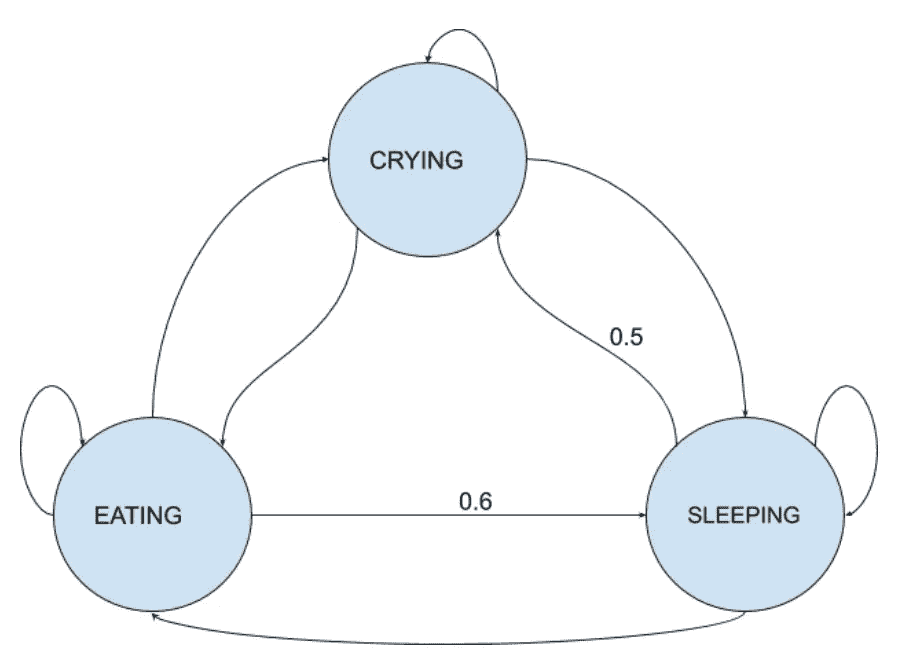

# 自然语言生成(实用指南)

> 原文：<https://towardsdatascience.com/natural-language-generation-practical-guide-9dc03df6bffd?source=collection_archive---------34----------------------->

## 如何用马尔可夫链制作自己的标题


由 [Unsplash](https://unsplash.com?utm_source=medium&utm_medium=referral) 上的[absolute vision](https://unsplash.com/@freegraphictoday?utm_source=medium&utm_medium=referral)拍摄

**自然语言生成(NLG)** 是一种能够从结构化数据中生成人类语言的人工智能。它与自然语言处理(NLP)密切相关，但有明显的区别。

简单来说， **NLP** 允许计算机**读，**和 **NLG** 到**写**。这是一个快速发展的领域，它可以让计算机理解我们的交流方式。目前，它被用于编写建议，如电子邮件的自动完成，甚至在没有任何人工干预的情况下产生人类可读的文本。

在本文中，您将在实践中了解这一过程是如何工作的，以及如何用几行代码生成人工新闻标题，这些标题与真实标题没有区别。

# 马尔可夫链



(图片由作者提供)

我们将在这个任务中使用马尔可夫链，所以首先让我们了解它们是什么，以及我们为什么要使用它们。

**马尔可夫链**是一个使用随机、无记忆过程在状态间转换的系统。你可能在过去的数学课程中学习过它们，但是可能没有看到应用它们的实际方法。

让我们看一个例子。米隆是个婴儿，他只做三件事:吃、睡、哭。我们称它们为**态**，Miron 可以处于的所有态称为**态空间**。

马尔可夫链向我们展示了这些状态之间所有可能的转变，以及每一种转变发生的可能性。

让我们看看上面的图像，以便更好地理解其背后的理论。从睡眠状态，米隆可以过渡到哭泣、进食或回到睡眠状态，每一种状态都有一定的概率。

通过观察米隆，随着时间的推移，我们能够根据他的正常行为找出这些概率。这是马尔可夫链背后的基本思想，但是我们为什么要把它们用于 NLG 呢？

答案相当简单。我们构造句子的方式可以很容易地用马尔可夫链来模拟。所以，每个单词都是一种状态，一个句子就是每种状态之间的一系列转换。这个事实允许我们构建一个类似于上面的链。

通过观察许多不同的句子，我们可以看到人们通常是如何造句的，以及单词应该出现的顺序。在看到足够多的句子后，我们实际上可以开发一个模型，它可以生成与人类相似的句子。

既然计算机如此擅长计算，我们仅仅通过状态和概率就能充分利用它们。计算机将根据概率列表选择转移到哪里，这将允许我们在示例中生成新闻标题。这种技术可以应用于任何类型的文本，因此我鼓励您使用您构建的模型来生成其他文本，例如，某个名人的推文。

# 数据集和模块


丹妮卡·坦尤科在 [Unsplash](https://unsplash.com?utm_source=medium&utm_medium=referral) 上拍摄的照片

对于这个小项目，我们将利用 **Markovify** ，这是一个方便 Python 使用的马尔可夫链生成器。它通常用于建立大型文本语料库的马尔可夫模型，并从中生成随机句子。不过它的应用并没有限制，可以在 Markovify GitHub 页面随意查看它的真实应用。

我们还将使用来自 Kaggle 的“一百万条新闻标题”数据集来训练我们的模型。它包括大量美国广播公司新闻发布的文章的标题。

你不需要任何编程经验来完成这个项目，所以不要担心。对于 Python，你可以直接进入 Kaggle，在笔记本部分创建你自己的笔记本。在这个文件中，您可以执行所有进一步的步骤。

# 模型结构


由[马库斯·斯皮斯克](https://unsplash.com/@markusspiske?utm_source=medium&utm_medium=referral)在 [Unsplash](https://unsplash.com?utm_source=medium&utm_medium=referral) 上拍摄

## 加载包

我们将使用熊猫来构建标题数据。它对于数据分析和操作也很有用。马尔可夫链需要的模型是马尔可夫链。

```
import pandas as pd
import markovify
import random
```

## 读取输入文件

如果您使用 Kaggle 笔记本，只需使用下面的行来加载数据集。如果您想在您的计算机上运行代码，请下载数据集并将它的路径放在括号中。

```
input = pd.read_csv('../input/abcnews-date-text.csv')

input.head(10)
```

## 标题示例

下面的代码将从前 100 个标题中随机输出 10 个标题，这样我们可以看看数据是什么样子的。

```
input.headline_text[random.sample(range(100), 10)]
```

## 建立模型

这里我们使用输入数据来建立我们的马尔可夫模型。sate_size 变量允许我们选择模型在生成新句子时要查看的单词数。

例如，state_size 为 2 将检查前面的 2 个单词，并决定下一个单词是哪个。这个变量越大，模型就越复杂。然而，如果它太大，我们将无法生成许多句子，因为我们的数据集中没有足够的数据。

```
model = markovify.NewlineText(input.headline_text, state_size = 2)
```

## 生成标题

现在，这是有趣的部分，因为下面的代码将为我们生成 10 个标题。每次都会不一样，所以可以反复运行代码。

```
for i **in** range(10):
    print(model.make_sentence())
```

一些例子:

*   塔斯马尼亚花费 1600 万英镑用于运动
*   牛奶价格不会影响亚马逊
*   商业环境和洪水
*   首相对领导权守口如瓶

## 不同的州规模

这里我们有不同的州大小，这将使标题更符合逻辑，实际上看起来像真的一样。

```
model1 = markovify.NewlineText(input.headline_text, state_size = 3)
model2 = markovify.NewlineText(input.headline_text, state_size = 4)
```

状态大小 3:

```
for i **in** range(5):
    print(model1.make_sentence())
```

一些例子:

*   搜寻在丹麦失踪的名为杰克·梅里特的男子的工作仍在继续
*   猕猴桃为新工厂做好准备
*   黎巴嫩军队加强对亚齐的控制引发新的冲突

状态大小 4(注意:我们这里要检查 4 个之前的单词，所以有些句子可能没有那么多。这就是为什么我们需要检查生成的句子是否不是 None):

```
for i **in** range(10):
    temp = model2.make_sentence()
    if temp **is** **not** None: 
        print(temp)
```

一些例子:

*   六年后吉朗星捕鱼禁令解除
*   特朗普能在 2020 年赢得第二个任期吗

## 集合模型

我们也可以将两个或多个模型结合在一起，看看结果是否会有所改善。

```
model11 = markovify.NewlineText(input.headline_text, state_size = 2)
model12 = markovify.NewlineText(input.headline_text, state_size = 2)
model_combo = markovify.combine([ model11, model12 ], [ 1.5, 1 ])

for i **in** range(5):
    print(model_combo.make_sentence())
```

一些例子:

*   工业捍卫数百万人的安全；毕晓普说她会旅行
*   天然气中心可能会在自行车比赛中放松
*   议员推测亨德拉病毒马运动

# 结论

您现在已经学习了马尔可夫链的实际应用，以及如何开始学习 NLG。这个过程相当简单，上面的代码基本上可以应用于任何其他的生成任务。

# 来源:

[1]库尔卡尼河(未标明)。一百万个新闻标题。检索于 2021 年 1 月 18 日，来自[https://www.kaggle.com/therohk/million-headlines](https://www.kaggle.com/therohk/million-headlines)

[2]辛格-维恩，法学博士(未注明)。马克维奇。检索于 2021 年 1 月 18 日，发自 https://github.com/jsvine/markovify