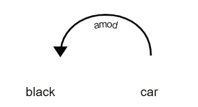
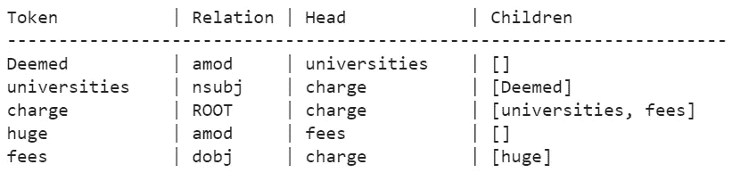
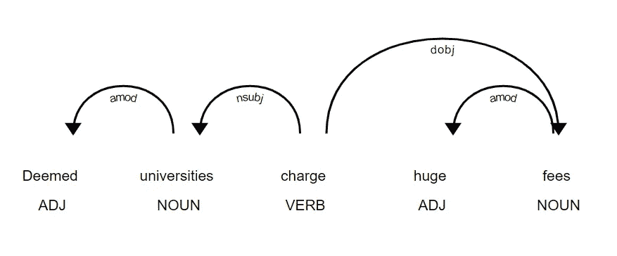
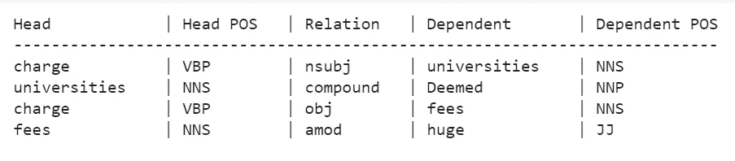
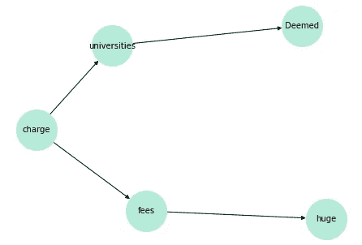
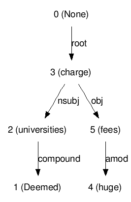
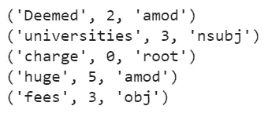
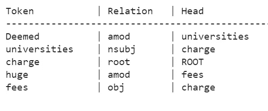

# 自然语言处理——依存句法分析

> 原文：<https://towardsdatascience.com/natural-language-processing-dependency-parsing-cf094bbbe3f7?source=collection_archive---------3----------------------->

## [实践教程](https://towardsdatascience.com/tagged/hands-on-tutorials)

## 使用 spaCy、NLTK 和 Stanford CoreNLP 和 Stanza 进行依赖解析的不同方法


照片由 [Siora 摄影](https://unsplash.com/@siora18?utm_source=medium&utm_medium=referral)在 [Unsplash](https://unsplash.com?utm_source=medium&utm_medium=referral) 拍摄

# 什么是依存解析？

依存句法分析是分析句子的语法结构，找出相关词以及它们之间的关系类型的过程。

每种关系:

1.  有一个**头** 和一个修改**头**的**从属**。
2.  根据**头**和**被从属**之间的从属性质进行标注。这些标签可以在[通用依赖关系](https://universaldependencies.org/u/dep/)中找到。



两个词之间的简单依存关系

在上图中，*车* 和*黑*之间存在关系，因为*黑*修饰了*车*的含义。这里，*车*充当**头**而*黑*是**头的从属**。这里关系的本质是 **amod** ，代表“形容词修饰语”。它是修饰名词的形容词或形容词短语。

# 履行

在 Python 中实现依赖解析有不同的方法。在本文中，我们将研究三种方法。

## 方法 1:使用空间

spaCy 是一个用于自然语言处理的开源 Python 库。

要开始，首先安装 spaCy 并加载所需的语言模型。

```
pip install -U pip setuptools wheel
pip install -U spacy
python -m spacy download en_core_web_sm
```

**en_core_web_sm** 是 spaCy 现有最小的英文型号，大小为 12MB。参考 [spaCy 英国型号](https://spacy.io/models/en)查看其他可用型号。



使用空间进行依存解析

spaCy 还提供了一个名为 **displaCy** 的内置依赖可视化工具，可以用来生成句子的依赖图。

`displacy.render()`功能将生成句子的可视化。

> **注意:**如果运行的是 Jupyter Notebook 或者 Google Colab 中的代码，使用`render()`函数中的`jupyter = True`。



依赖关系可视化的输出

## 方法 2:将 NLTK 与斯坦福 CoreNLP 一起使用

由斯坦福 NLP 小组创建的 CoreNLP 提供了 Java 语言的 NLP 工具。这个 Java 库可以和 NLTK 一起使用来解析 Python 中的依赖关系。

第一步，从 [CoreNLP 网站](https://stanfordnlp.github.io/CoreNLP/download.html)下载斯坦福 CoreNLP zip 文件和斯坦福 CoreNLP 模型 jar 文件。

运行这三个命令将下载所需的库并解压缩 zip 文件。

```
wget [https://nlp.stanford.edu/software/stanford-corenlp-4.2.2.zip](https://nlp.stanford.edu/software/stanford-corenlp-4.2.2.zip)
wget [https://nlp.stanford.edu/software/stanford-corenlp-4.2.2-models-english.jar](https://nlp.stanford.edu/software/stanford-corenlp-4.2.2-models-english.jar)
unzip /content/stanford-corenlp-4.2.2.zip
```

一旦下载了这些库，我们就可以从 NLTK 导入 StanfordDependencyParser。

```
from nltk.parse.stanford import StanfordDependencyParser
```



使用 NLTK 和 Stanford CoreNLP 进行依存解析

为了可视化 CoreNLP 生成的依赖关系，我们可以使用`dependency.nx_graph()`函数提取一个有标签和有方向的 NetworkX 图形对象，或者使用`dependency.to_dot()`函数在图形描述语言中生成一个点定义。使用 [GraphViz](http://graphs.grevian.org/graph) 可以将点定义可视化为图形。

**使用 NetworkX 可视化**

```
# importing networkx
import networkx as nx
import matplotlib.pyplot as plt# Using reverse() to reverse the direction of edges as nx_graph() returns inverted edges
G = dependency.nx_graph().reverse()# nx_graph() returns numeric node labels starting from 1
# Create a dictionary to map numeric nodes and words in the sentence
words = sentence.split(" ")
labels = {index + 1: words[index] for index in range(len(words))}nx.draw(G, with_labels=True, labels=labels, node_size=2500, node_color='#B5EAD7', font_size=10)
```



从 NetworkX 对象创建的依赖关系图

**使用点定义可视化**

```
!pip install graphvizfrom graphviz import Source
dot_def = dependency.to_dot()'''
The below lines require graphviz executables to be installed to your system. If that does not work, print the dot_def object and paste the output on http://graphs.grevian.org/graph/
'''
source = Source(dot_def, filename="dependency_graph", format="png")
source.view()
```



从点定义创建的依赖关系图

## 方法 3:使用节

斯坦福大学 NLP 小组也开发了 Stanza。它提供了一个可以定制的神经网络 NLP 管道和一个基于 Stanford CoreNLP 包的 Python 包装器，使得在不下载 jar 文件的情况下使用 CoreNLP 特性变得更加容易。

要开始，请安装 Stanza

```
pip install stanza
```

下一步是导入 stanza 并下载所需的语言模型。您可以在此查看所有可用型号[。](https://stanfordnlp.github.io/stanza/available_models.html)

```
import stanza
stanza.download('en')
```

使用`stanza.Pipeline()`函数初始化神经管道。第一个参数是要使用的语言。可以传递一个可选参数`processors`，该参数可以是一个字典或逗号分隔的字符串，以配置处理器在流水线中使用。

```
nlp = stanza.Pipeline('en',
                     processors = 'tokenize,mwt,pos,lemma,depparse')
```

您可以找到[管道上所有处理器和处理器](https://stanfordnlp.github.io/stanza/pipeline.html#processors)的列表。有些处理器可能需要在流水线中的其他处理器之前，否则它们将无法工作。例如，`pos`处理器需要`tokenize`和`mwt`处理器，所以如果我们想使用`pos`处理器，也需要在流水线中使用这两个处理器。

我们现在将通过管道传递我们的句子，并将所有结果存储在`doc`变量中。

```
doc = nlp(sentence)
```

如果我们打印`doc.sentences`，我们将看到通过管道传递的每个句子的列表。每个列表包含所有标记信息和语言特征的结果。

例如，列表中的每一项都是一个对象，具有表示*词条*、*通用词性*、*树库专有词性*、*形态特征*、*中心词索引*、*在句子中的位置*等属性。

```
{
    "id": 1,   -----> index of word in the sentence, starting from 1
    "text": "Deemed", -----> actual word
    "lemma": "Deem",  -----> lemma of the word
    "upos": "VERB", -----> universal POS
    "xpos": "VBN", -----> treebank specific POS
    "feats": "Tense=Past|VerbForm=Part",-----> morphological feature
    "head": 2, -----> index of the head
    "deprel": "amod", -----> dependency relationship nature
    "start_char": 0, -----> start index of word in the sentence
    "end_char": 6  -----> end index of word in the sentence
}
```

对于`doc`对象中的所有句子，我们可以调用`print_dependencies()`函数。这个函数将打印具有三个值的元组——令牌、头部的索引和关系性质。

> **注意:**在我们的例子中，因为我们只有一个句子，所以我们使用`doc.sentences[0]`直接访问它



print_dependencies()函数的输出



使用 Stanza 进行依赖解析

因此，在本文中，我们看到了用 Python 实现文本依赖解析的三种方法。感谢您的阅读！:)如果对实现有疑问，可以在 [LinkedIn](https://www.linkedin.com/in/shivaneej/) 上联系我。

# 参考

1.  空间依赖解析器—[https://spacy.io/usage/linguistic-features#dependency-parse](https://spacy.io/usage/linguistic-features#dependency-parse)
2.  斯坦福·科伦普—[https://stanfordnlp.github.io/CoreNLP/index.html](https://stanfordnlp.github.io/CoreNLP/index.html)
3.  小节依赖解析器—[https://stanfordnlp.github.io/stanza/depparse.html](https://stanfordnlp.github.io/stanza/depparse.html)