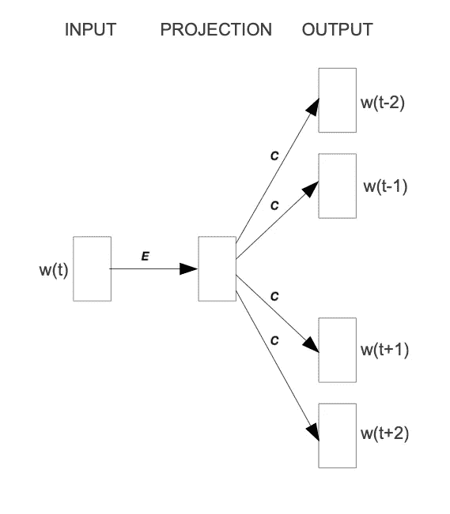
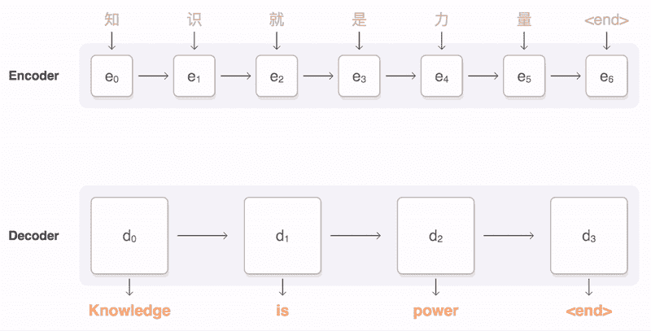
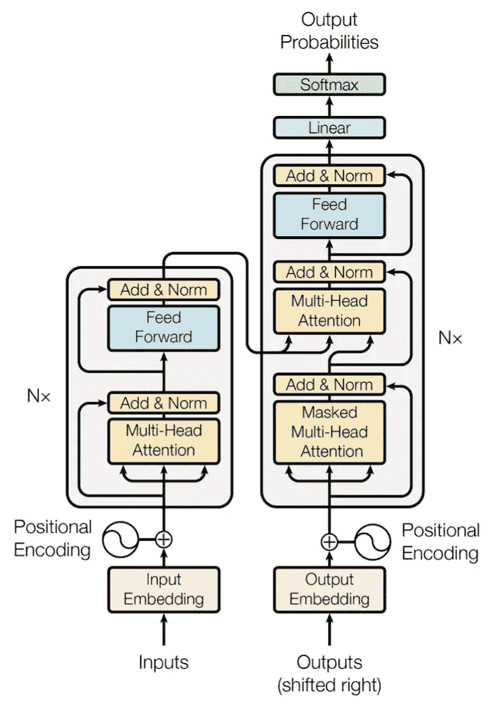
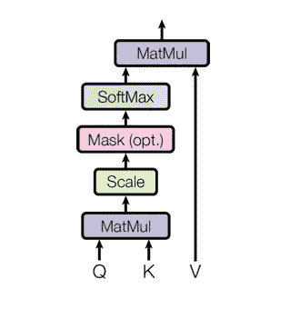
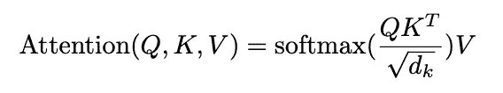
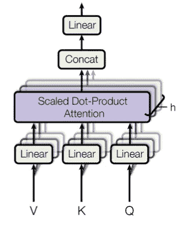
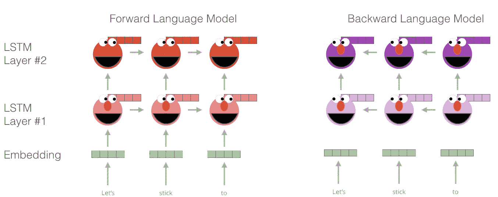
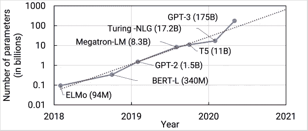

# 自然语言处理:从一个热点向量到十亿参数模型

> 原文：<https://towardsdatascience.com/natural-language-processing-from-one-hot-vectors-to-billion-parameter-models-302c7d9058c6?source=collection_archive---------20----------------------->

## 实际上，它有万亿个参数。

人类的语言是模糊的。在说(或写)的时候，我们传达单个的单词、语气、幽默、隐喻和许多其他语言特征。对于计算机来说，这样的属性首先很难检测到，其次更难理解。为应对这些挑战，出现了几项任务:

*   分类:该任务旨在将文本分类到几个预定义的类别中的一个或多个类别中
*   语音识别和语音转文本:这些任务处理检测音频信号中的语音并将其转录成文本形式
*   情感分析:在这个任务中，文本的情感被确定
*   自然语言生成:这个任务处理自然(即人类)语言的生成

这份清单绝非详尽无遗；其中包括词性标注、(命名的)实体识别以及其他任务。然而，在所有列出的项目中，自然语言生成(NLG)领域最近受到了最多的关注。

想想最近的语言模型。例如，GPT-2(和 3)可以生成本身连贯的高质量文本数据。这样的能力开启了许多可能性；出于好的和坏的目的。无论如何，这种能力已经出现了很长时间；早期的方法使用一键向量将单词映射成整数；最近的成功依赖于注意力机制。

纳迪·博罗迪纳在 [Unsplash](https://unsplash.com?utm_source=medium&utm_medium=referral) 上拍摄的照片

# 建模文本

使用任何文本数据作为神经网络的输入都需要一个数字表示。一个简单的方法是用一包单词(BoW)表示法。按照这种方法，人们只考虑单词和它们的频率，而不考虑顺序:只是一袋单词。

举个例子，就拿“敏捷的棕色狐狸跳过篱笆”这句话来说吧。对应的弓是

["The:2 "，" quick:1 "，" brown:1 "，" fox:1 "，" jumps:1 "，" over:1 "，" fence:1"]。

为了将这个多集合(数学上是什么)转换成向量表示，我们用一个整数来表示每个单词。术语“The”被转换为 2，这是示例中“the”的计数。同样，“快”翻译成 1。有了这些信息，得到的矢量就是

[2, 1, 1, 1, 1, 1, 1]

第一个位置是句子中“The”的计数，第二个位置是文档中“quick”的计数，其余的索引也是如此。如果我们有几个句子，向量就会增长；总是只要词汇量大。例如，当我们有了第二句话，“狗和猫都是动物”，我们的词汇量就会增加五个单词。这种变化反映在所有矢量中；我们最初的例子变成了

[2, 1, 1, 1, 1, 1, 1, 0, 0, 0, 0, 0]

附加的零代表更新的词汇。由于这些词在第一句中不存在，所以它们没有数量。

单词包方法工作良好，但有一个明显的缺点:我们使用词序。失去了排序，我们引入了歧义。例如，句子“A 和 not B”和“B 和 not A”都映射到向量表示[1，1，1，1]。此外，语言特征也丢失了。从最初的例子“快速的棕色狐狸跳过篱笆”，我们可以推断动词“跳”指的是狐狸和篱笆。这种上下文信息会丢失。为了对这两个提到的特征建模，我们需要词序和上下文信息。

# 代表单词

传统上，单词被认为是离散的符号。如果我们总共有 20 个唯一的单词，每个单词由一个长度为 20 的向量表示。只有一个索引设置为 1；所有其他的都为零。这种表示被称为*独热向量*。使用这种技术，我们例句中的单词就变成了

[1，0，0，0，0，…]表示“the”

[0，1，0，0，0，…]表示“快”

作为一个旁注，总结这些向量，我们得到了弓的表现。

两个问题很快出现:给定一个相当大的词汇表，向量变得非常长而且非常稀疏。事实上，只有一个索引是活动的。第二个问题与单词之间的相似性有关。例如，一对“猫”和“狗”比“猫”和“鹰”更相似像这样的关系不会反映在一键表示中。通常，人们使用相似性度量(或反距离度量)来计算两个向量之间的相似性。一个常见的相似性是 [*余弦相似性*](https://en.wikipedia.org/wiki/Cosine_similarity) 。回到我们的例子对“猫”和“狗”，我们可能有(任意的)向量

猫的[0，0，0，0，0，1，0，0，0]

狗的[0，1，0，0，0，0，0，0，0，0]

这些向量之间的余弦相似度为零。对“猫”和“鹰”来说，也是零。因此，两个结果没有反映第一对的更高相似性。为了解决这个问题，我们使用了嵌入。

# 嵌入

**嵌入背后的核心思想:**一个词的意义是由经常出现在附近的词创造的。为了推导出这个意思，人们使用单词的上下文，即在一个范围内出现的一组单词。对许多这样的上下文进行平均，可以得到这个词的相当准确的表示。以我们为例

"那只敏捷的棕色狐狸跳过了栅栏."

对于大小为 1 的上下文窗口，“fox”具有上下文单词(附近的单词)“brown”和“jumps”对于尺寸为 2 的窗口，将添加“快速”和“结束”。在我们的短句中，我们将很快用完上下文单词，并且只有一个“fox”的外观显而易见，需要大量的文本来创建实体的有意义的表示。我们通常想要尽可能多的上下文信息，这对于较大的语料库来说是自然的。

假设我们有足够的文本数据，我们如何创建一个嵌入？首先，嵌入是大小为 *d* 的密集向量。第二，意义接近的单词具有相似的嵌入向量，这解决了上面介绍的信息相似性度量的问题。第三，有一些算法可以创建单词嵌入； [Word2Vec](https://code.google.com/archive/p/word2vec/) 就是其中之一。

所有嵌入计算算法的一般思想是为令牌创建有价值的嵌入向量。word2vec 算法以词为基本单位，侧重于局部关系。为了创建一个嵌入向量，我们可以——利用这个框架——集中精力从上下文预测中心词，或者从中心词预测上下文。第一种方法称为连续单词包(CBOW)，第二种方法称为跳格法。我将在下一节简要介绍跳格法:

为了获得任何单词的嵌入向量，我们使用神经网络。下图取自[1]，显示了该过程的示意图:

修改后的 Word2Vec 跳格法示意图。图片来自[1]。

为了获得任意单词的嵌入，我们使用它的一键表示。这个向量是网络的输入，如左图所示。在下一步中，向量被投影到它的嵌入表示中，如中间所示。通常，这是通过将其乘以一个矩阵来实现的，在图中标记为 *E* 。换句话说，这是网络中的正向传递。得到的(隐藏的)表示被优化以预测显示在右侧的上下文单词。

因此，网络的输出不是嵌入而是上下文单词。为了预测它们，我们使用另一个权重， *C* 。当我们将隐藏的内部表示乘以 *C* 时，我们得到一个长度为 *d* 的向量，其中 *d* 是我们的词汇量。这个结果向量可以被解释为每个单词在上下文中出现的非标准化概率。因此，在训练我们的网络时，我们最大化实际上下文单词的概率，最小化非上下文单词的概率。概括来说，向量流是:

Wᵢₙₚᵤₜ × E = e |对于一个热点与 e 的乘法运算

out = e × C |用于内部表示与 C 相乘

为了最终获得嵌入，我们提取内部表示。这里会涉及更多内容，比如目标函数(负对数似然)。请参考该文件以了解更多信息。

为了评估嵌入的有用性，请使用 TensorFlow 的[投影工具](https://projector.tensorflow.org/)。它让你探索不同的嵌入；在我们的例子中，“Word2Vec 10k”数据集是合适的。点击“A”启用标签。您现在可以直观地看到相关单词之间的相似性。在下面的例子中，我搜索了单词*机器*。最近的邻居被突出显示:

高维嵌入的可视化。我搜索了单词“ *machine”，它的邻居(即最相似的嵌入)被高亮显示。你可以拿着它到处玩* [*这里*](https://projector.tensorflow.org/) *。图片由作者提供。*

如上所述，Word2Vec 算法有两种选择:

首先，它抓住了当地的关系。其次，它把词作为基本单位。其他算法采取其他选择。例如， [GloVe](https://www.aclweb.org/anthology/D14-1162.pdf) 算法，是**Glo**bal**Ve**ctors 的缩写，它基于全局关系创建嵌入，并使用单词作为基本单元。第三种算法是 [FastText](https://fasttext.cc) (参见论文参考文献[此处](https://fasttext.cc/docs/en/references.html))，它使用子词信息作为基本单位(例如“this”—>“th”和“is”)。

不管算法选择如何，都存在一些挑战:如何处理标点符号？如何处理复数单词？不同的单词形式？这种修改是预处理的一部分，通常包括词干分析和词汇化。词干化把一个单词简化成它的词干。这种技术很有效，但是会产生人为的词干。词汇化试图将一个单词简化为它的基本形式，这通常是在大型数据库中实现的。

随着现代端到端方法的进步，预处理的重要性稍微变得不那么重要了。只有标记化仍然相关，比如字节对编码。在我们到达那里之前，我们必须看一下 n-grams。

# (现代)n-格兰姆斯

为了开始整合词序，我们可以使用所谓的 n 元语法方法。以前，当创建 BoW 表示时，我们将句子分成单个单词。相反，我们也可以把它分成两个连续的单词、三个连续的单词等等。一行的字数是*中的*n*n*-克。如果 *n* 为 1，解析模型称为**uni**gram；若 *n* 为二，则称为 **bi** 克。

举个例子，让我们用二元模型来解析“快速的棕色狐狸跳过栅栏”:

[《快手》、《快手布朗》、《棕色狐狸》、《狐狸跳》、…]

正如我们在这个例子中看到的，我们在文本上滑动一个窗口，大小为 *n* ，步幅为 1。一的跨距使得前一摘录的最后一个单词成为后一摘录的第一个单词。使用这种方法，我们部分地保持了单词之间的关系。

该表示是静态的。如果 *n* 参数改变，数据集必须再次预处理。根据大小，这可能需要一段时间。然而，我们可以将 *n* -gram 算法整合到神经网络中，让它们进行“预处理”这种方法可以看作是*现代 n-grams* 。

从嵌入步骤开始，我们对每个单词使用所获得的密集且信息丰富的表示向量。为了合并词序，我们必须稍微改变网络输入。给定一个长度为 *l* 的句子和大小为 *e* 的嵌入，输入现在是一个具有形状的矩阵:

l x e

这个矩阵可以解释为一个奇怪的图像。在与图像相关的任务中，卷积神经网络非常有效，但它们并不局限于这个领域。对输入文本矩阵的卷积运算可以解释为创建 *n* 个图。当内核大小设置为 2，步幅设置为 1 时，这实际上创建了一个二元模型表示。保持步幅，但是将内核的大小增加到 3，我们获得了三元模型。

卷积运算有一些有益的特性。其中之一就是位置不变性。可以在输入的每个位置应用核。如果一个这样的内核关注形容词-名词组合，它将在任何地方检测它们。此外，卷积运算自然会共享它们的权重，并且具有比密集图层少得多的参数。

*n* -grams 的缺点是它们只能捕捉有限范围内的关系。例如，N-grams 不能表达一个句子的第一个词和最后一个词之间的联系。将参数 *n* 设置为句子的长度是可行的，但是需要为每个不同长度的句子设置一个单独的 *n* 。有一种更好的方法来处理大跨度的关系，那就是注意力机制。这项技术是为机器翻译任务而引入的。

# 机器翻译

机器翻译(MT)任务处理将文本从源语言翻译成目标语言。例如，“这是水的毒药吗？”(法语)会被翻译成“鱼会接触水吗？”

早期的机器翻译研究是在冷战期间进行的，目的是将俄语翻译成英语。正在使用的系统主要基于规则和必要的字典。在下一步中，更正了词序。

从 20 世纪 90 年代开始，统计机器翻译成为焦点。核心思想是学习一个概率模型。强调翻译任务，这意味着:给定源语言中的一个句子，我们需要找到目标语言中最合适的句子——即最佳翻译。

数学上，这是用 y* = argmax_y P(y|x)来表示的。y*表示概率最高的翻译。

根据贝叶斯规则，这个描述可以分解为两个独立的部分:y* = argmax_y P(x|y) P(y)。第一个组件 P(x|y)对 x 是 y 的平移的概率进行建模，这部分称为平移模型。第二部分，语言模型，给出 y 在目标语言中的概率。

换句话说，第一部分量化源序列的概率，第二部分量化目标序列的概率。翻译模型是利用源语言和目标语言中的大型文本数据集来学习的。

深度神经网络的发展也影响了机器翻译的任务。递归神经网络是一个很好的选择，因为输入和输出都是序列。输入是要翻译的句子；输出是翻译。使用单个 RNN 会出现两个问题:首先，源句子和目标句子的长度可能不同。这一事实在最初的示例翻译中显而易见。输入包含八个标记，输出只有五个标记(取决于您如何计算标点符号，但问题是一样的)。其次，词序可以改变，使得单个一进一出的 RNN 不可用。

这两个问题的解决方案是在所谓的序列到序列(Seq2Seq)布局中使用两个递归网络[2，3]。第一个网络名为 encoder，接受输入并产生内部表示。称为解码器的第二个网络使用这种内部表示来生成目标序列，例如翻译。

简短说明:内部表示可以模拟任何关于输入句子的知识，包括单词关系。因此，长期依赖的问题被最小化。

单个 RNN 读取输入的逐标记解析，并立即返回翻译。在 Seq2Seq 布局中，编码器首先读取完整的输入序列，以创建内部表示。只有这时，这种通常是向量的表示才被传递到解码器网络。

这种设置是经过训练的文本对，生成目标序列的概率被视为损失。在训练期间，该模型是编码器和解码器的组合，最大化适当翻译的概率。

这是处理 Seq2Seq 任务所需的全部设置。然而，像往常一样，人们可以做一些改进，其中包括注意机制。

# 注意力

在普通的序列到序列布局中，编码器将关于输入句子的所有信息压缩到一个向量中。这个向量被恰当地称为瓶颈层，因为它导致了信息瓶颈。尽管能够解析无穷无尽的序列，但是随着新信息的加入，来自早期步骤的信息会慢慢消失。

这个瓶颈的解决方案是使所有隐藏的编码器状态都是可访问的。在普通设置中，编码器只传递它的最后一个状态，这成为了瓶颈。可以修改这种方法，以便在网络解析新令牌后保存所有中间状态。因此，编码器可以存储每一步的信息，而不再将所有知识压缩到一个向量中。

在编码步骤中，编码器网络可以访问所有每步向量。因此，它现在可以关注最重要的隐藏状态。我将简要回顾一下实现这一点的[机制](https://arxiv.org/pdf/1409.0473.pdf)【4】。

编码器保存所有隐藏状态(解析新令牌后的向量)。然后，我们获取编码器的当前状态，并计算它和隐藏状态之间的点积。该操作为每个隐藏状态返回一个标量数，我们可以将其表示为一个新的向量:

[甲、乙、丙、丁、戊]，

其中字符表示具有相应隐藏状态的点积的结果(例如，a 是具有第一隐藏状态的点积的结果)。然后将 softmax 操作应用于该向量，产生注意力权重。这些权重表示每个隐藏状态的重要性，用概率表示。在最后一步中，我们将隐藏状态与它们的注意力分数相乘，并将向量相加。这为我们提供了当前状态的上下文向量，它被传递给编码器(不完全正确，但对这个目的来说很好)。在每个编码器步骤之后，重复这个过程。

这个过程可以在这个动画中看到，它取自[谷歌的 seq2seq 知识库](https://github.com/google/seq2seq):

序列到序列过程的动画。粗线表示对特定编码器状态的关注。来自[谷歌 seq2seq 知识库](https://github.com/google/seq2seq)的动画。

注意力机制的动画。来自[谷歌的 seq2seq](https://github.com/google/seq2seq) 。

注意过程使编码器能够存储每一步的信息，并让解码器决定注意哪些隐藏状态。这些修改极大地提高了文本翻译的质量，如[4]所示。

一般来说，递归网络，尤其是序列到序列方法的一个普遍缺点是低并行性。回想一下，步骤 *k+1* 的输出依赖于步骤*k*；因此，我们必须首先解析前面的所有步骤。因此，我们在这里不能并行运行太多——除非我们改变底层网络架构。这个想法让我们想到了变形金刚。

# 变形金刚(电影名)

[转换器](https://arxiv.org/pdf/1706.03762.pdf)【5】是一种利用注意力机制的神经网络架构。在引擎盖下，它仍然使用编码器-解码器结构，但取代了循环网络。相反，编码器由具有自关注和常规前馈网络的 *n* 个相同层来建模。编码器模块使用相同的结构，并添加了另一个注意层，它接收编码器的输出。下图取自[5]，显示了所描述的设置:

变压器架构示意图。左边是编码器堆栈，右边是解码器堆栈。图片来自[5]。

第二个改进是注意程序的修改。在传统的序列到序列方法中，解码器的隐藏状态计算所有编码器隐藏状态的点积。在称为多头自关注的改进机制中，这些操作被建模为矩阵乘法。

自我关注将输入转化为内部表征，即自身时间步长的加权和。这种方法可以捕捉序列中的长期依赖性。输入被转换成三种不同的表示，即*键*、*查询*和*值*，以对这些关系进行建模。这些表示是通过将输入乘以三个权重获得的: *Wₖ* (对于键) *Wᵥ* (值)，以及 *Wq* (查询)。计算流程如下图所示[5]:

注意力机制的详细视图。q、K 和 V 是同一输入的不同表示。图片来自[5]。

q 和 K 进行矩阵相乘、缩放、选择性屏蔽，然后进行软最大化。最后，将结果与 v 进行矩阵相乘，这可以用以下公式进行数学表达:

将注意力机制表示为一个等式。图片来自[5]

最后，有多个这样的“流”，被称为注意力头。每个头部使用不同的注意力权重集 Wₖ、Wᵥ和 Wq。这些权重为同一输入产生多个内部表示。然后将单个注意头的结果连接起来，如下图所示[5]:

多头注意力机制的可视化示意图。各个向量在被送入线性层之前被连接在一起。图片来自[5]。

这些计算在编码器和解码器模块中完成，并且可以并行运行。这种并行化是 Transformer 方法比普通 RNN 模型更快的原因之一。此外，转换器使用字节对编码，使他能够归纳出看不见的单词。生僻字是一个常见的问题，有复合词的语言也是如此。想想德国那些疯狂的名词比如“Baumhausprüfgesellschaft”(检查树屋的社会)。我非常怀疑这种组合是否存在于典型的训练数据中。因此，我们的想法是使用子词标记，即前面提到的字节对编码:我们从训练数据中提取最常见的子词，如“th”和“ng”有了这样的词汇表，我们就可以将一个(未知的)单词建模为字节对的组合。

为了建立单词关系的模型，我们必须保留关于输入顺序的信息。简单的想法是修改令牌的嵌入向量。我们在每个嵌入中添加一个信号来模拟向量之间的距离，即步进信息。

更多的细节可以在这里讨论，但是这会偏离这篇文章的主题。如果你感兴趣，我推荐[杰伊·阿拉玛的描述，“图解变形金刚”](https://jalammar.github.io/illustrated-transformer/)

经过目前为止的进展，人们可能会有这样的印象，自然语言现在可以很容易地解析。事实并非如此。一些问题依然存在。回到单词嵌入，我们现在可以使用注意机制来模拟单词关系。然而，考虑一下“他开了一家银行”这句话。从上下文中可以清楚地看出，“银行”就是金融机构。现在考虑“她坐在岸上。”同样，上下文信息解释了“银行”是用来坐的东西。

Word2Vec 或类似的框架只为每个令牌创建一个向量。然而，正如我们已经注意到的，一个词的意思是由其上下文决定的。并且频繁上下文可能在训练数据(用于获得嵌入)和测试数据之间变化。那么我们该如何解决这个问题呢？通过使用迁移学习。

# 迁移学习、语言模型和 ELMo

在计算机视觉任务中，迁移学习是一个标准过程。首先，学习任务 A 的模型，然后使用任务 B 的权重。通常，任务 A 和任务 B 已经在相同的数据类型上进行了训练。此外，正在解决的问题(对象检测、分类、翻译)足够相似。这个概念可以扩展到 NLP 领域。

我们在一个大数据集上预训练一个模型，修改这个模型，并在我们的任务中重用它。在预训练步骤中，模型已经学习了语言特征，例如句法或语义。优点是减少了新任务对数据的需求。

标准的预训练任务是语言建模。当我们训练一个语言模型时，我们会根据之前的单词来预测即将到来的单词。对于这个任务，ELMo [6]变得相关。ELMo 是语言模型嵌入的缩写，由 LSTM 层组成。这些层中的几层被堆叠和训练以预测即将到来的单词。此外，该模型更进了一步:它是一个双向语言模型。序列被双向解析。为了获得嵌入向量，我们将隐藏层连接起来，并对它们求和(简化)，如图所示，摘自 [Jay Alammar 对 BERT and co.](http://jalammar.github.io/illustrated-bert/) 的介绍:

计算嵌入的 ELMo 过程的示意图。图片来自 [Jay Alammar 对 BERT 和 co](http://jalammar.github.io/illustrated-bert/) 的介绍。

一旦我们有了一个完全训练好的模型，我们就可以通过用我们的句子查询模型来获得我们的嵌入。这如何帮助我们获得上下文？ELMo 已经在许多数据上进行了训练，它必须预测下一个单词。这项任务要求它学习上下文。例如，“他坐在[银行]”和“他去了[银行]”都以“银行”结尾，模型必须学习同一个单词的不同含义。

从这种模型中获得的向量包含了这种上下文信息——它们是上下文化的嵌入。因此，对于前面的“银行”示例，我们得到了两个不同的向量，这取决于“银行”的上下文然后，在我们的主任务中使用这些嵌入；ELMo 模型用作特征提取器。但是它很慢；我们不能进行表查找，但必须加载(潜在的巨大)模型。它依赖于循环网络。这就引出了伯特。

# 伯特

从传统的、基于 RNN 的序列对序列方法发展而来的成功经验同样适用于 ELMo 模型。我们可以用一堆编码器模块来代替 LSTM 层，这是我们从《变形金刚》中了解到的。这些修改为我们提供了 BERT [7]模型，这是变压器双向编码表示的缩写。输入序列的一部分被屏蔽，这使得它成为一个屏蔽语言模型。我们通过随机屏蔽令牌(默认值:15 %)来实现双向；我们不需要在两个方向上解析序列。

BERT 的输出是维度为 *hidden_size* 的层，在基本模型中设置为 768(堆叠 12 个编码器块)。这些输出向量是我们的嵌入，它们再次被语境化。与 ELMo 的嵌入一样，我们可以将它们用于我们的特定任务。或者我们可以用伯特。它在很多任务上都非常有效。我们可以将其用于情感分析、问题回答、命名实体识别(例如，将标记标记为名词)。基本型有 1.1 亿个参数，大型型有 3.4 亿个参数，您可以做几件事情。但是我们还没有达到 10 亿。进入 GPT-2。

# GPT-2

GPT-2 [8]背后的想法与 BERT 的想法很接近:在大规模文本语料库上训练一个大型语言模型。GPT 是生成性预训练的缩写，2 表示这是第二次迭代。第一次迭代被称为 OpenAI Transformer [9]和堆叠式 Transformer 解码器层。伯特后来继承了这种架构。回到 GPT-2，该模型有 1.17 亿到 15.42 亿个参数——1.5 万亿个参数。因为它是一个语言模型，所以它可以执行的每个任务都被建模为一个完成任务。假设你想把英语翻译成拉丁语。首先，模型被训练成一个翻译系统，在推理过程中，你给它一个提示，比如

“政府已经发放了最新一轮的奖学金。="

“=”表示模型必须完成(即翻译)句子。在训练过程中，它看到了成对的“ <english>= <latin>，从而学会了“=”提示符的属性。翻译任务不是唯一的任务；GPT -2 也擅长总结和回答问题。</latin></english>

与 BERT 模型不同，GPT-2 没有对目标任务进行微调。在 BERT 在基础文本语料库上被训练之后，它针对个别问题被微调。这一步对于 GPT-2 来说是过时的，使其成为零射击设置。换句话说，它是一个通用模型，能够执行多种未经直接训练的任务。此外，它生成连贯文本的能力，通常相当于人类的工作，导致伦理上的考虑。例如，通过访问大型 GPT-2 模型，人们可以制造假新闻、假冒他人或制造大量高质量的垃圾邮件。

因此，GPT 网络背后的组织 OpenAI 最初决定不发布整个模型。相反，只公布了 1.17 亿和 3.45 亿个参数模型的训练权重。然而，在 2019 年底，研究人员还提供了大型模型，让任何精通 15 亿参数模型的人都有足够的权限。

即使我们现在已经达到了超过十亿个参数，仍然有更大的模型。十亿参数范围内有几种架构，万亿+参数有两种。

# 开关变压器

有几个架构有数十亿个参数。下图摘自 Nvidia 的博客，显示了语言模型的增长:

语言模型中的参数数量增长非常快。开关变压器(未示出)具有 1.5 万亿个参数。图片来自 [Nvidia 的博客](https://developer.nvidia.com/blog/scaling-language-model-training-to-a-trillion-parameters-using-megatron/)。

由于我们已经达到了十亿参数阈值，我将介绍一个万亿参数模型，开关变压器[10]。该架构使用的关键变化是专家混合(MoE)方法。通常，模型对所有输入使用相同的参数。无论输入是猫还是狗的图像，所使用的权重都是相同的。在 MoE 设置中，模型为每个输入选择不同的参数(思考路线)。这种方法对应于稀疏神经网络，其中仅同时使用权重的子集。下图清楚地说明了这一点(摘自[10]):

如前所述，该图示出了修改后的变压器编码器模块。在这个原始块中，信息流是由块的布局预先定义的。相比之下，开关变压器模块维护几个前馈神经网络(而不是单个)。然后，路由器层选择将当前输入转发到这些网络(称为专家网络)中的哪一个。这种方法有效地最大化了变压器的参数数量。而且因为只咨询了一个专家，所以在计算上还是可行的。

有几个其他的技巧可以支持这么多的参数。其中包括并行化策略。在纯数据并行中，工作人员处理独立的数据分割，每个工作人员使用相同的权重。在模型并行性中，模型的层被划分给不同的工作者。一旦激活变得太大而不适合单个设备，这种策略就很有用。开关变压器结合了这两种技术。还有很多细节在用。然而，讨论它们超出了本文的范围，所以我鼓励你自己去研究。我特别推荐讨论和未来研究方向部分。

—

随着开关变压器拥有超过一万亿个参数，我们已经到达了旅程的终点。但肯定不是所有的 NLP 问题都解决了。例如，目前的研究集中在使大模型变小(蒸馏)和减少偏差。我们可以从即将出版的书中期待很多。

—

# 摘要

自然语言处理有了巨大的发展。从一个热点向量来表示标记开始，它已经发展到嵌入来更精确地捕捉含义。慢慢地，这些向量不再从 Word2Vec 或类似的框架中获得，而是从语言模型中提取(ELMo，BERT)。这些模型从 1 亿到 3 亿个参数开始。很快，越多的参数获得越好的分数就变得越明显，因此研究人员不断扩大权重的数量。GPT-2 模型随后突破了十亿参数阈值，被更大的模型所取代。训练如此多的参数具有挑战性，如果没有大规模增加的计算，这是不可能的。由 TPUs 供电，开关变压器达到了超过一万亿个参数。而这仅仅是开始。

# 参考

[1] Mikolov 等人，[利用语言间的相似性进行机器翻译](https://arxiv.org/pdf/1309.4168.pdf)，2013，arXiv

[2] Sutskever 等人，[神经网络的序列对序列学习](https://proceedings.neurips.cc/paper/2014/file/a14ac55a4f27472c5d894ec1c3c743d2-Paper.pdf)，2014，神经信息处理系统(NIPS)进展

[3] Cho 等，[利用统计机器翻译的 RNN 编解码器学习短语表示](https://arxiv.org/pdf/1406.1078.pdf)，2014，arXiv

[4] Bahdanau 等，[联合学习对齐和翻译的神经机器翻译](https://arxiv.org/pdf/1409.0473.pdf?utm_source=ColumnsChannel)，2015，ICLR

[5]瓦斯瓦尼等人，[注意力是你所需要的全部](https://arxiv.org/pdf/1706.03762.pdf)，2017，NIPS

[6] Peters 等人，[深度语境化的词语表征](https://arxiv.org/pdf/1802.05365.pdf)，2018，arXiv ( [幻灯片](https://www.slideshare.net/shuntaroy/a-review-of-deep-contextualized-word-representations-peters-2018))

[7] Devlin 等人， [BERT:用于语言理解的深度双向变压器的预训练](https://www.aclweb.org/anthology/N19-1423.pdf)，2018，arXiv ( [幻灯片](https://pdfs.semanticscholar.org/0ff1/782ec7e953fe79fb783f6a6e7c49c9f778a6.pdf))

[8]拉德福德等人，[语言模型是无监督的多任务学习器](https://cdn.openai.com/better-language-models/language_models_are_unsupervised_multitask_learners.pdf)，2019，OpenAI 博客

[9]拉德福德等，[通过生成性预训练提高语言理解](https://s3-us-west-2.amazonaws.com/openai-assets/research-covers/language-unsupervised/language_understanding_paper.pdf)，2018，OpenAI 博客

[10] Fedus 等人，[开关变压器:利用简单有效的稀疏性缩放至万亿参数模型](https://arxiv.org/pdf/2101.03961.pdf)，2021 年，arXiv