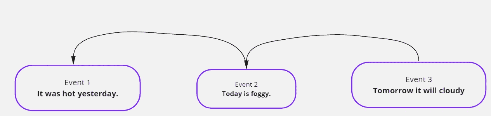
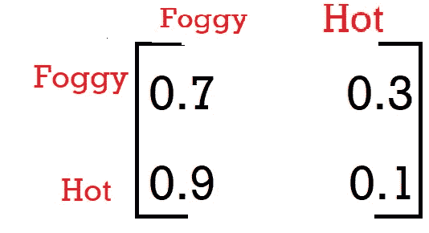
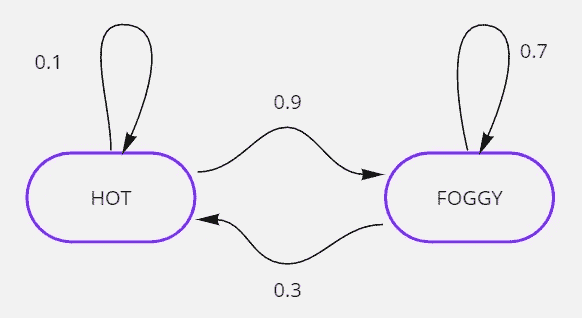
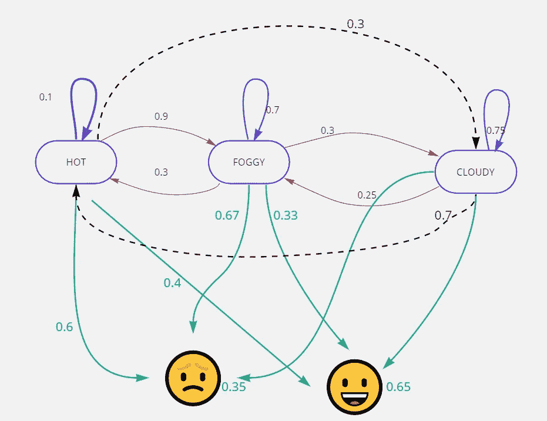
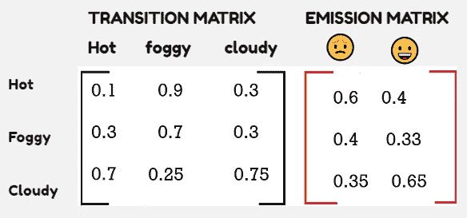
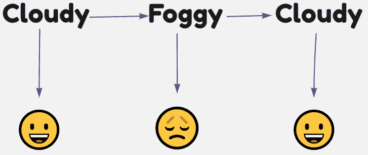
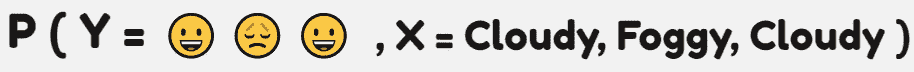
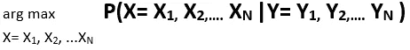

# 自然语言处理:III

> 原文：<https://towardsdatascience.com/natural-language-processing-iii-b067c5d0e89c?source=collection_archive---------36----------------------->

## HMM & LDA 的一瞥

我已经在这个系列的第一部分和第二部分[中解释了 NLP 的基本知识。可能会让你吃惊的一件事是，没有一个文本预处理没有解释单词之间的任何隐藏关系。这个博客会让你对 NLP 可用的数学工具有所了解。我们来了解一下。](/natural-language-processing-a-beginners-guide-part-ii-54a1bf8c0497)

## **马尔科夫模型:**

马尔可夫的性质告诉我们

> 在一组事件中，任何事件都依赖于它的前一个事件。

版权所有 somesh

以上是已经发生的一系列事件。所以根据马尔可夫的属性事件，2 将依赖于事件 2，事件 3 将依赖于事件 2。这意味着明天天气的概率取决于今天，而今天天气的概率取决于昨天。

***一些术语:***

*1。有多少个状态被考虑用于概率的计算是状态空间。*

*2。遵循马尔可夫性质的事件集合将形成马尔可夫链。*

*3。事件发生概率的矩阵称为传递矩阵。*

版权所有 Somesh

***1。天气热的时候天气会有雾有雾的概率有多大？***

状态空间= {多雾，炎热}

初始概率= {0.7，0.1}

Q = {热，多雾，多雾}

P(多雾，多雾|热)= P(多雾|热)* P(多雾|多雾)

向右复制一些

所以结果是 0.7*0.3=0.21

Q = {热，多雾，多雾，热，多雾}

可以用 P(Hot)* P(F | H)* P(F | F)* P(H | F)* P(F | H)来计算

***它仅仅是事件跃迁概率的产物！***

## **隐马尔可夫模型:一种改进的马尔可夫模型**

版权所有 Somesh

***隐马尔可夫模型*** *由一个普通的马科夫链&的一组观察变量组成。*

上图代表天气和相应的心情。天气是一种隐藏状态，情绪是依赖于隐藏状态的观察变量。简单地说，当天气多云时，心情愉快的概率是 0.65，概率是 0.75。

版权所有 Somesh

隐藏状态的概率矩阵是一个转移矩阵，其中观察变量的概率是一个发射矩阵

以下情况发生的概率有多大？

版权所有 Somesh

用数学术语来说，我们可以把它写成，

版权所有 Somesh

这可以使用 P(多云)、P(快乐|多云)、P(多雾|多云)、P(悲伤|多雾)、P(多云|多雾)、P(快乐|多云)的乘积来计算

我们可以从跃迁和发射矩阵中找到除 P(多云)以外的所有值。P(多云)的值可以使用马尔可夫链的平稳分布来计算。重复矩阵乘法和归一化左特征向量来计算分布。

但是，与特定的情绪序列相对应的最可能的天气序列是什么呢？

你可以用每个节点的概率来计算。那么概率较大的隐藏状态将是答案。从数学上讲，我们可以计算出这个公式。

版权所有 Somesh

利用贝叶斯定理，arg max P(Y|X)*p(X) / P(Y)

P(Y |X) = P(Y1 | X1)*P(Y2|X2)……。P(Yn|Xn)

进一步可以写成πP(Yi | Xi)&利用马尔可夫的性质，

P(X)=πP(Xi | Xi-1)。对于 Xo，你可以使用马尔可夫链的平稳分布来计算。所以最终等式会变成—

arg maxπP(Y*I*| X*I*)* P(X*I*| X*I*-*1*)。就这些了嗯！

你可以在生物信息学、自然语言处理、语音识别等领域实现它。

## ***LDA-潜在狄利克雷分配***

LDA 对于在给定文档中找到相当准确的各种主题非常有用。当你处理主题建模时，这是很方便的。考虑下面的几个例子。

> 1.我喜欢蜂蜜和浆果。
> 
> 2.熊也喜欢蜂蜜。
> 
> 3.熊和熊猫很可爱。

如果你理解了上面的句子，你会得到食物和动物的主题，第二句话将是两个句子的组合。在决定主题的时候，你必须明白一些事情。LDA 有两个方面:1 .文件中的文字——这是已知的。2.你需要计算才能知道你所学单词的主题。

每个文档都是主题的概率分布，每个主题都是单词的概率分布。换句话说，文档是主题的混合物，主题是单词的混合物。

像- is，am，are，has，have 等这样的词你必须去掉，因为它们不携带信息。

***在你开始找题目之前，你必须决定你想要多少题目。这基本上表示为 K.***

***除了你目前拥有的单词以外的所有题目都可以考虑。***

LDA 是如何工作的？

1.  选择你认为语料库中存在的主题数量。

2.仔细阅读每个文档中的每个单词及其主题。

3.查找该主题在文档中的出现情况，其次是该主题的整体出现情况。在此基础上，指定一个词作为新的主题。

4.执行多次迭代，直到获得合适的主题。

同样，最后一步是您作为人的工作，通过改变文档术语矩阵中的参数、主题数量和迭代次数来解释主题，并在达到目标时停止！

还有其他的主题建模技术，比如潜在语义索引和负矩阵分解。

希望你能理解，并请在评论区写下你的想法。我会为 NLP 系列带来更多有趣的话题。在 [**中**](https://somesh-routray11.medium.com/) 关注我，或者订阅我的博客了解他们。一如既往，我欢迎反馈和建设性的批评，可以通过 Twitter @ RoutraySomesh&[Gmail](http://somesh.routray11@gmail.com)联系