# 使用 SQL 导航时间序列

> 原文：<https://towardsdatascience.com/navigating-time-series-with-sql-39068018ba7e?source=collection_archive---------6----------------------->

## 通过分析顺序数据巩固您的 SQL 知识

照片由来自 [Pexels](https://www.pexels.com/photo/turned-on-monitor-displaying-frequency-graph-241544/?utm_content=attributionCopyText&utm_medium=referral&utm_source=pexels) 的 [Lorenzo](https://www.pexels.com/@lorenzocafaro?utm_content=attributionCopyText&utm_medium=referral&utm_source=pexels) 拍摄

从 SQL 开始，我最大的错误之一是我试图通过概念化来学习一切。

我的意思是，如果你有编程背景，只要理解 SQL 关键字和函数背后的逻辑应该就没问题了吧？

不对。

仅仅通过学习语法来学习编写 SQL 就像通过阅读字典来学习说英语一样；这简直是疯了。

一旦你认为你已经达到了某个里程碑，你的时间会更好地用在项目中。

也就是说，我发现许多人因为只为他们的项目选择相对简单的数据集而搬起石头砸自己的脚。对于更简单的数据集，您只能使用更基本的 SQL 关键字和函数。

这是一个很好的起点，但是它剥夺了您应用更高级技术的机会，比如 cte 和窗口函数。

明白真实的数据是杂乱无章的；它不像你在教程中看到的素数和适当的表那样友好。

因此，如果你想展示你的分析能力和 SQL 知识，最好是采用展示这些特征的数据集。

# 使用 SQL 的时间序列

出于多种原因，使用时间序列数据集有助于您学习 SQL。

时序数据本质上存储的记录并不是相互独立的。分析此类数据需要在列与列之间进行更复杂的计算。

这将要求您展示您对简单和高级 SQL 技术的理解。

因此，我强烈建议对那些希望巩固对 SQL 原理的理解的人进行时间序列分析。

# 个案研究

让我们试着为显示每个国家的疫苗接种时间序列的数据集编写一个 SQL 脚本。

将用于这次演示的数据集可以在[这里](https://www.kaggle.com/gpreda/covid-world-vaccination-progress)访问(无版权)。疫苗接种表显示每天收集的不同国家的各种疫苗接种统计数据。

为了缩小分析的范围，让我们将我们的研究限制在 3 个特征上:国家、日期和每天接种疫苗的次数。

*注意:下面的代码片段是在 SQL server 中运行的，所以语法可能与您最熟悉的 SQL 方言略有不同。*

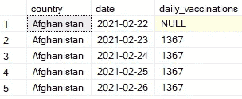

代码输出预览(由作者创建)

如果我们对如此大量的信息或如此精细的粒度不感兴趣，那会怎样？

假设我们只对按月观察每个国家的疫苗接种感兴趣。

此外，不考虑世界上的每个国家，我们只对英国(即英格兰、苏格兰、威尔士和北爱尔兰)的疫苗接种感兴趣。

我们可以过滤掉不需要的记录，并使用以下查询将每日疫苗接种记录转换为每月记录。

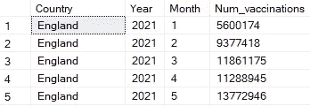

代码输出预览(由作者创建)

对英国每月一次的疫苗接种的任何分析都需要使用这个生成的表，所以为了方便起见，让我们将这个数据存储到一个名为“# Monthly _ Vaccinations”的临时表中。

有了这个临时表，我们可以开始从数据中提取见解，以了解每个国家的疫苗接种计划的更多信息。

## 每个国家疫苗接种的 3 个月移动平均值是多少？

移动平均经常用于时间序列分析，因为它通过限制观察变量的不稳定变化的影响来帮助减少噪声。

要计算 3 个月移动平均线，我们需要:

1.  查找当月和前两个月的疫苗接种值。
2.  找出每行在 3 个月内接种疫苗的平均次数。

幸运的是，我们可以使用窗口函数在一行代码中完成所有这些。

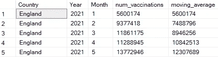

代码输出预览(由作者创建)

## 每个国家每月接种疫苗的百分比变化是多少？

另一个需要考虑的重要变量是疫苗接种的百分比变化。毕竟，疫苗接种的任何急剧上升或下降都会引起公共卫生官员的兴趣。

要找出每月疫苗接种的百分比变化，我们需要:

1.  查找每行上个月的疫苗接种数量
2.  给定当前和以前的疫苗接种值，计算每行的疫苗接种百分比变化

我们可以用 LAG 函数找到每条记录以前的疫苗接种值。请注意，第一行的先前疫苗接种值为 0。

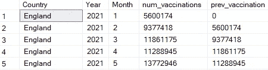

代码输出预览(由作者创建)

该表提供了我们计算每行疫苗接种百分比变化所需的所有信息。将它存储在 CTE 中后，我们可以计算每个国家每个月接种疫苗的百分比变化。

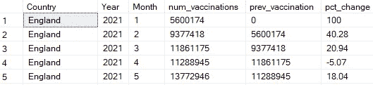

代码输出预览(由作者创建)

# 每个国家哪个月的疫苗接种率最低？

要确定每个国家表现最差的月份，我们需要:

1.  根据接种疫苗的数量对记录进行排序(从低到高)
2.  选择等级最高的行(即等级=1)

我们可以使用 RANK 函数根据接种记录的数量对每个国家的记录进行排序。

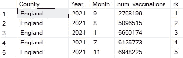

代码输出预览(由作者创建)

用 CTE 存储这些数据后，我们可以继续查询，选择每个国家中排名最高的记录。

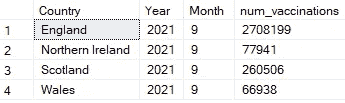

代码输出(由作者创建)

所有四个国家在第 9 个月(9 月)登记的疫苗接种数量最少。

RANK 函数允许我们对表现最差的月份进行更深入的搜索。

例如，如果我们想找出每个国家最差的 3 个月，我们只需要修改 WHERE 语句。

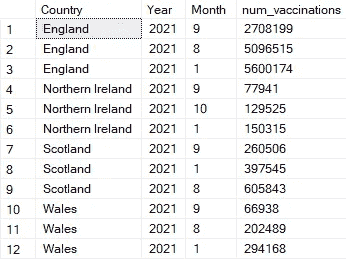

代码输出(由作者创建)

## 哪个国家目前在管理疫苗方面最成功？

直接比较国家的一个好方法是找出每个国家接种疫苗总数与人口的比率。

考虑这些国家的人口是合乎逻辑的。直接比较每个国家的疫苗接种总量是不公平的，因为这些国家在人口规模上有很大差异。

为了找到疫苗接种与人口比例最佳的国家，我们需要:

1.  查找每个国家接种的疫苗总数(累计)
2.  找出每个国家的人口
3.  计算每个记录的疫苗接种与人口的比率
4.  只保留最近一个月的记录

首先，我们需要知道每个国家总共注射了多少疫苗。目前，我们只能获得每月注射的疫苗数量。

要找到累计疫苗接种数，需要计算累计总数。这可以通过窗口功能来实现。

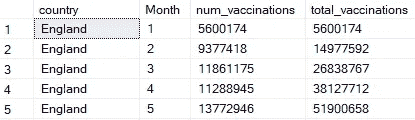

代码输出预览(由作者创建)

接下来，我们需要知道每个国家的人口。

让我们创建一个包含这些信息的表。

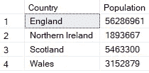

代码输出(由作者创建)

让我们使用每 10 万人接种疫苗的数量作为我们选择的评估指标。

我们可以通过一个连接合并名为“running_total”的 CTE 和人口表，然后计算每 10 万人的疫苗接种数量，从而直接比较这些国家。

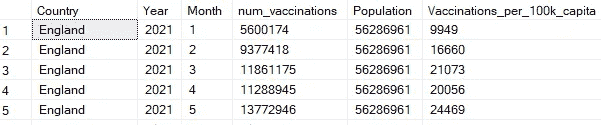

代码输出预览(由作者创建)

最后一步是用第二个 CTE 存储这些信息，并过滤掉不需要的记录。结果将显示每个国家最近一个月的疫苗接种总数。

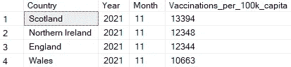

代码输出(由作者创建)

根据评估标准，苏格兰在为人民接种疫苗方面做得最好(到目前为止)。

# 结论

照片由 [Unsplash](https://unsplash.com?utm_source=medium&utm_medium=referral) 上的 [Prateek Katyal](https://unsplash.com/@prateekkatyal?utm_source=medium&utm_medium=referral) 拍摄

现在，您已经对如何将 SQL 关键术语和函数应用于时间序列数据有了一些了解。

也就是说，即使你从这个演示中学到了很多，如果你自己进行类似的分析，你会取得更大的进步。

本案例研究仅包括英国的国家。我邀请你利用这个数据集，对其他国家进行类似的分析。

我祝你在数据科学的努力中好运！

# 参考

Preda，G. (2021)。新冠肺炎世界疫苗接种进展，第 221 版。2021 年 11 月 27 日检索自 https://www . ka ggle . com/gp reda/covid-world-vaccine-progress。