# Tableau 导航设计

> 原文：<https://towardsdatascience.com/navigation-designs-in-tableau-e1ba7e35cf7?source=collection_archive---------12----------------------->

## [深入分析](https://towardsdatascience.com/in-depth-analysis/home)

## 设置引人注目的导航结构的指南

由[玛丽安·博斯](https://unsplash.com/@mariannebos?utm_source=unsplash&utm_medium=referral&utm_content=creditCopyText)在 [Unsplash](https://unsplash.com/s/photos/arrows?utm_source=unsplash&utm_medium=referral&utm_content=creditCopyText) 上拍摄的照片(由作者编辑)

在使用商业智能(BI)工具进行数据分析的领域，我们很少使用专用的独立仪表板。通常在组织中，我们需要将多个仪表板编织在一起，有时还需要外部资源来创建和理解更大的画面。在这方面，我们需要将用户导航集成到其他仪表板或外部来源。拥有一个好的导航结构是至关重要的，因为它为最终用户提供了一种类似网站的感觉，并允许他们与您的仪表板无缝交互。

在这篇文章中，我将通过用例来说明如何在 [Tableau](https://www.tableau.com/) (2021.3)中创建这样一个导航结构的不同可能性。在本演练中，我们将使用 [Sample - Superstore](https://help.tableau.com/current/guides/get-started-tutorial/en-us/get-started-tutorial-connect.htm) 工作簿，它有六个仪表板*概述、产品、客户和发货(默认)以及绩效和预测(另外从默认内置视图中创建)。*

# 按钮导航

## **用例:以文本按钮的形式在两个仪表板产品和客户之间创建来回的用户导航。**

因为在这个用例场景中，仪表板*产品和客户*都在同一个工作簿中，所以我们可以使用**导航**对象，它将充当导航按钮。

为此，将**导航**对象从**对象**窗格拖放到仪表板中，并设置其属性。请记住，我们将需要两个导航对象，一个用于产品，另一个用于每个仪表板上的客户。您可以根据自己的选择进一步自定义格式选项。但是请记住关于选项**背景**颜色，当前激活的仪表板需要是明亮的，而非激活的仪表板需要是浅色的。这可以很容易地通过使用相同的基色并调整其不透明度来实现。这将最终为您提供主动/被动效果。默认情况下，Tableau 提供了直观的**工具提示**，但是如果您需要定制它，请继续。

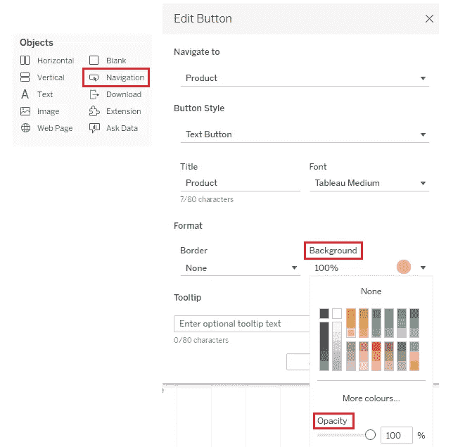

导航对象及其属性(来源:图片由作者提供)

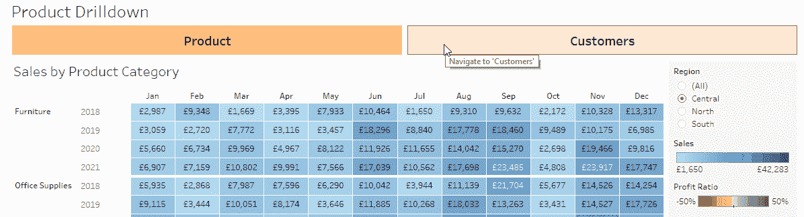

按钮导航(来源:图片由作者提供)

# 类似工作表的按钮导航

## 使用案例:在概览控制面板上以文本按钮的形式添加外部 OneDrive URL 存储库链接。

由于在这个用例场景中，我们需要将一个外部链接附加到一个文本按钮来进行导航，并且由于上面的带有按钮的**导航的设计不支持这个场景，我们需要创建一个**工作表按钮**来模拟一个 Tableau 导航对象。**

为此，创建一个新的**工作表**，命名为*储存库*，带有**空白计算字段**，并将其添加到**文本卡**。此外，格式化工作表背景颜色，编辑并添加按钮名称，此处为文本的**储存库**，并将其对齐为**中间居中**。此外，格式化工具提示说明，类似于在第一个设计**导航中观察到的按钮，**此处导航到“OneDrive 团队存储库”**。**

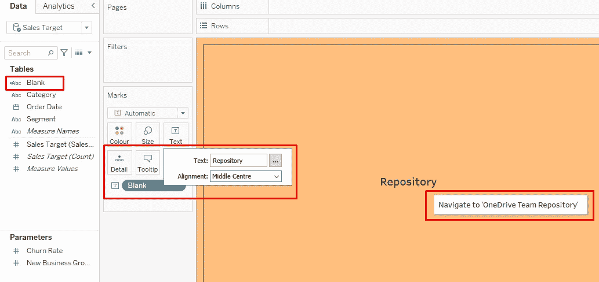

存储库工作表及其属性(来源:图片由作者提供)

继续将此*储存库*工作表添加到您的*概览*仪表板，并对齐&位置，使其看起来像一个按钮。最后，通过*仪表板菜单- >操作…* 添加一个指向外部 [OneDrive](https://www.microsoft.com/en-ww/microsoft-365/onedrive/online-cloud-storage) 存储库链接的 **URL 操作**，并在 **Select** 上执行到该工作表。

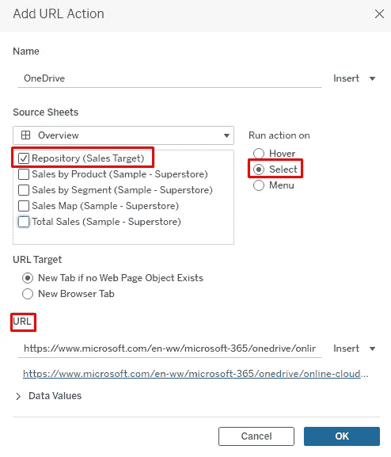

存储库工作表 URL 操作(来源:作者提供的图片)

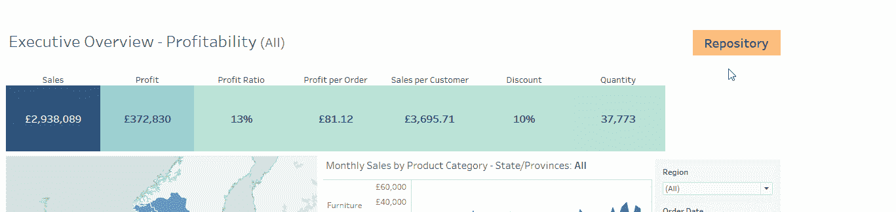

类似工作表的按钮导航(来源:作者图片)

# **图像导航**

## 用例:向每个仪表板添加公司徽标，并将其链接到公司网站。

在这个用例场景中，我们将利用**图像**对象进行导航，并将我们公司的网站链接附加到它上面。

为此，将**图像**对象从**对象**窗格拖放到每个仪表板中，并设置其属性。在我们的例子中，我们有 [Tableau 徽标](https://www.tableau.com/sites/default/files/pages/tableaulogo_highres.png)，同样，您可以从本地存储或指向该图像的 URL 链接中插入贵公司徽标的图像文件。在**待打开的 URL**中，添加您公司的网站链接，点击即可显示。

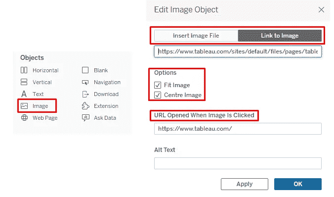

图像对象及其属性(来源:作者提供的图像)

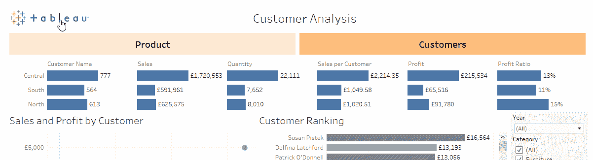

用图片导航(来源:作者图片)

# 使用形状导航

## 用例:为每个仪表板创建一个 back image 按钮，在鼠标悬停时，该按钮将用户导航回外部主/主仪表板。

在这个用例场景中，我们将把我们的外部主仪表板看作是作为 Tableau 解决方案库的一部分在 Tableau 服务器上发布的[超市概览](https://www.tableau.com/solutions/gallery/superstore)仪表板；因此，这将是一个外部 URL 链接。

为此，创建一个新的**工作表**，命名为*背面*，带有**空白计算字段**，并将其添加到**标记**卡上的**颜色**和**形状**。此外，从形状选项板*中选择所需的形状(或者，您也可以通过将图像文件保存在本地 Tableau 存储库中的文件夹 Shapes 中来使用您自己的自定义形状)，*相应地格式化其颜色、大小和工具提示。添加与第一个设计**按钮导航类似格式的工具提示说明，此处**为导航至“概述”。

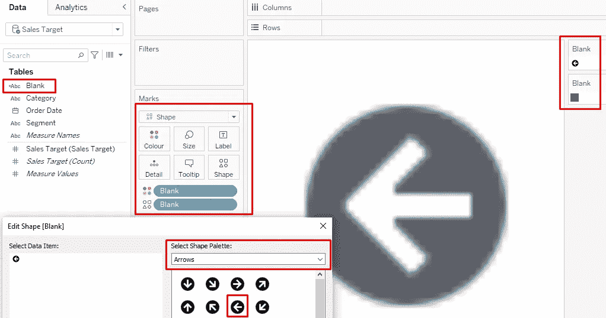

后台工作表及其属性(来源:图片由作者提供)

将*返回*工作表添加到每个仪表板后，添加**仪表板 URL 操作** ( *仪表板菜单- >操作……->添加操作- >转到 URL……*)，在 Tableau 服务器上发布仪表板的 **URL** 并在鼠标**悬停时执行(在我们的示例中为[超市概览](https://www.tableau.com/solutions/gallery/superstore))。然后*概览*仪表盘将打开，无需点击鼠标。**

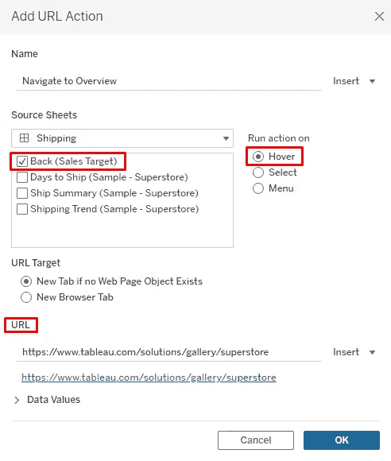

返回工作表 URL 操作(来源:图片由作者提供)

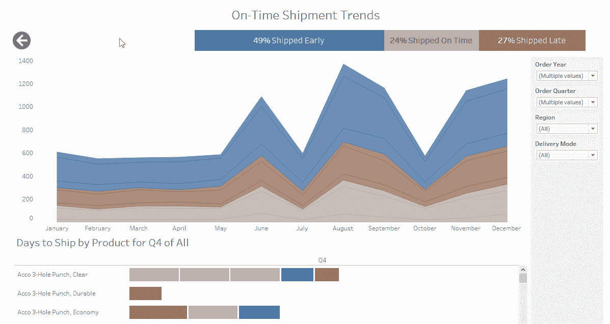

用形状导航(来源:图片由作者提供)

同样，也要以这样一种格式设计您的外部主/主页仪表板，它还提供了返回到每个单独仪表板的导航。

# 菜单导航

## 用例:在产品仪表板上创建一个下钻菜单，以查看所选产品的性能和预测仪表板。

因为在这个用例场景中，所有的仪表板都在同一个工作簿中，所以我们可以使用**仪表板过滤动作**来创建下钻菜单。

为此，在*产品*仪表板上，在工作表产品视图上创建两个过滤器操作(*仪表板菜单- >操作…- >添加操作- >过滤器*)。一个用于衡量产品性能，另一个用于查看产品预测。您可以对**所有**或**选定字段**执行过滤，也可以隐藏仪表板的内容，直到通过**排除所有值** *做出选择(这将有助于更好的仪表板性能)*。此外，仔细选择**名称**，因为它将作为菜单选项出现。此外，我还添加了一个后退按钮，以便从两个菜单仪表板中的每一个导航回主*产品*仪表板。

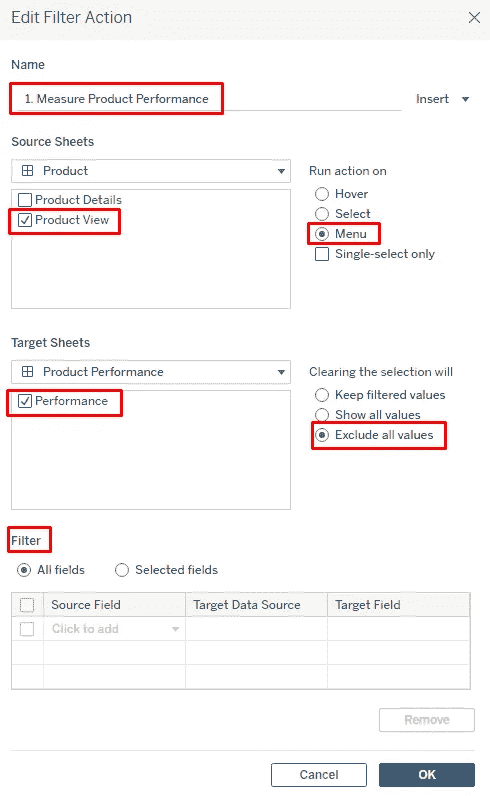

产品性能的过滤动作及其属性(来源:图片由作者提供)

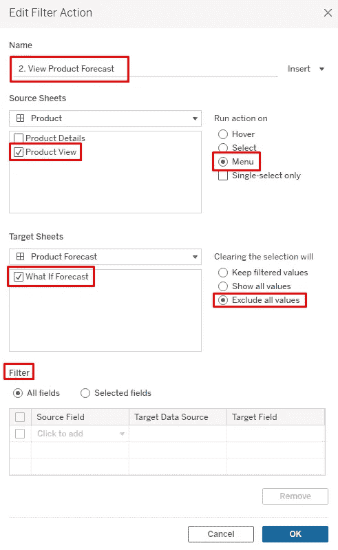

产品预测的筛选操作及其属性(来源:图片由作者提供)

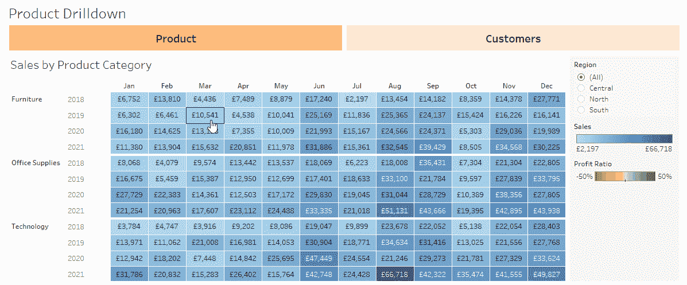

带菜单的导航(来源:作者图片)

最后，一些额外的提示来丰富最终用户的导航体验，添加参数**？:link target = _ self&:embed = yes**在 URL 操作中的每个 URL 的末尾，将您的仪表板发布到 Tableau Server/Public，不使用选项**将工作表显示为选项卡**，并使用参数**与用户共享初始或主/主页仪表板链接？:link target = _ self&:embed = yes**附在最后。这将强制视图加载到同一个浏览器选项卡中，而不是打开多个视图。

总的来说，Tableau 提供了很多功能，有了一个好的设计概念，你就可以创建一个引人注目的工作流程。

## 参考

[1][https://www.tableau.com/support/knowledgebase](https://www.tableau.com/support/knowledgebase)

[2][https://kb . tableau . com/articles/issue/URL-actions-open-a-new-browser-tab-inst-of-the-same-tab](https://kb.tableau.com/articles/issue/url-actions-open-a-new-browser-tab-instead-of-the-same-tab)