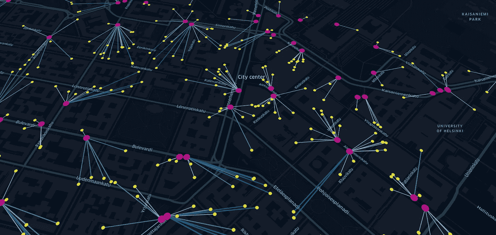
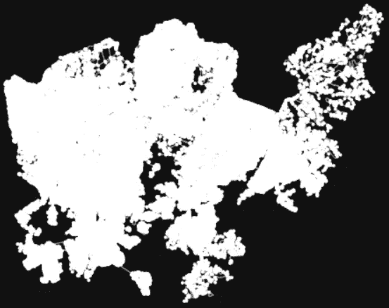
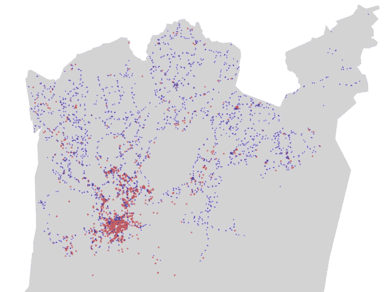
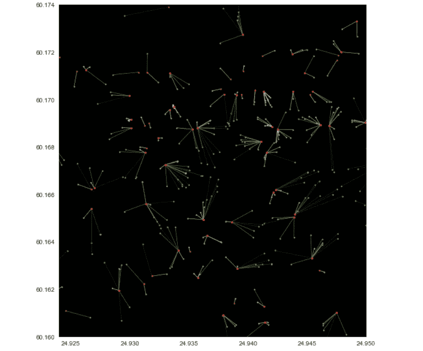
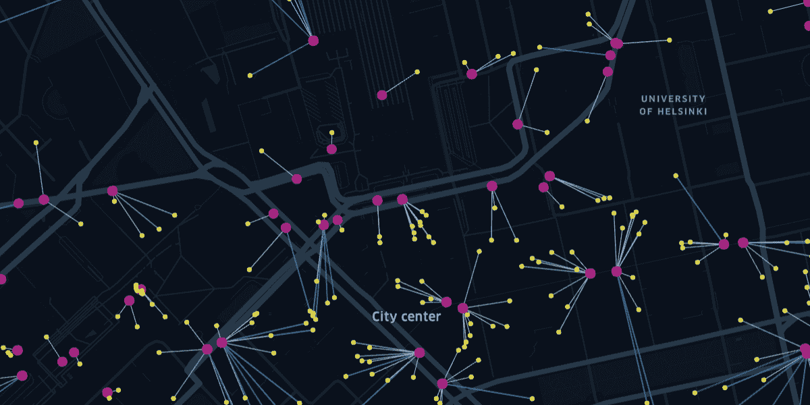

# 赫尔辛基地区大数据集的最近邻分析

> 原文：<https://towardsdatascience.com/nearest-neighbor-analysis-for-large-datasets-in-helsinki-79ebc7288c91?source=collection_archive---------26----------------------->

## 用于高效距离分析的 BallTree 函数:公交车站和餐馆



图片由作者提供。离每个从 OSM 回来的餐馆(黄色)最近的公共汽车站(粉红色)。[演示](https://bryanvallejo16.github.io/nearest_neighbor_large_dataset/)

在过去的几个月里，我作为一名研究助理参加了赫尔辛基大学著名的 [*自动化 GIS*](https://autogis-site.readthedocs.io/en/latest/notebooks/L3/06_nearest-neighbor-faster.html) 课程。在给学生们讲解 GIS 自动化流程的过程中，我的经验非常丰富。我很高兴看到地理学家是如何用 python 语言编程接管 GIS 自动化的，我仍然对材料的高质量感到惊讶。在课程开始时，课程会就 python 的用法和 GIS 中常用对象的基本概念给出建议。然后，这些类变成了深入和高级的分析，在广泛的应用中非常有用。

我将永远记住的一课是最近邻分析。这是一种来自 [shapely](https://shapely.readthedocs.io/en/stable/manual.html) 库的算法，可以从选定的点中检索最近的点。在此过程中，它使用一元并集函数，这会消耗内存并降低操作速度。因此，在本教程中，我们将使用 [BallTree](https://en.wikipedia.org/wiki/Ball_tree) 函数，而不是一元并集，这样可以加快进程并消耗更少的内存。

> 最终网络地图:[演示](https://bryanvallejo16.github.io/nearest_neighbor_large_dataset/)
> 仓库代码:[回购](https://github.com/bryanvallejo16/nearest_neighbor_large_dataset)

对于这个示例，我将使用赫尔辛基作为研究案例，并查找该城市中距离餐馆最近的所有公交车站。在此过程中，从 Geoff Boeing 开发的 python 库 OSMnx 中获取餐馆，从赫尔辛基地区的 GTFS 数据集(最新数据集)中获取公交车站。我们开始吧

# 数据集

本文中使用的数据集和所用材料的许可证的简要描述。

*   赫尔辛基地区的 GTFS 数据集。根据[知识共享协议 CC0](https://creativecommons.org/publicdomain/zero/1.0/legalcode) 获得许可。这个数据集是通过 [OpenMobilitydata](https://transitfeeds.com/about) 收集的，OpenMobilitydata 是一个为交通数据、应用开发者、网络开发者和交通机构提供的免费服务。
*   **打开街道地图数据。**根据[开放数据共享开放数据库许可证(ODbl)](https://opendatacommons.org/licenses/odbl/) 或归属许可证获得许可。用户可以自由地复制、分发、传输和改编这些数据，只要这些数据是像 [OpenStreetMap](https://www.openstreetmap.org/copyright) 贡献者这样的作者所拥有的。
*   **自动化 GIS 教学材料。**根据[知识共享署名-相似分享 4.0](https://creativecommons.org/licenses/by-sa/4.0/legalcode) 国际许可证获得许可。用户可以在归属下自由分享和改编。课程是公开分享的，在使用资料后，建议也公开分享资料。

# 编码实践

从最重要的开始。导入所需的库。

```
**import** geopandas **as** gpd
**import** pandas **as** pd
**import** osmnx **as** ox
**import** matplotlib.pyplot **as** plt
**from** shapely.geometry **import** Point, LineString
```

让我们用 OSMnx 获取感兴趣的区域。赫尔辛基

```
**# Specify the name that is used to seach for the data** place_name = “Helsinki, Finland”**# Fetch OSM street network from the location** graph = ox.graph_from_place(place_name)**# Plot the streets** fig, ax = ox.plot_graph(graph)**# Get place boundary related to the place name as a geodataframe** area = ox.geocode_to_gdf(place_name)
```



图片由作者提供。图形对象的绘图

现在，让我们从 OSMnx 获取并安排餐馆

```
**# List key-value pairs for tags such as restaurants** tags = {‘amenity’: ‘restaurant’}**# Retrieve restaurants** restaurants = ox.geometries_from_place(place_name, tags)**# getting centroids from restaurants to avoid polygon geometric objects** restaurants[‘geometry’] = [geom.centroid for geom in restaurants[‘geometry’]]**# reset index** restaurants = restaurants.reset_index(drop=True)
```

现在，餐馆已在格式化的地理数据框架中，我们将从赫尔辛基地区的 [GTFS 数据集中读取停靠点文件，并创建另一个地理数据框架](https://transitfeeds.com/p/helsinki-regional-transport/735)

```
**# read the stops** stops = pd.read_csv(r’gtfs/stops.txt’, sep=’,’)**# creating geodataframe of stops** stops[‘geometry’] = Nonestops_gdf = gpd.GeoDataFrame(stops, geometry = ‘geometry’, crs=4326)stops_gdf[‘geometry’] = [Point(lon, lat) for lon, lat in zip(stops_gdf[‘stop_lon’], stops_gdf[‘stop_lat’])]**# Clip stops from the area of interest** stops_mask = gpd.clip(stops_gdf, area)
```

让我们画一个图，看看到目前为止它看起来怎么样



图片由作者提供。公共汽车站(蓝色)和餐馆(红色)

现在我们有了我们需要的东西，我们将定义几个函数来帮助找到最近的邻居

```
**from** sklearn.neighbors **import** BallTree
**import** numpy **as** np
```

第一个功能。

```
**def** get_nearest(src_points, candidates, k_neighbors=1):
 '''
**Find nearest neighbors for all source points from a set of candidate points**
'''**# Create tree from the candidate points
** tree = BallTree(candidates, leaf_size=15, metric=’haversine’)**# Find closest points and distances
** distances, indices = tree.query(src_points, k=k_neighbors)**# Transpose to get distances and indices into arrays
** distances = distances.transpose()
 indices = indices.transpose()**# Get closest indices and distances (i.e. array at index 0)
 # note: for the second closest points, you would take index 1, etc.
** closest = indices[0]
 closest_dist = distances[0]**# Return indices and distances
** **return** (closest, closest_dist)
```

第二个功能。

```
**def** nearest_neighbor(left_gdf, right_gdf, return_dist=False):
'''
 **For each point in left_gdf, find closest point in right GeoDataFrame and return them.

 NOTICE: Assumes that the input Points are in WGS84 projection (lat/lon).**
'''

 left_geom_col = left_gdf.geometry.name
 right_geom_col = right_gdf.geometry.name

 **# Ensure that index in right gdf is formed of sequential numbers** right = right_gdf.copy().reset_index(drop=True)

 **# Parse coordinates from points and insert them into a numpy array as RADIANS
 # Notice: should be in Lat/Lon format** left_radians = np.array(left_gdf[left_geom_col].apply(lambda geom: (geom.y * np.pi / 180, geom.x * np.pi / 180)).to_list())
 right_radians = np.array(right[right_geom_col].apply(lambda geom: (geom.y * np.pi / 180, geom.x * np.pi / 180)).to_list())

 **# Find the nearest points** **# — — — — — — — — — — — -
 # closest ==> index in right_gdf that corresponds to the closest point
 # dist ==> distance between the nearest neighbors (in meters)
** 
 closest, dist = get_nearest(src_points=left_radians, candidates=right_radians)**# Return points from right GeoDataFrame that are closest to points in left GeoDataFrame
** closest_points = right.loc[closest]

 **# Ensure that the index corresponds the one in left_gdf** closest_points = closest_points.reset_index(drop=True)

 **# Add distance if requested** if return_dist:
 **# Convert to meters from radians** earth_radius = 6371000 # meters
 closest_points[‘distance’] = dist * earth_radius

 **return** closest_points
```

让我们应用这些函数

```
**# Find closest public transport stop for each building and get also the distance based on haversine distance 
# Note: haversine distance which is implemented here is a bit slower than using e.g. ‘euclidean’ metric 
# but useful as we get the distance between points in meters**closest_stops = nearest_neighbor(restaurants, stops_mask, return_dist=True)
```

此时，相同数量的餐馆将会是相同数量的最近停靠点。这里我们总共有 1.111 个链接。

现在，我们将合并餐馆和公共汽车站。这样，我们就可以在每一行中找到离公交车站最近的餐馆，我们可以创建一个线串作为链接。

```
**# Rename the geometry of closest stops gdf so that we can easily identify it** closest_stops_geom = closest_stops.rename(columns={‘geometry’: ‘closest_stop_geom’})**# Merge the datasets by index (for this, it is good to use ‘.join()’ -function)** restaurants = restaurants.join(closest_stops_geom)
```

我们可以在此具有距离属性的地理数据框架中应用描述性统计，我们可以看到从餐馆到公交车站的平均距离为 114 米，记录的最大距离为 4813 米。你会在最终地图中注意到一些餐馆位于群岛上:)

让我们继续创建链接。

```
**# Create a link (LineString) between building and stop points** restaurants[‘link’] = restaurants.apply(lambda row: LineString([row[‘geometry’], row[‘closest_stop_geom’]]), axis=1)**# Set link as the active geometry** restaurants_links = restaurants.copy()
restaurants_links = restaurants_links.set_geometry(‘link’)
```

最后，如果我们对我们的元素进行绘图。它看起来会像这样:

```
**# Plot the connecting links between buildings and stops and color them based on distance** ax = restaurants_links.plot(column=’distance’, cmap=’Greens’, scheme=’quantiles’, k=4, alpha=0.8, lw=0.7, figsize=(13, 10))
ax = restaurants.plot(ax=ax, color=’yellow’, markersize=4, alpha=0.7)
ax = closest_stops.plot(ax=ax, markersize=8, marker=’o’, color=’red’, alpha=0.7, zorder=3)**# Zoom closer** ax.set_xlim([24.924, 24.95])
ax.set_ylim([60.16, 60.1740])**# Set map background color to black, which helps with contrast** ax.set_facecolor(‘black’)
```



图片由作者提供。餐馆(黄色)和最近的公交车站(红色)之间的链接(绿色)

现在，它完成了。如果你想的话，你可以下载这些数据，并像我一样按照你自己的喜好进行格式化。



图片由作者提供。最终地图。

# 结论

BallTree 是一种有效的功能，有助于加速几何元素之间的距离分析过程。自己测试一下，你会发现它是如何快速工作的，避免了额外的计算机内存开销。此外，通过研究与最近邻居的距离，可以创建移动性报告。在这个例子中，公共汽车站和餐馆之间的平均距离是 114 米，步行不到 5 分钟。在这种情况下，您分析的是餐馆之外的其他元素，平均值太高，到达时间较长，显然存在可访问性问题。

仅此而已。良好的编码实践和对未来的良好分析。你可以在我的网络地图中支持我的工作，或者在我的 [LinkedIn](https://www.linkedin.com/in/bryanrvallejo/) 上找到我。