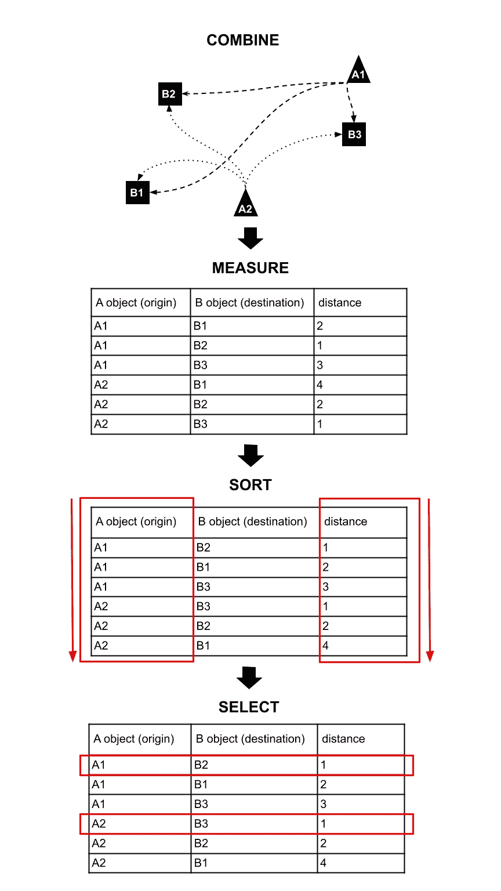
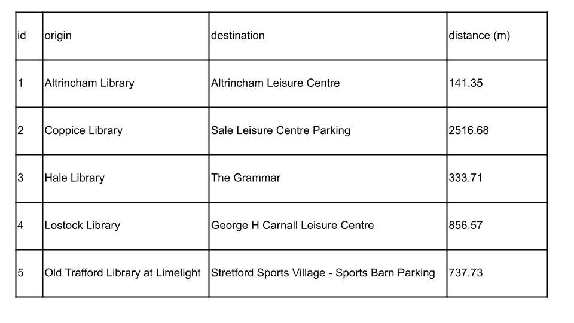
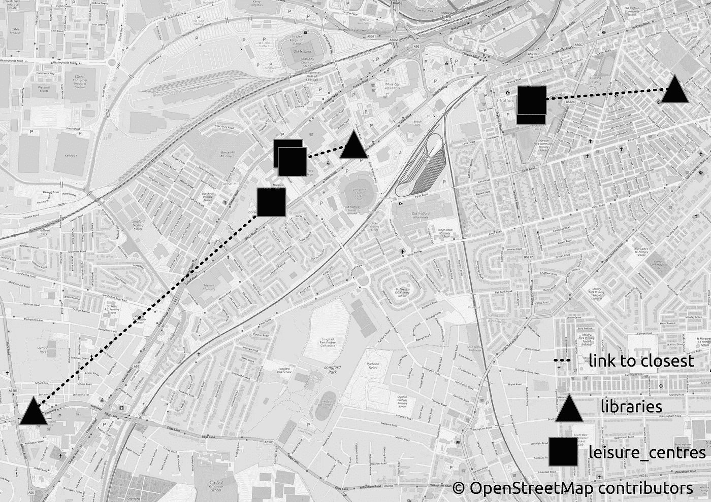
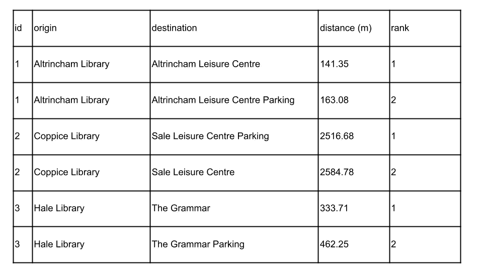
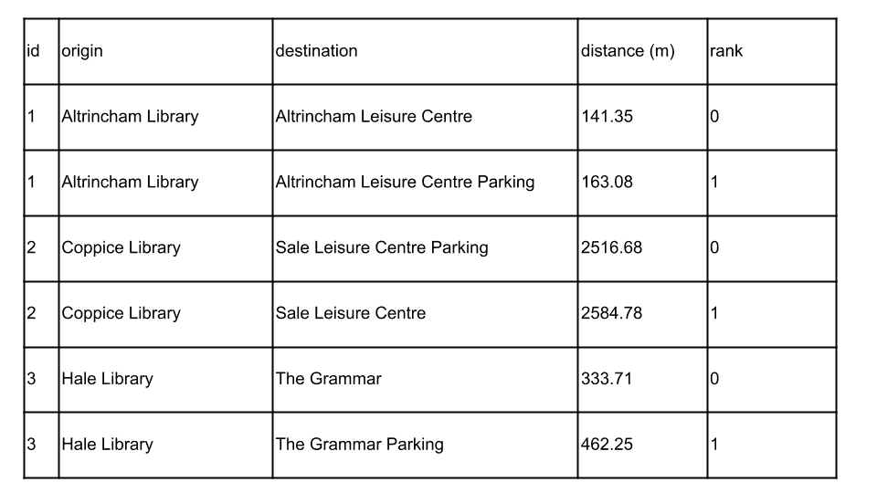
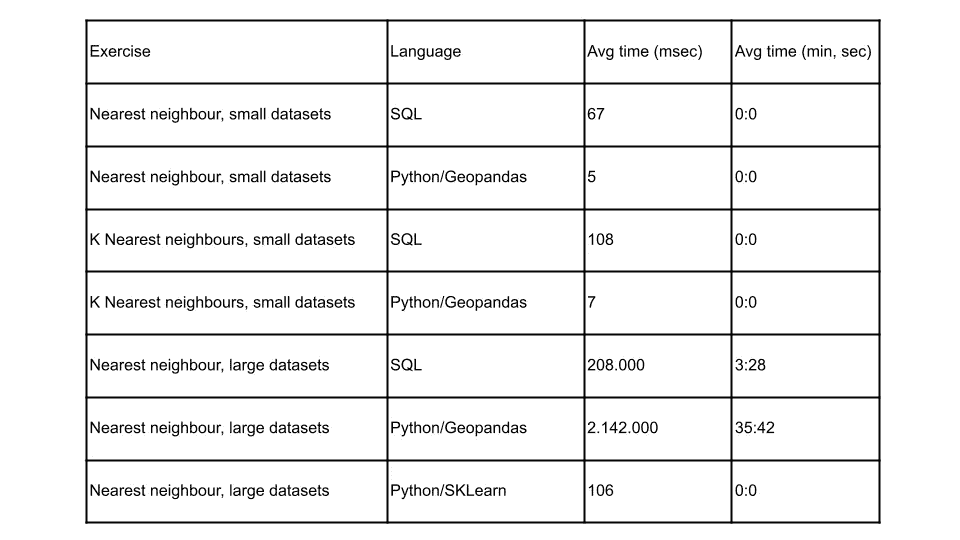

# 使用 SQL 和 Python 的最近邻

> 原文：<https://towardsdatascience.com/nearest-neighbour-with-sql-and-python-78a1937d15b8?source=collection_archive---------27----------------------->

## 一个简单的算法来解决最近邻问题与任何语言和 SQL 和 Python 中的例子

最近邻问题是空间分析中经常出现的问题之一。它是如此普遍，知道如何简单有效地解决它是根本。本文介绍了 SQL 和 Python 中的问题和解决方案。

# 问题是

这个问题很容易定义:给定空间中的两组物体，集合 A 和集合 B，对于 A(原点集合)中的每一个物体，在 B(目的集合)中寻找最近的物体。

假设 A 组代表图书馆，B 组代表休闲中心，你想知道哪个休闲中心离每个图书馆最近。

# 该算法

这个问题的解决方案如下(图 1):

*   组合集合 A 和 B 中的对象
*   测量每个组合的距离
*   首先按(原点)中的对象，然后按距离对组合进行排序。
*   对于中的每个对象，选择应该是最短距离的第一个组合



图 1:最近邻算法。图片作者。

请注意，一个集合必须是起点，另一个集合必须是终点。这是因为原始集合中不应该有重复值，但是目标集合可以有重复值。B 中的相同对象可能是 a 中不同对象的最近对象。以图书馆和休闲中心为例，两个图书馆可以拥有相同的休闲中心作为它们的最近对象(图 2)。


图 2:两个起点共享一个目的地作为它们的最近点。图片作者。

该算法可以被修改以产生唯一的关系。换句话说，如果一个目的地是一个起点，那么算法可以为你提供下一个最近的起点。

# 数据

我们在这篇文章中使用了两个数据集:一个是特拉福德的图书馆，一个是特拉福德数据实验室(2021)的休闲中心。您可以通过以下方式下载它们:

```
wget h[ttps://www.trafforddatalab.io/council_open_data/assets/leisure_centres/leisure_centres.geojson](https://www.trafforddatalab.io/council_open_data/assets/leisure_centres/leisure_centres.geojson) ; wget [https://www.trafforddatalab.io/council_open_data/assets/libraries/libraries.geojson](https://www.trafforddatalab.io/council_open_data/assets/libraries/libraries.geojson)
```

# SQL 示例 1:仅最近邻

本文中的所有 SQL 示例都适用于 postgreSQL (Postgresql.org，2019)数据库和 PostGIS (PostGIS Developers，2020)。这些表名为“休闲中心”和“图书馆”，都存储在名为“trafford”的模式中，都有一个“id”列、“name”列和“geom”列。

假设我们想知道每个图书馆最近的休闲中心，算法实现如下:

代码片段 SQL 中的最近邻查询

让我们分析一下查询的不同部分:

*   我们使用“选择”来选择我们想要的列
*   使用“DISTINCT ON”，我们指定不希望在表“A”的“id”列中出现重复的元素；它通过选择定义为“ORDER BY”的第一行来工作
*   我们指定数据将来自两个表，即模式“trafford”中的“libraries”和“leisure_centres ”,并对这两个表应用别名，以避免在每一列前面重复表名
*   没有连接表的“WHERE”条件会迫使 SQL 规划器组合两个表的元素
*   然后，我们使用“ORDER BY”对值进行排序，这允许“DISTINCT ON”过滤掉最近的邻居

表 1 和图 3 显示了图书馆和最近的休闲中心之间的一些联系。



表 1:使用 SQL 的离图书馆最近的休闲中心(未显示全部)



图 3:离图书馆最近的休闲中心(未全部显示)。图片作者。

可以通过在 QGis 中运行前面查询的一个小修改来生成链接:

代码片段 2:以链接作为几何图形的 SQL 中的最近邻查询

这个例子平均运行 67 毫秒，我将把它与 Python 版本进行比较。

# SQL 示例 2: K 个最近邻居

在某些情况下，我们不仅对最近的邻居感兴趣，而且对一组最近的邻居感兴趣。我们可以通过简单修改代码来实现这一点。例如，如果我们对每个图书馆最近的两个休闲中心感兴趣，您可以使用:

代码片段 3:用 SQL 查询 K 个最近邻居

表 2 显示了输出。



表 2:使用 SQL 查询离图书馆最近的两个休闲中心(未全部显示)

该示例平均运行时间为 108 毫秒。

# Python 示例 1:仅使用 Geopandas 的最近邻

目标是使用 Geopandas 复制 SQL 示例 1 的输出( *Jordahl* et al，2020)。算法是相同的，我们结合所有，计算距离，排序的价值，并选择最近的。

首先让我们导入库并读取数据:

代码片段 4:将数据导入 Geopandas

重要的部分是下一个函数，我们遵循算法的所有步骤:

代码片段 Python 中的最近邻函数

现在我们必须做两件事:首先，应用函数，这样我们就可以获得最近几何图形的标识符列表。其次，我们获取这些标识符的值。

该函数被编写为总是返回源和目的地的标识符，这样更安全，因为所有数据帧都有索引，但不是所有数据帧的列都有相同的名称。代码的第二部分将这些标识符转换成值:

代码片段 6:最近邻函数的实现

输出类似于 SQL 示例 1:


表 3:离使用 Geopandas 的图书馆最近的休闲中心(未全部显示)

平均运行时间为 5 毫秒，这与 SQL 相比快得惊人。在这篇文章的最后，我将用一个更大的数据集进行比较。

# Python 示例 2:具有 Geopandas 的 K 个最近邻

现在，让我们尝试使用 Geopandas 来查找 K 个最近的邻居，就像我们在 SQL 示例 2 中所做的那样。和以前一样，算法不变，只有实现。我们修改了函数，现在接受第三个变量 k，它代表所需的最近邻数量:

代码片段 Python 中的 K 近邻函数

我们调用该函数并获得输出(表 4):

代码片段 8:K 近邻函数的实现



表 4:离使用 Geopandas 的图书馆最近的两个休闲中心(未全部显示)

这个例子平均运行 7 毫秒。

# 更大数据的性能

到目前为止，所有的例子都是使用一对相当小的数据集完成的。一个是 13 行长，另一个是 17 行长。我将使用操作系统打开 UPRN 和代码点打开 UPRN 作为原点，重复练习 1。

这两个数据集都可以从 https://osdatahub.os.uk/downloads/open(2021)下载。

我将表格简化为白马谷区域内的几何图形。这给了我们 80347 个 UPRNs 和 4074 个代码点。这些仍然是小数据集，我想说一个更真实的练习将涉及有数百万行或至少数十万行的表。不过，我将保持简单，只是为了演示性能上的差异。

在 PostgreSQL 中，有许多方面会影响 Geopandas 与 SQL 的性能:

*   Geopandas 将数据存储在内存中，而 PostgreSQL 必须从磁盘中读取数据。这可以让熊猫更快，只要你有足够的内存，你愿意等待数据读入内存。
*   PostgreSQL 有一个计划器，它会尝试以最好的方式实现查询，这可能是相对于 Python 的一个优势。
*   根据版本的不同，PostgreSQL 可以对同一个查询使用多个 CPU，而 Pandas 则仅限于单个 CPU。
*   通常 PostgreSQL 运行在一个比普通计算机有更多 RAM 和 CPU 的服务器上，但是你也可以在服务器上运行 Geopandas，所以这完全取决于你的情况。
*   PostgreSQL 和 Geopandas 都使用索引来加快查询速度，但我发现 PostgreSQL 索引更加通用和强大。
*   PostgreSQL 的配置很重要，默认情况下，它会限制给查询的内存量。

在这种情况下，SQL 和 Python 都在同一台笔记本电脑上运行，该笔记本电脑有 16GB RAM 和 8 个 2.30 Ghz 的 CPU(对于数据库服务器来说不是很好)。

我们需要做一些调整，以确保查询和函数不会被大型任务所阻塞。对于 SQL，我们需要:

*   为两个表创建空间索引
*   为要在“DISTINCT ON”中使用的列创建索引
*   建立一个距离限制来减少组合的数量

如果没有索引，SQL 查询将需要很长时间。我使用的限制是 5 公里，因此距离超过 5 公里的所有组合都会被删除。

让我们创建索引，并用距离限制修改查询:

代码片段 9:最近邻查询的表索引

代码片段 10:使用 SQL 的大型数据集的最近邻

注意，我没有调用输出，而是重定向到一个新表。输出可能很大，您肯定不希望第二次运行一个很长的查询。这个查询需要 3 分 28 秒。

对于 Geopandas，我们需要重写代码，以便从索引中获益。我们导入数据，定义新函数，并像这样实现它:

代码片段 11:使用 Python 的大型数据集的最近邻

该查询运行时间为 35 分 42 秒。

如您所见，在这种情况下，Geopandas 并不比 SQL 运行得更快。

还有另一种选择:由于两个表都是点，我们可以将几何图形表示为坐标，然后使用 scikit-learn (Pedregosa 等人，2011 年)计算最近邻。这仅用了 106 毫秒。这种方法的唯一缺点是不能使用不同于点的几何图形:

代码片段 13:使用 sklearn 和 geopandas 的最近邻

所有执行速度如表 5 所示:



表 5:性能比较

# 结论

最近邻问题是空间分析中的基本问题之一，它可以有一个简单的解决方案，但需要一个计算密集型的解决方案。

我已经展示了使用 SQL 和 Python 的选项。更准确地说，我展示了 PostGIS、Geopandas 和 Scikit-learn 的选项。

很明显，当任务很小时，Geopandas 是很棒的。当任务较大时，PostGIS 做得更好，尤其是在服务器良好的情况下。Scikit-learn 速度超快，但仅限于点数。

性能不仅受您使用的语言的影响，还受硬件、配置、索引等整个环境的影响。

我希望你喜欢这篇文章，但如果你有改进算法或代码的建议，请不要忘记评论。

# 参考

凯尔西·乔达尔、乔里斯·范登博舍、马丁·弗莱施曼、雅各布·乏色曼、詹姆斯·麦克布莱德、杰弗里·杰拉德……弗朗索瓦·勒布朗。(2020 年 7 月 15 日)。geo pandas/geo pandas:v 0 . 8 . 1(v 0 . 8 . 1 版)。芝诺多。可用时间:<http://doi.org/10.5281/zenodo.3946761>**。**

*osdatahub.os.uk. (2021)。 *OS 数据中枢*。[在线]可从[https://osdatahub.os.uk/.](https://osdatahub.os.uk/.)获得*

*Pedregosa，f .，Varoquaux，g .，Gramfort，a .，Michel，v .，Thirion，b .，Grisel，o .，Blondel，m .，Prettenhofer，p .，Weiss，r .，Dubourg，v .，Vanderplas，j .，Passos，a .，Cournapeau，d .，Brucher，m .，佩罗特，m .和 Duchesnay，e .(2011).sci kit-learn:Python 中的机器学习。*机器学习研究杂志*，【在线】12(85)，第 2825–2830 页。可在:[https://jmlr.csail.mit.edu/papers/v12/pedregosa11a.html](https://jmlr.csail.mit.edu/papers/v12/pedregosa11a.html.)*

*后 GIS 开发者(2020)。*PostGIS—PostgreSQL 的空间和地理对象*。[在线]Postgis.net。可在:[https://postgis.net/.](https://postgis.net/.)*

*‌Postgresql.org。(2019). *PostgreSQL:全球最先进的开源数据库*。[在线]可在 https://www.postgresql.org/.[的](https://www.postgresql.org/.)找到*

*Trafforddatalab.io. 2021。*特拉福德数据实验室*。【在线】可在:[https://www.trafforddatalab.io/](https://www.trafforddatalab.io/)获得。*