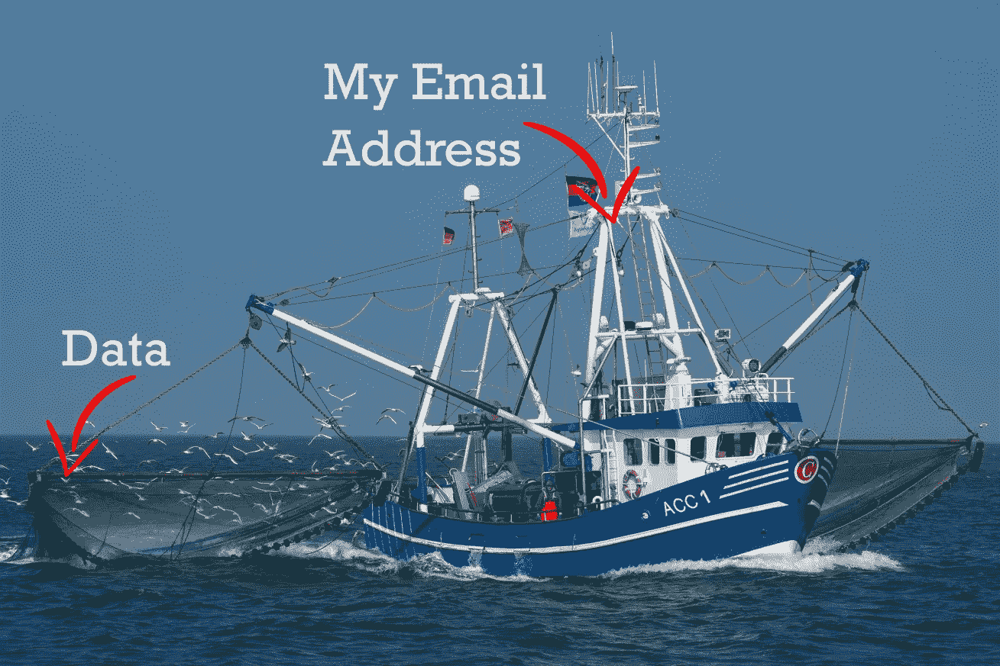
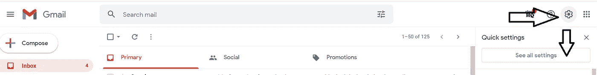
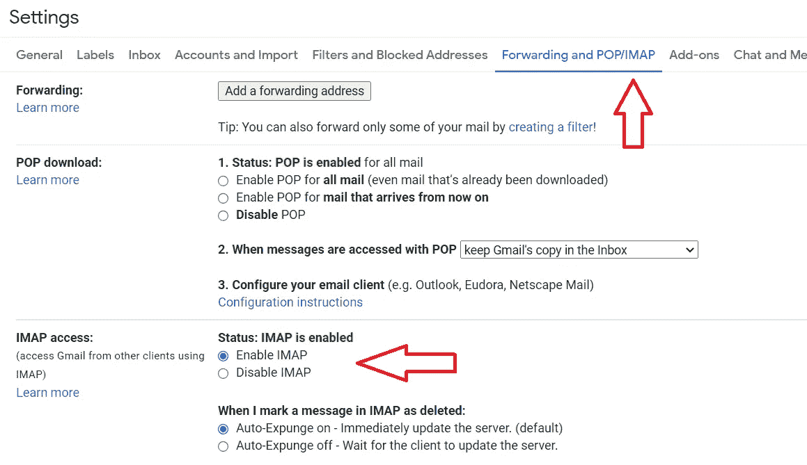
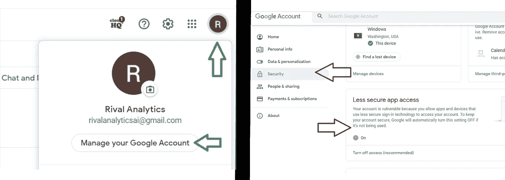
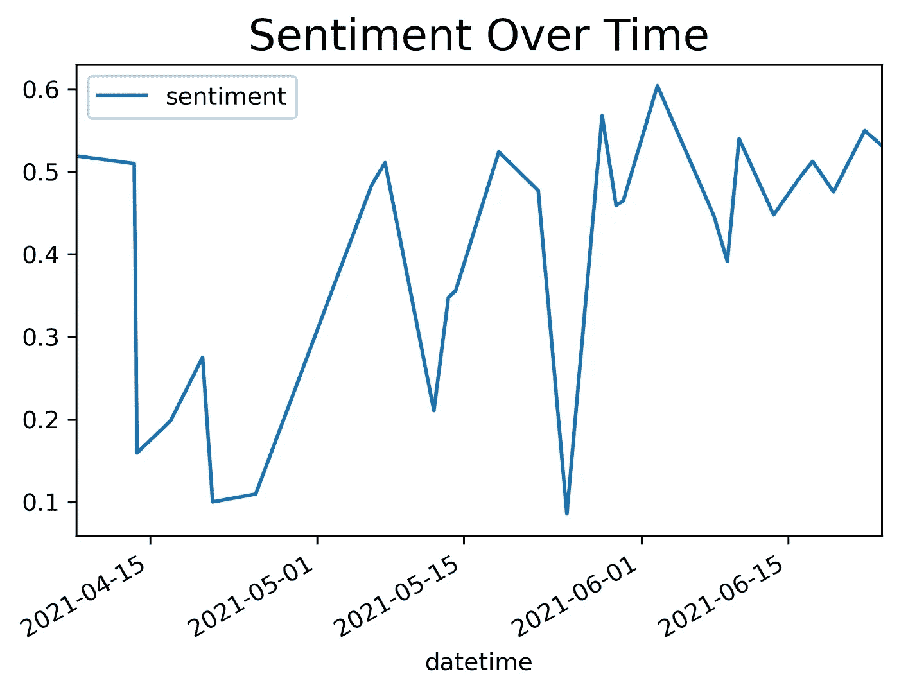
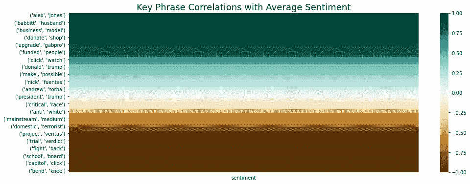

# 需要数据？为什么不用你的邮箱地址呢？

> 原文：<https://towardsdatascience.com/need-data-why-not-use-your-email-address-2936e9894a4c?source=collection_archive---------45----------------------->

## 我如何设置我的电子邮件帐户来分析右翼媒体信息

皮沙贝

尽管在过去的几年中，我们已经看到消息应用和聊天选项的流行程度显著上升，但电子邮件仍然是最主要的数字通信形式之一。今天，据估计有超过 40 亿人使用电子邮件；这个数字预计在可预见的未来还会增长。

此外，电子邮件简讯的打开率大约为 [22%](https://uplandsoftware.com/postup/resources/blog/email-newsletter-statistics/) ，这使得社交媒体业务参与度大打折扣。简而言之，电子邮件仍然很重要，有很多公司、团体和组织都渴望让你注册他们的电子邮件营销简讯。

# 但是数据科学家如何处理这些信息呢？；)

年轻的数据科学家今天面临的最大问题之一是在构建企业级数据科学解决方案的过程中真正理解数据工程的价值。无论是访问数据、了解如何处理杂乱的数据，还是为下游培训进行特征工程，年轻的数据科学家通常不会接触这些主题，因为课程、博客和在线教程通常提供“罐装”数据集，这些数据集已经过审查并清除了它们的原始形式。

进入电子邮件，你自己的数据收集机器，它有助于让你接触数据科学中肮脏的、较少被谈论的、当然也没有被美化的方面，同时也打开了无数商业用途的大门。以下是使用电子邮件收集、分析和模拟数据的一些业务用例:

1.通过订阅他们的电子邮件时事通讯来了解你的竞争对手在做什么

2.监控社会运动及其对信息的使用，以发现新趋势

3.从客户那里收集反馈，感觉不像是另一项调查

# 好吧，酷，但我该怎么做？

在本文的剩余部分，我将提供一个过程和一些代码，向您展示我如何设置一个电子邮件帐户来收集来自右翼团体的数据，以监控极端主义消息，并使用一些自然语言处理工具来分析这些数据以获得洞察力。如果你正在挠头，想知道为什么这个话题如此狭窄，这个项目是与 [RivalAnalytics 合作的。Ai](https://www.rivalanalytics.ai) ，一个竞争情报数据科学小组，有兴趣建立像这样的监控项目。

高级项目看起来像这样:

1.设置一个 Gmail 帐户并启用程序化访问

2.使用新的电子邮件地址注册目标时事通讯

3.等待我的收件箱填满…

4.利用 Python 访问电子邮件并提取日期、主题和正文

5.清理数据

6.使用关键词、情感和相关性分析数据

7.考虑一下其中的含义

开始了…

# 步骤 1:设置电子邮件帐户

希望我不需要向每个人展示如何设置一个 Gmail 帐户，更有用的是展示如何启用该帐户进行编程访问。创建 Gmail 帐户后，进入 Gmail 收件箱，单击“齿轮”图标进入设置，然后单击“查看所有设置”(见图中的黑色箭头)。

从那里点击“转发和 POP/IMAP”标签和“IMAP 访问”部分的“启用 IMAP”(见图中红色箭头)。选择后，滚动到底部并单击“保存更改”以启用帐户上的选择。

最后，点击左上角你的 Gmail 账户的圆圈图标(我用的是 Chrome BTW)，然后点击“管理你的谷歌账户”(见绿色箭头)。转到“安全”部分，点按以打开“不太安全的应用程序访问”(见黑色箭头)。搞定了。现在，您的电子邮件配置为编程访问。前进！

# 步骤 2 和 3:注册并等待

对于这个实验中的第 2 步和第 3 步，我选择注册 Gab 时事通讯。Gab 是一个右翼社交媒体网站，也是右翼极端组织的知名平台。

…等待…等待…仍在等待…

随着我的耐心越来越少，我终于决定拔掉插头，看看我在大约 2 个月内积累的数据。在仅仅两个月的时间里，并且只关注一个时事通讯来源，我积累了 28 封电子邮件。无论如何都不是“大数据”,但你可以想象如何扩大范围以包括更多的来源，并允许多一点时间来获取数据，可以大大扩展足迹。

# 步骤 4:使用 Python 访问数据

为了以编程方式访问数据，我在 Windows 10 笔记本电脑上使用了 Python 3.7。首先，我们需要安装允许我们访问电子邮件服务器的库:

第二，我们从我们的时事通讯提供商那里搜索电子邮件，并提取日期、主题和正文。请注意，代码只关注正文中的文本，并不试图提取附件，但是这里的是修改我的循环以将附件保存到您的硬盘驱动器的一个很好的资源。

既然我们已经有了包含每封电子邮件的日期、主题和正文的数据框架，我们就可以开始分析了。

# 步骤 5:清理数据

为了清理数据，我构建了一个函数，我通常在我的大多数 NLP 项目中使用它来快速清理文本数据。该函数允许您传递一个字典，该字典将对单词标记的任何潜在问题进行标准化，例如将首字母缩略词从“NLP”更改为“自然语言处理”，如果它变得相关的话。代码使用 Python 的 NLTK 库中的工具。

在我们的 dataframe 中创建了“clean_text”列之后，我从文本中构建二元模型。我通过点互信息(PMI)值和基于它们作为名词的状态来过滤二元模型，因为大多数主题都基于文本中的名词。 [PMI](http://fid.cl/courses/nlp/hw/pmi.pdf) 本质上是给定二元模型的概率除以每个词独立的概率。使用这些过滤器提高了我们获得有意义二元模型的可能性。一旦我们获得了最终的二元模型列表，我们就为每封邮件创建一个二元模型频率矩阵。

# 第六步:分析

现在我们有了一个数据框架，其中包含了最终二元模型列表中每个二元模型的频率计数，我们可以分析数据了。为了进行分析，我首先将主体和日期从主数据框架连接到我们的 clean_text 数据框架。然后，我使用 HuggingFace 的“情绪分析”管道添加了一个情绪栏。在生成情感分数的函数中，因为基于 BERT 的转换器有一个字符限制，所以我们需要限制暴露给模型的字符。我遍历正文的每一行，选择前 512 个字符来生成情感评估。最后，我将所有的情感评分平均在一起，以获得每封邮件的总体情感评估。显然，我们不会捕获所有的文本数据，但是可以通过迭代 512 个字符的块来捕获所有的数据。

一旦完成，我们执行一个快速的时间序列分析，绘制一段时间内的情绪，以及通过 bigram 与情绪的相关性分析，以确定哪些短语与整体情绪相关联。

从上面的代码中，我们生成了一些图像来帮助我们解释。让我们先来看看时间序列图:

尽管最初几封邮件的平均情绪很高，但我们看到快速下降，随后从 05–2021 到 06–2021 呈线性上升趋势。仍然有很大的可变性，但是分析确实表明了一种趋势。这种趋势让我假设这些时事通讯可能与新闻中的其他事件相关联。因此，将这些数据与其他数据源(如谷歌趋势)进一步融合会很有意思。让我们来看看我们的二元模型是如何与情绪相关联的:

# 第七步:解释

在关联热图中有一些有趣的见解，显示了二元模型和平均情绪之间的关系强度。有趣的是，“唐纳德·特朗普”比“特朗普总统”更与积极情绪正相关，这表明极右翼团体可能会以不同的方式使用前总统的标签，这种方式可能取决于他们是否讨论自己对唐纳德·特朗普的热情，而不是描述自由主义者如何对待特朗普总统。

其他关键见解包括倾向于与更多负面情绪相关联的短语，如“关键种族”和“国内恐怖分子”

# 带回家或 TLDR

总之，我们的电子邮件地址是宝贵的数据来源，如果使用得当，可以带来一些重大的商业和/或社会价值。通过应用数据科学的工具，我们可以为电子邮件的非结构化本质增加结构，并创造新的见解，从而在各种使用案例中推动价值。

比如参与学习更多关于数据科学的知识？[加入我](https://www.facebook.com/groups/thinkdatascience)。