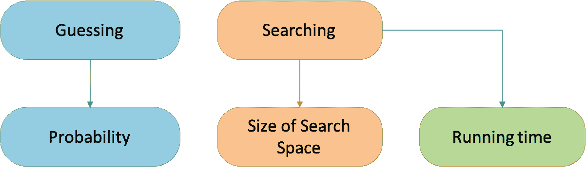
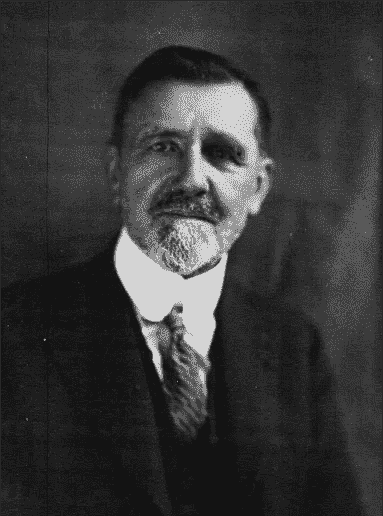
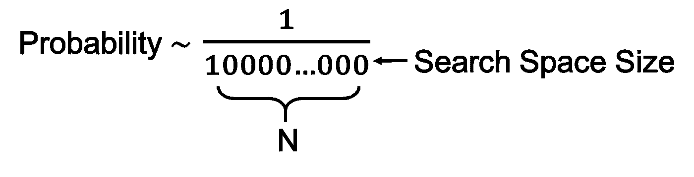
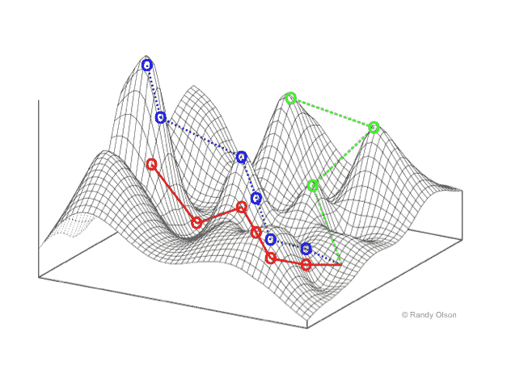

# 时间不够

> 原文：<https://towardsdatascience.com/neo-darwinistic-concepts-of-chance-and-time-through-the-lens-of-ai-2eee4d5c2bd6?source=collection_archive---------28----------------------->

弗朗西斯科·赫苏斯·纳瓦罗·埃尔南德斯在 [Unsplash](https://unsplash.com/collections/8302845/my-first-collection/930b256d239388d58d002fe967c52d0d?utm_source=unsplash&utm_medium=referral&utm_content=creditCopyText) 上拍摄的照片

## 从计算复杂性的角度看新达尔文主义的时间观

如果进化是一个计算问题，那么大自然是如何解决的呢？此外，它与人工智能(计算的顶点)有什么关系？根据新达尔文主义，或者查尔斯·达尔文的生命起源进化理论的[现代综合](https://en.wikipedia.org/wiki/Modern_synthesis_(20th_century))，大自然在足够长的 **时间**里盲目冒险选择基因突变中的变异。在本文中，我试图通过计算复杂性的视角来研究****新达尔文主义的**时间**概念。****

# ****盲人钟表匠****

****新达尔文主义者的“中心教条”说:****

> ******当**给予足够的**时间**通过一个验证过程，比如**自然选择**，**机会**可以导致多样性、创造性和独创性，不管它们多么罕见。****

****“一个人只有等待；生理学家、诺贝尔奖获得者乔治·沃尔德认为:“时间本身会创造奇迹。”。有时候，稀有性受到挑战，比如在[钟表匠类比](https://en.wikipedia.org/wiki/Watchmaker_analogy)中，批评家说如果你在地上发现一块手表，我们可以推断一定有人把它掉了，一定有钟表匠制造了它。然而，理查德·道金斯声称，即使大自然就像一个不可思议的盲人钟表匠，时间也会把不可思议变成现实。“自然选择的活生生的结果给我们留下了极其深刻的印象……带有设计和规划的幻觉(道金斯，1985)。”换句话说，手表可能是一个盲人钟表匠的偶然产品，他既不知道手表是什么，也没有制造手表的计划。****

****虽然关于盲人钟表匠的辩论是隐喻性的，永远无法解决，但这种解释力的总体主张，如果在不同的情况下被无可争议地驳斥，将成为新达尔文主义的致命弱点。****

# ****随机猜测者和数学天才****

****这是这样一个思想实验:****

> ****如果有足够的时间，一个精通遵循逻辑规则，但没有数学直觉的随机猜测者能像数学天才一样解决问题吗？****

****如果你问新达尔文主义者，他们会坚持认为，由于他们的中心教条，随机猜测者展示了数学天才的创造力和独创性。然而，数学家会说，“不，这在数学上是不可能的。”计算机科学家会回应说这在计算上是不可行的。与盲人钟表匠不同，随机数学猜测实验可以在数学和计算机科学中找到它的对应物，这样我们就可以果断地解决这场争论。****

****让我们从二十世纪初开始，当时由杰出的数学家戴维·希尔伯特领导的数学形式主义者将逻辑推理作为数学的一个组成部分。这样，他们可以把解决问题当作数学的一部分。他们认为直觉思维是人工制品，因此对数学发展没有必要。于是，希尔伯特提出了希尔伯特方案，可以从一组公理和逻辑规则中完整地展开数学。****

****知道希尔伯特的程序最终失败，我们可以得出直觉起了什么必要的作用？直觉“猜测”开始的正确公理、要研究的突出数学事实以及证明这些事实的必要逻辑步骤。然后使用逻辑来验证这些猜测。正如我们所看到的，在希尔伯特的时代，数学家淡化了猜测的艺术，并认为它可以通过随机猜测被“净化”掉。因此，我们的随机猜测思维实验相当于希尔伯特的程序。如果行得通，数学发展可能是盲目的、无目的的、无计划的，这正是新达尔文主义者对生命进化的描述。****

****现在让我们继续讨论库尔特·哥德尔和艾伦·图灵，他们证明了希尔伯特的程序在数学上是不可能的，因为自参照产生了不可避免的悖论。根据哥德尔的说法，直觉不仅是不断提炼和扩展公理所必需的，而且根据图灵的说法，直觉还必须参与发现和证明数学事实(参见我的文章《逻辑的极限和计算机的兴起》)。****

****数学的发展需要直觉，这意味着大自然可能并不盲目。****

# ****数学和计算机科学****

****数学上的两个弱点解释了希尔伯特程序中的数学谬误。首先，它缺乏解决问题所需时间的概念。第二，它没有猜测工具。矛盾的是，数学中的这些缺点导致了计算机和计算机科学的出现。****

****计算机科学定义了运行一个程序的处理步骤的时间，并配备了一个叫做“搜索”的工具来处理猜测。随机猜测和巧妙猜测分别对应于强力搜索和智能搜索。正确猜测的微小概率可以与通过蛮力和长时间运行在大空间中的搜索相关联。****

********

****计算中的相关概念****

****总结一下:****

1.  ****强力搜索的运行时间与搜索空间大小成正比。****
2.  ****做出正确猜测的概率与搜索空间的大小成正比。****

****现在，我们可以将解决问题的数学问题视为计算问题，并将数学可能性视为计算可行性。关于可行性，我们可以根据计算问题的运行时间或搜索空间是指数增长还是多项式增长，将计算问题分为以下两类。我们可以认为第一种类型是不可行的，因为指数运行时间或搜索空间甚至可以超越宇宙。第二种类型，称为代表多项式时间的 P，被认为是可行的**T3，因为多项式运行时间或搜索空间通常可以容纳在宇宙的限制内。******

# ****p 与 NP:问问新达尔文主义者****

****处理不可行的问题是没有希望的，可行的问题似乎太容易而没有意义。幸运的是，还有第三种类型，称为 NP，代表非确定性多项式时间。做出正确的猜测可能很困难(指数时间)，但验证猜测很容易(多项式时间)。我们认为希尔伯特的程序是一个 NP 问题，因为使用逻辑推理来验证猜测是可行的，但如果随机猜测或用蛮力搜索则不可行。****

****同样，根据新达尔文主义，盲目、无目的、无计划的进化就像用蛮力搜索解决一个 NP 问题。自然选择作为验证机制必须花费多项式时间；否则，它不会促进生命的进化。****

****正如我在文章[直觉、复杂性和最后的悖论](https://medium.com/cantors-paradise/intuition-complexity-and-the-last-paradox-ec0a7f8ad93b)中所解释的，有一类 NP 问题，称为 NP-完全，被认为是所有 NP 问题中最困难的。如果一个 NP-完全问题有一个多项式时间的解，那么所有的 NP 问题都可以归结为这样一个问题并在多项式时间内求解，从而证明 P = NP。我们把确定 P = NP 称为 P 对 NP 问题。这是数学和计算，甚至是现代科学中最重要的公开问题之一。****

****一个新达尔文主义者会如何回答 P = NP 这个问题？如果是，那么进化就可以归结为某个 NP 完全问题，由一个不了解生命的多项式时间 NP 完全求解器来求解。因此，大自然可能仍然是盲目的，创造力、独创性和对进化的预见仍然是一种幻觉，正如新达尔文主义者所期望的那样。然而，解释谁设计了这样一个多项式时间解算器的噩梦将困扰着她。正如我们所见，一个新达尔文主义者会坚持 P 不等于 n P。****

# ****埃米尔·波莱尔:罕见的事件不会发生****

********

****埃米尔·波莱尔，1871-1956 年****

****回想一下，强力搜索对应于随机猜测。因此，指数增长的搜索空间表示指数运行时间和正确猜测的概率的减少。为了方便起见，我们可以将搜索空间的大小表示为 10^N，其中 n 是 1 后面的零的数量。****

********

****因此，我们可以用 N 来表示搜索空间有多大，搜索要花多长时间，以及做出正确猜测的可能性有多大。新达尔文主义者坚持认为，无论 N 有多大，都有足够的时间进行尽可能多的猜测。这一立场也许在乔治·沃尔德的以下引述中得到最好的证明:****

> ****给定这么多时间，[几乎]“不可能”变成可能，“可能”变成可能，“可能”变成几乎“确定”(Wald，1954，48–53)。****

****与新达尔文主义者关于机会和时间的立场相反，法国著名数学家埃米尔·波莱尔(1871-1956)在他的“单一机会法则(Borel，1962)”中说:****

> ****概率足够小的事件永远不会发生；或者至少我们必须采取行动，在任何情况下，就好像它们是不可能的。****

****尽管它被称为“单一”定律，但它描述了两种我们认为足够小的概率为零的重要场景——前者涉及你如何做出日常或一生的决定。例如，你想开车去上班，冒着在车祸中丧生的风险，考虑到天气预报并不总是正确，你每天都带着一把伞，或者把你的退休生活押在中彩票上。****

****第二个场景是关于你如何处理科学事实或工程决策。Borel 估计概率小于 N = 50，即支配者中 1 后面的零的数量，牛顿定律可能被违反。但在设计桥梁、汽车、飞机和人类登月时，我们会认为这种可能性为零。进一步，考虑统计力学的预测，我们不需要考虑容器中的氧和氮的混合物自发分离成右半部分的纯氮和左半部分的纯氧的可能性。决定向左或向右的每个原子的搜索空间的大小是 N，以亿计，比我们的宇宙在各个方面都大得多，以至于 Borel 认为这样的搜索空间大小是超宇宙规模的。****

****对于生命的进化，著名的进化生物学家 Carl Sagan 估计搜索空间为 N = 2，000，000，000，或 1/10 的 20 亿次方，以符合新达尔文主义理论，即生命可以在任何一个给定的行星上进化完全是偶然的(Sagan，1973)。然而，新达尔文主义者认为他们的进化机制不是完全随机的，自然选择是非随机因素(Dawkins，2006)。如前所述，如果进化被认为是一个 NP 问题，自然选择就是验证机制。微生物学家詹姆斯·夏皮罗(James Shapiro)认为，“没有变异和新奇，选择就没有任何作用”(夏皮罗，2011)。使其可行或可能的唯一方法是在猜测或搜索中具有非随机性，这意味着在产生变异时有设计或计划，这在中心法则中是严格禁止的。****

# ****超越 P 与 NP****

****尽管在数学、芯片设计、软件检查和与我们日常生活相关的各种领域的关键任务决策中，我们已经成功地采用了启发式和近似求解器，尽管有最坏情况下的指数时间。与此同时，我们正在见证 AI 通过模仿数学天才在解决数学中的 NP 完全问题方面取得进展(Bansal 等人，2019)(Polu & Sutskever，2020) (Selsam 等人，2019)。****

****在生物学中， [Levinthal 悖论](https://en.wikipedia.org/wiki/Levinthal%27s_paradox)一直面临着蛋白质结构预测(PSP)问题，以从蛋白质的线性氨基酸序列中确定三维结构。悖论说****

> ****尽管它有巨大的搜索空间，N 约为 300，即使对于一个小的蛋白质分子，它也会在毫秒甚至微秒的时间尺度上自发折叠。****

****科学家认为 PSP 是 NP 完全的(Unger & Moult，1993) (Unger & Moult，1993)。最近，DeepMind 声称在使用人工智能程序 [AlphaFold](https://www.nature.com/articles/s41586-019-1923-7.epdf?author_access_token=Z_KaZKDqtKzbE7Wd5HtwI9RgN0jAjWel9jnR3ZoTv0MCcgAwHMgRx9mvLjNQdB2TlQQaa7l420UCtGo8vYQ39gg8lFWR9mAZtvsN_1PrccXfIbc6e-tGSgazNL_XdtQzn1PHfy21qdcxV7Pw-k3htw%3D%3D) 以前所未有的准确性和效率解决 PSP 方面取得了[突破](https://deepmind.com/blog/article/alphafold-a-solution-to-a-50-year-old-grand-challenge-in-biology)。现在一个问题如下:如果 AlphaFold 确实“解决”了 PSP 这个已知的 NP 完全问题，那么它的成功不就证明了 P = NP 吗？答案是否定的，因为 AlphaFold 在学术上被归类为近似和启发式求解器之一。然而，与其他解决方案相比，AlphaFold 和 AI 解决方案在以下方面表现突出:****

1.  ****即使在最坏的情况下，它们也没有指数运行时间****
2.  ****他们总是“开放”的，并不断学习和适应****
3.  ****如下所述，它们可以被设计成端到端的，以捕捉人类或自然的直觉****

****之前声称 PSP 是 NP 完全的可能是由于自然和手工问题公式之间的不匹配，这导致了搜索空间的指数膨胀(Bahi 等人，2013)。相反，AlphaFold 从自然界学习，以端到端的方式将蛋白质的氨基序列直接映射到其最终的三维结构。它不是在一个超级宇宙的搜索空间里跳来跳去，而是把搜索空间看作一个风景，并导航到底部。****

****从这个意义上说，人工智能为挑战性问题提供了切实可行的解决方案，并启发我们了解自然和人类可能如何类似地解决问题。一个更深刻的问题是大自然如何选择那些可以折叠成三维结构的氨基酸序列。一个有趣的观察结果是，“自然界在进化时间尺度上选择蛋白质序列所使用的能量景观本质上与将这些序列折叠成功能蛋白质的能量景观相同(Morcos 等人，2014)。”大自然可能是通过在进化景观中导航而进化的。****

********

****鸣谢:维基百科。NK 健身景观的两个维度的可视化。箭头代表种群在适应度景观上进化时可能遵循的各种变异路径。****

# ****罕见事件发生怎么办？****

****新达尔文主义者认为大自然没有解决任何问题。它更像是一个**模拟**，而不是毫无目标的盲目前行；任何成绩都纯属偶然。****

****卡罗尔 2020 年的书的一篇[评论](https://www.seanbcarroll.com/)指出，“一系列幸运事件讲述了机会的可怕力量，以及它是生活世界中所有美丽和多样性的令人惊讶的来源。”书名类似的书《一系列幸运事件》(Snicket，1999-2006)可能启发了书名的选择。在早期的书中，波特莱尔家的孩子们遭受了一系列悲惨的事故，从在一场火灾中失去父母开始。与卡罗尔对机遇的崇拜相反，波德莱尔家的孩子可能会指责机遇是痛苦和毁灭的根源。****

****卡雷尔和他的新达尔文主义者伙伴们认为，机遇既不是好事，也不是波德莱尔家的孩子们认为的坏事。它是对尚未发生的事情的不确定性的度量。一件事一旦发生，就叫事件。当一件本该罕见的事情发生时，我们该如何反应？根据似是而非的推理(Polya，1954)，波德莱尔的孩子们认为，当一系列几乎不可能的事件发生时，几乎可以肯定的是，有一个邪恶的主谋，结果是奥拉夫伯爵，密谋反对他们。****

****另一方面，试图将宇宙事件与一个人的存在联系起来，听起来像是道德领袖或精神导师的工作，新达尔文主义者多少渴望扮演他们的角色。用机会和时间来解释细节是绝对错误的。****

# ****科学头脑****

****自从新达尔文主义出现以来，一直有蓬勃发展的研究([第三种进化方式](https://www.thethirdwayofevolution.com/) ) (Koonin，2012) (Shapiro，2011) (Jablonka & Lamb，2005) (Carey，2012) (Woodward & Gills，2012)(Noble，2017)表明新达尔文主义不足以解释进化。它迫切需要用新的科学发现进行修正。****

****例如，一个与新达尔文主义截然不同的理论是[共生理论](https://en.wikipedia.org/wiki/Symbiogenesis)，生物学家琳·马古利斯是其主要发现者之一。她与道金斯(Noble，2017)有如下对话:****

******道金斯**:它【新达尔文主义】非常合理，经济，节俭，当它是如此不和谐，不经济的【理论】时，你究竟为什么要把共生扯进来？****

****马古利斯:因为它在那里。****

****大自然是否真的如新达尔文主义所描述的那样进化，这个问题还没有定论。我坚持认为，一个科学头脑不会因为一个理论简洁而止步不前。相反，它贪得无厌的好奇心和似是而非的推理原则迫使它详细地追寻魔鬼。****

# ******参考书目******

****Aaronson，S. (2016 年)。P=？NP。在*数学开放题*。斯普林格。****

****Bahi，J. M .、Bienia，w .、Cote，n .、Guyeux，C. (2013 年)。蛋白质折叠问题真的是 NP 完全问题吗？初次调查。*生物信息学与计算生物学杂志*， *12* (1)。****

****Bansal，k .，Loos，s .，Rabe，m .，Szegedy，c .，和 Wilcox，S. (2019)。整体论:高阶定理证明的机器学习环境。*第 36 届机器学习会议论文集*。****

****博雷尔，E. (1962)。概率与寿命。).多佛出版公司。****

****博雷尔，E. (1963)。概率和确定性。沃克公司。****

****北卡罗来纳州凯里(2012 年)。表观遗传学革命:现代生物学如何改写我们对遗传学、疾病和遗传的理解。哥伦比亚大学出版社。****

****卡罗尔，S. B. (2020)。*一系列幸运事件:机遇和地球的形成，生命和你*。普林斯顿大学出版社。****

****道金斯河(1985 年)。*盲人钟表匠*。诺顿&公司****

****道金斯，R. (2006 年)。*神痴*。霍顿·米夫林公司。****

****道金斯，R. (2010 年)。地球上最大的表演:进化的证据。新闻自由。****

****w .哈特和 s .英斯特兰(1977 年)。蛋白质折叠 NP-hardness 的强有力证明:一般晶格和势能。*计算生物学杂志*， *4* (1)，1–22。****

****贾布隆卡和兰姆(2005 年)。*四维进化:生命历史中的遗传、表观遗传、行为和符号变异*。麻省理工学院出版社。****

****杰恩斯(2003 年)。*概率论:科学的逻辑*(第 10 版。).剑桥大学出版社。****

****Koonin，E. V. (2012 年)。*机会的逻辑:生物进化的本质和起源*。皮尔逊教育公司。****

****Morcos，f .，，N. P .，Cheng，R. R .，Onuchic，J. N .，& Wolynes，P. G. (2014 年 8 月 26 日)。共同进化信息、蛋白质折叠景观和自然选择热力学。美国国家科学院院刊。****

****诺贝尔博士(2017)。*随着生命的旋律起舞:生物相对论*。剑桥大学出版社。****

****Polu，s .，& Sutskever，I. (2020 年 9 月 7 日)。自动定理证明的生成语言建模。[https://arxiv.org/abs/2009.03393.](https://arxiv.org/abs/2009.03393.)****

****波利亚，G. (1954)。*数学和貌似合理的推理*。普林斯顿大学出版社。****

****波利亚，G. (1954)。*数学和貌似合理的推理*。普林斯顿大学出版社。****

****Selsam，d .，Lamm，m .，Bunz，b .，Liang，p .，Dill，D. L .，& de Moura，L. (2019 年 3 月 12 日)。从单比特监督学习 SAT 求解器。[https://arxiv.org/abs/1802.03685.](https://arxiv.org/abs/1802.03685.)****

****夏皮罗，J. A. (2011 年)。进化:来自 21 世纪的观点。詹姆斯·夏皮罗。****

****斯尼克湖(1999 年至 2006 年)。*一系列不幸事件*。哈珀柯林斯出版有限责任公司。****

****昂格尔和莫尔特(1993 年)。寻找蛋白质的最低自由能构象是一个 NP 难题:证明和含义。*数学生物学通报*， *55* (6)，1183–1198。****

****沃尔德·g .(1954 年 8 月)。生命的起源。*科学美国人*，(191)，45–53。****

****伍德沃德、T. E .、吉尔斯和 J. P. (2012 年)。神秘的表观基因组:DNA 之外还有什么。克雷吉出版公司。****