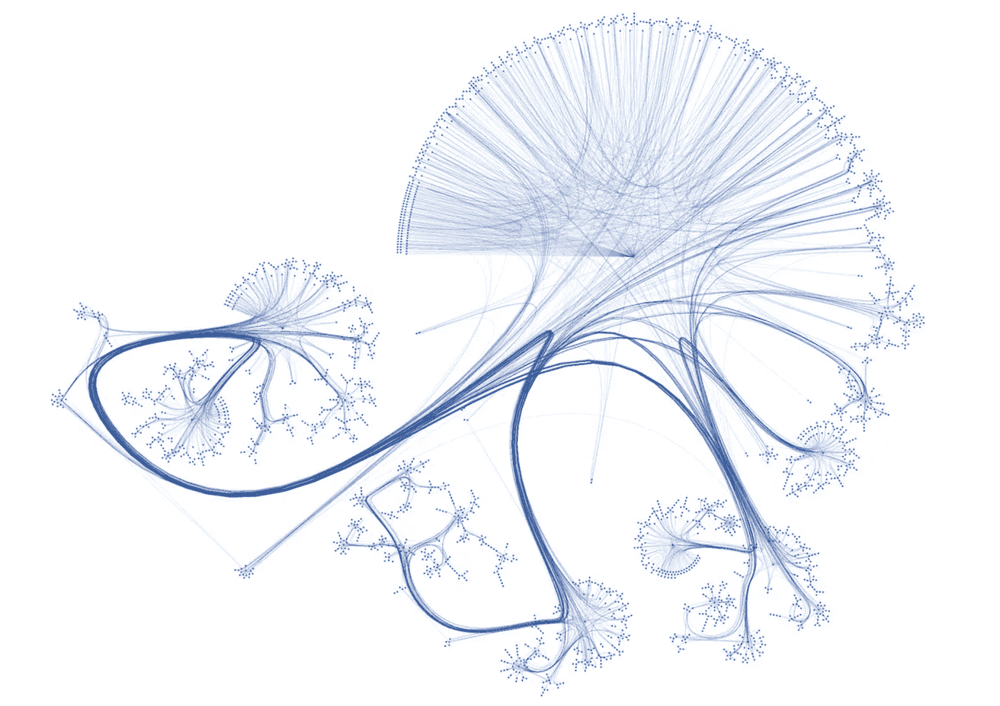
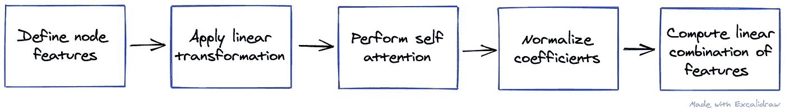
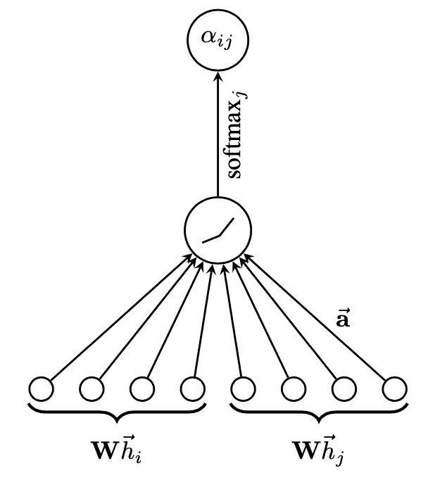
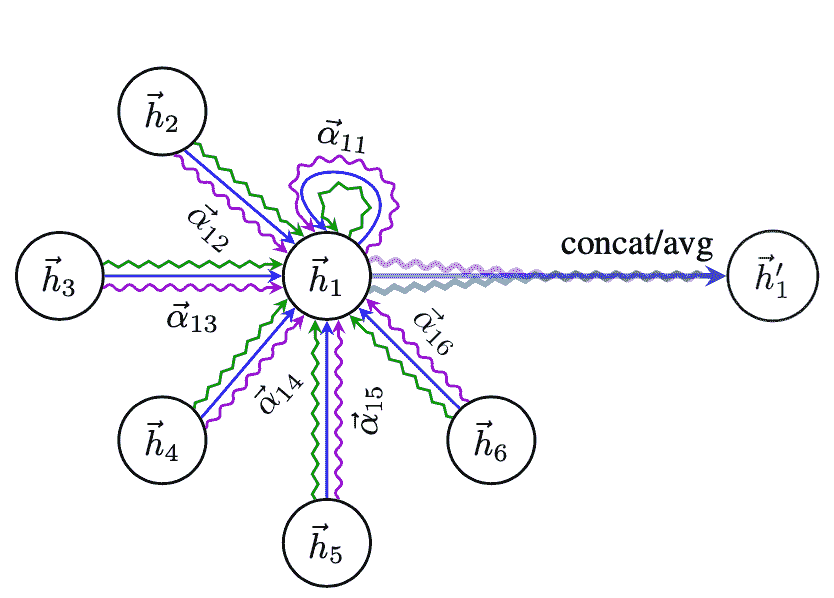
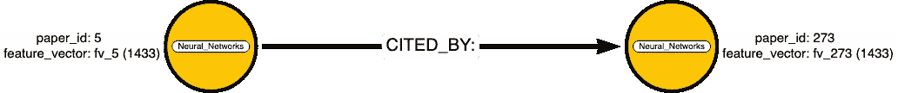
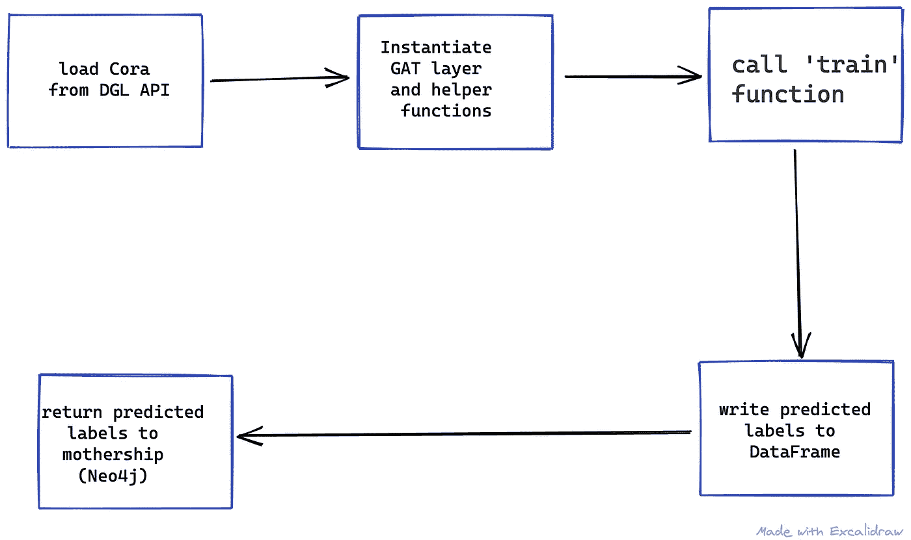
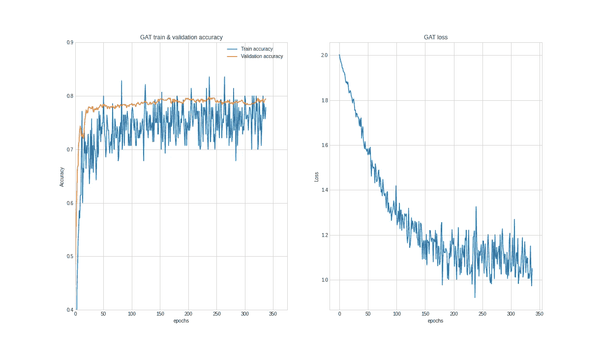

# Neo4j 和 DGL —无缝集成

> 原文：<https://towardsdatascience.com/neo4j-dgl-a-seamless-integration-624ad6edb6c0?source=collection_archive---------12----------------------->

## 在本文中，我们将说明如何使用深度图形库将**图形注意力网络**模型集成到 Neo4j 工作流中，并部署 Neo4j Python 驱动程序。

***本帖与*** [***克莱尔·沙利文***](https://medium.com/@cj2001) ***和*** [***马克·李约瑟***](https://medium.com/@markhneedham) 合著



Cora 数据集可视化—经 https://graphsandnetworks.com/the-cora-dataset/[许可复制](https://graphsandnetworks.com/the-cora-dataset/)

## 介绍

Neo4j GDS 库版本 1.5 的发布和内置的机器学习模型，现在为需要在 Neo4j 中的任何图形上执行机器学习任务的数据科学家提供了两种可能的解决方案。

如果时间是最重要的，并且需要一个受支持的、经过测试的本地工作的模型，那么对 GDS 库的一个简单的函数调用就可以完成这项工作。然而，如果需要更大的灵活性或者有一些数据限制，那么数据科学家可以部署外部机器学习库，结合 Neo4j Python 驱动程序。

在这一系列文章中，我们将说明如何使用不同的外部机器学习库来补充现有的 Neo4j 图形数据科学(GDS)功能。

对于这篇文章，我们使用深度图形库(DGL)包和 TensorFlow 作为后端，并使用 Cora 数据集构建了一个包含完整代码的 Colab 笔记本，可以在这里找到[。](https://colab.research.google.com/drive/15oBxD2zj64nDgaaIq5y2Upf2Dh1pAmjn?usp=sharing)

## **图形神经网络**

作为背景，我们简要描述图形神经网络(GNNs ),从最广泛的意义上来说，它可以被定义为一类适合于处理图形结构数据的神经网络模型。同样地，在最广泛的意义上，对图形的学习(即图形表示学习)可以分为两类学习问题；无监督和监督学习(包括半监督)。无监督学习旨在学习捕捉输入图结构的低维欧几里德表示，这些通常被称为嵌入算法，其一个例子是可以在 Neo4j GDS 库中找到的 [Node2Vec 算法](https://neo4j.com/docs/graph-data-science/current/algorithms/node2vec/)。第二类学习任务也学习嵌入，但目标是执行一些下游预测，例如节点或图形分类或链接预测。无监督学习的输入通常是整个图，而对于有监督的任务，输入是节点特征和可能的边特征，此外，图结构(全部或通常部分)也可以用于训练。监督 GNN 任务的一般框架是一个“消息传递”框架，旨在包含不同类型的 gnn。最近的调查将不同的 GNN 组织成大约 5 种 GNN 体系结构的分类，范围从递归 gNN、图卷积 nn 到图注意网络等。

现在，数据科学家可能希望利用这些不同的架构，因为她/他可能面临标记数据量有限的问题，因此只能部署半监督模型，或者可能希望从最重要的功能中获得更多见解等。因此，在这些情况下，数据科学家将希望构建自己的定制模型来进行节点分类或其他下游应用。

由于 Neo4j Python 驱动程序，任何 GNN 包都可以在 Neo4j 图上执行图形机器学习任务。事实上，在过去的几年中，已经开发了一整套的库和工具，根据最近的统计，关于图形神经网络的开源项目已经达到了将近 100 个！

[](https://awesomeopensource.com/projects/graph-neural-networks) [## 排名前 97 的图形神经网络开源项目

### 浏览最流行的 97 图形神经网络开源项目

awesomeopensource.com](https://awesomeopensource.com/projects/graph-neural-networks) 

## 深度图形库

[DGL 包](https://www.dgl.ai/)是最广泛的库之一，由创建图形的核心构建块、几个消息传递函数以及完整的图形神经网络模型组成，一切就绪。DGL 图书馆的另一个优势是它可以与最常用的后端平台协同工作，比如 TensorFlow、Pytorch 和 MXNet。最后，DGL 提供了一个数据 API，它提供了对一些基准数据集的访问，其中一个是 Cora 引文图表，它相当于图表领域的 MNIST…

## **图关注网**

数据科学家可能想要使用的一个这样的 GNN 是图形注意力网络。这是一个半监督学习模型，除了节点特征之外，只需要有限数量的已知标签来训练模型。它通过计算图中每个节点的隐藏表示来做到这一点，方法是“关注”该特定节点的邻居。也就是说，它应用一种[【基于注意力的架构】](https://en.wikipedia.org/wiki/Attention_(machine_learning))来执行节点分类。

**理论**

在我们开始实验之前，我们将首先解释我们正在部署的 GNN 模型。图注意力网络(缩写为' GAT '，例如不要与[生成对抗网络](https://en.wikipedia.org/wiki/Generative_adversarial_network))是由 [Velickovic 等人](https://arxiv.org/abs/1710.10903)在 2018 年引入的，作为对现有图卷积神经网络的改进。顾名思义，GATs 的核心思想是应用基于“注意机制”的架构。

注意机制彻底改变了神经机器翻译和一般的 NLP，并且已经成为许多基于序列的模型中事实上的规范。注意机制可以大致分为两个主要类别:“一般注意”和“自我注意”，前者量化输入和输出元素之间的独立性，后者管理和量化输入元素内部的独立性。在 GAT 模型中，注意机制的作用是"*按照自我注意策略，通过关注其邻居*来计算图中每个节点的隐藏表示。

我们将简要描述单个“图形注意力层”的关键步骤和组成部分，并向感兴趣的读者推荐该论文以获得更详细的数学解释。

 [## 图形注意网络

### 我们提出图注意网络(GATs)，新的神经网络结构，对图结构的数据操作…

arxiv.org](https://arxiv.org/abs/1710.10903) 

模型的叙述可以总结为 5 个步骤:



1.  第一步是定义向模型提供输入的节点要素集。正如我们将看到的，在我们的例子中，这些是通过将每个文档的文本嵌入长度为 1433 的 0/1“单词包”向量中而获得的特征向量。
2.  第二步，我们使用可学习参数的共享权重矩阵对每个特征向量应用线性变换。
3.  第三步涉及通过如下计算关注系数来执行自关注:我们连接源和目的节点的两个线性变换的节点特征(在步骤 1 中线性变换),并应用关注机制。这种机制无非是将 LeakyReLu 非线性激活函数应用于可学习权重向量(姑且称之为 ***a*** )与级联节点特征的点积。同样地，注意机制可以被视为由权重向量参数化的单个前馈神经网络，并且 LeakyRelu 作为激活函数。关注系数可以解释为一个节点的特征对其邻居的重要性。
4.  作为倒数第二步，通过应用 softmax 函数来归一化关注系数，这使得不同节点之间的系数具有可比性。这将允许分析哪些关注系数对隐藏节点以及输出具有最大影响。反过来，它允许测量注意力分布的“熵”。
5.  作为最后一步，在可能应用非线性σ之后，归一化的注意力系数用于计算对应于它们的特征的线性组合，并产生每个节点的隐藏表示。

单一的注意机制可以想象如下:



图片摘自图关注网[论文](https://arxiv.org/abs/1710.10903)

**单头还是多头？**

GAT 论文的作者发现，为了稳定自我注意的学习过程，将该机制扩展到“多头注意”表现得更好。简而言之，多头机制简单地并行多次贯穿点积注意力。回想一下上面的步骤 3，在注意力系数计算中，我们有一个权重向量*。好了，多头注意力现在产生了几个(下图中的 3 个)，然后将它们连接起来产生隐藏的表示。然而，在最后一层中，执行平均。*

*这可以如下所示(使用绿色、蓝色和紫色的 3 个头)*

**

*图片摘自图注意力网络[论文](https://arxiv.org/abs/1710.10903)*

## ***实验***

*我们现在将使用 Neo4j Python 驱动程序来实现图形注意力网络，以访问 DGL 库，执行机器学习任务，将结果写回到 Neo4j 中的原生图形，并执行 Cypher 查询。*

***数据集***

*我们将使用的数据集是前面提到的 Cora 引文数据集，它也是 GAT 论文中使用的数据集之一，由机器学习领域的学术论文组成。这些论文分为以下七类之一:*

1.  *基于案例*
2.  *遗传算法*
3.  *神经网络*
4.  *概率方法*
5.  *强化 _ 学习*
6.  *规则 _ 学习*
7.  *理论*

*论文的选择方式是每篇论文都引用或被至少一篇其他论文引用。整个语料库中有 2708 篇论文，5429 条边。*

*Cora 数据集是 DGL 数据 API 的一部分，为了使工作流程易于复制，我们还使用了这个版本的 Cora 数据集，我们将用 Neo4j 将它写成一个图表。与原始 Cora 数据集的唯一区别是节点标注，在 DGL 版本中是基于索引的。*

*然而，似乎有一些重复，因为 DGL 用 5278 条独特的边过滤掉了它们。事实上，当将 Cora 边加载到 Neo4j 中时，我们也得到 5278 个关系。因此，数据集有 5278 个关系，我们在 Neo4j 中将其称为“被引用”关系类型。我们使用 Python 驱动程序将 Cora 图写入 Neo4j，如下所示:*

*关于如何使用 Neo4j Python 驱动程序的极好参考可以在 Clair Sullivan 的[这篇文章](/create-a-graph-database-in-neo4j-using-python-4172d40f89c4)中找到。*

**

*Cora 图中的引用示例*

***特征向量***

*对每篇论文的文本进行分析，并提供如下特征向量:在词干化并去除停用词以及频率小于 10 的词之后，我们最终得到 1433 个唯一的词，这提供了字典。该字典现在允许创建二进制值的特征向量(即，如果单词出现在文档中，则向量条目为 1，0，否则为 1，0)，也称为“单词包”表示。因此，在我们的例子中，代表一个节点的每个文档都有这样一个长度为 1433 的特征向量。*

***任务***

*我们设置 GAT 来模拟直推式学习任务(半监督学习),该任务预测节点的标签，但是每类仅允许 20 个节点用于训练，即总共 2708 个节点中的 140 个。然而，训练算法给出了所有节点的特征向量的完整集合。经过训练的模型也只有 140 个训练标签，在 500 个节点上进行验证，并在一组 1000 个节点上进行测试。该任务可以应用于各种现实世界的应用，例如产品标签，其中特征向量是从产品描述中导出的，或者客户分类，其中特征向量可以由共同购买等组成。*

***超参数选择***

*本文附带的 Colab 笔记本可以在[这里](https://colab.research.google.com/drive/15oBxD2zj64nDgaaIq5y2Upf2Dh1pAmjn?usp=sharing)找到，它包含了每个代码块的详细注释。需要注意的关键点是，该模型选择了 8 个注意头，并且给定了小的训练集和过度拟合的风险，该模型使用 L2 正则化和丢弃(p = 0.6)来降低这种风险。最后，交叉熵被用作 ADAM SGD 优化器的损失函数*

***运行图形注意力模型***

*如前所述，Deep Graph Library 是最广泛、记录最完整的图形机器学习库之一，具有能够在 PyTorch、TensorFlow 或 MXNet 上运行的额外优势。*

*任何机器学习模型的核心都是层，这在 DGL 库中没有什么不同，因此，dgl.nn 包包含了最常用的 GNN 层的实现，当然也包括 GAT 层。最后，DGL 和张量流的组合被设计成完全使用 GPU 的。*

***工作流程***

*代码在 Colab 笔记本中进行了注释，工作流程相当简单。*

**

*使用 DGL 数据 API 将数据加载到笔记本/模型中，并使用掩码方法进行预处理。这是一个简单的布尔向量，暴露或隐藏相关训练、验证和测试集的标签。GAT 层是 TensorFlow-Keras 层的子类，在实例化类时需要确定参数。为了做到这一点，我们创建了一个单独的函数`create_model`，除此之外还有几个帮助函数，用于损失、准确性、评估、提前停止等。*

*最后，`train`函数调用相关的函数，它的参数决定超参数，如上面所列，我们使用了与本文相同的方法。*

*我们还确保将预测的标签写入熊猫数据帧，这样我们就可以将它们写回 Neo4j。*

*至于训练，我们选择了 500 个纪元，但包括一个我们将“耐心”设置为 100 的早期停止。*

*该模型的运行时间不到 10 秒，并在 379 个周期后达到早期停止触发，实现了令人印象深刻的 82.10%的准确性。*

**

*令人欣慰的是，这与论文中取得的结果一致:83.0%，方差为 0.7%。*

*因此，在我们的测试集中的 1000 个节点中，图形注意力网络模型成功地正确标记了 820 个，只需要大约 5%的标签来训练(2708 个中的 140 个)，当然还有每个节点的特征。*

***将预测标签写入 Neo4j***

*既然我们与 DGL 的合资企业已经产生了我们需要的结果，是时候返回母舰了。同样，我们调用 Neo4j Python 驱动程序将结果写回 Neo4j 中的 Cora 图。这只需要我们 7 行代码加上标准的 Cypher 查询，如下所示:*

*我们让模型在整个图上运行预测，所有 2708 个节点，从上面的 Cypher 查询可以看出，我们将预测的标签作为节点属性写入图中。*

*我们现在在 Neo4j 中有以下内容:*

```
*╒══════════════════════════════════════╕
│"n"                                   │
╞══════════════════════════════════════╡
│{"id":0,"label":"Genetic_Algorithms","│
│Predicted_Label":"Genetic_Algorithms"}│
├──────────────────────────────────────┤
│{"id":1,"label":"Rule_Learning","Predi│
│cted_Label":"Rule_Learning"}          │
├──────────────────────────────────────┤
│{"id":2,"label":"Rule_Learning","Predi│
│cted_Label":"Rule_Learning"}          │
├──────────────────────────────────────┤
│{"id":3,"label":"Case_Based","Predicte│
│d_Label":"Case_Based"}                │
├──────────────────────────────────────┤
│{"id":4,"label":"Genetic_Algorithms","│
│Predicted_Label":"Genetic_Algorithms"}│
└──────────────────────────────────────┘*
```

*我们现在可以运行一些密码查询，例如，我们可以检查有多少预测标签与实际标签不同:*

*它返回了 454 个——因此，我们在 2708 个标签中有 454 个是不正确的，即 16.7%，因此实际上有 83.3%被正确预测，在去除 140 个训练标签后，这与论文中的结果完全相同。*

*我们还可以在 Neo4j 中进行一些更详细的分析，方法是将上面的命令分配给一个精度属性，然后计算每类纸张的精度，如下所示:*

```
*╒══════════════════════════════════╤══════════════════╕
│"Label"                           │"Accuracy"        │
╞══════════════════════════════════╪══════════════════╡
│["Theory"]                        │0.9425837320574163│
├──────────────────────────────────┼──────────────────┤
│["Probabilistic_Methods"]         │0.8986175115207373│
├──────────────────────────────────┼──────────────────┤
│["Rule_Learning"]                 │0.8943661971830986│
├──────────────────────────────────┼──────────────────┤
│["Case_Based"]                    │0.8062678062678063│
├──────────────────────────────────┼──────────────────┤
│["Reinforcement_Learning"]        │0.738255033557047 │
├──────────────────────────────────┼──────────────────┤
│["Genetic_Algorithms"]            │0.7286063569682152│
├──────────────────────────────────┼──────────────────┤
│["Neural_Networks"]               │0.7111111111111111│
└──────────────────────────────────┴──────────────────┘*
```

# ***结论***

*在本文中，我们已经表明，通过使用 Neo4j Python 驱动程序，可以访问一系列额外的机器学习模型，并补充现有的 Neo4j GDS 功能。*

*在未来的文章中，我们将说明有多少 Neo4j GDS 算法可用于计算一系列特征向量，这些向量随后可用于训练 GNN，并再次将结果返回到本机 Neo4j 图。*