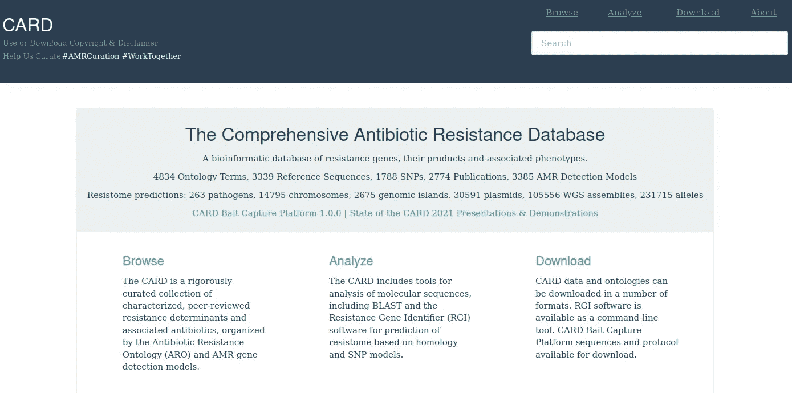
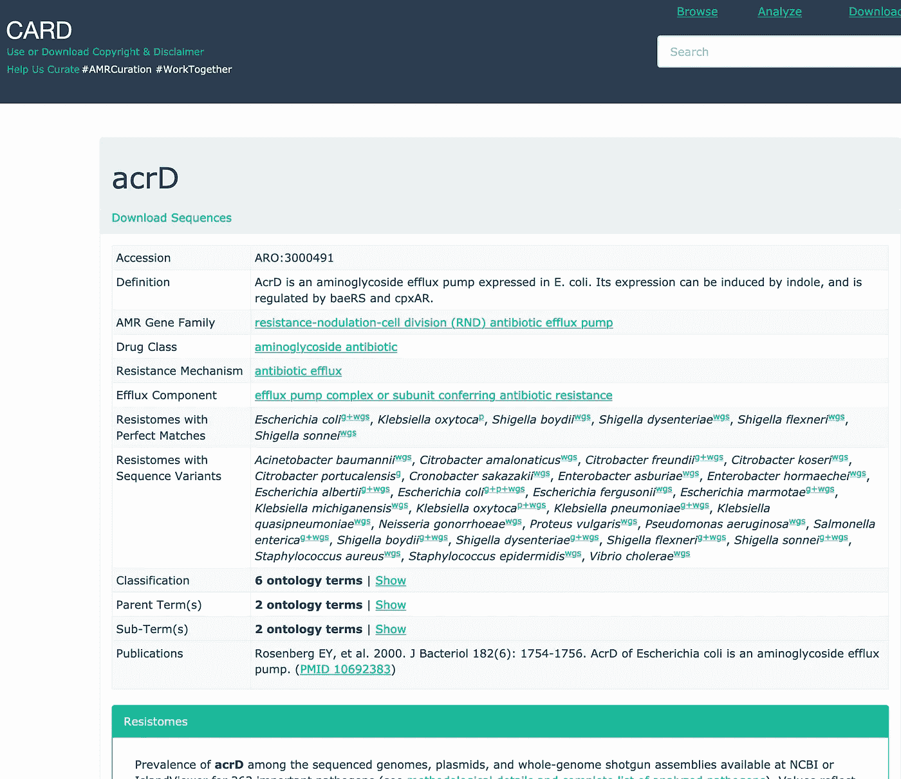
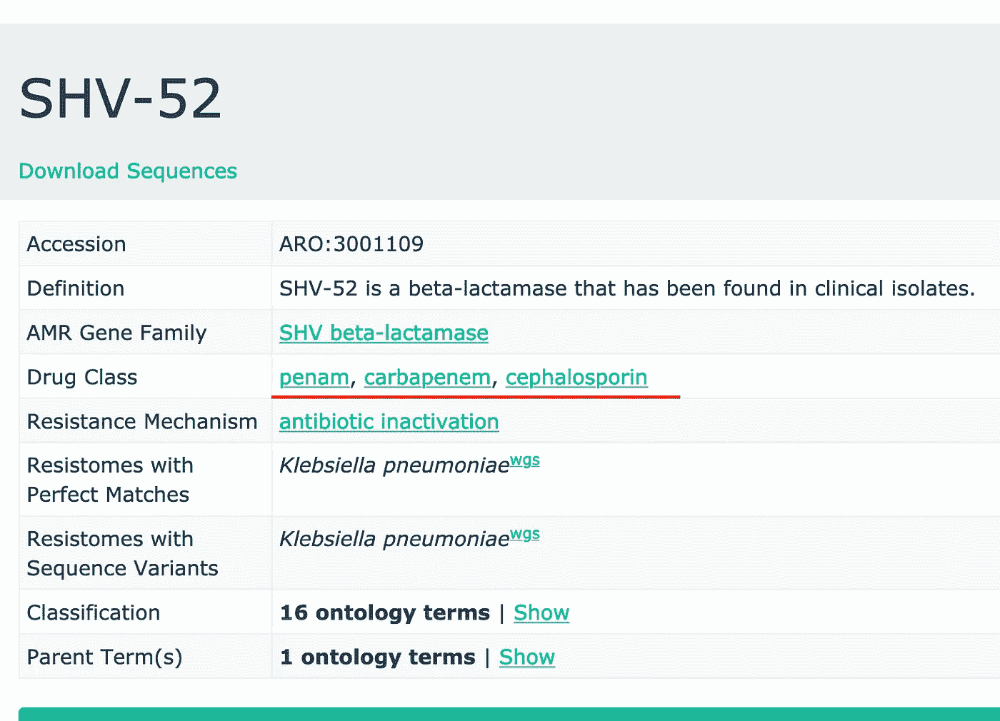
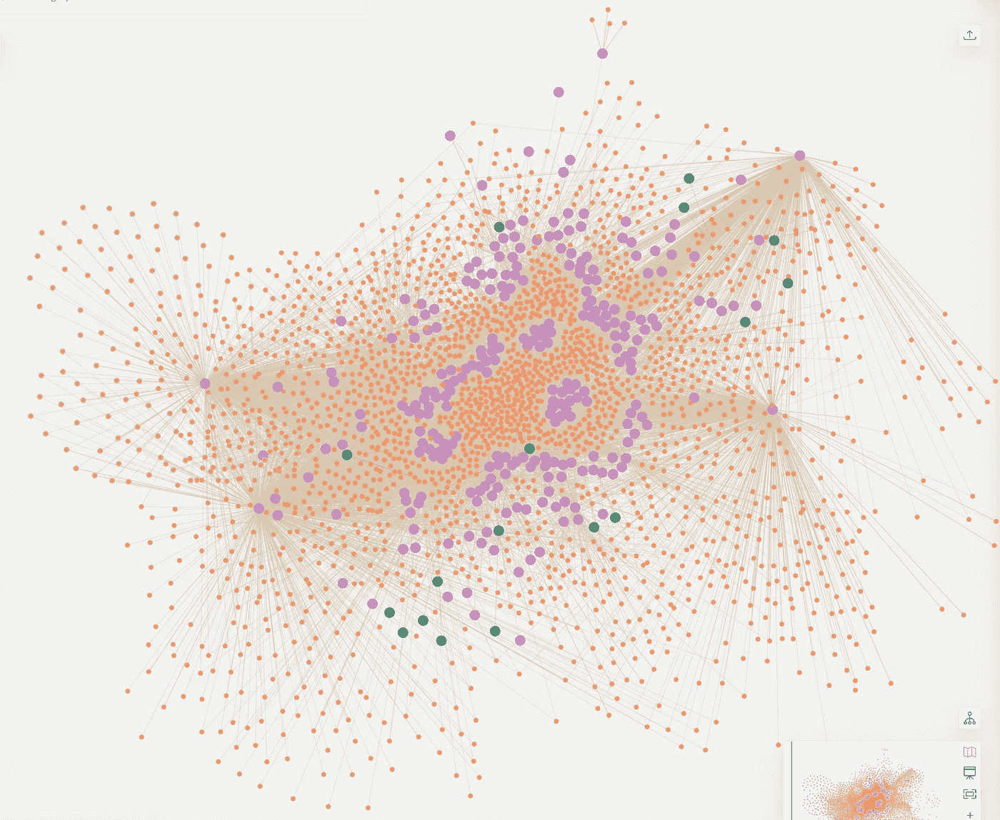
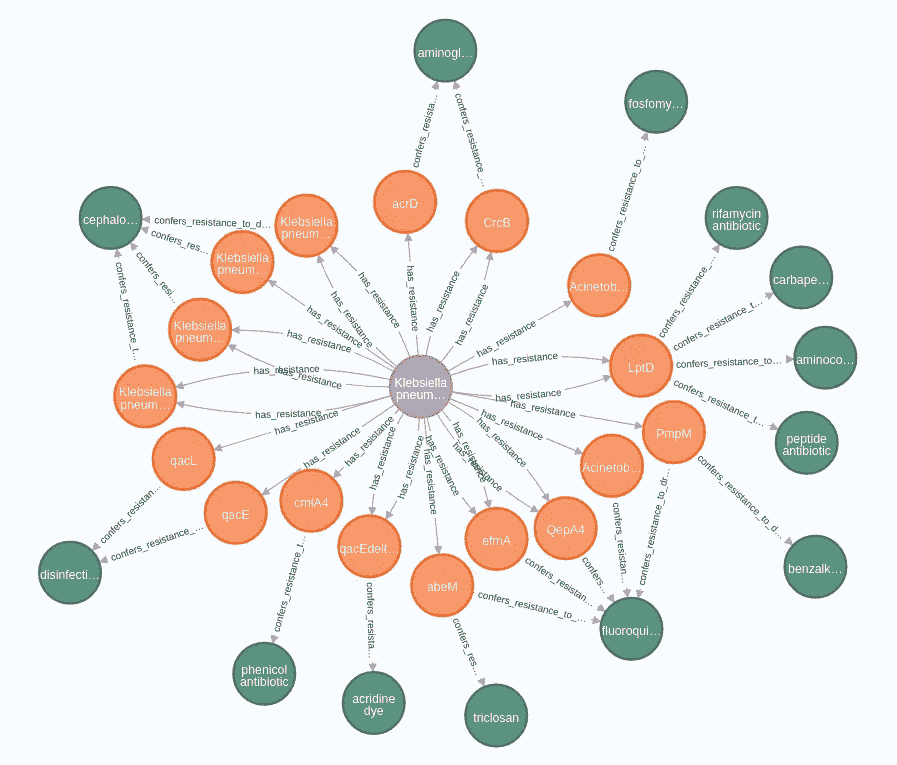
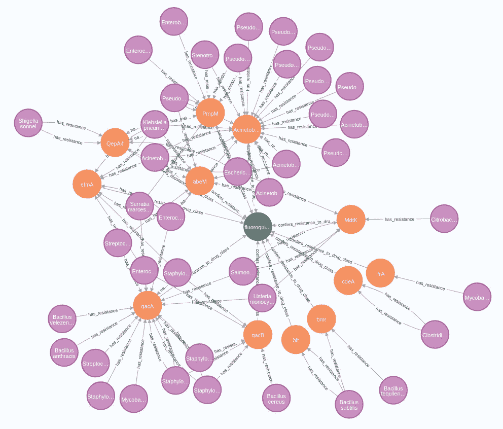
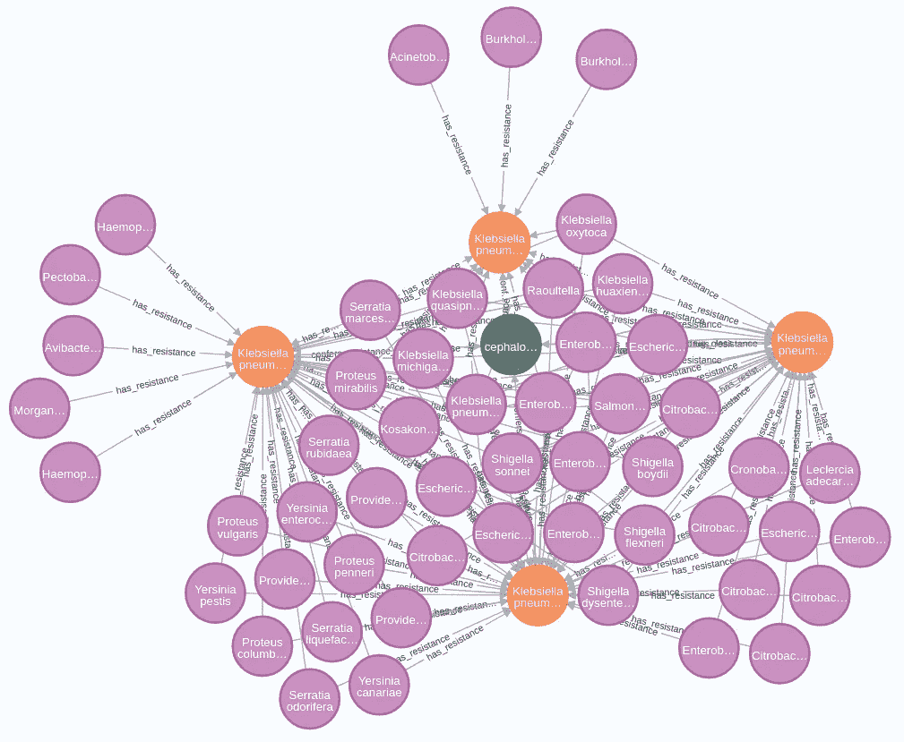

# 抗生素耐药性的 Neo4j

> 原文：<https://towardsdatascience.com/neo4j-for-antibiotic-resistance-f452f74137e8?source=collection_archive---------31----------------------->

## 卡片数据库的另一种视图

抗生素的引入是我们公共卫生史上的一个里程碑。它们是用于预防和治疗细菌感染如肺炎和肺结核的药物。抗生素拯救了数百万人的生命。

然而，它们的过度使用和误用导致了抗生素抗性细菌的出现。这些细菌可以在抗生素中存活，因为它们拥有耐药性——赋予抗生素耐药性的基因。其中一些基因编码的蛋白质可以减少药物的输入，增加输出或者使药物失去活性。其他的编码突变的药物靶点，逃避抗生素的攻击。抗生素抗性基因的垂直(母细胞和子细胞之间)和水平(不同细菌之间)转移导致抗生素抗性细菌在全球迅速传播。

作者 Charles Kenny 在他的《鼠疫循环:人类与传染病之间无休止的战争*一书中描述了我们目前令人担忧的抗生素耐药性现状。*

> 但是最好的估计是，仅在美国，耐甲氧西林金黄色葡萄球菌(MRSA)每年就杀死 18000 人。在欧洲和美国，抗生素耐药性造成的总人数每年约为 5 万人。在世界范围内，耐药细菌每年已经导致多达 70 万人死亡，是霍乱死亡率的 7 倍，麻疹死亡率的 6 倍。而耐药性是一个有爆发风险的问题。

后抗生素时代前景黯淡:

> 由英国政府发起、经济学家吉姆·奥尼尔主持的一项关于抗生素威胁的评估预测，如果我们不采取行动，到 2050 年，全球每年将有 1000 万人死于日益增加的抗生素耐药性。这比全世界每年死于癌症的人数还要多。相比之下，世界卫生组织估计，2030 年至 2050 年间，每年因气候变化而死亡的人数将增加 25 万。全球死于恐怖主义的人数大约是抗生素耐药性潜在死亡人数的千分之一。

所以我们需要快速行动，我们需要科学数据。综合抗生素耐药性数据库 (CARD)是一个重要的数据来源。

图一。[全面的抗生素耐药性数据库](https://card.mcmaster.ca/)。作者截图。

自 2013 年以来，CARD 数据库已经收集了超过 3300 个基因序列及其相关抗生素。工作人员仔细策划收集，并在抗生素耐药性本体论(ARO)和抗微生物耐药性(AMR)基因检测模型中组织数据。该数据库还为我们提供了用于数据分析的生物信息学工具。CARD 已经成为研究和工业的重要数据来源。CARD 的首席研究员 Andrew G. McArthur 表示，在欧洲，运行通过卡是益生菌产品批准的一项要求。

每种药物、抗生素耐药性和基因都有自己的页面。例如， *acrD 外排泵*的页面是这样的:

图二。卡片中的 acrD 页。作者截图。

该网页显示了该基因的详细信息，它的流行程度，它可以对抗的抗生素等等。然而，目前还没有关于“耐药体”的网页，准确地说是“病原体”的网页。所以像“这种细菌对哪种抗生素耐药”这样的常见问题，在 CARD 里是无法直接回答的。

在我以前的文章“[在图数据库中分析基因组](https://medium.com/geekculture/analyzing-genomes-in-a-graph-database-27a45faa0ae8)和“ [Neo4j 用于疾病](/neo4j-for-diseases-959dffb5b479)”中，我已经展示了我们可以将关系数据库中的生物数据转换成图，并发现新的见解。尽管有很多图形数据库，Neo4j 无疑是这个领域的领导者。它易于使用和扩展。它的密码语言很简单。最后但同样重要的是，图形数据科学库提供了许多强大的图形操作和机器学习能力。在本文中，我将向您展示如何将 CARD 转换为 Neo4j，并从数据中快速获取一些事实。这个项目的代码存放在我的 Github 仓库中:

<https://github.com/dgg32/card>  

# 1.导入数据

从卡下载页面，下载并解压缩`Ontology files`和`CARD Prevalence, Resistome, & Variants data`。事实上，我们只需要从两者中选择`aro.obo`和`card_prevalence.txt`。运行我的`analysis.ipynb`中的所有细胞。它将这两个文件转换成五个 CSV 文件，以便导入。你可以在我的知识库中找到所有这些文件。

启动 Neo4j Desktop，创建一个名为`card`的项目，并将所有这些 CSV 文件放入其`Import`文件夹中(阅读段落" [2)。将数据导入 Neo4j](https://medium.com/geekculture/analyzing-genomes-in-a-graph-database-27a45faa0ae8) "如果需要帮助)。在 Neo4j 浏览器中运行以下命令，以导入和索引 Neo4j 中的数据:

这些命令将创建三种类型(标签)的节点(`drug`、`pathogen`和`resistance`)。它们由两种类型的关系(`confers_resistance_to_drug_class`和`has_resistance`)连接。

# 2.概观

导入后，我们可以快速查看数据。运行以下三个查询来获得三种节点类型的总数:

有 43 种药物，263 种病原菌和 2640 种耐药机制。值得注意的是，下载数据和网络数据之间存在差异。例如，根据`aro.obo`，SHV-52 (ARO:3001109)不具有授与 _ 抗性 _ 药物 _ 类别关系。但是它的网页表明它可以帮助宿主抵抗青霉烯、碳青霉烯和头孢菌素(图 3)。为了避免混淆，本文仅基于下载的卡数据。这个项目的第二个警告是，分类学的分辨率下降到物种水平，而不是菌株水平，这本来可以更精确。

图 3。SHV-52 的数据在网页和下载之间不一致。作者截图。

我们还可以使用 Neo4j Bloom 快速创建卡片数据的拓扑概览(在此阅读[我的文章](https://medium.com/geekculture/analyzing-genomes-in-a-graph-database-27a45faa0ae8)获取说明)。

图 4。卡片数据的拓扑概述。绿色的点代表药物节点，紫色的是病原体，橙色的是耐药节点。图片作者。

在图 4 中。，我们可以看到数据主要聚集在紫色病原体节点周围。在 Neo4j Bloom 中，我们可以识别出一些大型“枢纽”。分别是*大肠杆菌*、*肺炎克雷伯菌*、*铜绿假单胞菌*和*鲍曼不动杆菌*。这些也是科学报告中研究最多的抗生素抗性细菌。

# 3.调查超级细菌

超级细菌是多重耐药细菌，也就是说，它们对一种以上的抗生素具有耐药性。它们可以有多个基因，每个基因都可以抵抗一种抗生素。或者一个基因可以对抗多种抗生素(阅读[这篇文章](https://www.reactgroup.org/toolbox/understand/antibiotic-resistance/multidrug-resistant-bacteria/)了解更多细节)。耐碳青霉烯类肠杆菌科(CRE)已对“所有或几乎所有”抗生素产生耐药性，包括“最后的治疗手段”碳青霉烯类。2015 年，在中国的患者和牲畜中发现了对另一种最后手段药物[粘菌素具有耐药性的细菌。根据疾病预防控制中心的数据，在美国，它们每年感染 200 万人，杀死 23000 人。因此，迫切需要更多地了解这些生物。](https://www.thelancet.com/journals/laninf/article/PIIS1473-3099(15)00424-7/fulltext)

我们可以先查一下耐药连接最多的前 10 个超级细菌。请注意，`OPTIONAL MATCH`子句是必要的，因为在 CARD 中，许多阻抗节点不与任何药物相连。

它返回:

*肺炎克雷伯氏菌*通常发现于胃肠道的[粘膜表面。但是一旦它进入人体，它会变得非常致命并对抗生素产生抗药性。顾名思义，*肺炎克雷伯氏菌*可导致肺炎，是美国](https://www.ncbi.nlm.nih.gov/books/NBK519004/)[医院获得性肺炎最常见的原因](https://www.ncbi.nlm.nih.gov/books/NBK519004/)。但是这种细菌也会带来其他疾病，如血流感染、伤口和手术部位感染以及脑膜炎。我们的分析表明 *K* 。*肺炎*连接一千多个阻力节点。这些耐药机制提供了对 13 种抗生素的耐药性，也是我们数据集中最多的。

通过以下查询，我们可以获得更多详细信息:

它会返回一个图表:

图 5。*肺炎克雷伯菌抗生素耐药性详情。图片作者。*

图表显示*肺炎克雷伯菌*对头孢菌素类抗生素 KpnEFGH 具有耐药性。它们都是从细胞中泵出抗生素的主要促进超家族(MFS)抗生素外排泵的组成部分。据[艾舍斯特*等人*。](https://www.ncbi.nlm.nih.gov/books/NBK519004/)、*肺炎克雷伯菌*也能以其超广谱β-内酰胺酶(ESBL)降解头孢菌素。因此，另一种抗生素——碳青霉烯成为了一种治疗选择。但是我们的结果表明，这种选择也可能是无效的，因为 LptD 机制本身可以赋予对碳青霉烯和其他三种药物的耐药性。事实上，在 2013 年向 CDC 报告的 9000 例耐碳青霉烯类*肠杆菌科*感染中，约 80%是由*肺炎克雷伯菌*引起的。此外，qacE、Edelta1 和 L 基因可以保护细菌免受消毒剂和嵌入染料的影响。

# 4.耐药性最强的抗生素

使用 Neo4j，我们还可以研究哪些抗生素最有可能成为抗生素耐药性的目标:

结果是:

氟喹诺酮干扰细菌中的 DNA 复制，并导致革兰氏阴性和革兰氏阳性细菌中的细胞死亡。但是 CARD 数据表明，这两种类型的细菌已经发展出许多抵抗其影响的策略(图 6。):

图 6。细菌对氟喹诺酮类药物的耐药性。图片作者。

一方面，革兰氏阳性菌如*杆菌*和*葡萄球菌*利用 blt、qacAB 等 MFS 抗生素外排泵系统泵出氟喹诺酮类药物。另一方面，*肠球菌*编码 PmpM，这是一种药物逆向转运蛋白，属于多药和毒性化合物挤压(MATE)家族。然而，在革兰氏阴性细菌中也发现了 PmpM，如*嗜麦芽窄食单胞菌*和*粘质沙雷氏菌*。*假单胞菌*，另一组革兰氏阴性菌，含有与 *abaQ* 相似的基因序列，该基因编码[一种 MFS 转运蛋白，负责 *A* 中喹诺酮类药物的挤出。*鲍曼*](https://card.mcmaster.ca/ontology/42490) 。

头孢菌素，列表中的第二项，显示了一个非常不同的拓扑结构。

图 7。细菌对头孢菌素的耐药性。图片作者。

与对氟喹诺酮类抗生素的多种耐药机制相反，对头孢菌素只有四种耐药机制。总共有 52 种病原体使用它们。有些病原菌，如*产酸克雷伯氏菌*和*植物拉氏菌*，具有全部四种耐药机制。

# 结论

本文展示了 Neo4j 如何快速洞察 CARD。在我看来，CARD 包含了如此多的关系，以至于图形数据库比关系数据库更适合它。在其关系形式中,“这种细菌对哪种抗生素具有抗性”这一问题的答案不是立即显而易见的，因为 CARD 通过抗性机制连接细菌和抗生素。这对于 Neo4j 来说不是问题。我们可以用 Cypher 简单地表达这个问题，然后马上得到答案。

但是下载的卡数据并不总是与在线数据一致。也许我漏掉了一些环节。此外，有些联系是相当投机的。例如，根据描述，cdeA 在 *E* 中赋予对氟喹诺酮类药物的耐药性。*大肠杆菌*和*梭状芽孢杆菌*和*艰难梭菌*。但是我们的数据连接 *C* 。*难与氟喹诺酮类*通过 cdeA 机制过。

在这个项目中，我只分析了基于`card-prevalenc.txt`的细菌种类。但是，如果我们利用 CARD 提供的 NCBI 登录号，就有可能得到菌株的分辨率。那么结果将会更加具体和精确。当然，如果 CARD 一开始就在菌株水平上汇编病原体，事情会简单得多。

这项研究也揭示了抗生素耐药性的情况。上图显示，耐药机制的数量超过了病原体的数量，比例为 10:1。这意味着病原体平均有十种机制来对抗抗生素的作用。同样清楚的是，有比抗生素更多的耐药机制。随着新抗生素研发的放缓，我们正在耗尽抗生素。

请尝试这个项目，告诉我你的经验。

<https://dgg32.medium.com/membership> 