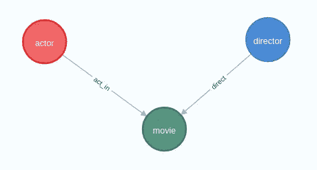
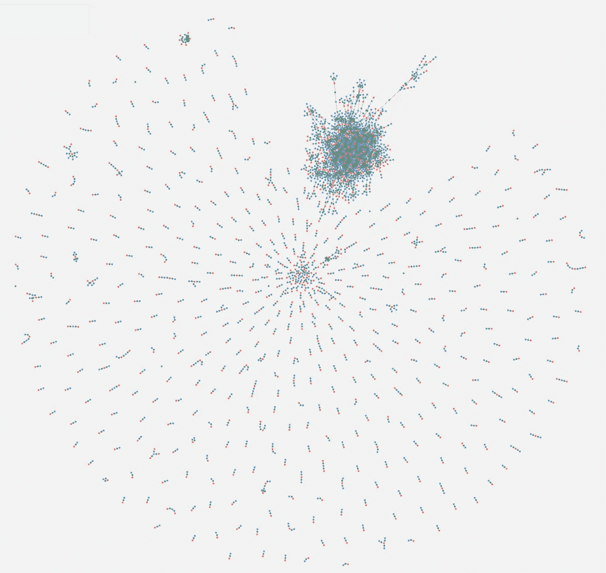
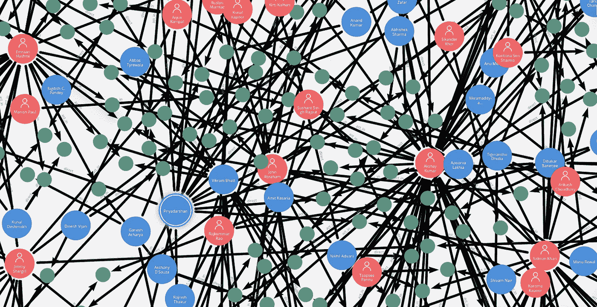
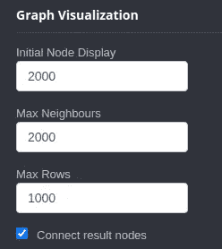
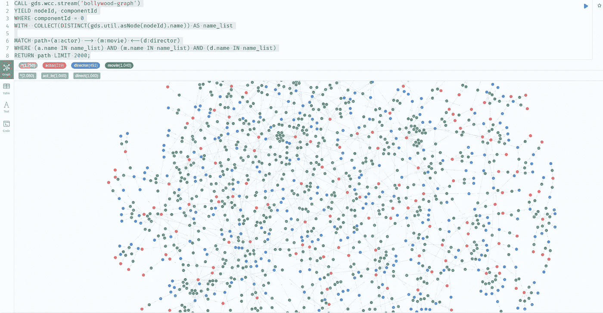

# 宝莱坞的 Neo4j

> 原文：<https://towardsdatascience.com/neo4j-for-bollywood-5ceb371031f1?source=collection_archive---------17----------------------->

## 学习图形数据库的有趣项目

厌倦了 SQL 中的那些“JOIN”？每次需要修改关系数据库中的模式时，您是否都感到头疼？如果任何一个答案是“是”，那么你应该给图形数据库，如 Neo4j 一个尝试。

图形数据库将信息存储为节点和边。节点通过边连接，它们都有属性。我们可以通过查询检索和聚集数据。因为它们的逻辑和语义更接近于我们大脑对现实世界的建模方式，所以图形数据库很容易学习。关系数据库的用户可能会很快发现 SQL 和 Neo4j 的查询语言 Cypher 的相似之处。此外，Neo4j 附带聚合函数和机器学习模块，可以快速洞察数据。

在我以前的文章中(抗生素耐药性的 Neo4j、疾病的和基因组分析的)，我已经展示了图形数据库 Neo4j 可以提供许多在关系数据库中不那么明显的有趣见解。但是它们都是关于生物信息学的，不是最简单的学科。这些文章更多的是关于 Cypher 相对于 SQL 的优势。读者要求我对 Neo4j 进行更全面的介绍，以加快学习速度。因此，我四处寻找 Neo4j 初学者项目的数据，特别是为有 SQL 背景的读者。最近，我偶然发现了 P. Premkumar 的宝莱坞电影 (CC BY 4.0)的[数据集，并认为它非常适合。](https://data.mendeley.com/datasets/3c57btcxy9/1)

组合词**宝莱坞**由 **Bo** mbay 和 Ho **llywood** 创造。顾名思义，这是总部设在孟买的印地语/乌尔都语电影业。这些电影涵盖了广泛的主题，其中一些甚至触及了敏感的政治和宗教话题。许多电影都包含了欢快的舞蹈场景，让气氛变得轻松起来。宝莱坞电影在全世界都很受欢迎。例如，电影《Dangal》在中国获得了巨大成功，其 3.3 亿美元的全球票房中有三分之二来自中国。好莱坞已经被大量报道，但宝莱坞很少得到应有的关注。因此，更多地了解这个电影行业将是一件好事。Premkumar 的表格数据很小，但包含了 2005 年至 2017 年间的 1698 部宝莱坞电影。所以我认为它是这个介绍性项目的一个极好的数据源。这个项目的代码存放在我的 Github 仓库中:

[](https://github.com/dgg32/bollywood) [## GitHub-dgg 32/宝莱坞

### 通过在 GitHub 上创建帐户，为 dgg 32/宝莱坞的发展做出贡献。

github.com](https://github.com/dgg32/bollywood) 

数据集来自[https://boxofficeindia.com](https://www.google.com/url?sa=t&rct=j&q=&esrc=s&source=web&cd=&ved=2ahUKEwie1Jq5y4fzAhXEg-AKHZYKC7MQFnoECAMQAQ&url=https%3A%2F%2Fboxofficeindia.com%2F&usg=AOvVaw33S6bzbkk-A0LfEboTANRv)。与 IMDB.com 相比，boxofficeindia.com 的数据非常不完整。此外，请注意，该表仅列出了主要演员。所以它低估了演员和电影之间的联系。另外，这个项目只包括演员、导演，以及他们的电影。原始数据中还有一个小问题:预算和收入列放错了位置。

# 1.准备和导入数据

首先从链接[这里](https://data.mendeley.com/datasets/3c57btcxy9/1)下载数据。交换列名`Budget(INR)`和`Revenue(INR)`。接下来，运行我的 Python 笔记本`prepare.ipynb`中的所有单元格。他们应该在`data_for_neo4j`文件夹中生成三个 CSV 文件。你也可以在我的 Github 库中找到所有的数据文件。

打开`Neo4j Desktop`。创建一个名为`bollywood`的项目，并将三个 CSV 文件放入其`import`文件夹中。

之后，打开`Neo4j Browser`并输入以下命令。他们将把数据导入数据库(参见 [2。将数据导入 Neo4j](https://medium.com/geekculture/analyzing-genomes-in-a-graph-database-27a45faa0ae8) 一节以获得详细说明)。

我们可以检查三种类型的节点(演员、导演和电影)是如何连接的:

```
call db.schema.visualization()
```



图一。宝莱坞项目的模式。图片作者。

# 2.概观

让我们首先了解一下数据集的概况。打开`Neo4j Desktop`中的`Neo4j Bloom`。在`Settings`中，将`Node query limit`增加到 3600。在`Perspective` - > `Search phrases`中，添加一个名为`match all`的搜索短语，查询如下:

返回主窗口，在`Search graph`中选择`match all`并运行。Bloom 应该生成数据集的拓扑概览(图 2)。



图二。宝莱坞数据集的拓扑概述。绿色:电影；红色:演员；蓝色:导演。图片作者。

概述立即给我们一个宝莱坞电影世界的总体印象。很多演员-电影-导演三重奏都是“孤岛”。但是可以看到一个大的星团。我们可以通过放大或使用过滤器来了解更多信息:



图 3。数据集中大型聚类的详细部分。绿色:电影；红色:演员；蓝色:导演。图片作者。

很明显，这一大群人是由多产的宝莱坞演员聚集在一起的，如三汗、[阿克谢·库玛尔](https://en.wikipedia.org/wiki/Akshay_Kumar)、[埃朗·哈斯米](https://en.wikipedia.org/wiki/Emraan_Hashmi)和导演如[维克拉姆·帕特](https://en.wikipedia.org/wiki/Vikram_Bhatt)和[莫希特·苏里](https://en.wikipedia.org/wiki/Mohit_Suri)。

我们还可以看看数据集中的流派分布:

Neo4j 的文档解释说,[与 Bash 中的管道操作符](https://neo4j.com/docs/cypher-manual/current/clauses/with/)类似。在上面的查询中，我用 with 语句计算了电影的总数，然后将其用于百分比计算。结果表明，戏剧、喜剧和惊悚片是宝莱坞的三大电影类型。

# 3.获取一些统计数据

概述完后，我们可以用 Neo4j 快速计算统计。首先，让我们来计算一下阿米尔·汗电影的总收入:

这个 Cypher 首先匹配所有以阿米尔·汗为主角的电影，然后将它们的收入加起来。它很快给了我们总计 29，030，895，000 印度卢比(393，932，987 美元)。作为宝莱坞最成功、最有影响力的演员之一，阿米尔·汗曾在今年票房最高的几部印度电影中扮演主角，如 *Ghajini* 、 *3 个白痴*、 *Rangeela* 、 *Dhoom 3* 、 *PK* 和 *Dangal* 。他也被称为“中国票房之王”，因为他的电影在中国也获得了巨大的成功。

接下来，我们可以看到收入最高的人:

与前面的查询相比，这个查询删除了对 actor 节点的约束。它计算了收入预算比率，以显示电影的相对盈利能力。最后，该查询根据收入按降序对结果进行排序。

查询显示，帕拉巴斯的 Baahubali 2 位居榜首。但是这部电影的制作成本也很高。相比之下，*丹加尔*的收入预算比为 5。可汗又一次占据了榜单。请注意，这些结果与来自[维基百科](https://en.wikipedia.org/wiki/List_of_highest-grossing_Indian_films#Global_gross_figures)的数据并不一致。

我们可以看到最卖座电影的名单。

这个快速查询返回了数据集中前 10 个失败。位居榜首的是[*孟买天鹅绒*](https://en.wikipedia.org/wiki/Bombay_Velvet) ，因剧本和导演受到批评。第一天的入住率只有 10-20%。第三天所有的影院都撤下了这部电影。它在投资者的口袋里烧了一个 748，635，000 印度卢比的洞。第二名被 [*破马*](https://en.wikipedia.org/wiki/Broken_Horses) 占据。这部电影得到的评价大多是负面的，它也是一个商业上的失败。但对我来说，仅由一名印度导演主演并不能证明这部电影是真正的宝莱坞电影。

之后，我们还可以看到哪些演员最擅长惊悚片或恐怖片。

埃朗·哈斯米和阿杰·德弗恩似乎是最活跃的惊悚片演员。哈什米先生成功地确立了自己作为惊悚电影明星的地位。我们可以在数据集中看到他所有电影的列表:

原来，哈什米先生也是恐怖电影系列 *Raaz* 最后三部的主角。根据数据集，宝莱坞并没有太多的恐怖电影(1695 部中的 52 部，或 3%，见“2。概述”)。仅这三部恐怖电影就已经让 Hashimi 先生成为了我们数据库中拥有最多恐怖电影的演员。

最后，让我们看看一些演员和导演合作的频率。

超级巨星 Ajay Devgn 和导演罗希特·谢迪之间的兄弟关系是众所周知的。1991 年的电影 [*是他们合作的第一部电影。到目前为止，他们已经合作了 11 部电影。*](https://en.wikipedia.org/wiki/Phool_Aur_Kaante)

# 4.社区检测

在第二部分，Neo4j Bloom 的拓扑概述向我们展示了一个围绕宝莱坞一些最大的名字的大集群。现在的问题是，是否有可能通过查询获得该社区？在 Neo4j 的图形数据科学库(GDS)的帮助下，答案是响亮的“是”。

在我之前的文章“ [Neo4j for Diseases](/neo4j-for-diseases-959dffb5b479) ”中，我展示了如何使用 Louvain 算法计算社区。但是在这个项目中，我没能用 Louvain 得到最优的结果。然后我找到了托马兹·布拉坦尼克的中间文章“Neo4j 图形数据科学库中的[子图过滤”。在里面，他提到了另一个算法“](/subgraph-filtering-in-neo4j-graph-data-science-library-f0676d8d6134)[弱连通分量](https://neo4j.com/docs/graph-data-science/current/algorithms/wcc/) (WCC)”。该算法在无向图中寻找连接节点的集合，其中同一集合中的所有节点形成一个连接组件。我的测试表明，它可以快速识别不连接的组，并有效地隔离第 2 节中的大集群。

要使用 WCC，您需要在您的项目中启用 GDS 插件(阅读第 5 节中关于疾病的说明[Neo4j](/neo4j-for-diseases-959dffb5b479))。首先，我们需要用以下命令创建一个内存中的图形:

之后，我们运行 WCC。它返回前 10 个最大的社区(在 WCC 中称为“组件”):

我们可以看到组件 0 有多达 1750 个节点。但是，我发现有些节点被重复计算了。让我们看看具有不同功能的节点是什么:

该查询返回 1，734 个节点，而不是最初的 1，750 个。我们甚至可以在 Neo4j 浏览器中显示网络。但是首先，在 Neo4j 浏览器中调整可视化参数(图 4)。



图 4。显示大型集群的设置。图片作者。

然后运行命令:

COLLECT 函数将名字转换成一个列表。然后我们做一个普通的匹配查询，用这个列表过滤结果。



图 5。宝莱坞数据中的组件 0。图片作者。

经过仔细的检查，我们可以确认这就是我们在第 2 节的 Neo4j Bloom 中观察到的大星团。

# 结论

电影 [*降临*](https://en.wikipedia.org/wiki/Arrival_(film)) 有一个信息:一种新的语言可以改变你的思维方式。从 SQL 到 Cypher 的过渡也是如此。与 SQL 不同，我们需要在 Cypher 中明确定义关系。Cypher 是直观的，因为我们可以在不使用外键的情况下通过关系制定查询。换句话说，Cypher 让我们在网络中而不是在桌子上做事。Neo4j Desktop 和 Bloom 中的图形可视化让我们可以轻松地以交互方式探索各种关系。

这个项目表明，Neo4j 不仅擅长关系丰富的数据，而且还可以像 SQL 一样轻松地聚合表格数据。本教程主要展示了 Neo4j 中的统计函数。读者可以很容易地将 SQL 查询与上面的 my Cypher 查询进行比较，并感受到两种语言在语法和表达能力上的差异。根据维基百科，Cypher 的语法是基于 ASCII-art 的。所以查询看起来非常直观，易于理解。结合其聚合和图形数据科学功能，Neo4j 可以做关系数据库能做的任何事情，甚至更多。

宝莱坞的数据也给了这个项目许多有趣的因素。我们了解到宝莱坞的一些大牌明星有着令人印象深刻的统计数据。这些知识可能会帮助我们在未来更好地欣赏宝莱坞电影。

这里有一个挑衅性的想法:我们是否只能使用 Neo4j 这样的图形数据库来满足我们所有的需求？

[](https://dgg32.medium.com/membership) [## 加入媒介与我的介绍链接-黄思兴

### 作为一个媒体会员，你的会员费的一部分会给你阅读的作家，你可以完全接触到每一个故事…

dgg32.medium.com](https://dgg32.medium.com/membership)