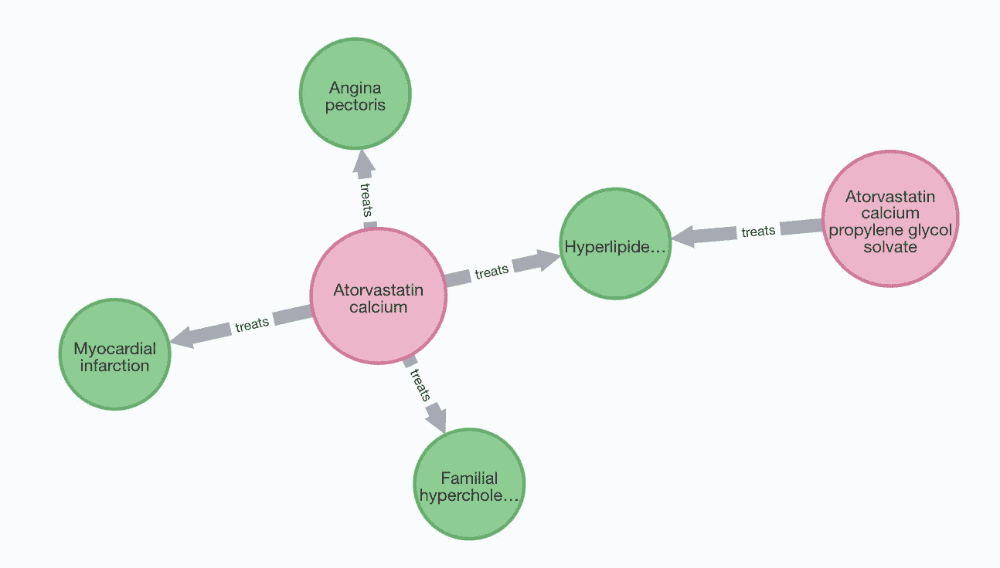

# 用于疾病的 Neo4j

> 原文：<https://towardsdatascience.com/neo4j-for-diseases-959dffb5b479?source=collection_archive---------22----------------------->

## 用图形数据库分析 KEGG 疾病数据

> 本文展示了如何:
> 
> 1.使用 Neo4j 快速浏览 KEGG 疾病数据库。
> 
> 2.识别多用途药物。
> 
> 3.显示一些病原体的细节，如新型冠状病毒。
> 
> 4.用 Louvain 形成疾病社区，用 PageRank 发现关联度最高的疾病。SARS 和新冠肺炎是与其他大型疾病群隔离的“孤岛”。

*免责声明:本文不提供医疗建议。它仅供参考。它不能替代专业的医疗建议、诊断或治疗。*

新冠肺炎遥遥领先于世界。这种传染病给我们的生活带来了沉重的代价。它扰乱了许多家庭，造成巨大的经济损失，也许永远改变了我们的行为。因此，它提高了我们对公共卫生问题的认识。显而易见，我们人类需要在医学研究上投入更多，以避免下一场灾难。


图一。来自 KEGG 疾病数据库的条目“新冠肺炎”在 Neo4j 中可视化。*作者图片。*

自从我的上一个故事“[在图数据库中分析基因组](https://medium.com/geekculture/analyzing-genomes-in-a-graph-database-27a45faa0ae8)”以来，我注意到在[京都基因和基因组百科全书(KEGG)](https://www.genome.jp/kegg/) 数据库中仍然有许多宝藏。其中之一无疑是 KEGG 疾病数据库。该数据库包含许多已知人类疾病的详细信息。此外，连同其他数据库，如基因组，药物和基因，KEGG 为我们提供了一个非常广泛的网络知识的障碍，其原因和药物。正如我在文章中提到的，像 [Neo4j](https://neo4j.com/) 这样的图形数据库有助于生物医学研究中的知识发现。来自 KEGG 的这些信息对于这样一个数据项目来说是完美的。因此，我通过 [API](https://www.kegg.jp/kegg/rest/keggapi.html) 下载并处理了 KEGG 疾病数据库中的数据，将其导入 Neo4j，进行了几次分析，并发现了一些有趣的信息。

在这篇文章中，我将集中讨论疾病、病原体和药物之间的关系。这个项目的代码存放在我的 Github 库中:

<https://github.com/dgg32/kegg_disease>  

# 1.将数据导入 Neo4j

所有 CSV 文件都位于数据文件夹中。如果你想更新信息，你可以按照我的回购 README.md 中的说明。

从他们的[官网](https://neo4j.com/download/)下载 Neo4j 桌面。安装完成后，添加一个新的“本地 DMBS”并命名为“kegg_disease”。点击“…”->“打开文件夹”- >“导入”，打开其导入文件夹。将所有 CSV 文件放入文件夹中。然后，运行以下命令，它们将导入所有信息:

# 2.获取概述

一旦数据被导入，我们就可以对 KEGG 疾病数据库进行一些基本的统计。这三个命令获取所有三种类型节点的总数:

因此，数据库中记录了 333 种病原体、1，339 种药物和 2，498 种疾病。这是一个相当大的数据集。我们也可以用 Neo4j Bloom 看看数据的拓扑结构。在搜索短语中输入下面的密码查询并执行它([我以前的文章展示了详细的步骤](https://medium.com/geekculture/analyzing-genomes-in-a-graph-database-27a45faa0ae8)):

```
MATCH p=(n:disease) <-[]-() RETURN p;
```


图二。此项目中的数据拓扑。绿点代表“疾病”，红点代表“药物”，蓝点代表“病原体”。*作者图片。*

运行以下命令以获取数据集中排名前十的疾病类别。尽管有些疾病(如 Schwartz-Jampel 综合征和中央核肌病)被分为两类，但要小心，查询不会分别重复计算它们。：

你会看到这样的结果:

令我惊讶的是，在这个问题下，第一名既不是传染病，也不是两个臭名昭著的杀手——心血管疾病和癌症。是先天畸形，包括[钉-髌骨综合征](https://en.wikipedia.org/wiki/Nail%E2%80%93patella_syndrome)和梅克尔综合征。

传染病可由病毒、细菌或真核生物引起。以下命令将显示数据库中每个的编号:

结果是:

令我惊讶的是，细菌，而不是病毒，是数据中最常见的病原体。通过发出以下命令，我们可以更深入地了解病毒:

这个查询结合了分类法的第一层和第二层，并对它们进行计数。

如你所见，核糖病毒是最丰富的病毒领域。但是核糖病毒也是一个非常多样的分类群。新型冠状病毒及其前身 SARS 冠状病毒(2002-2004 年 SARS 爆发的病原体)都属于核糖病毒属。但是人类免疫缺陷病毒(HIV)和肝炎病毒也是如此。

最后，我们可以通过发出以下命令来获得抗传染病药物的数量:

该查询返回 293 种药物。值得注意的是,“DISTINCT”关键字在这里是必要的，因为一些药物可以用于治疗多种疾病，如果没有“DISTINCT ”,它们会被重复计算。

# 3.寻找多用途药物

多用途药物是可以用来治疗一种以上疾病的药物。换句话说，他们是多才多艺的。因为药物的开发很昂贵，而且需要严格的临床试验，所以如果“旧药能出新招”(请看美国国家卫生研究院主任弗朗西斯·柯林斯富有启发性的 TED 演讲[这里](https://www.ted.com/talks/francis_collins_we_need_better_drugs_now))，这对患者和制药公司来说无疑都是好消息。在实践中，药物受到美国食品和药物管理局等机构的严格监管，制造商只能将它们用于食品和药物管理局批准的适应症。因此，找出数据中最通用的药物以及它们的适应症将是非常有趣的。

发出以下命令来查看十大最通用的药物:

结果是:

前十名名单基本由两类药物组成:类固醇激素和四环素类抗生素多西环素。类固醇激素用于抑制免疫系统和治疗各种炎症。列表中的第三种地塞米松已经在新冠肺炎患者中进行了研究，初步结果显示，它降低了那些接受有创机械通气或单独使用氧气的患者的死亡率，但没有降低那些没有接受呼吸支持的患者的死亡率([康复合作小组，2020 年](https://www.nejm.org/doi/10.1056/NEJMoa2021436))。强力霉素是一种广谱抗生素，用于治疗疟疾、莱姆病、霍乱和梅毒等传染病。事实上，以下查询显示，这些类固醇激素的适应症相互重叠，而多西环素及其衍生物也针对许多相同的疾病。


图 3。KEGG 十大多用途药物的适应症。*作者图片。*

例如，列表中的前两种药物:泼尼松及其活性形式泼尼松龙，自 1955 年以来在美国已被批准用于医疗用途。[它们很受欢迎:根据 DrugStats 数据库](https://clincalc.com/DrugStats/Top300Drugs.aspx)，到目前为止，泼尼松是 2021 年美国第 21 大处方药，泼尼松龙是第 134 大处方药。逐一发出这两个命令，查看泼尼松龙磷酸钠的详细信息:

并且查询返回

并且:

事实证明，泼尼松龙不仅用于治疗免疫系统疾病，还用于治疗旋毛虫病和结核病等传染病。由于其抗炎作用，它也用于慢性阻塞性肺病(COPD)。[然而，其在特发性肺纤维化(IPF)中的应用尚不确定](https://www.pulmonaryfibrosis.org/life-with-pf/pulmonary-fibrosis-treatment-options)。

到目前为止，美国 2021 年最常开出的药物——阿伐他汀及其衍生物，其用途仅限于四种代谢或心血管疾病:高脂血症、家族性高胆固醇血症、心绞痛和心肌梗死。



图 4。KEGG 中阿伐他汀及其衍生物的适应症。*作者图片。*

# 4.一些病原体的细节

现在是探索病原体数据的时候了。首先，我们可以数一数一种病原体能引起多少种不同的疾病。

前十都是病毒。前两种是乳头瘤病毒，可导致人类不同类型的癌症。根据[维基百科](https://en.wikipedia.org/wiki/Human_papillomavirus_infection)，大多数乳头瘤病毒感染是无症状的，90%的病例会在两年内消失。但在其他情况下，它们持续存在并导致疣或病变。这些病变增加了人体各部位患癌的风险，如子宫颈、外阴、阴道、阴茎、肛门、口腔、扁桃体或咽喉(图 5。).几乎所有的宫颈癌都是由人乳头瘤病毒引起的；这两种菌株占了 70%的病例。仅 HPV16 就导致了几乎 90%的人乳头瘤病毒阳性口咽癌。


图 5。HPV18 和 HPV16 与癌症。*图片作者。*

相比之下，非典和新型冠状病毒都与一种疾病有关。SARS 导致了中国 2002 年至 2004 年的 SARS 疫情，到目前为止还没有抗病毒疗法。对于新冠肺炎，KEGG 列出了药物 remdesivir。Siemieniuk *等人*。进行了一项活体系统评价([在此处阅读](https://www.ncbi.nlm.nih.gov/pmc/articles/PMC7390912/))，并声明 remdesivir 可能会缩短 COVID 症状。


图 6。非典和新型冠状病毒以及它们引发的疾病。*图片作者。*

抗疟药硫酸羟氯喹**未**被视为治疗 KEGG 新冠肺炎的药物。


图 7。硫酸羟氯喹的细节。*图片作者。*

这与 Siemieniuk 研究中的一个结论相呼应:

> 羟氯喹可能不会降低死亡率或机械通气，而且似乎不太可能有任何其他好处(对新冠肺炎而言)。

# 5.使用图形算法发现社区和高度连接的节点

图 2 中的拓扑。有一些有趣的特点。许多小网络围绕着一大群互连的点。确定这些集群并确定一些连接最紧密的节点，即所谓的枢纽，将是一件有趣的事情。幸运的是，Neo4j 为我们提供了一个非常强大的插件:图形数据科学(gds)来处理这些任务。

首先转到 Neo4j 桌面中的项目详细信息选项卡并安装插件:


图 8。安装图形数据科学(gds)插件。*作者图片。*

在 Neo4j 中，图形算法在图形投影上运行。首先，我们将所有的节点和边放入一个名为“disease-graph”的带 Cypher 的命名图投影中。

## 5.1 利用 Louvain 算法形成疾病社区

现在我们可以对它运行卢万算法来识别集群或社区。该算法将紧密连接的节点压缩成更大的节点，并且重复直到不可能压缩。首先，我们询问可以形成多少个社区:

在 4170 个节点中，Louvian 算法可以创建 2120 个社区。我用不同的参数运行这个查询，比如“maxIterations”和“tolerance ”,但是看不到任何大的差异。

我们可以查看最大的社区并查看其成员:

它返回:

现在，我们可以通过以下方式检查社区“3421”中的成员:

成员包括:

浏览列表后，很明显这个社区主要包含与肿瘤相关的项目。已知会增加癌症风险的病原体，如乙型和丁型肝炎病毒，也在这个社区。

您可以进一步分析社区。我自己的社区分析表明，大型集群中的疾病是那些受到最多研究关注的疾病，它们通过常见病原体或通用药物密切相关。相比之下，许多孤立的“岛屿”是罕见的疾病，如[克里斯蒂安森综合征](https://en.wikipedia.org/wiki/Christianson_syndrome)或[齐默尔曼-拉班德综合征](https://en.wikipedia.org/wiki/Zimmermann%E2%80%93Laband_syndrome)。值得注意的是，非典和新冠肺炎是两个孤立的“孤岛”(图 2。)尽管它们引起了轰动性的流行病。信息也很清楚:相对而言，我们对新冠肺炎仍然知之甚少。

## 5.2 用 PageRank 发现连接最多的节点

最后，我们可以使用 [PageRank](https://neo4j.com/docs/graph-data-science/current/algorithms/page-rank/#algorithms-page-rank) 来检查图中哪些节点连接良好:

最佳结果是:

没有药物或病原体节点进入前十二个最重要的列表，所有都是疾病。这一方面可以解释为，在我们的数据模型中，每个病原体和药物都保证与一个疾病节点相关联。所以疾病节点从一开始就是默认的中心。另一方面，这个列表包含了现代世界中一些最常见的人类痛苦，并且已经开发了许多药物来解决它们。事实上，通过更复杂的查询，我们可以计算出与这些主要疾病相关的药物:

结果显示，有 103 种药物被指定用于治疗高血压，位于列表的顶部节点。牛皮癣是这个列表中的最后一种，影响了 2-4%的西方人口，但在数据库中有 34 种药物治疗牛皮癣。然而，药物数量排名并不完全遵循 PageRank。例如，有 48 种药物用于治疗类风湿性关节炎，这比那些排名较高的疾病如乳腺癌、重性抑郁症和血吸虫病的药物还多。

# 结论

该项目是展示 Neo4j 在生物医学研究中的力量的又一个例子。一旦数据被导入 Neo4j，我们就可以快速获得大量关于疾病的数据和细节。如果在关系数据库中完成，我们将需要三个表来建模数据，而不是 Neo4j 中的一个模式。此外，Cypher 查询的表述非常简单，读者无需任何“连接”即可理解。最后，在图形数据库中，我们可以对数据运行图形算法，并轻松发现一些有趣的新见解。

这并不是说我们应该放弃其他数据库。当我们的数据包含大量连接时，图形数据库是一个很好的选择，例如我们之前的项目和这里的 KEGG Disease 项目。在简单计数的情况下，如价格表，我们应该使用关系数据库。对于文档，要考虑 MongoDB 等文档数据库。时间序列也有自己的数据库，如 Amazon Timestream 或 InfluxDB。

这个项目也给我们上了关于疾病和健康的宝贵一课。其中之一是关于我们的免疫系统。在目前的新冠肺炎疫情期间，我们更有可能购买那些“增强你的免疫系统”的广告。但是我们的免疫系统非常脆弱，我们绝不希望看到它超速运转。相反，上面的分析表明，一些最通用和广泛使用的药物实际上是免疫抑制剂，即抑制免疫系统的药物。而约翰·霍普金斯大学估计 [3%的美国人口患有自身免疫性疾病，](https://pathology.jhu.edu/autoimmune/prevalence)也就是一千万人左右！这让我想起马特·里奇特尔在[*中的一段优雅的辩护*](https://www.amazon.com/Elegant-Defense-Extraordinary-Science-Immune/dp/0062698494/ref=sr_1_1?crid=2V1EP1KV05U19&dchild=1&keywords=the+elegant+defense&qid=1625051307&sprefix=the+elegant+defens%2Caps%2C236&sr=8-1) 当听到有希望增强免疫系统的广告时，安东尼·福奇博士说

> “这几乎让我窃笑。首先，这是假设你的免疫系统需要增强，而这很可能并不需要。如果你成功地增强了你的免疫系统，你可能会让它做坏事。”

这个项目只涵盖了 KEGG 的一小部分:疾病、药物和病原体。我只是想知道，如果我们利用 KEGG 中存储的所有信息，我们可以获得什么样的新见解。因此，我鼓励您使用图形数据库来进一步探索这个数据宝库，并向我展示您在这一过程中发现的东西。

这篇文章是我自己翻译成中文的:[https://blog.csdn.net/dgg32/article/details/119081851](https://blog.csdn.net/dgg32/article/details/119081851)

<https://dgg32.medium.com/membership> 