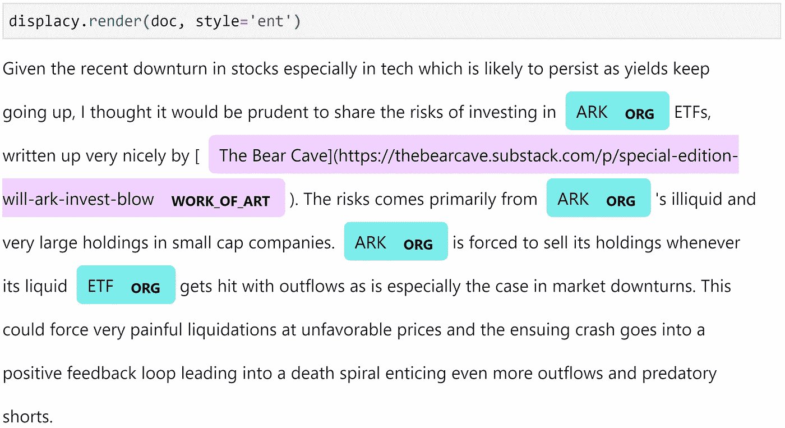
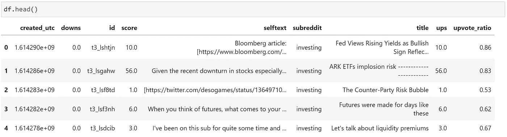
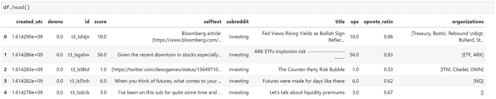
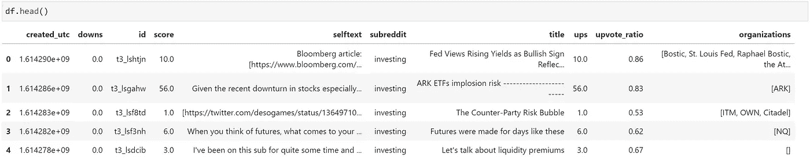
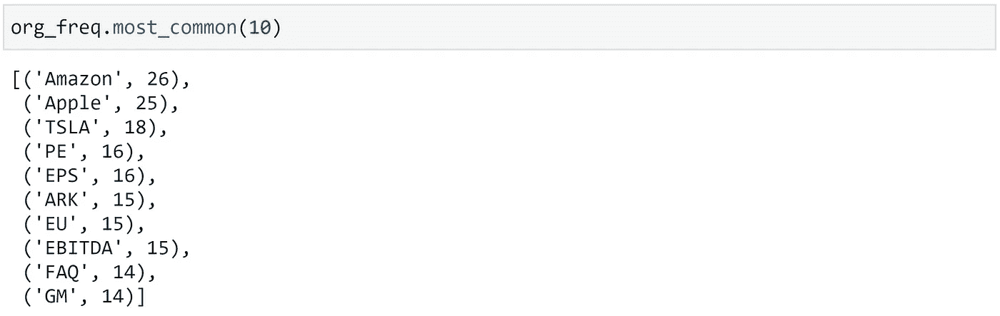

# NER 在 Reddit 上提取股票提及

> 原文：<https://towardsdatascience.com/ner-for-extracting-stock-mentions-on-reddit-aa604e577be?source=collection_archive---------17----------------------->

## 如何将命名实体识别用于🚀🚀🚀💎🤲


照片由 [Ishant Mishra](https://unsplash.com/@ishant_mishra54?utm_source=medium&utm_medium=referral) 在 [Unsplash](https://unsplash.com?utm_source=medium&utm_medium=referral) 拍摄

eddit 一直处于金融世界最大运动之一的中心，尽管这看起来不太可能是这种运动的源头，但事后看来这并不奇怪。

Reddit 上以交易为中心的子页面是大量关于市场动态的讨论的背景，因此挖掘这个庞大的数据源是合乎逻辑的。

当构建这样的数据提取工具时，我们需要做的第一件事就是确定我们提取的数据实际上是什么——为此我们将使用命名实体识别(NER)。

我们将确定正在讨论哪些组织。简而言之，我们将涵盖:

```
**> Reddit Data****> NER**
  - SpaCy**> Identifying Entities**
  - DisplaCy Visualization
  - Extracting Entities**> Processing The Dataset**
  - Extracting Entities
  - Pruning Entities**> Building a Frequency Table**
```

点击此处观看视频教程:

# Reddit 数据

首先，我们需要从 Reddit 提取信息——为此，我们有两个选择。我们可以使用`requests`库直接与 Reddit API 接口，或者使用 PRAW 库，它在访问 Reddit API 时增加了一个额外的抽象层。

在这个项目中，我们将通过`requests`直接与 Reddit API 接口——但是您可以随意使用您喜欢的任何方法。你可以在这里找到通过`requests`连接的指南:

</how-to-use-the-reddit-api-in-python-5e05ddfd1e5c>  

我们将使用[这个脚本](https://github.com/jamescalam/transformers/blob/main/course/named_entity_recognition/01_getting_reddit_data.ipynb)提取 Reddit 数据。你可以在这里找到我们使用的数据(如果你想跳过这一部分)。

使用这个，我们可以很容易地切换我们正在查看的子街道——但是我们将关注`/r/investing`。

# NER

一旦我们有了我们的数据，我们需要处理它，并提取组织名称，以便任何进一步的分析是自动分类和结果分配到正确的股票。

在每个子编辑中，组织以各种格式被提及。通常我们会发现两种格式:

*   组织名称，如特斯拉/特斯拉汽车公司
*   股票代号，如 TSLA，tsla，或$TSLA

我们还需要能够区分 ticker 和其他缩写/俚语——其中一些是不清楚的，比如 AI (AI 既可以指人工智能，也可以指 C3.ai 的 ticker 符号)。

因此，我们需要一个合理的 NER 过程来准确地分类我们的数据。

## 空间

spaCy 库是 Python 中最受欢迎的自然语言处理包之一——它附带了一套优秀的 NER 工具，包括 displaCy 中一些非常酷的可视化工具——我们将很快探索这些工具。

要安装 spaCy，打开 CMD/Bash/etc 并键入`pip install spacy`。

安装后，我们可以通过在命令行中输入`python -m spacy download <MODEL-NAME>`来下载任何 SpaCy 模型。下载后，我们可以用 Python 代码初始化模型，如下所示:

```
nlp = spacy.load('en_core_web_sm')
```

空间模型名称分为四部分，`[lang]_[type]_[genre]_[size]`:

*   **Lang** —模特的语言(例如`en`为英语)。
*   **类型** —模型类型，`core`是通用类型，支持词汇、语法、实体和词向量。
*   **流派** —文本模型被训练的类型(如`web`或`news`)。
*   **尺寸** —模型包装尺寸— `sm`、`md`或`lg`。

在我们的例子中，我们将使用一个英国模型，它需要支持 NER(实体)——所以它将是一个通用的`core`模型。Reddit 线程与`web`类型保持一致，我们将坚持使用小型号`sm`。

所有这些给了我们模型`en_core_web_sm`！

# 识别实体

我们将从 ARK 上 */r/investing* 中的一个线程开始:

```
Given the recent downturn in stocks especially in tech which is likely to persist as yields keep going up, I thought it would be prudent to share the risks of investing in ARK ETFs, written up very nicely by [The Bear Cave](https://...). The risks comes primarily from ARK's illiquid and very large holdings in small cap companies. ARK is forced to sell its holdings whenever its liquid ETF gets hit with outflows as is especially the case in market downturns. This could force very painful liquidations at unfavorable prices and the ensuing crash goes into a positive feedback loop leading into a death spiral enticing even more outflows and predatory shorts.
```

从这里我们想提取出 **ARK** 作为这个提取的唯一相关组织。为此，我们将返回到我们初始化的`nlp`模型:

尽管看起来不像，`doc`实际上包含了我们的 NER 标记的文本。我们只需要进入它。

我们将通过两种方式进行研究，一种是显示可视化，另一种是通过`ents`属性进行编程。

## 显示可视化

DisplaCy 允许我们方便地可视化我们的文本，突出显示空间标识的实体，如下所示:



这种方法对于快速可视化我们的模型的结果非常有用——很明显，模型将 ETF 识别为一个组织(我们可能希望删除它),并将文章链接 *The Bear Cave* 识别为`WORK_OF_ART`。

对我来说，`WORK_OF_ART`标签是什么意思并不清楚(也许是毕加索？).幸运的是，我们可以使用`spacy.explain(<TAG>)`得到一个标签描述:

从这个描述来看，这篇文章——虽然不完全是一本书——似乎很有意义。

## 提取实体

用 displaCy 可视化很棒，但我们还需要一种更程序化的方式来提取组织实体。这就是`ents`的用武之地。

`doc`的`ents`属性包含一个实体列表和它们各自的标签——然后我们可以循环查看我们的数据。

这里我们通过`entity.label_`访问标签类型，通过`entity.text`访问各自的文本。我们将只过滤**组织**标签。

此外，我们在这段文本中标识了 ARK 三次——理想情况下，我们只想返回每个唯一的组织一次，这将通过将输出列表转换为一个集合来实现。

现在我们有了，我们已经从文本中提取了我们的组织实体。现在，我们需要做的就是重构我们到目前为止所做的，并将其应用到我们提取的所有数据中。

# 处理数据集

我们的数据集看起来像这样:



我们/r/投资数据集的负责人

我们关注的是 *selftext* 列，它包含了每篇文章的文本内容到 */r/investing* 。

## 提取实体

为了处理它并输出我们的组织实体，我们所做的就是将我们已经构建的代码重写到一个函数中，该函数接受一个单独的 *selftext* 字符串作为输入，并返回一个已识别实体的列表:

我们将这些确定的实体添加到我们的数据框架中的一个新列，称为*组织*。



我们的/r/投资数据框架，右边是新的**组织**列

## 修剪实体

同样，我们引入了一些我们不想包含的实体。为了避免这些，我们在我们的`get_orgs`函数中的 if 语句中添加了一个附加条件:

现在，如果组织包含在`BLACKLIST`中，它将被忽略——这可以在我们的数据框架中看到:



我们的/r/investing 数据框架头，现在我们已经包括了一个黑名单‘ETF’和‘Treasury’不再包括在前两行

# 建立频率表

现在我们所有的数据都准备好了，我们可以继续建立一个频率表。为此，我们将把所有的组织标签提取到一个列表中，然后使用`collections`创建一个`Counter`对象(频率表)。

现在我们已经将频率表包装在`Counter`中。这个对象的结构很像 Python 字典，其中我们将标签作为键，将它们的频率作为值*。*

*然而，与 Python 字典不同，`Counter`附带了几个有用的方法——特别是`most_common(n)`方法——它为我们返回了 n 个最常提到的组织！*

**

***most_common(n)** 方法返回前 **n** 个最高计数*

*现在我们有了，所有最常被提及的来自 */r/investing* 的组织！*

*这就是本文的全部内容，我们已经介绍了很多内容，包括:*

*   *快速浏览一下从 Reddit API 中提取的数据(如果需要，这里有更多的[和](/how-to-use-the-reddit-api-in-python-5e05ddfd1e5c))。*
*   *空间模型——如何下载并理解它们的用途。*
*   *用我们的空间模型进行实体提取。*
*   *使用 displaCy 可视化 NER。*
*   *使其适用于完整的数据集。*
*   *使用`collections`建立一个提及频率表。*

*我希望你喜欢这篇文章！如果你有任何问题，请通过 [Twitter](https://twitter.com/jamescalam) 或在下面的评论中告诉我。如果你想要更多这样的内容，我也会在 YouTube 上发布。*

*感谢阅读！*

# *参考*

*空间，[可视化工具—显示文档](https://spacy.io/usage/visualizers)*

*[🤖带变压器的 NLP 课程](https://www.udemy.com/course/nlp-with-transformers/?couponCode=MEDIUM)*

*[完整剧本](https://github.com/jamescalam/transformers/blob/main/course/named_entity_recognition/xx_ner_reddit_freq_table.ipynb)*

***所有图片均由作者提供，除非另有说明**