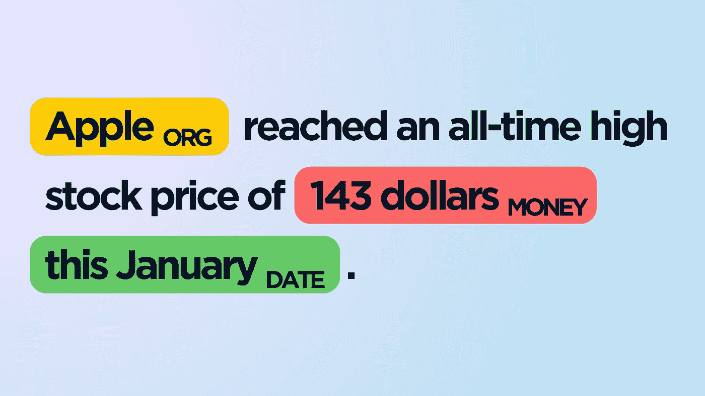
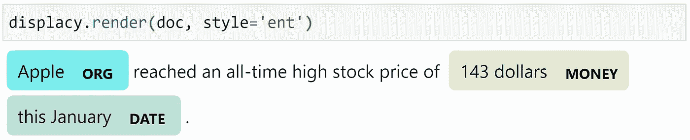
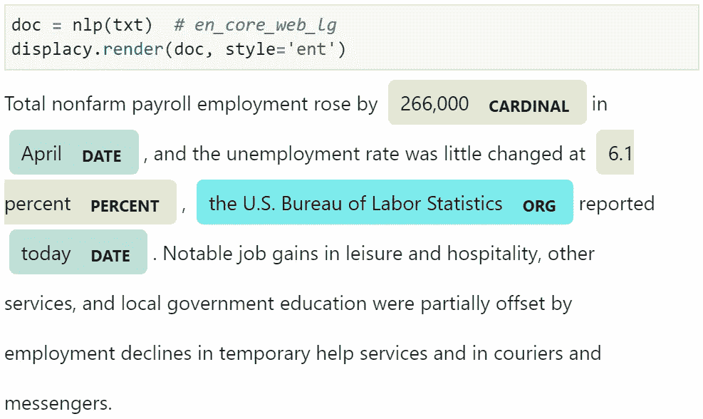
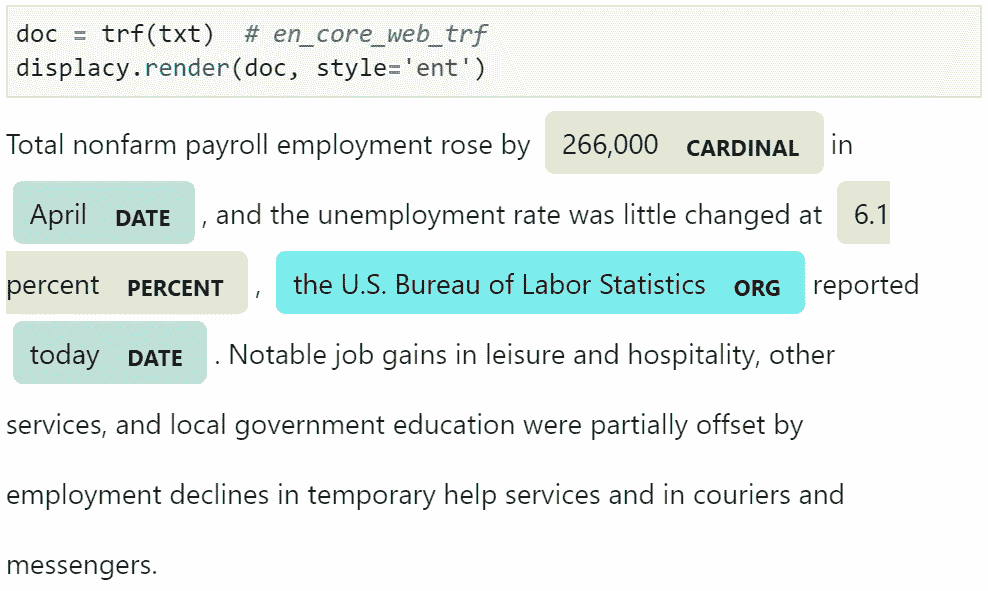
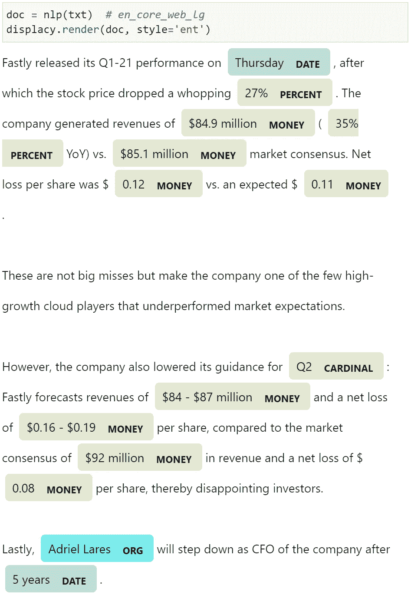
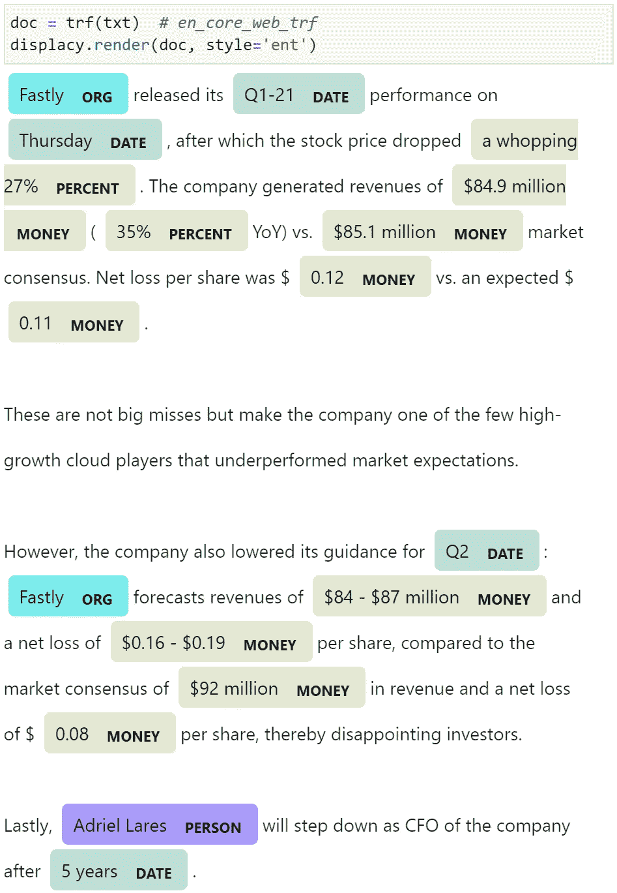

# NER 与变形金刚和太空

> 原文：<https://towardsdatascience.com/ner-with-transformers-and-spacy-b3240bc65eb4?source=collection_archive---------9----------------------->

## 使用 roBERTa 提取过强的实体



作者图片

N 命名实体识别(NER)包括从文本中提取“实体”——我们的意思在句子中给出了:

> "今年 1 月，苹果公司的股价达到了 143 美元的历史新高。"

我们可能想要提取关键的信息片段——或“实体”——并对这些实体进行分类。像这样:

**苹果—组织**

**143 美元——货币价值**

**今年 1 月—日期**

对于我们人类来说，这很容易。但是，我们如何教会一台机器区分一个史密斯奶奶苹果和我们在纳斯达克交易的苹果呢？

*(不，我们不能指望‘A’大写……)*

这就是 NER 的用武之地——使用 NER，我们可以提取像苹果这样的关键词，并确定它实际上是一个*组织*——而不是一种水果。

Python 中 NER 的首选是 spaCy 库——这真的很神奇。例如，我在编写任何代码之前编写了上面的 NER 示例，spaCy 完美地匹配了该示例:



变压器 NER 模型的输出。

很酷的东西…但是，这只是香草空间——如果我们加入变形金刚会怎么样？

# 空间变压器

变形金刚是自 NLP 中的面包片以来最热门的东西。自 2017-18 年推出以来，它们已经主导了 NLP 基准，成为事实上的语言标准(抱歉，LSTM)。

SpaCy 在 2019 年推出了`spacy-transformers`库[1]。它将 spaCy 连接到 HuggingFace 的变形金刚库——允许我们像往常一样使用 NER——但由尖端的变形金刚模型驱动。

NER 与变形金刚和空间的视频漫游。

## 装置

我们首先安装`spacy-transformers`,使用:

```
pip install spacy[transformers]
```

如果你使用 CUDA，用`nvcc --version`检查你的版本，把 CUDA 版本添加到安装中——我有 CUDA 11.1，所以我的安装命令是:

```
pip install spacy[transformers,cuda111]
```

## 初始化空间转换器

现在我们已经安装了`spacy-transformers`，我们可以像通常使用 spaCy 模型一样开始使用 transformer 模型。

这里唯一的例外是我们下载并初始化一个 spaCy transformer 模型——而不是通常的模型。

我们下载了 [roBERTa-base 模型](https://spacy.io/models/en#en_core_web_trf),其中包含:

```
python -m spacy download en_core_web_trf
```

然后用 Python 初始化它:

对于以前使用过 spaCy 的人来说，这应该看起来很熟悉。

## NER

我们现在准备用我们的 transformer 模型处理一些文本，并开始提取实体。同样，这里与通常的空间语法没有区别:


变压器 NER 模型的输出。

## 变形金刚 v 传统空间

很好，但是与传统的空间模型相比，这种模型表现如何？我们将使用`en_core_web_lg`模型，并比较来自[*r/投资*](https://www.reddit.com/r/investing/) 子编辑的一些帖子。



传统 **en_core_web_lg** 型号(左)，变形金刚 **en_core_web_trf** 型号(右)。

在这里，我们可以看到这两个模型之间没有任何差异——我们应该期待有相当数量的样本，因为传统模型`en_core_web_lg`仍然是一个非常高性能的模型。

但是，让我们从[这里](https://www.reddit.com/r/investing/comments/n6uka6/fastly_drops_27_after_release_of_q121_results/)尝试一个稍微长一点、更复杂的例子:

```
Fastly released its Q1-21 performance on Thursday, after which the stock price dropped a whopping 27%. The company generated revenues of $84.9 million (35% YoY) vs. $85.1 million market consensus. Net loss per share was $0.12 vs. an expected $0.11.These are not big misses but make the company one of the few high-growth cloud players that underperformed market expectations.However, the company also lowered its guidance for Q2: Fastly forecasts revenues of $84 - $87 million and a net loss of $0.16 - $0.19 per share, compared to the market consensus of $92 million in revenue and a net loss of $0.08 per share, thereby disappointing investors.Lastly, Adriel Lares will step down as CFO of the company after 5 years.
```



传统 **en_core_web_lg** 型号(左)，变形金刚 **en_core_web_trf** 型号(右)。

现在我们看到了不同之处:

除了在百分比标签中包含*“巨大的”*——transformer 模型明显优于传统模型。

关于在空间中使用转换器*进行命名实体识别的文章到此结束！你可以在这里找到完整的笔记本。*

我希望你喜欢这篇文章！如果你有任何问题，请通过 [Twitter](https://twitter.com/jamescalam) 或在下面的评论中告诉我。如果你想要更多这样的内容，我也会在 YouTube 上发布。

感谢阅读！

# 参考

[1] M. Honnibal & I. Montani， [spaCy 遇上变形金刚:微调伯特、XLNet 和 GPT-2](https://explosion.ai/blog/spacy-transformers) (2019)，爆炸 AI

[🤖带变压器的 NLP 课程](https://bit.ly/nlp-transformers)

如果您有兴趣了解更多关于使用 NER 空间库的信息，我会在这里做更深入的介绍:

[](/ner-for-extracting-stock-mentions-on-reddit-aa604e577be) [## NER 在 Reddit 上提取股票提及

### 如何使用命名实体识别进行有意义的分类

towardsdatascience.com](/ner-for-extracting-stock-mentions-on-reddit-aa604e577be) 

**所有图片均由作者提供，除非另有说明*