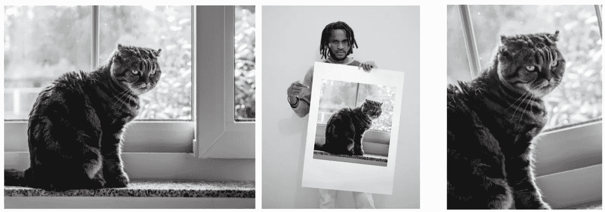
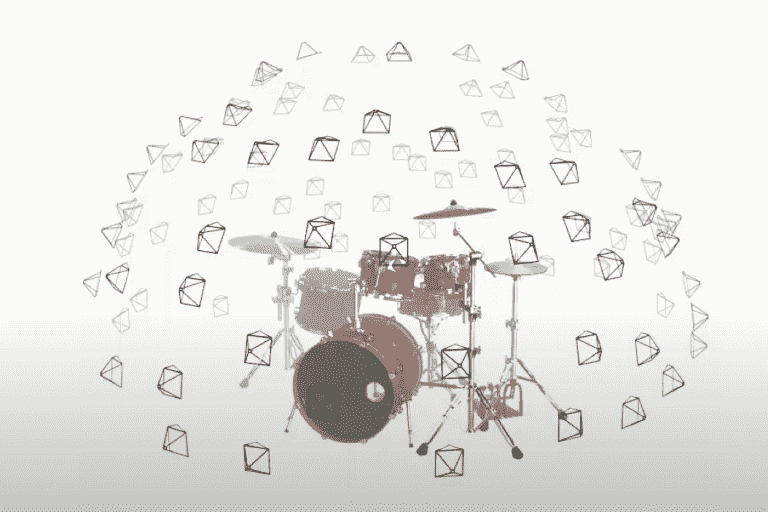
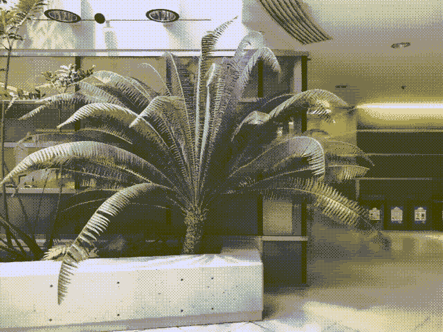
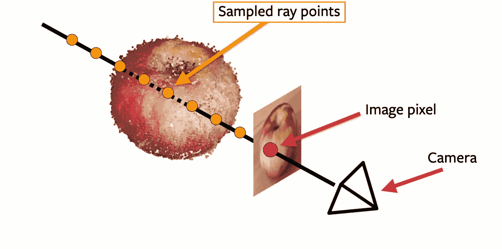
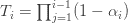

# 当图形变得可微时会发生什么

> 原文：<https://towardsdatascience.com/nerf-and-what-happens-when-graphics-becomes-differentiable-88a617561b5d?source=collection_archive---------10----------------------->

## [思想和理论](https://towardsdatascience.com/tagged/thoughts-and-theory)

## 深度学习和计算机图形之间的浪漫是如何开始的，以及走向照片现实主义的未来之路

*渲染*，任何图形系统的关键部分，*就是让一个电脑化的三维世界在我们的二维电脑屏幕上反映出来的东西，就好像世界上的一个角色从口袋里拿出相机，拍下了他们所看到的东西。*

在过去的一年(2020 年)，我们已经学会了如何使渲染过程变得可区分，并将其变成一个深度学习模块。这激发了想象力，因为深度学习的格言是:“如果它是可微分的，我们可以通过它学习”。事实上，许多深度学习突破都来自于试图软化零和一之间的差距，将离散变成连续，将 *argmax* 变成 *softmax* 。如果我们知道如何有区别地从 3D 到 2D，这意味着我们也可以使用深度学习和反向传播从 2D 回到 3D。

假设我手里拿着一张(2D 的)猫坐在窗户里的照片(在现实世界中拍摄的)，并且可以访问一个*可微分渲染器*，一个将三维(计算机化)世界的**表示**转换为二维图像的系统。现在，如果我让系统渲染一个 2D 图像，我会得到一些看起来一点也不像猫的随机图像，因为它渲染的 3d 世界只是一些随机初始化的计算机化环境。

但是因为渲染器是可微分的，这意味着结果图像中的每个像素都是计算机化 3d 世界的可微分函数。这实质上意味着我们的深度学习框架保持了从渲染图像回到 3D 世界表示的链接。因此，我们可以问:“我们如何改变我们当前的 3D 世界表示，以便下次我们从相同的角度渲染它时，得到的图像看起来更像照片？”(数学上，我们取照片像素和图像像素之间的差的梯度)。

如果我们相应地改变我们的 3D 世界表示，并一遍又一遍地这样做，最终我们的可区分渲染器将渲染一个看起来非常类似于原始猫照片的图像。

在那一点上，我们可以把注意力转向它所融合的计算机化的 3D 世界。我们能从中得到什么？它在 3D 窗口中有 3D 猫对象吗？如果我们从不同的拍摄角度(获得不同的图像)渲染同一个 3D 计算机化世界，它看起来还会像一只猫吗？好吧，除非我们的 3D 表现已经有了一些关于 3D 猫长什么样的预定义概念，否则很可能没有。仅仅使用一张照片，从一个角度来看，没有足够的信息来了解猫从不同的角度看起来会是什么样子。据我们所知，我们的 3D 世界可能会汇聚成一只印在画布上的扁平猫，而画布就放在摄像机前面。

**左边**和**中间**:对世界的两种可能解释，右边**的照片是在那里拍摄的**。资料来源:联合国人类住区规划署

为了让我们对 3d 世界的描述汇聚成有用的东西，我们需要更多的照片，从更多的角度拍摄。

NeRF:每个场景都是从几十个不同的角度拍摄的，以找到它的三维表示。资料来源:NeRF 论文[1]。

这正是加州大学伯克利分校(Ren Ng 的实验室)的一组研究人员在一个名为 NeRF(神经辐射场的缩写)的项目中所做的。他们一次从不少于 40 个不同的角度拍摄了现实世界中的一个静态场景(并获得了 40 幅图像)，目标是获得该场景的三维计算机化表示，稍后可以从任何角度正确渲染。他们的结果令人震惊。

由 NeRF 处理的场景。所有帧都是通过从不同角度渲染相同的 3D 表示而完全合成的。注意地板和玻璃上的反射。来源:[NeRF github 页面](https://www.matthewtancik.com/nerf)(点击查看附加示例)。

使用同一物体或场景的多个视图来获得其 3D 表示的想法并不新鲜(这被称为*视图合成*)。然而，以前的方法都无法生成逼真度如此之高的 3D 结构，以至于从**新**视点渲染的图像与真实照片无法区分。

建造 NeRF 的人能够搞定它。他们成功的原因是他们结合了强大的可区分渲染器和强大但不典型的 3D 世界表示。这个强大的 3D 世界表现是一个神经网络。甚至不是那些花哨的神经网络之一，而是一个多层感知器，就像过去的好时光一样，9 个完全连接的层。

NeRF 中心的神经网络是如何表现整个 3D 世界的？答案:它对它的 3D 空间进行分类！它的输入是空间中一个点的任意 3 个坐标(x，y，z)(以及相机视点)，它的输出是空间中该点的颜色 *(r，g，b)* 和材质的不透明度(α)。

NeRF 中心的神经网络。

这就是了。五个号码进，四个号码出。一旦神经网络在场景中得到充分训练，我们就可以在空间的任何一点上查询它，并探测环境。这很好，但是如果我们想知道更多关于场景的实际内容，我们必须努力探测网络。这个神经网络没有明确地告诉我们场景中对象的数量、它们的类别或它们的边界。这是一种更“原子化”、更低级的看待世界的方式。

从计算机图形研究者的角度来看，这是激进的。它们用于在场景中以自己的数据结构(称为“网格”)来表示每个对象。它们用于处理表面、获取深度图和跟踪光源发出的光线。这里什么都没有。

相反，我们有一些更类似于医学图像中用于表示体积的体素网格，如 MRI 或 CT 扫描，除了:

*   MRI/CT 体积具有固定的分辨率，使用离散的体素，而我们可以在任何分辨率下向 NeRF 网络询问任何分数(x，y，z)点。
*   与 NeRF 多层感知器的相对紧凑的 256 x 256 x 9 权重(粗略地)相比，MRI/CT 体积占据了大量的空间(考虑 512 x 512 x 512 体素)。

因此，NeRF 的神经网络不是表现不同对象的最自然的方式，但它绝对是渲染它们的合适方式，也许这就是为什么结果图像如此逼真。

**NeRF 渲染器是如何工作的？**

你可以想象我们正在渲染的图像就像一个屏幕放在相机前面，垂直于相机的视角。为了确定该图像中任何像素的颜色，我们从相机发出一条光线，穿过像素在屏幕上的位置并向前。如果光线击中任何表面，像素的颜色将被确定为表面在撞击点的颜色。如果表面是不透明的(𝛂=1)，我们就到此为止。但如果没有，我们必须继续跟踪光线，看看它碰到了什么其他表面，因为它们的颜色也会影响像素的颜色。

**单像素渲染**。图像被渲染为好像放置在垂直于摄像机角度的屏幕上。光线通过像素离开相机并继续。沿着射线采样几个点。像素应该在光线和苹果表面的第一个交叉点得到颜色。来源:David Novotny，pytorch3d 教程[2]。

在该渲染器的不可微分版本中，只有最接近的不透明表面决定了像素的颜色。但是如果我们想使它可微分，我们需要再次将 *argmax* 变成 *softmax* 。换句话说，所有被光线击中的表面都需要在计算中发挥一些作用，即使是那些被最近的表面遮挡的表面(仍然会产生最大的影响)。这是维持 3D 世界所有区域和最终图像像素之间必要联系的关键。

更具体地说，为了计算特定像素的颜色，我们沿着上述光线采样 100 个点，并向我们的神经网络请求颜色 *(r，g，b)* 和每个点的不透明度(𝛂)。像素的最终颜色是所有**所有**采样点**所有**颜色的线性组合(加权平均)，甚至是那些在半空中的点(𝛂应该接近 0)，或者那些在相机“隐藏”的表面上的点(𝛂应该接近 1)。分配给光线上第*个*点(远离相机)的权重将得到权重 T_i 𝛂_i，其中标量𝛂_i

由网络直接计算，并且

取决于前面点的不透明度值。您可以看到最近的曲面如何获得最主要的权重(我们将权重归一化，因此它们的总和为 1)。

**前进的道路**

我觉得这很令人兴奋。这不再是一个预测物理的神经网络。这个**是插在 PyTorch 引擎内神经网络顶部的**物理(或光学)。我们现在有了一个现实世界的*可微分模拟*(利用计算机图形的力量)和一个它的*神经表示*(利用深度学习的力量)。难怪结果看起来如此逼真。

深度学习和图形之间的这场罗曼史才刚刚开始。它将缩小计算机模拟和现实世界之间的差距。如果你有一个 VR 头戴设备，想象一下看电影，你不只是坐在一个静态的视角，而是可以在场景中移动，甚至可以与之互动。

最新的创新将允许我们将现实世界中的物体和环境导入虚拟世界，减少对艺术家制作的资产的依赖。【在这种情况下，我推荐观看[Nvidia 的 Sanja Fidler 关于创建三维内容的讲座](https://slideslive.com/38939970/a-i-for-3d-content-creation)，该讲座来自上一期 NeurIPS 关于该主题的研讨会。]

还有我之前提到的关于 NeRF 网络局限性的那些东西？这对于计算机图形学来说太低级了？这将会改变。我们将从这个 3D 世界表示中提取语义元素，这将使我们能够理解和控制它，就像我们对经典网格表示所做的那样，但保留了照片真实感的新标准。

在下一篇文章中，我将解释我们计划如何去做。

**延伸阅读**

[1]米尔登霍尔等人。艾尔。 **NeRF:将场景表示为用于视图合成的神经辐射场。** ECCV 2020 [ [链接](https://www.matthewtancik.com/nerf)

[2]脸书的 PyTorch3D 图书馆。[ [链接](https://github.com/facebookresearch/pytorch3d) ] [ [隐函数与 NeRF](https://www.youtube.com/watch?v=g50RiDnfIfY)][[NeRF 专用 jupyter 笔记本](http://dedicated NeRF notebook.) ]

[3]桑娅·菲德勒。**用于 3D 内容创作的人工智能**。NeurIPS 2020 [ [链接](https://slideslive.com/38939970/a-i-for-3d-content-creation)

[4]弗拉德伦·科尔顿:走向摄影现实主义[ [视频](https://www.youtube.com/watch?v=Rd0nBO6--bM)