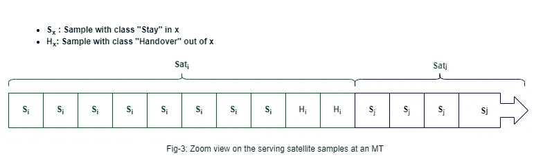

# 基于机器学习的多类分类中的嵌套类不平衡问题

> 原文：<https://towardsdatascience.com/nested-class-imbalance-problem-within-machine-learning-based-multi-class-classification-a4b2c43ba832?source=collection_archive---------32----------------------->

## 揭示现实生活中非人类为中心的 ML 数据

于韦斯屈莱的 Paijä nne 湖-信贷:艾哈迈德·马斯里

# 放弃

你可能会觉得这篇文章的内容可笑到你可能会笑死的地步。为此，要受到警告，记得在临死前给出建设性的反馈；)

# 介绍

在基于机器学习(ML)的分类应用中，类不平衡是一个众所周知的问题。当不同类别之间的样本数量不平衡时，就会出现这样的问题，并且所得到的 ML 模型将偏向于具有频繁样本的一个或多个类别，而不是具有不频繁样本的其他类别。例如，训练 ML 模型来从数百万健康病例(类别 2)中检测几个癌症病例(类别 1)将导致与类别 1 相比偏向类别 2 的模型，如果两个类别之间样本数量的不平衡没有解决的话。

本文不详细讨论类不平衡问题本身，因为它是文献中定义明确的问题，不熟悉的读者可以参考那些精选的参考文献以获得更多信息[1][2][3]。除此之外，本文的目标是揭示现实生活中非以人为中心的 ML 数据案例，其中存在一个隐藏的嵌套类不平衡问题，据作者所知，这个问题以前还没有解决。

为了便于理解这个问题，让我们把它放在一个示例场景中。

# 系统场景

图 1:低轨卫星通信系统场景——鸣谢:艾哈迈德·马斯里

假设我们有几个移动终端(mt)由低地球轨道(LEO)卫星系统服务，如图 1 所示。数百到数千颗 LEO 卫星正在/将要在不同高度绕地球运行，并为被称为 5G NTN 的 5G 移动网络提供类似的服务[4]。在这种情况下，移动终端从几个可见的低地球轨道卫星接收无线电信号。每个 MT 都试图保持连接，并从其最佳卫星获取数据。这里的最佳并不意味着最近，因为通常大气条件和在比目标 LEO 系统更低的高度运行的其他 LEO 卫星可能会阻碍与 MT 的无线电通信。因此，MT 在失去连接之前不容易决定应该连接到哪个卫星以及何时更换(切换)新的卫星。由于这一点，基于时间序列 ML 的分类解决方案可用于对 MT 上从所有可见 LEO 卫星收集的接收信号帧进行分类，以在正确的时间预测最佳卫星，如图 2 所示。

图 2:MT 从不同可见卫星接收的样本作为神经网络的输入，用于训练多类分类 ML 模型——鸣谢:Ahmed Masri

训练单个监督 ML 模型来处理该任务需要在每个 MT 处收集来自所有可见卫星的接收信号，如图 2 所示。显然，不是所有的卫星都能被 MTs 看到，这取决于它们当前的位置和条件。为此，来自每个卫星的信号的数量和强度在 MT 处将会变化，并且一些 MT 将具有来自“X”卫星的更多信号样本，而其他 MT 可能具有来自“Y”卫星的更多样本。当然，在训练分类 ML 模型之前，应该对收集的数据进行处理和标记。

避免了这种示例场景的所有技术和特定于技术的细节，以保持对目标想法本身的关注，而不会迷失在枝节细节中。现在，随着场景的简单定义，让我们强调嵌套类不平衡问题。

# 嵌套类不平衡问题定义

## 多级失衡—1 级

MTs 将从不同的卫星接收不同数量的信号样本的事实可能导致众所周知的多类不平衡问题，如果一个卫星比其他卫星具有更多的样本，并且作为结果，我们的 ML 模型将开始优选并且预测这个流行的卫星为与其他不太流行的卫星相比最好的卫星。

## 隐藏的二进制—类别不平衡—级别 2

独立地在 MT 处再次研究从每个卫星收集的样本，我们可以看到样本本身可以被二进制分类成两类:当样本值足够好时的停留类，以及当样本值变得衰减并且失去与当前服务卫星的连接的风险变得更高时的切换类，如下图 3 所示:

图 3:MT 处服务卫星样本的放大视图——作者:Ahmed Masri

具有类别 1(停留)的样本的数量将远远高于具有类别 2(切换)的样本的数量，因为一旦类别 2 样本出现，则该模型将预测 MT 很快切换到另一个服务卫星，此时将再次收集更多类别 1 类型的样本。停留样本和切换样本的数量之间的这种隐藏的二元类不平衡将对我们的多类分类 ML 模型做出正确预测的能力产生间接的显著影响，如果它没有被正确解决的话。

由于目标是单个多类分类 ML 模型，该模型不仅能够检测最佳卫星，而且能够在正确的时间检测它，因此很容易发现第 1 级的多类不平衡问题，但是另一方面，如果没有很好地调查，第 2 级的二元类不平衡可能会隐藏起来。鉴于此，在本文中，我们揭示了这种嵌套的不平衡问题，如果您的多类分类模型不仅要预测正确的类，还要在正确的时间预测它，那么注意，您可能有一个嵌套的类不平衡问题。

# 拟议解决方案

解决方案建议的一个提议是从不同卫星收集相等的样本以解决多类不平衡问题，同时仅在切换区周围收集样本以解决二元嵌套不平衡问题。然而，这可能会引起一些关注，例如，忽略非切换区域是否会影响模型的多类分类精度？模型会不会丢失一些重要的模式？如果是，那么处理嵌套二进制不平衡问题的另一个建议解决方案是通过从所有区域(切换/非切换)收集样本，以便我们不会错过多类分类的任何重要模式，但同时，我们增加少数切换样本的样本权重，以从 ML 模型的角度给予它们更多的关注。

# 结论

在一个示例场景中强调并讨论了嵌套类不平衡问题。我们揭示了这种嵌套的不平衡问题，如果多类分类模型不仅要预测正确的类，还要在正确的时间预测它，那么我们可能会遇到嵌套的类不平衡问题。此外，还提出了一些解决方案，并进行了简要讨论。

# 参考

[1]凌春生，盛诉我国阶级不平衡问题。参见:萨姆特·c，韦伯主编的《机器学习百科全书》，2011 年，斯普林格，波士顿，马萨诸塞州。[https://doi.org/10.1007/978-0-387-30164-8_110](https://doi.org/10.1007/978-0-387-30164-8_110)

[2] [Johnson，J.M .，Khoshgoftaar，T.M .关于深度学习与班级失衡的调查。j 大数据 6，27 (2019)。https://doi.org/10.1186/s40537-019-0192-5](https://journalofbigdata.springeropen.com/articles/10.1186/s40537-019-0192-5#citeas)

[3] Patel H，Singh Rajput D，Thippa Reddy G，Iwendi C，Kashif Bashir A，Jo O .无线传感器网络不平衡数据分类综述.2020 年，*国际分布式传感器网络杂志*。doi:[10.1177/1550147720916404](https://doi.org/10.1177/1550147720916404)

[4] 3GPP，“TR 38.811:技术规范组无线接入网；支持非地面网络的新无线电(NR)研究，“2009–2020，第 15 版，V15.4.0。”