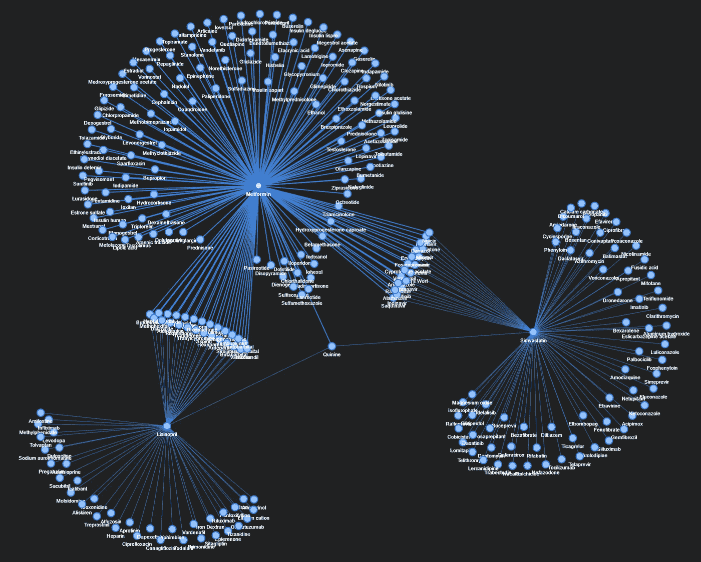
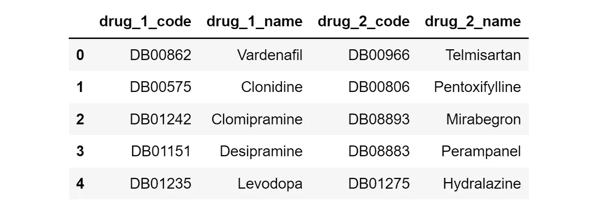
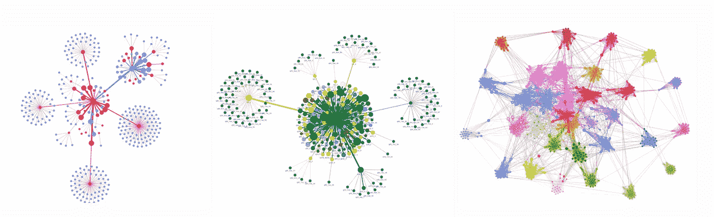
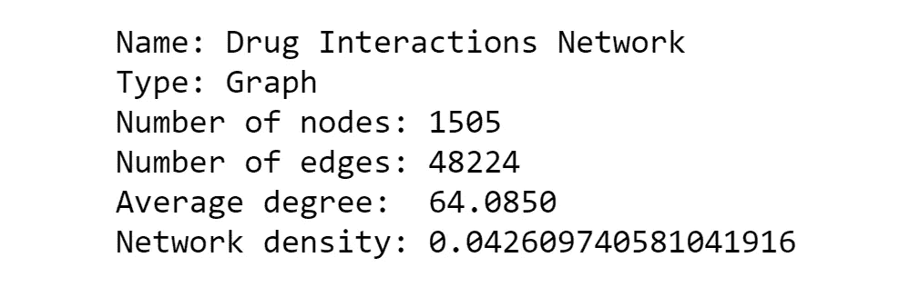
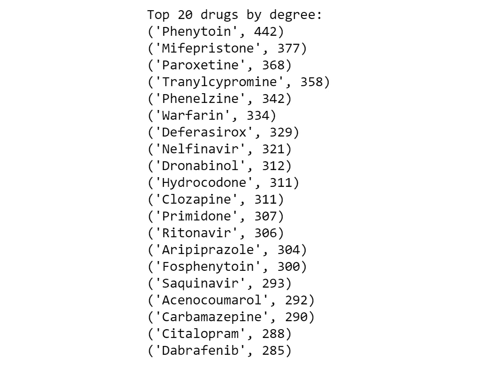
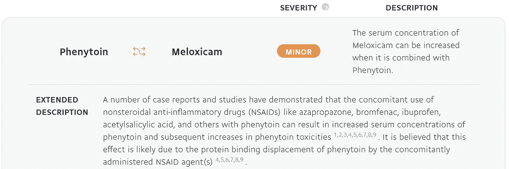
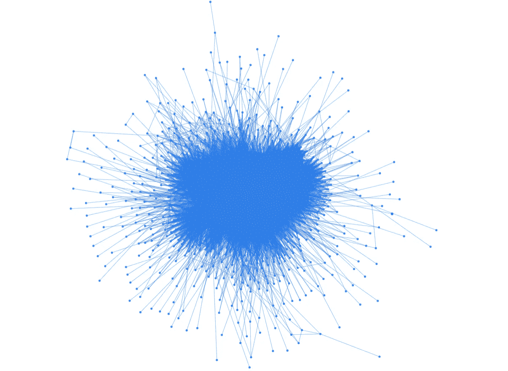
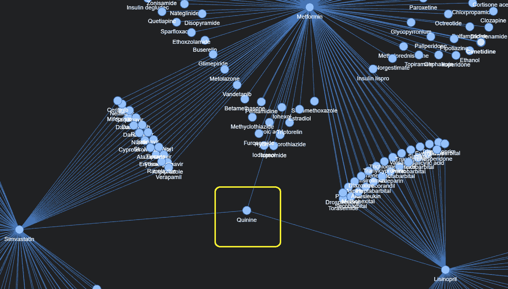

# 药物-药物相互作用的网络分析和可视化

> 原文：<https://towardsdatascience.com/network-analysis-and-visualization-of-drug-drug-interactions-1e0b41d0d3df?source=collection_archive---------12----------------------->

## 了解如何使用 NetworkX、Pyvis 和 Datapane 探索和可视化药物相互作用数据(Python 格式)

数据子集上药物-药物相互作用的可视化|作者图片

D **药物-药物相互作用**当两种或两种以上的药物相互反应时，就会发生药物-药物相互作用，导致意想不到的(且可能致命的)不良反应。

作为一名具有临床药学背景的数据科学家，我热衷于利用我的领域知识来探索药物相互作用的数据。

药物-药物相互作用涉及多个实体之间的联系，因此将**网络作为核心概念来分析这些药物相互作用是合适的。**

# 内容

> ***(1)****[*数据采集和准备*](#1a92)***(2)****[*网络分析用 NetworkX*](#ed0c)*[*可视化用 Pyvis 和 Data pane*](#b836)***

****

**Volodymyr Hryshchenko 在 [Unsplash](https://unsplash.com?utm_source=medium&utm_medium=referral) 上的照片**

*****免责声明*** *:本文是* ***而非*** *意在提供任何形式的医学意见或建议。请向您的医生或药剂师咨询与任何药物治疗相关的专业建议。***

# **(1)数据采集和准备**

**斯坦福网络分析项目( [**SNAP**](http://snap.stanford.edu/) )有一个公共的[生物医学网络数据集集合](http://snap.stanford.edu/biodata/)，包含许多具有实体间关系信息的数据集。一些例子包括疾病-药物关联，生物过程之间的关系，甚至蝴蝶之间的相似性网络。**

**我为这个项目使用了[**ChCh-Miner**](http://snap.stanford.edu/biodata/datasets/10001/10001-ChCh-Miner.html)**数据集，它包含了[美国食品药品监督管理局( **FDA** )](https://www.fda.gov/) 批准的药物之间的相互作用网络。****

****原始数据存储为 48，464 行和 2 列的 CSV 文件，其中每行代表特定药物对之间的相互作用。****

****这些值采用药物库( **DB** )代码的形式，因此需要与实际药物名称相匹配。这是通过从公共[药物库](https://go.drugbank.com/)数据库中反复搜索相应的药物名称来手动完成的。****

****经过进一步的数据预处理(例如，删除没有药物名称的化合物)，我们得到了一个熊猫数据帧，如下所示:****

********

****已处理药物相互作用数据的样本行|作者图片****

****该数据集的缺点是没有提供药物相互作用的**严重性**。因此，添加了一个填充了 **1 的**的自定义列(名为“ *Weight* ”)来表示所有交互的“相等”严重性。****

# ****(2)用 NetworkX 进行网络分析****

## ****(一)概述****

****一个网络只是一个连接对象的集合，它们对于建模**实体**(又名节点)之间的**关系**(又名边)非常有用。****

********

****在 [pyvis BSD 许可](https://github.com/WestHealth/pyvis/blob/master/LICENSE_BSD.txt)下使用的网络|图像示例****

****在我们的数据集中，每一个成对的药物相互作用都是两个节点(即两种药物化合物)之间的关系。****

****假设我们在药物实体之间有一堆 ***无向*** 链接，我们可以继续用 [**NetworkX**](https://networkx.org/) 进行网络分析，这是一个用于创建、操作和研究网络的 Python 包。****

## ****(二)网络图的创建****

****NetworkX 可以用`pip install networkx[default]`安装的****

****完成后，我们从药物相互作用熊猫数据帧中生成一个**网络图对象**，并检索网络图的基本摘要:****

********

****来自**无向**药物相互作用网络图的总结结果|图片由作者提供****

****我们可以看到，该网络共有 **1，505** 个药物实体(节点)，有 48，224 个记录的相互作用(边)。****

****平均**度**为 **64** ，意味着每种药物一般平均与 64 种其他药物相互作用。(*在后面的章节中更多关于节点度)*****

******网络密度**描述网络中*潜在*连接占*实际*连接的比例，其中 **0** 表示一个没有边的图， **1** 表示一个所有节点都相互连接的完整图。****

****0.04 的低网络密度是有意义的，因为我们不希望太多的药物相互作用。****

## ****(三)程度中心性****

****节点的度是指节点拥有的连接数。当处理网络时，我们处理一个叫做**度中心性的关键概念。******

****简单来说，一个节点的度中心性就是它拥有的边数。这意味着具有 5 个交互的药物节点将具有 5 个的**度中心性。******

****通过计算每个节点的度中心性，我们可以得到**前** **20 种最常涉及药物相互作用的药物**:****

********

****参与最多相互作用的前 20 种药物(具有相应的节点度)|作者图片****

****上面的输出显示，药物相互作用中最常涉及的药物是**苯妥英钠，**，节点度为 **442** 。****

****[**苯妥英**](https://www.healthhub.sg/a-z/medications/135/phenytoin) 是一种治疗癫痫发作障碍的常用抗癫痫药物，其血药浓度必须小心保持在一致的水平，以确保其有效性和安全性。****

**** [## 关键词:苯妥英

### MediView 是一个药物图像门户网站，可以充当您口袋中的药房。MediView 是 1400 多个质量…

www.mediview.sg](https://www.mediview.sg/keyword/n-zXKQXN/phenytoin/) 

以下是一个涉及苯妥英的药物相互作用的例子:

使用的图像基于 [Creative Common 的署名-非商业性 4.0 国际许可](https://creativecommons.org/licenses/by-nc/4.0/legalcode)，如 [DrugBank](https://go.drugbank.com/legal/terms_of_use) 所示**** 

# ****(Pyvis 和 DataPane 的可视化****

## ****(一)概述****

****使用网络最酷的部分可能是可视化方面。帮助我们轻松构建这种可视化的工具是 Pyvis，这是一个 Python 库，以创建交互式网络图而闻名。****

****Pyvis 可以用`pip install pyvis`安装****

****从数据帧创建 Pyvis 可视化的顺序如下:****

1.  ****用`[nx.from_pandas_edgelist](https://networkx.org/documentation/stable/reference/generated/networkx.convert_matrix.from_pandas_edgelist.html)`方法从包含边列表的 Pandas 数据帧生成一个 NetworkX 图。****
2.  ****用`[Network()](https://pyvis.readthedocs.io/en/latest/_modules/pyvis/network.html)`初始化一个 Pyvis 网络类实例****
3.  ****用`Network()`类的`.from_nx`方法将 NetworkX 图形转换成 Pyvis 图形格式****

****有大量定制可用于构建或修改网络可视化的外观。在我的例子中，我实验了流行的 [**斥力**](https://pyvis.readthedocs.io/en/latest/_modules/pyvis/network.html#Network.repulsion) **解算器**和 [**巴恩斯小屋**](https://pyvis.readthedocs.io/en/latest/_modules/pyvis/network.html#Network.barnes_hut) **物理模型。******

****我开始把所有药物相互作用的数据都放入 Pyvis Barnes Hut 的图表中，作为回报，我得到了一个可怕的海胆相似物网络。****

********

****完整交互数据集的网络可视化(Barnes Hut 物理模型)|作者图片****

## ****㈡探索单一药物****

****为了使图表更有意义和更易理解，最好是处理更小的数据子集，而不是整个数据集。****

****因为我们之前发现苯妥英具有最多的药物相互作用，所以让我们单独为苯妥英创建一个 Pyvis 网络(使用排斥解算器):****

****苯妥英药物相互作用的网络可视化| *请给可视化加载一些时间*****

*****注:如果在移动设备上观看此视频，请点击“* ***【全屏】”*** *按钮*****

****上面的图像显示苯妥英钠作为**中心**节点，被与其相互作用的 **442** 其他药物实体所包围。****

****Pyvis 的美妙之处在于可视化效果是**交互式的**，这意味着你可以将鼠标放在图形上来缩放、指向或拖动节点。****

****由于 Pyvis 在本地将图形保存为 HTML 文件，所以我们需要一个单独的工具来公开共享结果。这就是 [**数据面板**](https://datapane.com/) 介入争论的地方。****

****Datapane 是一个开源的 Python 库，允许用户在 web 上发布 HTML 文件和 Python 绘图等对象，以便共享和可视化。你可以在这里找到我写的上传 HTML 文件到 Datapane [的脚本。](https://github.com/kennethleungty/Drug-Interactions-Network-Analysis-and-Visualization/blob/main/upload_viz_to_datapane.py)****

## ****㈢探索多种药物****

****只看一种药物可能没什么洞察力，所以让我们探索一个由稍大的数据子集组成的网络。****

****我挑选了**三种**药物( [**二甲双胍**](https://www.webmd.com/drugs/2/drug-11285-7061/metformin-oral/metformin-oral/details)[**赖诺普利**](https://www.webmd.com/drugs/2/drug-6873-9371/lisinopril-oral/lisinopril-oral/details)****辛伐他汀** )分别在**糖尿病****高血压**和**高脂血症**这三种常见疾病中的关键作用进行深入探讨。******

******在过滤数据以保留涉及这三种药物中至少一种的相互作用后，得到的图表如下所示(有点类似于*水母*和*花椰菜*的形状):******

******涉及部分药物(二甲双胍、赖诺普利和辛伐他汀)的药物相互作用的网络可视化|请给可视化加载一些时间******

******从网络图中，我们可以很容易地找出与二甲双胍、赖诺普利和/或辛伐他汀有共同相互作用的不同药物。和以前一样，这个网络图是交互式的，所以继续探索吧。******

******一个有趣的见解是，只有一个实体与所有三种精选药物相互作用(即具有边缘)，该药物是 [**奎宁**](https://en.wikipedia.org/wiki/Quinine) 。******

************

******奎宁与二甲双胍、赖诺普利和辛伐他汀相互作用|作者图片******

# ******(4) Python 实现代码******

******我在这个 GitHub repo 里面贴了全面的代码和数据 [***，所以可以随意探索(和星/叉)里面的内容。***](https://github.com/kennethleungty/Drug-Interactions-Network-Analysis-and-Visualization)******

******请尝试 NetworkX 和 Pyvis 中的其他功能和网络定制，并尝试创建自己的网络！******

************

******费尔南多·埃尔南德斯在 [Unsplash](https://unsplash.com?utm_source=medium&utm_medium=referral) 上拍摄的照片******

# ******(5)向前迈进******

******基线分析和可视化完成后，下面是几个潜在的后续步骤:******

*   ******药物相互作用有不同的严重程度(即轻微、中度、严重)，由于缺乏数据，这一点未被考虑在内。理想的情况是找到并包含该信息，以便边缘可以具有不同的厚度来反映不同的严重性。******
*   ******将鼠标悬停在节点和边上时，以弹出窗口的形式添加交互细节******
*   ******将该项目部署为一个 Streamlit web 应用程序，这样用户就可以自己选择一组药物，并在网络图中显示出来。******

********更新:**Streamlit 部署最近已经完成！请点击这里查看:******

****** [## 如何在 Streamlit 上部署交互式 Pyvis 网络图

### 使用 Python 在线发布您美丽的网络图，并简化它，让全世界都能看到并与之互动

towardsdatascience.com](/how-to-deploy-interactive-pyvis-network-graphs-on-streamlit-6c401d4c99db)****** 

## ******在你走之前******

******欢迎您**加入我的数据科学学习之旅！**一定要关注这个[媒体](https://kennethleungty.medium.com/)页面，以便了解更多令人兴奋的数据科学内容，或者访问 [LinkedIn](https://linkedin.com/in/kennethleungty) 。尽情探索网络图吧！******

****** [## 探索新加坡的非法毒品——数据透视

### 通过 Python 中的探索性数据分析发现保健品的好、坏、丑

towardsdatascience.com](/exploring-illegal-drugs-in-singapore-a-data-perspective-3716a75ee557)  [## 新冠肺炎疫苗——公众情绪如何？

### 使用 NLP (Stanza、NLTK Vader 和 TextBlob)对新冠肺炎疫苗推文进行逐步情感分析

towardsdatascience.com](/covid-19-vaccine-whats-the-public-sentiment-7149c9b42b99) 

## 参考

*   [*NetworkX 文档*](https://networkx.org/documentation/stable/)
*   [*Pyvis 文档*](https://pyvis.readthedocs.io/en/latest/documentation.html)
*   [*数据面板文档*](https://docs.datapane.com/)
*   [*编程历史学家—探索和分析网络数据*](https://programminghistorian.org/en/lessons/exploring-and-analyzing-network-data-with-python)
*   [*科学直接—程度中心性*](https://www.sciencedirect.com/topics/computer-science/degree-centrality)******