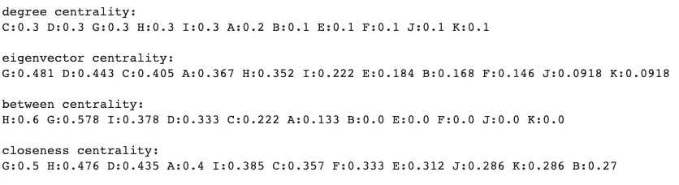
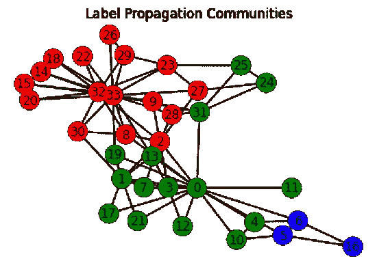

# 什么是网络分析？

> 原文：<https://towardsdatascience.com/network-analysis-d734cd7270f8?source=collection_archive---------1----------------------->

## 带有示例的简介

如果您正在使用任何社交媒体应用程序，您可能已经体验过好友或关注者建议功能。你有没有想过这些功能是如何工作的？在这些情况下，一种常用的技术是网络分析。

# 什么是网络？

网络是指代表一组对象/人以及他们之间的关系的结构。它在数学中也被称为图形。网络结构由节点和边组成。这里，节点代表我们将要分析的对象，而边代表这些对象之间的关系。

例如，如果我们正在研究脸书用户之间的社会关系，节点是目标用户，边是关系，例如用户之间的友谊或组成员关系。在 Twitter 中，边可以是关注者/追随者关系。


作者图片

# 为什么要进行网络分析？

网络分析在许多实际应用任务中非常有用。它有助于我们深入理解社会网络中的关系结构，自然现象中的结构或变化过程，甚至对生物体的生物系统的分析。

再次，让我们以社交媒体用户的网络为例。分析这个网络有助于

*   识别一个群体中最有影响力的人
*   定义用户组的特征
*   为用户预测合适的项目
*   识别 CM 目标等。

其他容易理解的例子有脸书的好友建议功能或 Twitter 的关注建议功能。

# 谁是重要人物？

网络分析的一个重要应用是识别网络中的重要节点。这项任务称为测量网络中心性。在社会网络分析中，它可以指识别最有影响力的成员或群体代表的任务。


作者图片

比如上图你觉得哪个节点最重要？

当然，要定义最重要的节点，我们需要一个具体的重要节点的定义。有几个指标用于测量节点的中心性。

*   **度中心性**:度越高的节点中心性越高
*   **特征向量中心性**:在一个节点的度上加上邻居节点的中心性。结果，对应于邻接矩阵的最高特征值的特征向量表示网络中节点的中心性
*   **介数中心性**:两个节点之间经过第 I 个节点的路径数被认为是第 I 个节点的介数中心性。
*   **紧密中心性**:网络中从第 I 个节点到其他节点的路径长度被认为是第 I 个节点的紧密中心性。例如，利用这个定义，这种中心性可以应用于在城市中定义合适的疏散地点的任务中。

```
import networkx as nx
import numpy as np
import matplotlib.pyplot as pltG = nx.Graph()
G.add_nodes_from(["A","B","C","D","E","F","G","H","I","J","K"])
G.add_edges_from([("A","C"),("B","C"),("C","D"),("D","E"),
("D","G"),("A","G"),("F","H"),("G","H"),("H","I"),
("I","J"),("I","K")])nx.draw(G, node_size=400, node_color='red', with_labels=True, font_weight='bold')print("degree centrality:")
for k, v in sorted(nx.degree_centrality(G).items(), key=lambda x: -x[1]):
      print(str(k)+":"+"{:.3}".format(v)+" ", end="")
print("\n")print("eigenvector centrality:")
for k, v in sorted(nx.eigenvector_centrality(G).items(), key=lambda x: -x[1]):
      print(str(k)+":"+"{:.3}".format(v)+" ", end="")
print("\n")print("between centrality:")
for k, v in sorted(nx.betweenness_centrality(G).items(), key=lambda x: -x[1]):
      print(str(k)+":"+"{:.3}".format(v)+" ", end="")
print("\n")print("closeness centrality:")
for k, v in sorted(nx.closeness_centrality(G).items(), key=lambda x: -x[1]):
      print(str(k)+":"+"{:.3}".format(v)+" ", end="")
print("\n")
```


作者图片



作者图片

# 我们是谁？

网络分析的另一个应用是社区检测任务。此任务旨在将网络划分为在任何特定功能方面都相似的节点组。该任务的例子是定义 SNS 中共享共同兴趣/观点的用户组、寻找客户群以广告特定商品、在线购物系统中的推荐系统等的任务。

许多研究人员正在研究有效解决社区检测问题的算法。该任务中一些众所周知的算法/方法是 Kernighan-Lin 算法、谱聚类、标签传播、模块化优化等。


示例代码


作者图片



作者图片

# 还有什么？

除了这些应用之外，网络分析在时间序列分析、自然语言处理、电信网络分析等方面也起着重要的作用。最近，机器学习(深度学习)的技术也被用于网络分析。在这种情况下，关于图嵌入和图神经网络的研究是有趣的课题。

要了解更多细节，我推荐以下网站和教材。

*   网络科学([http://networksciencebook.com/](http://networksciencebook.com/))
*   网络:一个非常简短的介绍
    ( [)](http://www.veryshortintroductions.com/view/10.1093/actrade/9780199588077.001.0001/actrade-9780199588077)
*   网络、人群和市场
    ([https://www.cs.cornell.edu/home/kleinber/networks-book/](https://www.cs.cornell.edu/home/kleinber/networks-book/))