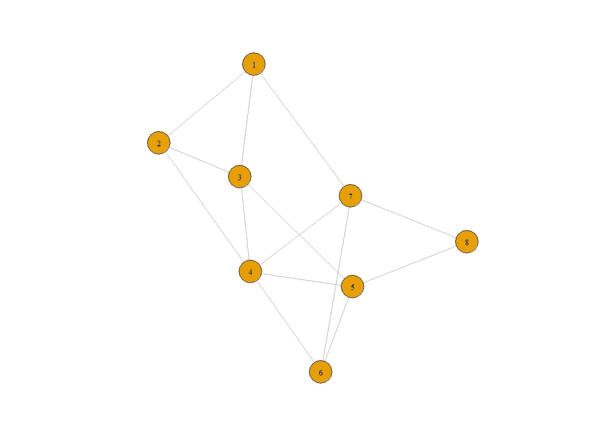
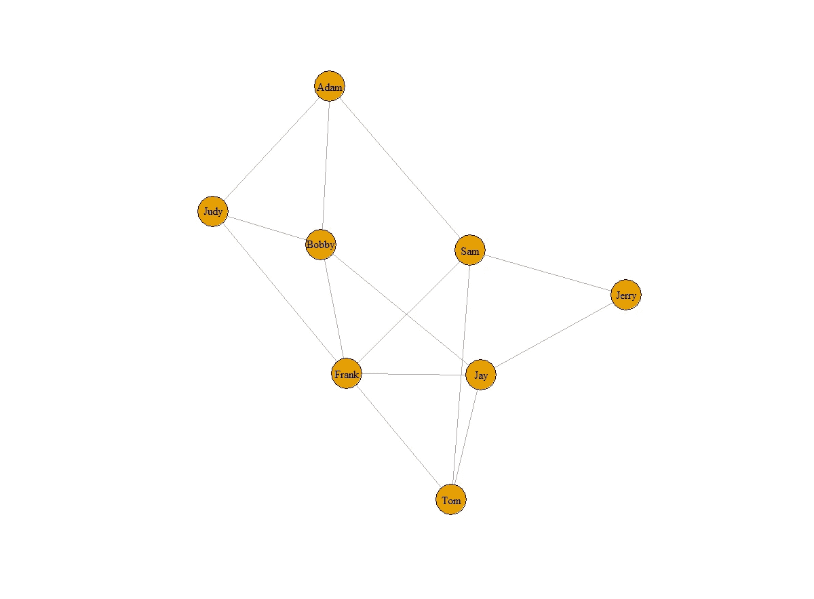
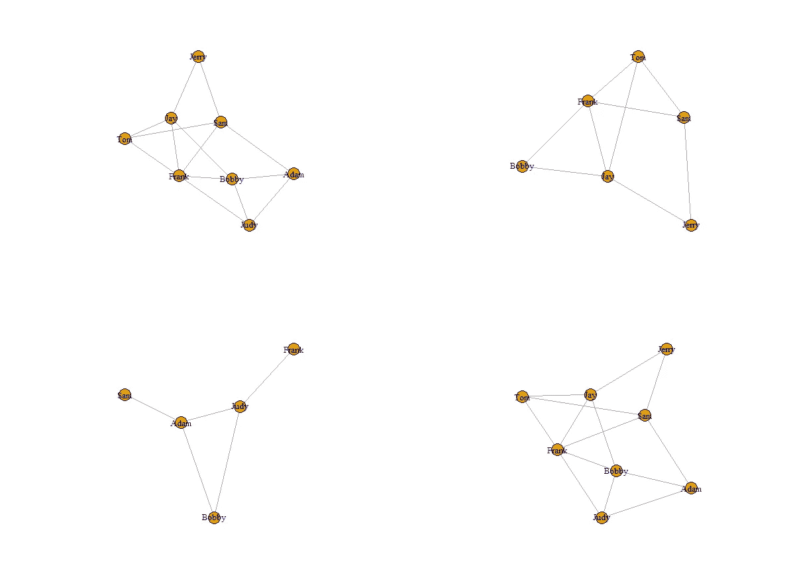
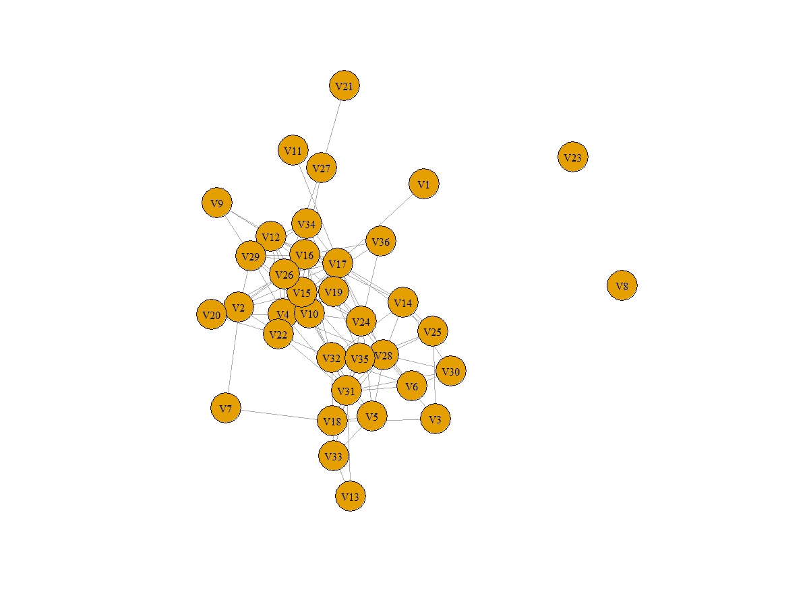

# 操作网络数据的网络分析

> 原文：<https://towardsdatascience.com/network-analysis-in-r-manipulating-network-data-ee388fba7215?source=collection_archive---------16----------------------->

## 在 r 中使用 igraph 执行网络分析和操作网络数据。


作者图片

# 介绍

N 网络分析是一种使用图论来研究复杂现实世界问题的技术，例如计算生物学、工程、金融、市场营销、神经科学、政治学和公共卫生(Kolaczyk 等人，2014)。在我之前的工作中，我用 NetworkX 和 node2vec 在 python 环境中做了相当多的网络分析。不过最近偶然看到了 Eric D. Kolaczyk 和 Gábor Csárdi 写的书——《[*用 R*](https://link.springer.com/book/10.1007/978-1-4939-0983-4) 对网络数据进行统计分析》(这是第 1 版，第 2 版于 2020 年出版)，这本书向我展示了 R 中许多很酷的软件包(如 igraph)，它们在操纵图形、数学建模、统计建模等方面提供了高质量的网络分析。

这本书附有一份代码演示列表，可以在这里找到:[https://github.com/kolaczyk/sand](https://github.com/kolaczyk/sand)。

这个博客是建立在本书的第二章:处理网络数据的基础上的，假设你已经理解了网络分析的基本概念，如节点、边等。然而，如果你需要一个全面的解释，我鼓励你读这本书。

# 您需要什么:

RStudio(或类似的 ide)和“igraph”(一个 R 包，可从 CRAN 获得)

如果您没有安装“igraph ”:

```
*## Download and install the package* 
install.packages("igraph") *## Load package* 
library(igraph)
```

# 密码

## 创建无向图和有向图

要手动创建图表，可使用“graph.formula”功能。

为了使创建有向图更容易理解，我提出了一个由三个机场组成的机场网络:JFK(纽约机场)、PEK(北京机场)和 CDG(巴黎机场)。因此，我创建的有向图可以理解为:我们只有从 JFK 到北京和 CDG 的单程航班(假设应用了一些旅行限制)；北京和 CDG 是相互连接的，你可以双向飞行。

## 获取图表的基本信息

为了使博客简洁，演示的其余部分将只关注无向图。更多参考，请访问该书的 GitHub 知识库。

一个图，用 G = (V，E)表示，是由一组 V 个顶点和一组 E 条边组成的数学结构。图中的顶点数和边数有时称为图 G 的*阶*和*大小*(Kolaczyk 等人，2014)。

您可以使用***【V】***和***【E】***来检查顶点和边；使用***【vcount(graph)***和***ecount(graph)***检查图形的顺序和大小；使用***print _ all(graph)***来显示图形的摘要。

## 形象化图表

您可以使用 ***命令绘制*** 图形:



图一。图(g)

## 标记顶点

我制作了这个图，它的顶点用数字 1 到 n 标记。实际上，你可能已经有了自然的标签，比如名字。这里是你如何标注你的顶点，以及它看起来会是什么样子:

```
V(g)$name <-c("Adam","Judy","Bobby","Sam","Frank","Jay","Tom","Jerry")plot(g)
```



图 2:带标签的图表

## 图形的表示

通常，图将以三种基本格式存储:邻接表、边表和邻接矩阵(Kolaczyk 等人，2014)。

邻接表是无序列表的集合。每个无序列表描述了邻接表中图的特定顶点的邻居的集合。这种格式就是 igraph 在图形摘要函数中使用的格式。

边列表是一个两列表格，列出了图中的所有节点对。这种格式是 NetworkX(python 中)的首选格式。

邻接矩阵的条目显示了图中的两个顶点是否相连。如果两个节点“I 和 j”之间有链接，则行列索引(I，j)将被标记为 1，否则为 0。因此，对于无向图，邻接矩阵将是对称的。统计模型通常喜欢用这种格式编码图形，比如 node2vec，它需要邻接矩阵作为输入。

可以使用***get . adj list(graph)***、***get . edge list(graph)***、***get . adjacency(graph)***的函数分别得到三种不同的格式。

## 图的运算

在实践中，我们可能想要移除某些边或连接图来得到子图。在这种情况下，数学运算符可以帮助您实现目标。



图 3。图的运算

(1，1)中的图是原图。(1，1)中的图从原始图中删除了两个顶点。(2，1)中的图由某些边组成(由于顶点的移除，这些边从原始图中移除)。(2，2)中的图是(1，1)和(2，1)的联图，并且它具有与(1，1)相同的结构。

## 使用数据框

在现实问题中，我们很少手动制作图表。相反，我们必须导入数据。对于操作图表的最佳实践，我们通常需要准备两个数据文件/数据框。其中一个文件需要包含图中每个顶点的所有属性。另一个文件需要包含网络中的边(通常是边列表)。

在书中，作者举了一个 Lazega 的律师数据集的例子。信息存储在两个不同的文件中: ***elist.lazega*** 和 ***v.attr.lazega*** 。原始数据可在 sand(网络数据统计分析)库中获得。因此，下面是您如何读取自己的数据:



图 4。阅读你自己的数据

# 结论

在这篇博客中，我讲述了创建有向和无向图、可视化图、从图中获取统计数据、标记顶点、生成不同格式的表示、子集化和连接图以及使用 **igraph** 读取您自己的网络数据的代码。

***请随时与我联系***[***LinkedIn***](https://www.linkedin.com/in/jinhangjiang/)***。***

# 相关阅读

[NetworkX:操纵子图的代码演示](/networkx-code-demo-for-manipulating-subgraphs-e45320581d13)

[使用 NetworkX、Gephi 和 Node2Vec 分析疾病共现](https://medium.com/analytics-vidhya/analyzing-disease-co-occurrence-using-networkx-gephi-and-node2vec-53941da35a0f)

# 参考

*带 R* 的网络数据统计分析，作者 Eric D. Kolaczyk 和 Csá rdi Gá bor，Springer，2014 年，第 13–28 页。