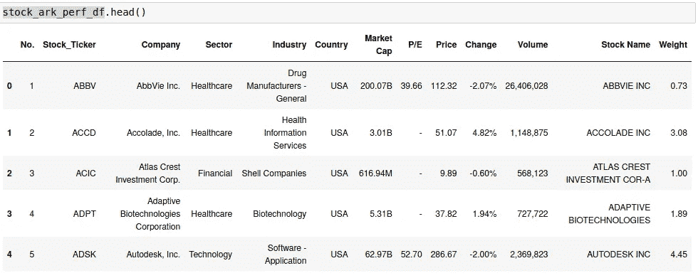

# ETF |方舟基金的网络图

> 原文：<https://towardsdatascience.com/network-graph-of-etf-ark-funds-4f9242f19702?source=collection_archive---------35----------------------->


最终方舟图——作者图片([https://shyambv.com/ark_net.html](https://shyambv.com/ark_net.html))

# 介绍

让我做一个预先声明；在看了[凯西伍德](https://en.wikipedia.org/wiki/Cathie_Wood)关于[特斯拉](https://youtu.be/j7oPJZG_boA)的预言后，我成了她的粉丝。是的，目前，她的基金业绩不是很好。然而，这并不意味着任何长期表现。我试图密切跟踪她的行动。在本文中，我将添加一些图形分析以及如何添加显示它们。

***来自《走向数据科学》编辑的提示:*** *虽然我们允许独立作者根据我们的* [*规则和指南*](/questions-96667b06af5) *发表文章，但我们并不认可每个作者的贡献。你不应该在没有寻求专业建议的情况下依赖一个作者的作品。详见我们的* [*读者术语*](/readers-terms-b5d780a700a4) *。*

# 本文的目标

在本文中，我们将浏览以下部分。**文章的各个部分都使用了 Python** 。

1.  以编程方式从网站获取方舟基金数据
2.  阅读 Gmail 方舟基金每日电子邮件
3.  对购买/销售进行分析
4.  总体资金分析
5.  将全部添加到网络图中
6.  可视化网络

# 以编程方式从网站获取方舟基金数据

方舟基金与其他试图隐藏其股票持有量的对冲基金略有不同。他们在自己的网站上公开列出了他们目前持有的所有股票。这使得我们的工作比执行所有的刮擦容易得多。

我们需要循环他们持有的所有资金。他们资金不足。

ARKK —方舟创新 ETF
ARKQ—自主技术&机器人 ETF
ARKW —下一代互联网 ETF
ARKG —基因组革命 ETF
ARKF —金融科技创新 ETF
ARKX —太空探索&创新 ETF

在执行了必要的导入之后，这就是获取

太好了！现在我们有了方舟基金的整体投资组合。接下来获取每日交易数据。

# 获取每日交易

获取每日交易需要一点努力。以下是步骤

1.  需要订阅方舟每日更新
2.  创建一个谷歌云项目并启用 Gmail API
3.  提供电子邮件的访问权限
4.  阅读发送的电子邮件
5.  通过电子邮件获取数据

**需要订阅方舟每日更新**

你可以在这里订阅方舟每日交易通知[。](https://ark-funds.com/trade-notifications)

**创建谷歌云项目并启用 Gmail API**

创建谷歌云项目和启用 Gmail API 是一篇独立的文章。你应该**启用** Gmail API 并且**从[API 文档](https://developers.google.com/gmail/api/quickstart/python#step_1_turn_on_the)中下载**生成的 credentials.json 文件。注意，您可以选择您的 OAuth 客户端作为桌面客户端。


来自谷歌云

```
pip install google-api-python-client google-auth-httplib2 google-auth-oauthlib
```

这是快速入门 [Gmail API 指南。](https://developers.google.com/gmail/api/quickstart/python)请在此查看所有步骤。

上面的代码将获取标签。因为我们需要搜索特定的电子邮件，我们可以使用下面的代码来获取电子邮件并将其转换为我们想要的文本。

执行完所有操作后，你将得到一个干净的熊猫数据帧输出。


# 图形分析

我想对我们得到的数据进行以下分析。

1.  Ark 每天都买/卖股票吗？
2.  方舟正在积累的股票有哪些？
3.  根据市值的整体投资组合。

如果我们能够获得优质数据集，我想预测方舟的下一只股票。在下一篇文章中，让我知道你的想法。

在图形分析上，我们可以使用不同的包和数据库来执行。对于本文，我们将使用用法包 ***pyvis。这是一个创建图形的优秀软件包。***

# 数据提取/清理

为了获得所需的数据，我们需要执行获取相应的数据并相应地清理它。我已经执行了所有的获取和清理处理。这是最终数据集的样子。



股票详细信息-按作者分类的图片


每日购买/销售-按作者分类的图片

完成所有这些工作后，我们有了继续前进所需的数据。

# 绘制图形

现在是时候用我们清理的数据获得良好的视觉效果了。这里 pyvis 库有一个创建网络图的选项。

```
from pyvis.network import Network
import pandas as pdark_net = Network(height='1500px', width='100%', bgcolor='#222222', font_color='white')
```

我们可以在记录级别上遍历熊猫的数据框，并添加节点和边。可以为每个节点和边添加不同的格式，如颜色、粗细、标题、形状等。

**一级——同行业股票**

在第一组绘图中，我们将添加股票代码和市值行业的节点。


股票到行业—作者图片

**第二级——行业部门**

下一步，我们将添加部门和行业的节点


行业-按作者分类的图片

**第三级——股票、行业、部门**

在这一部分，我们将把所有类别股票、行业、部门与所有权重、颜色等结合起来。

**第四级—添加每日交易柜**

最后，我们将添加由 Ark 执行的每日交易。我们需要区分日常买卖。

我们将在销售时添加红色，在购买时添加深绿色。为了显示基金持有和卖出的数量，我们将在标题中标出。这是最后一张图表。

```
ark_net.add_node(src, src, size =m_log, title = (str(t), m))
ark_net.add_node(dst, dst, title=dst, color='#00ff1e')
ark_net.add_edge(src, dst, value=w, title = str("Sold: "+str(w)+"%"), color ='Red')
```


你也可以使用[这个链接](http://127.0.0.1:5500/nasdaq_net.html)查看纳斯达克可视化。

# 最后的想法

为了得到它，我们做了大量的工作。这是他们。

1.  我们可以获取方舟公司的数据并进行数据清理。
2.  能够阅读方舟控股公司的日常邮件并进行处理。
3.  获取市场数据，并结合所有数据。
4.  创建一个网络图并绘制出来。
5.  与图表上的[这个链接](https://shyambv.com/ark_net.html)进行交互。

我们可以添加更多的信息，并每天更新。使用气流计划整个操作。

**参考文献:**

1.  [https://ark-funds.com/active-etfs](https://ark-funds.com/active-etfs)
2.  [https://ark-funds.com/trade-notifications](https://ark-funds.com/trade-notifications)
3.  [https://developers.google.com/gmail/api/guides](https://developers.google.com/gmail/api/guides)
4.  [https://pyvis.readthedocs.io/en/latest/](https://pyvis.readthedocs.io/en/latest/)
5.  [https://towards data science . com/under-appreciated-workflow-tool-air flow-a 078 a3 c 71 a 67](/under-appreciated-workflow-tool-airflow-a078a3c71a67)
6.  [https://medium . datadriveninvestor . com/live-advanced-stock-portfolio-rebalancing-autonomous-trading-for-investors-f 6a e9 bef 3c 25](https://medium.datadriveninvestor.com/live-advanced-stock-portfolio-rebalancing-autonomous-trading-for-investors-f6ae9bef3c25)

# 获取代码

*请订阅我的* [***简讯***](https://codesprout.substack.com/welcome) *获取这篇和我其他文章的工作代码。另外，你会得到其他订阅文章。*