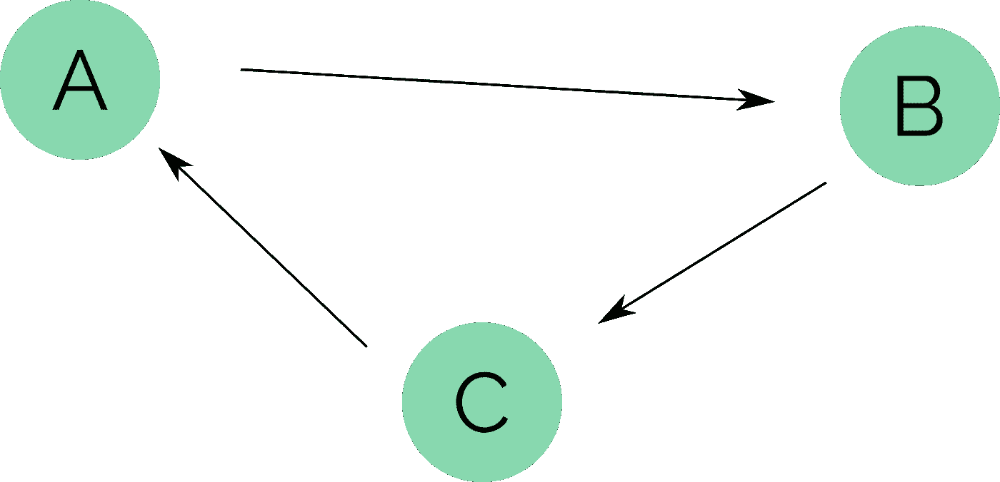
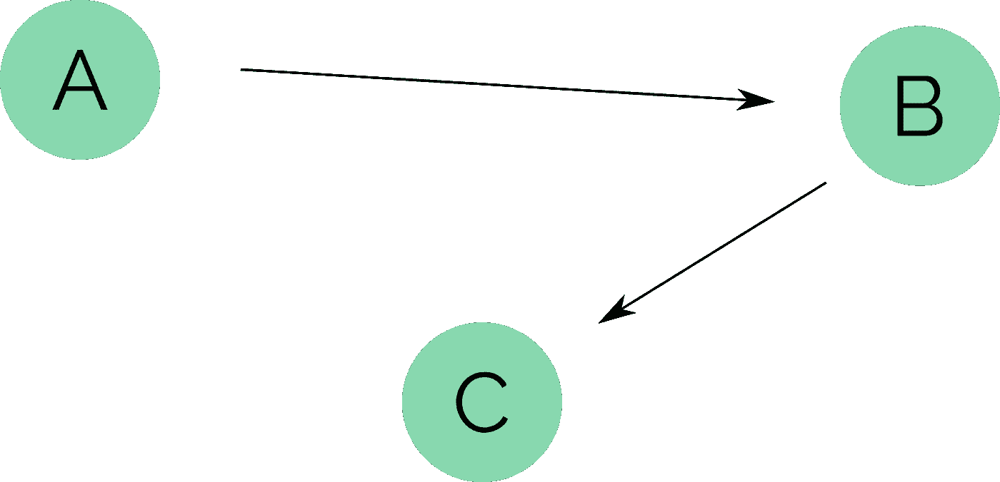
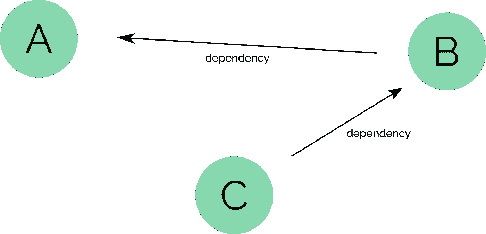
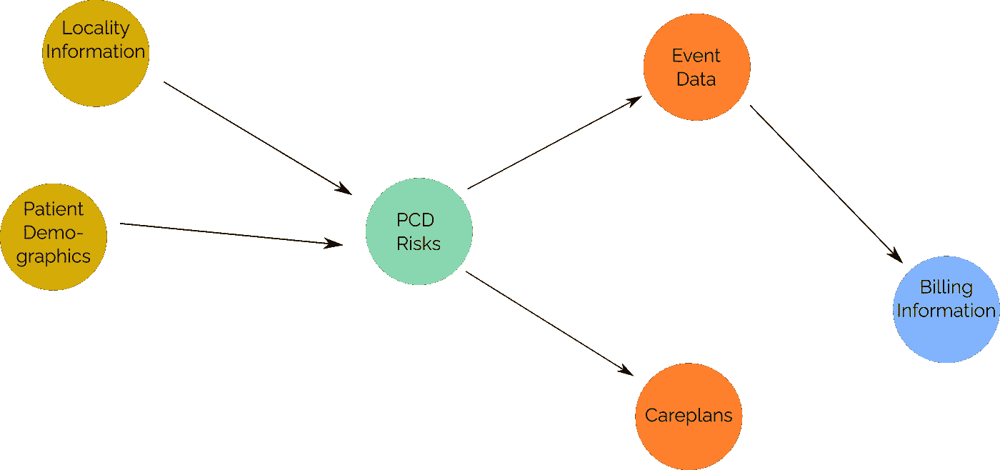

# 用于依赖性解析的网络图

> 原文：<https://towardsdatascience.com/network-graphs-for-dependency-resolution-5327cffe650f?source=collection_archive---------24----------------------->

## 大多数顶级工作负载管理器使用有向无环图(DAG)的原因很简单！

DAG 表示一组互连的节点，并对如何连接这些节点设置了一些硬性限制。DAG 在两个方面不同于常规的图形网络:节点之间的每个连接代表一种单向关系。节点之间的关系不会导致无限循环。

下图显示了一个有向图。然而，它不是非循环的，因为如果你沿着边的方向绕着图中的节点走，你会无数次地经过起点，甚至不会到达最后一个节点停下来。

一个循环有向图(图片由作者提供)

相反，DAG 强制要求不能像这样循环，因此它的名字中有非循环部分。由于 Dag 的这一固有属性，它们成为表达流程中依赖关系等概念的绝佳候选。请参见下图的修改版本，这确实是一个有效的 DAG。

表示处理管道中数据流的有向非循环图(图片由作者提供)

使用 DAG 来表示流程中的依赖关系，让我们假设上面显示的 DAG 边表示处理管道中的步骤，A 馈入 B，B 馈入 c。在此设置中，我们可以通过沿着边往回走来解决依赖关系。我们遇到的每个这样的节点都是我们开始时的初始节点的依赖项。另一种思考方式如下所示。我们可以颠倒每条边所表达的关系，沿着它们走。如果前向边沿表示数据流，那么反向边沿表示数据相关性。

表示处理管道的数据依赖关系的 DAG(作者图片)

既然我们理解了这个概念，我们就可以开始探索可能用来动态解决数据依赖性的算法。作为我工作的一部分，我一直在从事一个处理引擎的工作，这个引擎创建并运行 SQL 规则集。这个 SQL 对原始数据进行操作，产生类似于数据仓库中的表示层的东西。这里的问题是，有时 SQL 可能依赖于由其他 SQL 脚本创建的表和列，我需要一种好的方法来处理这些依赖性。如果我只想运行一个规则呢？我需要一种方法来找到该规则所依赖的所有规则，然后以适当的顺序运行它们，以便在每个 SQL 脚本试图访问它们之前创建所有的依赖关系。

让我们建立一个我所说的玩具例子。因为我在医疗保健领域工作，所以我将使用它作为上下文，但是这些概念适用于任何过程。假设我们有一些原始数据来解释客户与一组健康服务的交互。我们首先清理人口统计数据和健康服务位置数据。该干净的人口统计和地点数据然后被用作 PCD 风险数据处理阶段的一部分。进而，该 PCD 风险处理数据被另外两个阶段使用，即护理计划阶段和事件信息阶段。最后，在事件信息阶段产生的一些数据被用作计费阶段的一部分。这在下面的图表中有所展示。在这种情况下，非循环图中的箭头方向显示的是数据流，而不是数据依赖关系。

一个 DAG 显示了医疗环境中的数据流(图片由作者提供)

因为我是一名 python 程序员，所以我选择使用 NetworkX 库来构建一些算法的原型，以遍历这些依赖图。NetworkX 有一个 DAG 类，如果我尝试初始化的图不是非循环的，它会引发一个异常，并且它会将初始边列表中的所有边都视为有向边。使用上面描述的情况，让我们建立一个描述这个图的边列表，并使用 NetworkX 构建 DAG。

请注意，在上面的代码中，我们将每个节点的关系定义为面向数据流方向的箭头，而不是数据依赖关系的方向。为了获得我们所依赖的节点，我们将“向后”或朝着节点的“前辈”走。

接下来，我们需要定义一个函数来获取图和一个起始节点，遍历包含起始节点所依赖的每个节点的图，然后返回一个表示执行顺序的列表。为了允许并行化，如果存在不相互依赖的节点，我们将允许在执行顺序中多次使用数字。在上图中，我实际上用节点的颜色进行了编码。黄色节点需要首先运行，但是由于它们相互不依赖，没有理由必须先运行一个，或者如果数据库支持，没有理由我们不能并行运行这些处理阶段。

使用`get_node_dependancies(graph, start_nodes)`,我们可以沿着图往回走，建立一个节点列表，以及从我们遇到它们的开始节点的深度。我们可以用这些深度变量计算执行顺序，因为相同深度的节点可以一起运行！但是，这段代码有一个问题。如果我们使用多个开始节点，随着数据流的分支和合并，节点可以在这个列表中出现两次，甚至出现在不同的深度！我们需要一种方法来清理它，并返回给我们一个节点列表和它们的执行顺序。我选择了一种模型，在这种模型中，我们将在处理引擎的执行流中尽可能晚地运行节点。这意味着，如果一个节点在列表中出现不止一次，将使用最小深度(因为这些深度是负的，并且在执行时,“开始节点”实际上是最后运行的，因为我们是向后走的。

现在我们有了实现依赖关系解析算法所需的所有部分，让我们在我们创建的图上测试它。如果我们要运行 PCD 作业，我们首先需要运行人口统计和地区作业。我们希望看到类似“人口统计(0)，位置(0)，PCD (1)”的内容，其中括号中的数字是执行顺序。因为人口统计和地点作业相互不依赖，所以它们应该获得相同的“执行顺序”值。PCD 应该是下一个运行的，因此执行顺序高 1。

这里有一点需要注意。我决定尽可能晚地运行作业；这意味着为它们分配执行顺序的最大有效数字。您可能会注意到，在上图中，这意味着在使用此依赖遍历器时，护理计划节点实际上是蓝色的。这是为了在出现故障时尽早做尽可能少的工作。这并不总是合适的，我希望能够在各个阶段中平均分配执行。因此，如果有 4 项任务需要在第二或第三阶段运行，4 项任务需要在第三或第四阶段运行，我会对它们进行负载平衡，这样第二阶段有 2 项，第三阶段有 3 项，第四阶段有 3 项，但是，在这个阶段，这是方便读者的一个练习。如果你真的实施了，请告诉我！