# 网络学习——从网络传播到图形卷积

> 原文：<https://towardsdatascience.com/network-learning-from-network-propagation-to-graph-convolution-eb3c62d09de8?source=collection_archive---------12----------------------->

## [思想和理论](https://towardsdatascience.com/tagged/thoughts-and-theory)

## 计算生物学中流行的网络传播方法的两种不同观点及其与图卷积的联系

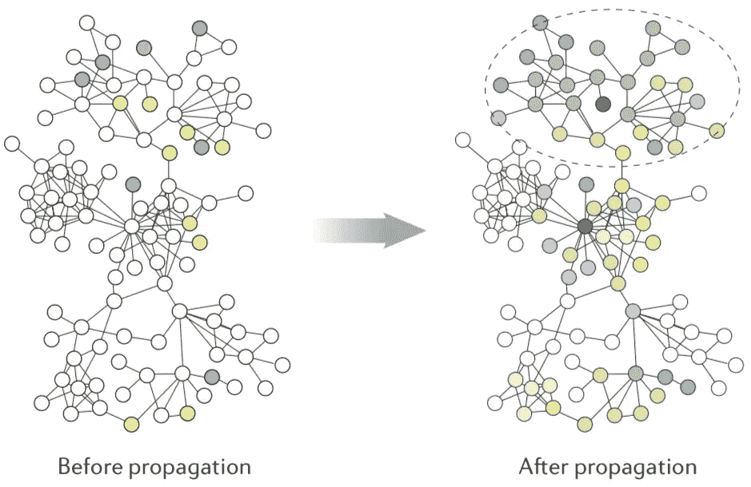

网络传播图解，图片来自[2]

你可能听说过图形卷积，因为它是当时的热门话题。虽然不太为人所知，但网络传播是计算生物学中用于网络学习的主要方法。在这篇文章中，我们将深入探讨网络传播背后的理论和直觉，我们还将看到网络传播是图卷积的一个特例。

# TL；速度三角形定位法(dead reckoning)

*   网络传播是计算生物学中一种流行的方法，它基于联想内疚原理。
*   网络传播的两种不同观点:*随机游走* vs. *扩散*，以 HotNet2 为具体例子。
*   网络传播是图卷积的特例。

# 计算生物学中的网络传播

网络自然地产生于许多现实世界的数据，例如社交网络、交通网络、生物网络等等。网络结构编码了关于网络中每个个体角色的丰富信息。

在计算生物学中，已经表明生物网络，如蛋白质-蛋白质相互作用(PPI)，其中节点是蛋白质，边代表两种蛋白质相互作用的可能性，在重建生物过程中非常有用，甚至揭示疾病基因[1，2]。重建可以简单地通过直接观察靶蛋白的邻近蛋白是否是生物过程或疾病的一部分来完成。这种通过相邻蛋白质推断蛋白质成员的过程被称为**网络传播**。我们将在下一节中更仔细地研究精确的数学公式，但是现在让我们考虑一下为什么这么简单的方法有效。

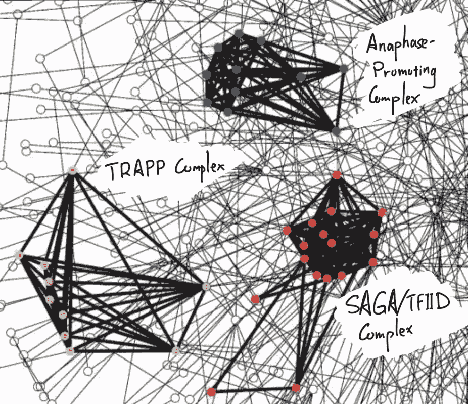

酵母 PPI 中蛋白质复合物的例子，图片来自[3]

这一切都可以归结为**关联有罪** (GBA)原则，该原则指出，彼此密切相关的*蛋白质，无论是通过物理相互作用，还是其他类似的措施，如基因共表达，都有可能参与相同的生物过程或途径*。GBA 原理源于观察到许多蛋白质复合物(如酵母中的 SAGA/TFIID 复合物[3])位于内聚网络模块中。同样，在人类疾病基因网络[4]中，我们可以看到，例如，与耳鼻喉疾病或血液疾病相关的疾病基因定位在网络模块中。顺便提一下，在这篇文章中，蛋白质和基因这两个词会互换使用。

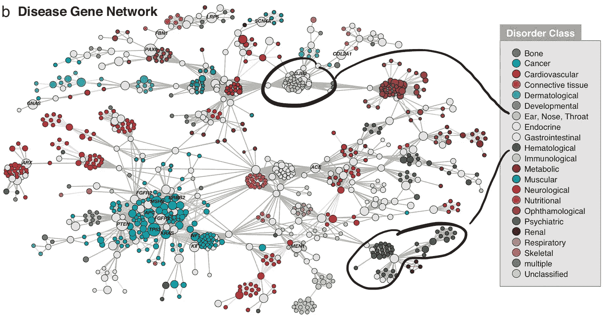

人类疾病基因网络，图片来自[4]

# 网络传播的数学公式——两种不同的观点

## 记号

给定一个(无向)图 *G=(V，E，w)* ，有 *n* 个顶点的顶点集 *V* ，边集 *E* ，权函数 *w* ，设 *A* 为对应的 n 乘 n 维邻接矩阵如下。

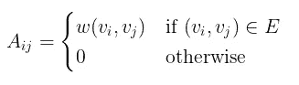

使用对角度矩阵 *D* ，其对角元素是相应节点的度数，我们可以按行或按列对 *A* 进行归一化，分别得到两个新矩阵 *P* 和 *W，*。

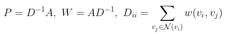

最后，设 *p0* 为独热编码标签向量，其中 *p0* 对应于具有正标签的节点的条目为 1，其他地方为 0。

## 第一个视图—随机漫步

我们可以像在网络上随机漫步一样进行网络传播。在这种情况下，我们要问的关键问题如下。

> 通过 1 跳传播，从目标节点开始并在任何一个具有正标签的节点中结束的概率是多少？

数学上，该操作对应于 *P* 和 *p0* 之间的矩阵向量乘法，产生预测得分向量 *y*

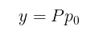

让我们看一个例子。考虑基因 g1、g2、g3 和 g4 的下列子网络。假设 g2 和 g3 被注释为一种疾病，这意味着这两个基因已知对这里感兴趣的疾病有贡献。另一方面，g1 和 g4 对这种疾病没有注释(注意:这并不意味着它们对疾病没有影响，而是说，目前还不知道它们与疾病有关)。

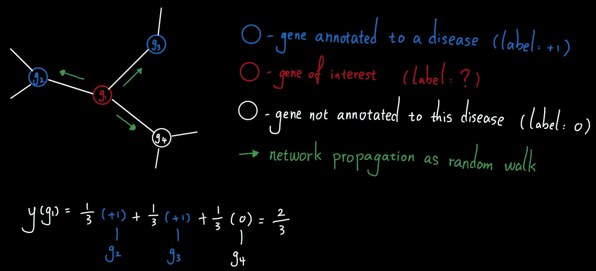

随机游走的网络传播实例，图片作者

为了确定 g1 是否与疾病相关，我们可以简单地设计一个从 g1 开始的 1 跳随机漫步，并看看它落在疾病基因(g2 或 g3)上的概率是多少。简单算了一下，我们看到预测得分是 2/3，相当高。这是有意义的，因为 g1 的三个相邻基因中有两个与该疾病相关，并且根据 GBA 原理，g1 很可能与该疾病相关。

## 第二种观点——扩散

网络传播的另一个观点是通过网络扩散。在这种情况下，我们要问的关键问题如下。

> 有多少“热量”正在扩散到目标节点？换句话说，通过一跳传播，从具有正标签的节点开始，并在目标节点结束的概率是多少？

在数学上，该操作对应于 *P* 和 *p0* 波浪号(T4 P0 的规范化版本)之间的矩阵向量乘法，产生预测分数向量 *y* 波浪号。

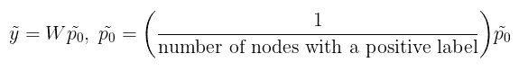

注意: *p0* 的规格化保证了从一个概率分布到一个概率分布的映射，即 *y* 波浪号总和为 1。

让我们回到上面通过网络传播进行疾病基因预测的例子。这一次，我们希望将标签传播作为扩散来执行。结果，由两个注释的疾病基因产生的总“热量”的大部分(5/12)被 g1 收集。因此 g1 很可能与这种疾病有关。

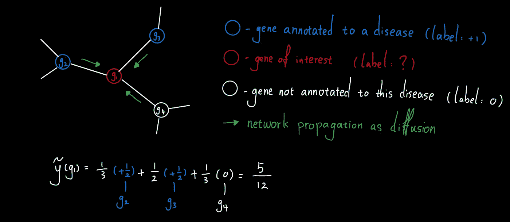

作为扩散的网络传播示例，图片由作者提供

# 超越一跳传播

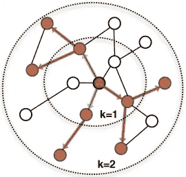

多跳传播的图示，图片来自[5]

一跳传播方法简单而有效。然而，当标记数据稀缺时，这是计算生物学中的典型情况，1 跳传播方法只能计算疾病基因的直接邻居的基因的非平凡预测分数。鉴于人类基因组中有超过 2 万个基因，这显然会导致次优预测。因此，我们可以扩展到 2 跳、3 跳甚至更多，而不是局限于 1 跳的邻域。此处的图说明了从 k = 1 到 k = 2 的 k 跳传播。

## 热网 2 扩散

有许多不同的变体来执行多跳扩散或随机行走。在这里，我们将把 HotNet2 作为一个具体的例子来关注[2]。类似于上面介绍的扩散，HotNet2 算法迭代更新初始“热量”分布 *p0* 波浪号如下。

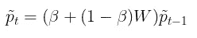

其中β的值从 0 到 1，是将“热量”带回源头的“重启概率”。包含这种重启概率有几个(有些相关的)原因。首先，扩散算子的先前定义给出了当前节点具有的所有“热量”，因此在步骤 *t* ，所有先前的扩散信息都丢失了。添加β有效地保留了每个步骤中的一些热量，因此在步骤 *t* ，分布包含来自先前步骤的所有信息。其次，当 *t* 趋于无穷大时,(非零)β参数保证了热分布的收敛，这进而给出了在 *t=* ∞处的热分布的闭合解

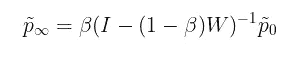

最后，在[1]中已经表明，就生物路径重建、疾病基因预测等而言，与上一节中定义的 1 跳网络传播相比，这种 HotNet2 扩散方法可以产生始终更好的预测。

# 与图卷积的关系

回想一下，图形卷积网络遵循如下的逐层传播规则。

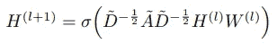

GCN 传播，方程(2)在[6]

其中 H(l)是第 l 层的隐藏特征，W(l)是可学习的参数，并且非线性 sigma (DAD)内部的主导部分是具有自连接的谱归一化邻接矩阵。自连接的作用类似于重启概率，以保留当前迭代的一些信息。

通过下面的替换，我们可以将标签传播完全重构为图卷积的特例。

*   用行规范化(P)或列规范化(W)版本替换谱规范化自连接邻接矩阵
*   将 H(l)替换为 p(l)
*   用恒等式代替非线性和 W(l)(或者干脆忽略这些变换)

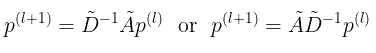

注意，第一次替换不会改变图形频谱，因此仍将执行相同的卷积运算。

现在你知道了，网络传播是图卷积的一个特例！

# 结论

基于关联原则，由于细胞组织的模块化，网络传播被广泛用于计算生物学中的各种任务，如疾病基因预测。我们已经深入探讨了网络传播的两种观点及其与图形卷积的关系。

# 参考

[1] R. Liu，C. A. Mancuso，A. Yannakopoulos，K. A. Johnson，A. Krishnan，[监督学习是基于网络的基因分类的精确方法](https://doi.org/10.1093/bioinformatics/btaa150) (2020)，*生物信息学*

[2] L. Cowen，T. Ideker，B. J. Raphael，r .莎兰，[网络传播:遗传关联的万能放大器](https://doi.org/10.1038/nrg.2017.38) (2017)， *Nat Rev Genet*

[3] V. Spirin 和 L. A. Mirny，[分子网络中的蛋白质复合物和功能模块](https://doi.org/10.1073/pnas.2032324100) (2003)，*美国国家科学院院刊*

[4] K. Goh，M. E. Cusick，D. Valle，B. Childs，M. Vidal，A. Barabasi，[人类疾病网络](https://doi.org/10.1073/pnas.0701361104) (2007)，*美国国家科学院学报*

[5] W. L. Hamilton，R. Ying，J. Leskovec，[大型图上的归纳表征学习](https://arxiv.org/abs/1706.02216) (2017)， *arXiv*

[6] T. N. Kipf 和 M. Welling，[利用图卷积网络的半监督分类](https://arxiv.org/abs/1609.02907) (2016)， *arXiv*