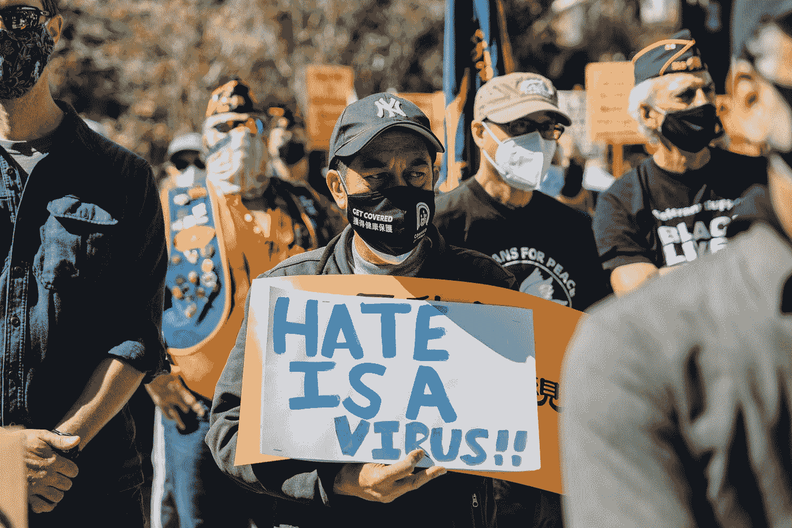

# 网络建模提出了消除网络仇恨的新策略

> 原文：<https://towardsdatascience.com/network-modeling-suggests-novel-strategies-to-eliminate-online-hate-b9d312e35c43?source=collection_archive---------33----------------------->

## 乔治华盛顿大学和迈阿密大学的研究人员基于他们的分析提出了一种新方法。

照片由 [JJ 英](https://unsplash.com/@jjying?utm_source=medium&utm_medium=referral)在 [Unsplash](https://unsplash.com?utm_source=medium&utm_medium=referral)

网络仇恨是社交媒体上的一个猖獗问题。它不仅会造成歧视性骚扰的有害环境，还会煽动现实世界的暴力和仇恨犯罪。由于创建一个匿名账户很容易，有大量的仇恨者，而且追踪所有事件的挑战很大，监管这些平台很困难。寻找新的解决方案仍在继续。

# 今天的反仇恨方法

打击网上仇恨的典型方法是本地或平台范围的内容审核和政策执行，有时通过机器学习工具来增强。内容审核成本高且耗时，因为大多数情况下，最好手动完成。然而，即使每个仇恨事件都由工作人员审查，人类版主也远非万无一失。[适度会对心理健康造成巨大的伤害，主持人甚至会相信他们被雇来打击的阴谋论。因此，在平台范围内开展有效的反仇恨活动几乎是不可能的，更不用说在互联网范围内了。](https://www.cnn.com/2019/02/28/tech/facebook-google-content-moderators/index.html)

已经进行了许多分析，为社交媒体平台推荐不同的策略和政策。通常，重点是监控或引导个别不良行为者，或压制整个意识形态，前提是它们是仇恨意识形态。前者过于精细，不能有效地衡量，而且在许多情况下，公众意见的转变是团体而不是个人的属性。后者使平台容易受到审查的指责。

亚历山大·沙托夫在 [Unsplash](https://unsplash.com?utm_source=medium&utm_medium=referral) 上的照片

将在线社交媒体社区建模为网络似乎是反仇恨研究最有效的途径之一。尽管人类行为是复杂的，但人类社会网络与生物网络、计算机网络和其他类型的网络共享许多属性。网络分析允许研究人员在一组简化的条件下测试打击仇恨的不同策略。

# 来自约翰逊*等人*的小说策略

一份关于网络仇恨的特别有趣的网络分析由 [Johnson *等人*发表。2019 年，在期刊*自然*T5。在这项研究中，在线仇恨被建模为网络的网络——跨越平台、国家、语言和仇恨类型的仇恨网络。](https://www.nature.com/articles/s41586-019-1494-7)

约翰逊*等人*。与其他建模方法相比，的建模方法使用了稍微不同的范例。它们将每一个仇恨集群表示为具有将仇恨传播到另一个集群的特定概率，当仇恨内容传递到监管更好的平台时会产生成本。他们使用公开可用的数据，并特别关注高度监控的脸书和不那么高度监控的 Vkontakte 之间的仇恨流。

[Jason Leung](https://unsplash.com/@ninjason?utm_source=medium&utm_medium=referral) 在 [Unsplash](https://unsplash.com?utm_source=medium&utm_medium=referral) 上的照片

约翰逊*等人*。我发现，全面的、特定于平台的监管只会导致用户转移到监管不那么严格的平台，从而形成网络仇恨的“黑池”。经过伪装，这种仇恨往往会蔓延回最初监管更好的平台。所以，对于打击网络仇恨，约翰逊*等人*。建议与目前使用的策略稍有不同的策略。基于他们的模型，他们推荐了四种方法，主要是基于孤立或分裂仇恨团体:

1.  **关闭较小的讨厌集群。**研究发现，仇恨集群的规模遵循幂律分布。关闭达到一定规模而不是最大规模的仇恨集群的原因是，瞄准最大规模只会让新的仇恨集群重新形成。另一方面，针对已经达到一定规模的仇恨集群，在它们变得太大之前，被证明可以防止集群增长。另一个优势是较小的仇恨集群更容易被发现，因为它们的数量更多。
2.  **随机封禁可恶用户。试图禁止一个平台上所有可恶的用户可能会导致他们迁移到另一个平台，并受到审查的指控。另一方面，随机禁令不必基于个人身份信息，也可以瓦解网上的仇恨团体。随机禁止的用户可以来自与平台相同的国家，以最好地利用社交媒体公司的内部法律知识。然而，团体可能会对随机禁令做出明确的反应。他们如何反应还没有研究过。**
3.  **将仇恨集群与反仇恨集群结合起来。**大量互联网用户致力于消除仇恨。如果仇恨集群与这些群体接触，他们就是分裂的。他们变得不太可能采取激进的下一步措施，也不太可能在现实世界中做出令人憎恶的行为。虽然这种方法可能不需要平台方面的节制，但研究估计，赶走最后的仇恨者需要很长时间。这种方法的其他缺点是，当人们遇到相反的观点时，他们可能会拒绝参与或他们的立场可能会变得强硬。反仇恨的用户也可能变得激进。研究中没有分析这些可能性。
4.  **将仇恨集群与其他不同意的仇恨集群联系起来。**这种方法利用了许多仇恨团体的一个特点——他们与其他仇恨团体存在严重分歧的倾向。例如，一些白人至上主义者支持统一的欧洲，另一些人反对。这项研究表明，反仇恨用户可以促进对欧洲统一持反对意见的白人至上主义者进行接触。他们的内讧可以防止进一步的激进化和仇恨集群的进一步增长。只有部分仇恨集群表现出这种属性。此外，没有研究当遇到相反的观点时，观点可能会变得强硬的可能性。

照片由 [dole777](https://unsplash.com/@dole777?utm_source=medium&utm_medium=referral) 在 [Unsplash](https://unsplash.com?utm_source=medium&utm_medium=referral) 上拍摄

约翰逊*等人*。的范例和方法有许多优点。他们的模型和提出的策略不需要个人信息，这种信息会成为隐私问题。它们也不需要社交网络之间的明确协调，社交网络可能会将彼此视为行业竞争对手，并可能会关注机密信息的共享。

# 对抗网络仇恨的未来

虽然 Johnson *等人*的方法可能很有前途，但需要在更现实的条件下进行进一步的研究，以评估其有效性。相对较少的研究采取了网络建模的方法，额外的网络模型可以帮助阐明打击网上仇恨的方法。

约翰逊*等人*。例如，特别关注三 k 党仇恨群体，因为他们的符号很容易识别。并非所有类型的网上仇恨都表现出这种特性——例如，巴以仇恨可以有许多不同的形式。分析其他类型的仇恨、其他平台和其他模型表示可以补充这项研究。

这种适度的方法也需要在现实世界的社交媒体平台上进行测试。这可以在试点规模上进行，如果成功和经济，将越来越广泛。不需要平台间大规模协调的方法，如 Johnson *等人*中推荐的方法。，更适合小规模测试。

由[奇拉尤·特里韦迪](https://unsplash.com/@rc820?utm_source=medium&utm_medium=referral)在 [Unsplash](https://unsplash.com?utm_source=medium&utm_medium=referral) 上拍摄的照片

就算约翰逊*等人*。的方法或它们的变体奏效了，但它们不是灵丹妙药。他们只会减少而不是消除网上的仇恨。即便如此，消除一些网上的仇恨就像打击犯罪一样。它让互联网和世界对每个人都更安全、更健康。