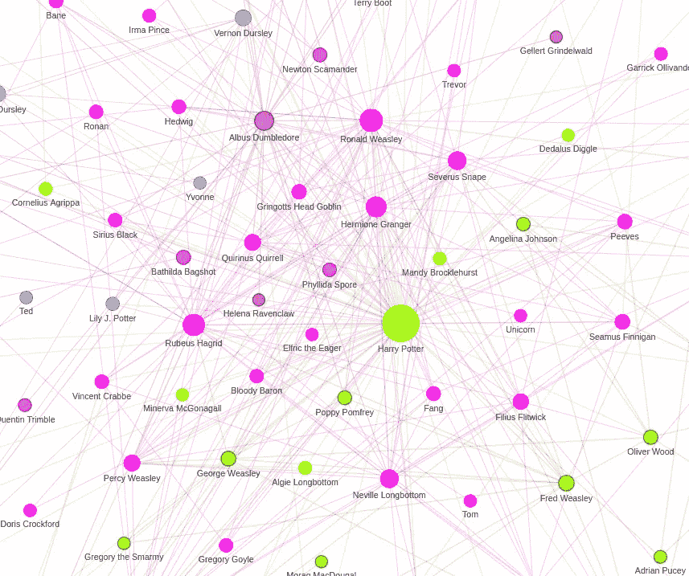
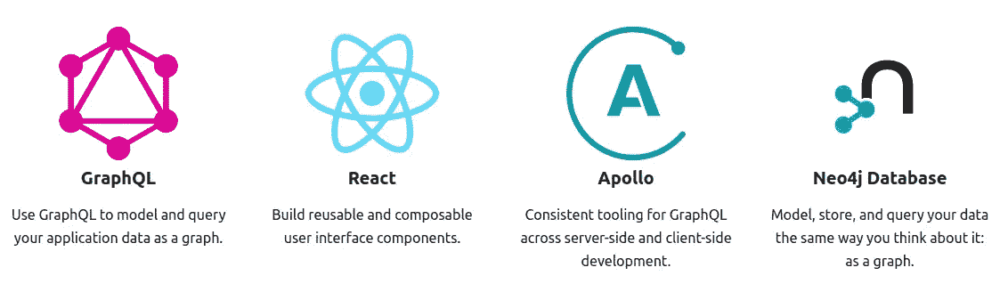
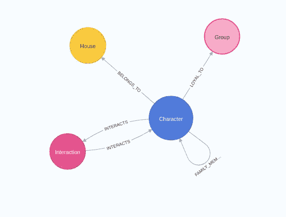
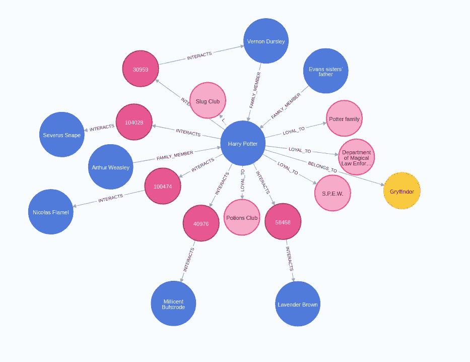

# 使用 GRANDstack 的网络可视化

> 原文：<https://towardsdatascience.com/network-visualizations-with-grandstack-a07deb0a0c3a?source=collection_archive---------27----------------------->

## 了解如何结合 Neo4j、Graphql 和 React 来开发一个图形探索工具



哈利波特世界的网络可视化。图片由作者提供。

这些年来，我参与了几个 Neo4j 项目。几乎所有的项目都有一个共同点，即需要开发一个定制的网络可视化工具，使最终用户无需学习任何 Cypher 查询语言语法就可以浏览图形。这篇博文将展示我开发的一个简单的网络可视化工具，它可以让你可视化并探索哈利波特的世界。可视化应用程序是使用 GRANDstack 构建的。所有代码都可以在 [GitHub](https://github.com/tomasonjo/neo4j-hp-viz) 上获得。



图片来自 https://grandstack.io/的[。由 4.0 在 CC 下授权。](https://grandstack.io/)

[大钉](https://grandstack.io/)由四部分组成:

*   Neo4j 数据库:存储网络数据的原生图形数据库
*   graph QL:API 的数据查询和操作语言
*   Apollo:一套协同工作来创建 GraphQL 数据流的工具。
*   React:一个 JavaScript 库，用于构建基于组件的可重用用户界面

## Neo4j 数据库

Neo4j 是一个本地图形数据库，适合存储、操作和查询网络数据。如果你是一个完全的 Neo4j 初学者，想了解更多，建议你看看 [Neo4j 介绍页面](https://neo4j.com/developer/get-started/)。

《哈利·波特》网络数据来自我不久前写的一篇博客，在这篇博客中，我使用了 [NLP 来提取《哈利·波特》和《魔法石》中人物之间的联系。图表模式模型如下:](https://medium.com/neo4j/turn-a-harry-potter-book-into-a-knowledge-graph-ffc1c45afcc8)



哈利波特宇宙图形模式。图片由作者提供。

在我们图表的中心是这本书的人物。有些角色属于像格兰芬多或斯莱特林这样的霍格沃茨学院。人物也是忠于各个群体的。例如，赫敏·格兰杰致力于促进小精灵福利的*协会。*网络还包含人物之间的家庭关系信息。最后，角色之间的交互也存储在数据库中。这是一个关于哈利波特的子图可视化示例:



围绕哈利波特的样本子图。图片由作者提供。

我已经在 [GitHub 库](https://github.com/tomasonjo/neo4j-hp-viz)中添加了数据集文件以及如何将数据加载到 Neo4j 中的说明。

## GraphQL 端点

GraphQL 最初由脸书开发，后来在 2015 年公开发布。GraphQL 是一种用于 API 的查询语言和服务器端运行时，它优先向客户端精确地提供它们请求的数据。GraphQL 服务是通过定义类型和这些类型上的字段，然后为每个字段提供函数来创建的。Neo4j 开发了一个 [GraphQL 库](https://github.com/neo4j/graphql)，可以快速开发与 Neo4j 数据库交互的 GraphQL 服务器。此外，该库自动提供检索 GraphQL 模式中定义的类型和字段所需的函数。当然，如果您愿意，您总是可以为任何字段提供一个定制的解析器。

这里，我在模式中定义了两种类型。类型名必须与 Neo4j 中的节点标签相同。Neo4j GraphQL 库默认提供完整的 CRUD 支持。在我们的网络可视化工具中，我们将只从 Neo4j 读取数据，从不更新数据库。由于我们不需要完整的 CRUD 支持，我们可以将创建、更新和删除突变排除在生成之外。您可以将应该通过 GraphQL 端点可用的节点的属性包含在一个类型的字段中。

例如，我们可以使用这两种模式类型在客户机中检索关于 House 或 Group 节点的信息。检索房屋节点信息的 GraphQL 查询示例如下:

```
query house {
   houses {
     name
   }
}
```

这个查询的结果是:

```
{ "data": {
   "houses": [
   { "name": "Gryffindor"},
   { "name": "Slytherin"},
   { "name": "Hufflepuff"},
   { "name": "Ravenclaw"}]
  }
}
```

嗯，那很简单！对于基本的 CRUD 操作，您甚至不需要了解任何 Cypher 查询语言。Neo4j GraphQL 库还提供了对分页、排序和过滤查询的支持。在[文档](https://neo4j.com/docs/graphql-manual/current/)中了解更多信息。接下来，我们可以为一个角色构造一个模式类型。

字符类型有点复杂。这里，我们介绍了`@relationship`指令。如果你还记得图形模式，一个角色可以属于一个家族，也可以忠于一个团体。为了检索关于角色的房子的信息，我们必须遍历 BELONGS_TO 关系。在`@relationship`指令中，您指定要遍历的关系类型及其方向。关系的方向可以是传出或传入。

我们的应用程序包括一个自动完成特性。我们将使用 Neo4j 的全文搜索特性来实现前端的自动完成功能。您可以在`Query`类型下定义定制的 GraphQL 查询。

这是我们需要为 GraphQL 服务器生成的大部分代码，以便与 Neo4j 交互。我还添加了交互类型，但是它非常基本，没有引入额外的功能，所以我在这里跳过了它。

## 前端反应组件

现在我们已经准备好了数据库和 GraphQL 服务器，我们可以继续开发前端了。我已经使用了 [vis-react](https://www.npmjs.com/package/vis-react) 进行网络可视化。我选择它是因为它同时公开了节点/边数据集和网络对象。我们需要节点/边数据集来创建动态网络可视化，而网络对象用于添加交互性。

Apollo 客户端库提供了两个 React 挂钩，用于从 GraphQL 端点检索数据。首先是`useQuery`钩。当 react 组件装载和呈现时，Apollo 客户机自动执行指定的查询。您可以如下定义`useQuery`挂钩:

首先，您需要定义 GraphQL 查询。在这里，我指定要检索 PageRank 值大于 0，16 的所有字符。此外，我只对 name、pagerank 和 community 字段感兴趣，所以我可以指定查询只检索这些字段。接下来，您可以通过使用 useQuery 功能来定义 Reach 挂钩。最后，将获取的数据与交互信息相结合，然后输入到 vis-react 库中，以生成下面的网络可视化。


哈利波特世界的网络可视化。图片由作者提供。

Apollo 客户端库提供的第二个 React 钩子是`useLazyQuery`。`useLazyQuery`钩子是为响应其他事件而运行查询而设计的。例如，您可以通过单击按钮来执行查询，或者在我们的示例中，通过在可视化中选择一个节点来选择一个字符来填充弹出窗口。

然后，在 characterData 别名下的函数 return 中可以获得角色的数据。注意，我在 GraphQL 查询中使用了`where`谓词来获取特定字符的数据。我已经使用了 [react-modal](https://www.npmjs.com/package/react-modal) 库来生成弹出窗口，因此代码如下所示:

有时您希望能够在函数中访问 GraphQL 返回。在我们的示例应用程序中，我们需要将自动完成选项从函数返回到输入组件。要实现这一点，您可以访问 Apollo 客户端，并等待查询通过异步函数完成。

通过组合自动完成、弹出和其他查询，我创建了以下网络探索组件:


哈利波特网络示例探索。作者视频。

## 结论

希望这篇博文能帮助你开始大规模的网络探索和可视化。如果你有任何想法如何改善这个应用程序，请让我知道生长激素问题或创建一个拉请求。

和往常一样，代码可以在 [GitHub](https://github.com/tomasonjo/neo4j-hp-viz) 上获得。