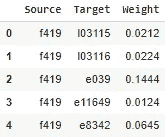
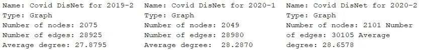
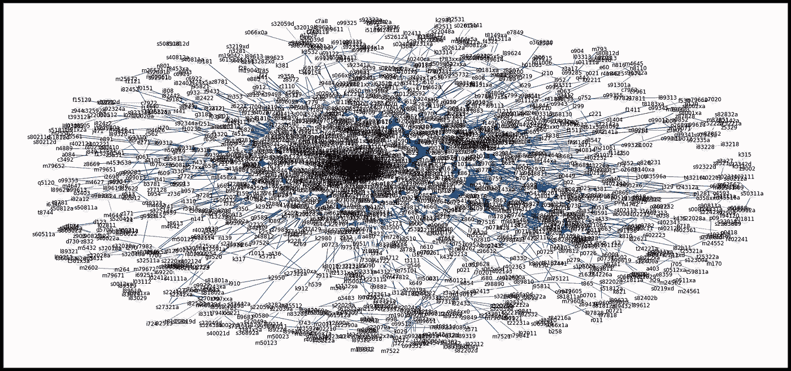
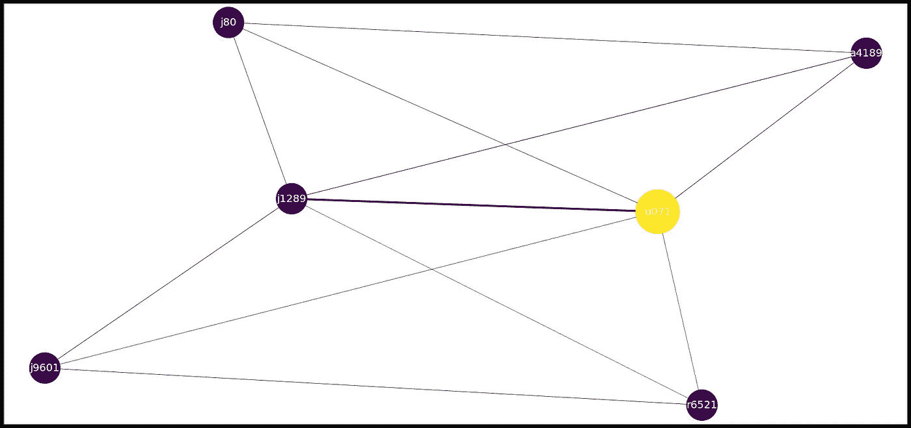
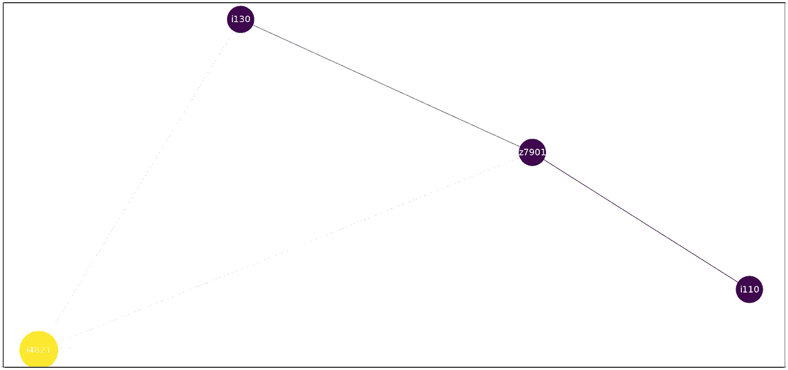
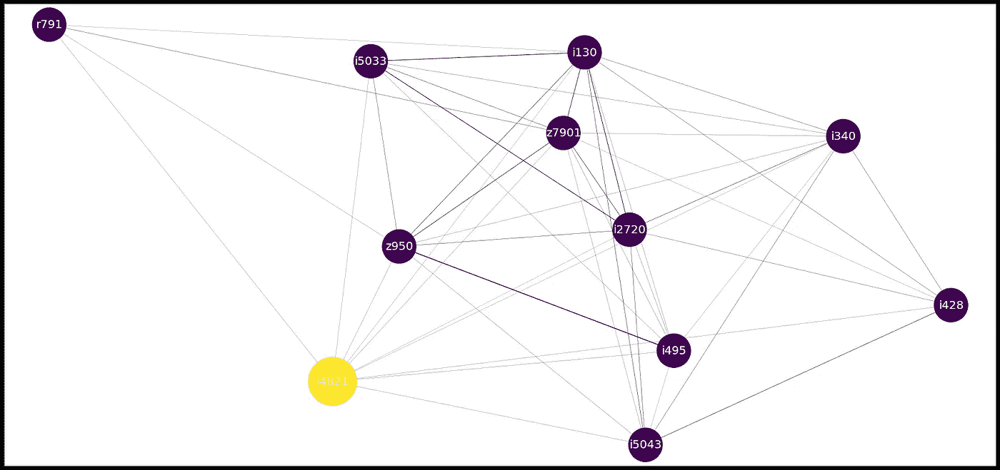
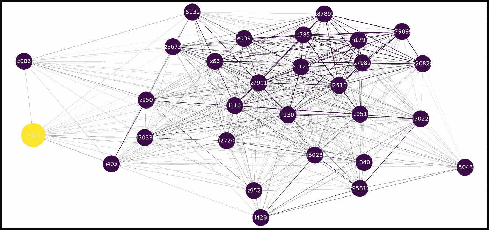

# 操作子图的代码演示

> 原文：<https://towardsdatascience.com/networkx-code-demo-for-manipulating-subgraphs-e45320581d13?source=collection_archive---------18----------------------->

作者图片

# 介绍

NetworkX 是一个用于研究图形和网络的 Python 库。这是一个代码演示，展示了我们如何使用 NetworkX 进行子图比较，以及如何操作参数来绘制图形。如果您以前不熟悉 NetworkX，它会告诉您如何将加权边列表转换为 NetworkX 图，以及如果您想要研究超级复杂网络图中的特定节点，尤其是在提供了权重属性的情况下，您可以做些什么。

# 数据

我们正在使用电子健康记录(EHR)数据集，其中包括亚利桑那州 2019 年下半年至 2020 年下半年住院患者的诊断。该数据集包含近 9000 个独特的诊断。每个诊断都标有 icd10 编码。在住院期间，每个病人可能有不止一种诊断。通过研究 EHR，我们可以捕捉疾病或诊断之间的共现关系。

IC D10([https://icdcodelookup.com/icd-10/codes](https://icdcodelookup.com/icd-10/codes))是国际疾病和相关健康问题统计分类(ICD)的第 10 版，是世界卫生组织(世卫组织)制定的医学分类清单，指明了疾病、体征和症状、异常发现、主诉、社会环境以及伤害或疾病的外部原因。

我们手动将数据集分为三个时间戳:2019 年下半年、2020 年上半年和 2020 年下半年，以研究疾病网络在疫情的不同阶段如何变化。为了用数据实现 NetworkX，我们首先将数据转换成一个加权边列表，它有三列:源、目标和权重。

图 1:样本数据

# 密码

## 将边列表转换为网络 x 图:

图 convert _ graph()的示例输出

## 用边权重画出整个图

下面是一个输出示例:

图 3:示例图

正如我们从图 3 中看到的，由于图中有大量的节点和边，这个图非常复杂，很难阅读。如果您的网络很小而且很简单，那么它现在应该会返回一个明显的视图。

## 研究图中的某个节点

因此，如果我们想特别了解 2020 年上半年冠状病毒(u071 代表新冠肺炎)的情况，我们需要做的是键入:

*drawnodegraph(图 2，“u071”，weightbar=0.1)*

图 u071 的疾病网络

**用法示例(时间演变图对比):**

假设我们想要研究“永久性房颤”(i4821)的疾病网络在疫情的三个不同时间点上是如何变化的。通过使用上面的代码，我们可以看到:

图 5:疫情之前的 i4821 网络

图 6:疫情开始时 i4821 的网络

图 7:疫情疫情期间 i4821 的网络

很明显，在疫情之前，只有少数疾病与永久性房颤显著相关(i4821)。然而，随着 2020 年时间的推移，网络变得越来越复杂。

# 结论

在这个代码演示中，我们向您展示了如何使用 NetworkX 来操作子图。您可以使用边的权重来更改图形中边的宽度。当然，你也可以在此基础上进行其他变换，例如:使用权重来改变节点的大小，等等。最后，我们还向您展示了这段代码的一个用途——进行时间演化图比较。

***请随时与我联系***[***LinkedIn***](https://www.linkedin.com/in/jinhangjiang/)***。***

# 相关阅读:

[使用 NetworkX、Gephi 和 Node2Vec 分析疾病共现](https://medium.com/analytics-vidhya/analyzing-disease-co-occurrence-using-networkx-gephi-and-node2vec-53941da35a0f)

*我是在堪萨斯大学商学院商业分析助理教授*[*Karthik Srinivasan*](https://business.ku.edu/people/karthik-srinivasan)*博士的指导下完成这篇博客的。*