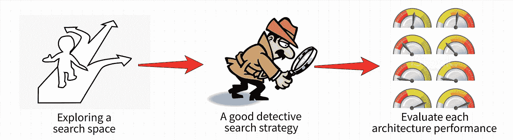
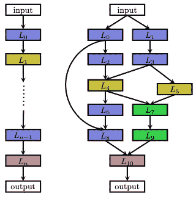
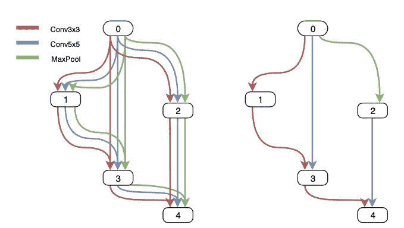

# 神经架构搜索:一个模型创建公司

> 原文：<https://towardsdatascience.com/neural-architecture-search-a-model-creation-company-602c6ba4f576?source=collection_archive---------21----------------------->

## AutoML 如何工作？我们如何在不同的设备上部署模型？看看 NAS 和谷歌大脑的最新进展:BigNAS

图片来自 [Unsplash](https://unsplash.com/photos/7aUgMBxhVNU) by [beasty](https://unsplash.com/@beastydesign)

 [## 通过我的推荐链接加入 Medium-Stefano Bosisio

### 作为一个媒体会员，你的会员费的一部分会给你阅读的作家，你可以完全接触到每一个故事…

medium.com](https://medium.com/@stefanobosisio1/membership) 

当我在学习和接触机器学习时，我总是想知道 Google AutoML 如何能够为给定的任务选择合适的模型，返回有希望和令人鼓舞的度量结果。研究越来越多，当我发现神经架构搜索(NAS)的力量时，我感到高兴和兴奋，这是创建新模型的关键，它运行在 AutoML 下面。

如果一方面我们有深度学习，这可以被视为自动化特征工程的成功例子——即我们不必花费数小时来寻找有前途的特征，因为架构本身可以在网络中处理这一点——另一方面，ML 未来的下一个有希望的步骤是自动创建新的强大模型。这一步可以由 NAS 来完成，NAS 正在成为一个越来越令人兴奋的研究领域。

为了理解 NAS，我们必须参考 [Elsken、Metzen 和 Hutter](https://jmlr.org/papers/v20/18-598.html) 的综述，他们将 NAS 方法分为三个步骤:

*   这是一个建筑原则生活的空间(例如 CNN、LSTM、RNN 等等)。一些体系结构和任务性能的先验知识有助于快速识别新的模型，减少这个空间的维度；
*   `search strategy`:我们如何探索搜索空间？搜索策略应该为我们提供如何执行模型研究的规则，在快速找到一个性能良好的架构以避免过早收敛之间进行折衷；
*   `performance estimation strategy`:我们最终需要一种策略来检测所有创建的架构的性能，满足计算成本。

图 1:将 NAS 分解为三个步骤:1)探索搜索空间，操作(例如池化、卷积等)就在搜索空间中进行；2)有一个好的侦探策略，为特定的任务挑选正确的片段；3)为任何创建的架构建立一个评估系统。【图片由作者提供。]

## 搜索空间

我们可以天真地认为通过创建 NN 架构作为一系列链状结构的神经网络来填充我们的搜索空间。在这种情况下，层 *L_i* 的第 *i 个*输入是层 *L_(i+1)的输入。*因此，我们可以认为相空间由 *n* 个最大层和每层的任何种类的操作组成，从卷积到池化，以及与每个操作相关联的任何超参数值。这很好，但是在这样的空间中进行有效搜索的计算成本太高了。

第二种方法是*多分支网络。*这里，我们将每个层与一个函数 *g_i(L_i，…L_out)* 相关联，该函数允许来自一个层的输出的组合成为随机新层的输入。此外，每个分支由保持输入维度的*单元* : *正常单元*和减少空间维度的*减少单元*组成。通过将每一个细胞堆叠在一起，我们创造了最终的建筑。小区例子可以是 LSTM 块或卷积架构以及 rnn。

图 2:左边是链式结构的神经网络，右边是多分支网络。图片来自 [Elsken 的论文。](https://arxiv.org/abs/1808.05377)

用编码术语来说，实现搜索空间的最初尝试需要回答这些问题:

*   我们想要模仿什么样的建筑？能不能从人类已知的建筑开始？我们想从新的开始吗？
*   我们想要多少层？我们能强加一个限制吗？
*   我们有多少计算能力？这要花多少钱？
*   我可以使用哪些 Python 包？Keras？Tensorflow？

试想一下:虽然我们可能会想到小型神经网络，但搜索空间中的参数数量会非常多。为了减少计算成本，我们可以为每个隐藏层中的神经元数量考虑一个列表。从那里，我们可以对一组激活函数做同样的事情。最后，我们甚至可以考虑在建筑功能中插入已知的架构:

## 搜索策略

既然我们已经定义了搜索空间的组成部分，我们需要一种方法来搜索正确的部分。这是一个奇妙的研究领域，有很多充满活力和令人兴奋的想法。受神经进化(例如遗传算法)的启发，每个新架构都可以基于贝叶斯优化或进化方法来构建。另一种有前途的方法是强化学习方法，其中状态是部分训练的架构，回报是模型的性能，动作是对最终模型的功能保持突变。更近的例子有*蒙特卡罗树搜索*或*爬山*算法或*连续松弛*

在 Python 中，我们可以考虑类似的东西来实现搜索策略:

## 性能评估

为了进一步定义搜索策略，我们需要找到一种合适的方法来计算每个创建的模型的性能指标。天真地，我们可以考虑根据训练数据对所有生成的模型进行评估，但考虑到我们生活的巨大搜索空间，这将需要巨大的计算成本。但是，我们可以找到一些解决办法:

*   *较低的逼真度*:可以根据充分训练后的实际表现的较低逼真度来评估表现。这可以是对数据子集或较低分辨率的数据进行训练，或者每层使用较少的过滤器和单元。
*   *学习曲线的外推*:只需从早期生成的学习曲线进行几个时期的训练，就可以外推性能
*   *预测性能*:可以使用另一个模型来预测各种架构的性能
*   *一次性架构*:这是一个基于“图形”的程序。对于每个创建的架构，都有一个包含所有架构的不同部分的一次性模型(例如，一个架构 1 的 CNN，架构 2 的 LSTM，等等)。然后，对该模型进行训练，其权重在所有现有体系结构中共享，并用于检索性能

图 3:一个简短的架构方法:创建的架构显示在左侧。不需要评估每一个单独的模型，可以评估一个一次性的模型，它包含了所有架构的各个部分。由此，权重在所有现有的架构之间共享。图片来自 [Elsken paper。](https://arxiv.org/abs/1808.05377)

如今，一次性架构被广泛使用。显而易见，我们可以通过训练一个超级网络，然后对几个候选人进行排名来提高效率。然而，通常有彻底的后处理来从每个候选中检索精确的准确性。在搜索之后，需要对权重进行补偿、重新训练和微调。遗憾的是，这些步骤带来了额外的计算成本，以及部署阶段的复杂性。的确，*每个候选人在不同的硬件上有不同的表现*。例如，即使两个设备可能有相同的 CPU，如在移动电话中，硬件可能更喜欢一个网络架构，返回不同的精度和性能。这个工程方面将我们带到了最后一步:如何正确部署 NAS 模型？

## BigNAS:为合适的硬件找到合适的型号

ML 中最被忽视的需求之一是资源感知。这意味着我们经常需要最小化资源使用、延迟或失败。谷歌大脑正在用 BigNAS 解决这个问题，这可以被视为一个两步过程:

*   首先，*训练一个大的单级模型*，其重量在展开时就可以使用。考虑到这个模型的规模，我 *t 可以分割不同的子架构*，这对于不同硬件上的即时推断和部署来说非常方便。
*   在给定硬件资源限制(例如，CPU 大小、延迟、预算)的情况下，找到最准确的模型

BigNAS 是 NAS 的一种新范式，它已被证明在广泛的硬件架构中超越了最先进的 ImageNet 分类模型搜索。为了让 BigNAS 工作，我们只需要几个简单的步骤:

*   三明治规则(Sandwich Rule):这个有趣的名字是由 Yu 和 Huang 起的，定义了一种策略，在每次迭代中训练最小和最大的模型。在 BigNAS 环境中，在每个训练步骤中，针对最小的子模型和最大的子模型以及其他一些随机的子模型来处理小批量的数据。然后，来自采样子代的所有梯度被聚集并用于更新单阶段模型中的权重
*   原位提取:这里的想法是将最大的模型从真实数据中获得的知识转移到所有较小的子模型中。特别地，来自最大模型的预测标签被用作所有较小子模型的训练标签。

最后，通过*由粗到细*的策略选择最佳模型。在这种方法中，首先搜索有希望的候选网络的粗略框架，然后用细粒度的变化进行采样。在这个设置中，定义了有限的输入分辨率集、深度集和核集来对模型进行基准测试。然后，挑选最佳模型并随机变异(例如，网络分辨率、阶段深度、内核大小)以越来越多地改进最终模型。

这项工作有助于进一步扩展 NAS，这可能会在某个时候为我们带来新的强大的体系结构，以解决越来越复杂的任务。然而请记住，总要付出一定的代价，那就是理解模型在做什么，以及这些特性如何在模型的决策过程中发挥作用。

请随时给我发电子邮件询问问题或评论，地址:stefanobosisio1@gmail.com

或者，你可以在 Instagram 上联系我:【https://www.instagram.com/a_pic_of_science/ 