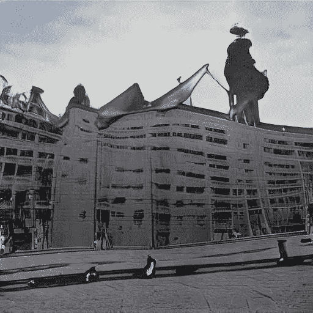

# 神经和服，或人工智能的互文性

> 原文：<https://towardsdatascience.com/neural-kimono-or-intertextuality-of-ai-218fda33ab41?source=collection_archive---------22----------------------->

## 用人工智能创造古代服装的新图案

和服设计，由人工智能创作//图片由 Merzmensch 提供

**【朱丽娅·克里斯特娃】**在她的散文中写道“**文字、对话与小说**”[PDF](https://cpb-us-w2.wpmucdn.com/u.osu.edu/dist/3/29382/files/2016/03/Kristeva-Word-Dialogue-and-Novel-2kauf14.pdf)关于文本，它们分别是“*对另一种【文本】*”的吸收与转化。她推广了术语“**互文性**”，这是

> 错综复杂的引文。

没有原文；它们基于不同的先前作品，不断改变我们的叙述。

文本是纹理——它们是我们现代以文字为基础讲故事的材料，其模式、主题、思想，与古代世代相传的不断变化的故事相比，确实具有永恒变化的其他特征(以“中国耳语”游戏的方式，在及时转换的上下文中改变内容)。

随着人工智能时代的后作者叙事，我们不得不重新思考**互文性**作为**生成驱动力**。如果**基于作者的文本**是由有意识和潜意识的人类思想体(作者的知识、经验、偏见、成见、成见、扭曲的记忆)创建的，那么**作为创造者的人工智能**在以前的数据集上接受训练，并通过重新解释、重新组合已知的特征、模式、视角(就像在基于自我关注的语言模型 GPT-3 中一样)来生成新的作品。

> 因此，模型越大，知识的潜在空间就越丰富——越多创造性的完成出现。

# 接受记忆训练

视觉模型以不同的方式工作——通过检测和重新解释可见的图案、颜色和形状。训练数据库越多样化——越令人惊讶和多样的图像完成，[就像我的项目“merz mory”](/visual-ai-trained-on-my-memories-a54c55967c28?sk=3e37e2716ccee2101ba07025e5bcfd60)一样，由 [RunwayML](https://medium.com/u/2d612be6e147?source=post_page-----218fda33ab41--------------------------------) 驱动。

https://medium.com/r/?URL = https % 3A % 2F % 2 ftowardsdata science . com % 2f visual-ai-trained-on-my-memories-a54c 55967 c28 % 3 FSK % 3d 3e 37 e 2716 ccee 2101 ba 07025 e 5 bcfd 60//图片由 Merzmensch 提供

这里我使用了 StyleGAN2 (FFHQ)模型，它最初是在高分辨率照片人像上进行预训练的。它可以创建 1024 x 1024 的图像。作为动机的面部并没有发挥重要作用，因为在无数次迭代之后，它们消失了，并被修改成来自新数据集的图片。在**默兹莫里**我使用了我的高度异质的摄影收藏——完成相当抽象。在训练(或微调)期间，StyleGAN2 模型创建与原始图像最接近的图像。

两个神经网络相互对抗:

*   **发生器**，试图创造尽可能精确真实的图像，愚弄对方；
*   即**鉴别器，**其任务是检测伪图像并拒绝它们。事实核查！

经过多次迭代后，图像变得越来越接近训练数据集中的原始图像。如果鉴别者不再能够区分真伪，那么训练就可以被认为是成功的。

在 MERZmory 的例子中，我的数据集中有非常不同的图像，所以“最接近原始的”这个概念是不可行的。

MERZmory //图片由 Merzmensch 提供

这种训练的一个有趣的方面是两个对手都非常关注的最突出的视觉特征。他们学会发现它们，产生它们，并揭穿它们。

在我的异构数据集之后，我将我的训练数据限制为仅圆形图像，即在构图中间具有圆形形状的照片:

我的圆形数据集//图片由 Merzmensch 提供

完成变得有点圆——但我在第 500 次迭代时停了下来:初始预训练的人脸仍然可见。圆形人出现了。

圆脸(第 500 步)//图片来自 Merzmensch

在训练这一轮数据集到第 1000 步之后，潜在空间转换到人脸几乎不可识别。最突出的是眼镜，作为一个强有力的主题。

Merzmensch 对圆形数据集//图像的第 1000 次迭代

但是同样，即使已经检测到了一个特征——圆形，原始数据集仍然是异构的，足以创建与原始图像最接近的“相同能量”图像。

# 神经和服

有了**神经和服，**我们就有了另一种情况。

正如我昨天在[公共领域时事通讯](https://publicdomainreview.org/subscribe)中读到的关于和服图案书籍(ca。1900ies)，我受到了启发。

史密森尼图书馆将其中一本图案精美的书籍数字化:

权利:公共领域美国//来源:[https://publicdomainreview . org/collection/unk indo-和服设计](https://publicdomainreview.org/collection/unkindo-kimono-designs)

然而，为了训练，它们在形状和颜色上有所不同。

In opposite, another book by Metropolitan Museum of Art, [Hanafubuki](https://libmma.contentdm.oclc.org/digital/collection/p16028coll7/id/23918/rec/1) [“花吹雪”, “Falling Cherry Blossoms”], from 1904, caught my attention.

Published by Hatubaijo Honda Unkindō in Kyoto [京都市: 本田金之助: 發賣所本田雲錦堂], it provided a variety of Kimono designs, presented in the Kimono shapes:

来自" Hanafubuki" //公共领域的页面

在这里，我们可以看到贯穿整个出版过程的明显的视觉结构:

*   两页展开
*   左右页显示相反的和服方向
*   上面有汉字的描述

唯一的区别是恒定形状中的图案。

**这个集合让我用作和服新神经设计的训练数据集。**

所以我开始训练。

# 训练 AI-和服

第一步仍然显示初始预训练模型:人脸。同样，我使用这种模式不是因为面孔，而是因为该模型具有最佳的输出分辨率，1024 x 1024。

步骤 1，开始 Merzmensch 的 StyleGAN2 训练//图像

这些人并不存在，[正如你已经知道的](/this-item-does-not-exist-2defbac76b39?sk=f444e16f44856396cf97e5939d055211)。

在步骤 310-480 之后，事情变得更令人毛骨悚然

步骤 310//Merzmensch 的图像

第 480 步//图片由 Merzmensch 提供

正如你所看到的，主要的特征是可以识别的:左右页的垂直分割——在每张图片的中间。这张脸即将被一分为二。

在步骤 820，你不能再识别人脸。只有某人的眼镜仍然是一个突出的特征；它甚至继续到步骤 1060

步骤 820 //图片由 Merzmensch 提供

第 1060 步//图片由 Merzmensch 提供

大约在 1600 年，我们已经可以从书中辨认出图案和形状:

步骤 1610

大约需要另外一半的步骤，直到我们有了神经和服的新模式:

在这里，同样的过程也在进行，用人工智能创作的音乐来产生戏剧性的效果。

当然，花、山、浪这些具体的图案已经消失了。但是我们现在看到:

*   和服形状
*   两页展开
*   颜色；色彩；色调
*   类似汉字的涂鸦

在这里我们有新的文本，马赛克的*语录模式*，这是被艾的*转化和吸收*。

人工智能以互文性为驱动方式；它是真实的，对创造新媒体至关重要。但是我们在这里得到了无穷无尽的新变化，这是以前不存在的。

**没有原件。但是有独特性。和新鲜感。**

