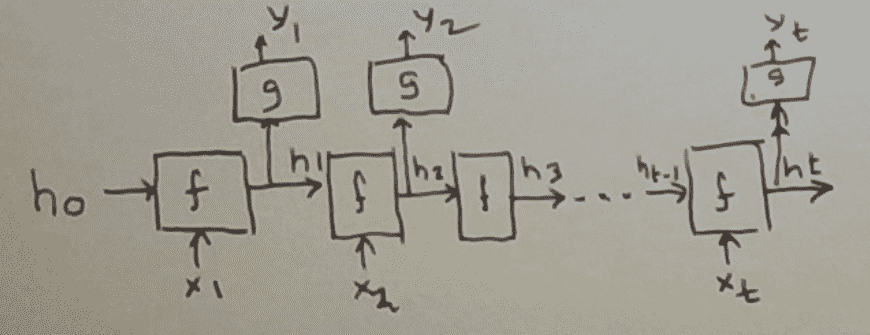
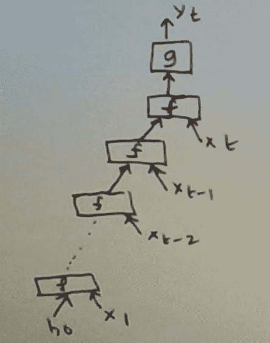
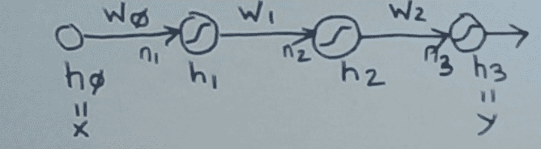
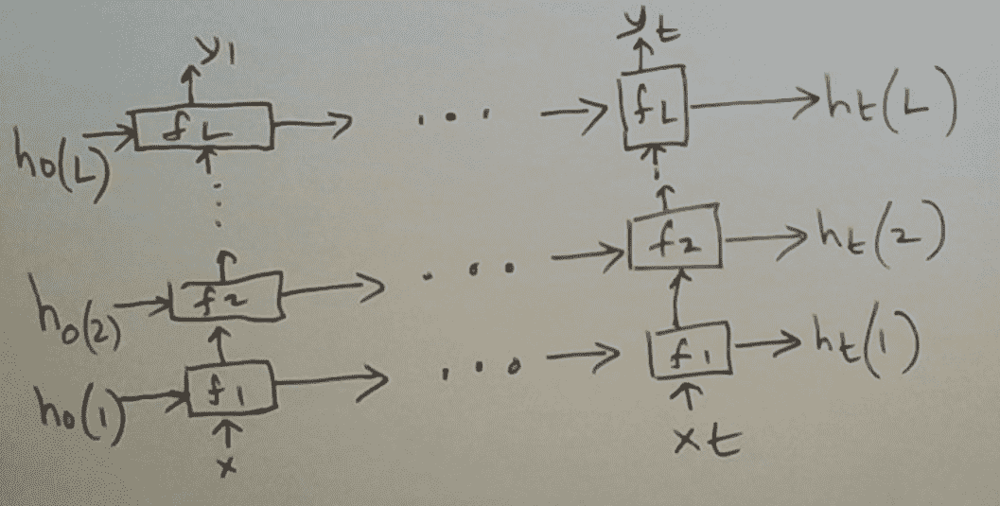

# 神经语言模型

> 原文：<https://towardsdatascience.com/neural-language-models-32bec14d01dc?source=collection_archive---------13----------------------->

## 从前馈到堆叠递归


马库斯·斯皮斯克在 [Unsplash](https://unsplash.com/s/photos/language?utm_source=unsplash&utm_medium=referral&utm_content=creditCopyText) 上的照片

在 NLP 中，语言模型是符号字母表上序列的*概率分布*。语言建模中的一个中心问题是从例子中学习语言模型，例如从句子的训练集中学习英语句子的模型。

语言模型有许多用途。比如…

*   **建议自动完成**:用户在网络搜索引擎或智能手机上键入几个字符(或单词)，可能的扩展就会被建议。
*   **识别笔迹**:基于图像的识别系统增加了语言模型，提高了准确性。例如，即使一个单词不清晰，它也能从上下文中猜出这个单词。
*   **识别语音**:和手写识别一样，用语言模型扩充语音系统可以提高其准确性。
*   **检测并纠正拼写错误**
*   **翻译语言**:为了将文本从一种语言翻译成另一种语言，为这些语言建立语言模型很有帮助。

在[1]中，我们讨论了统计语言模型，这是 20 世纪 90 年代及更早时期的标准范式。在过去的几十年里，出现了一种新的范式:神经语言模型。这就是这篇文章的主题。

为什么神经语言模型胜过统计语言模型？简而言之:它们以最少的人工工程产生最先进的精确度。为什么？简短的回答是:由于近几十年来两项突破的结合——深度神经网络和递归神经网络。(计算能力和训练数据可用性的指数级增长也有很大帮助。)分布式表示，即单词嵌入，也发挥了作用。

在这篇文章中，我们将在语言建模的背景下讨论递归神经网络(包括深度神经网络)。

我们从主方程开始。这些是本帖中最重要的外卖方程式。除了精确定义语言建模问题之外，它们还可以用来构建解决问题的各种方法。

设 *P* ( *w* 1， *w* 2，…， *w* n)表示一个令牌序列( *w* 1， *w* 2，…， *w* n)的概率。学习的目的是从序列的训练集中学习这样的概率。

考虑预测序列的下一个记号的相关问题。我们将此建模为 *P* ( *w* n | *w* 1， *w* 2，…， *w* n-1)。请注意，如果我们可以准确预测概率*P*(*w*n |*w*1， *w* 2，…， *w* n-1)，我们可以将它们链接在一起得到

*P* ( *w* 1、 *w* 2、…、*w*n)=*P*(*w*1)**P*(*w*2 |*w*1)**P*(*w*3 |*w*

大多数学习方法将语言建模作为下一个令牌预测问题。这是一个监督学习的问题。输入为( *w* 1， *w* 2，…， *w* n-1)。我们寻求的输出是 *wn* 可能取的各种值的概率分布。

注意，输出是固定长度的概率向量。(不过，维度可能非常高。几十万到几百万的英语句子语言模型。)

输入不是固定长度的向量。其长度 *n* 不等。在许多用例中， *n* 通常很大，在 100 或 1000 以上。这是造成这个问题困难的首要因素。

统计方法估算*P*(*w*n |*w*1、 *w* 2、…、 *w* n-1)当 *n* 较大时必须做一些假设。没有他们，问题就难以解决。假设 n = 101，字母表只有两个符号:0 和 1。可靠估计*p*(*w*n |*w*1， *w* 2，…， *w* n-1)的最小训练集大小是 2 ⁰⁰.的数量级这是因为输入可以是这些选择中的任何一个，我们希望能够在每种情况下合理地预测下一个令牌。

统计方法中最广泛采用的假设是马尔可夫假设。具体来说，*P*(*w*n |*w*1、 *w* 2、…、 *w* n-1)用*P*(*w*n |*wn*-*k*、…、 *wn* -来近似这假设下一个令牌概率仅取决于最后的 *k 个*令牌。这里的 *k* 是固定的，往往是一个很小的数(2 或 3)。关于这个主题的更多信息，请参见[1]。

这大大简化了问题。代价是无法模拟长期影响。这里有一个来自[2]的长期影响的例子。

简走进了房间。约翰也走了进来。时间已经很晚了，每个人都在漫长的一天工作后走回家。简向 __ 问好

答案是*约翰*。这需要记住约 25 个单词前约翰的出现。

另一个很好的例子来自[4]。

*我在法国长大……我说一口流利的法语。*

预测*法语*需要记住*法语*，这可能在很多句子之前就已经出现过了。

神经语言模型解决了这个“长期影响”的问题。此外，它们还更好地解决了短程影响问题，特别是通过可自动学习的特征向量。(统计方法也可以使用特征；然而，这些都是人为制造的。)

**早期神经语言模型**

早期的神经语言模型之一，如[3]中所述，本质上是前馈。虽然最近的方法现在都是循环出现的，但我们从这个模型开始，因为它有一些深刻的特征，将为后面的方法奠定基础。

和很多统计语言模型一样，这个模型是 *k* 阶马尔可夫。即对于 *n* 大于 *k* ，假设*P*(*w*n |*w*1、 *w* 2、…、 *w* n-1)等于*P*(*w*n |*wn*-*k*

它对输入单词使用分布式表示。分布式表示，最近也被称为单词嵌入，可以追溯到 20 世纪 80 年代。一个单词的分布式表示将其映射到一个三维数字空间。分布式表示由算法以鼓励语义相关的单词在该空间中彼此靠近的方式来学习。

使用学习过的分布式表示的直觉是希望它们能够提取涉及语义相关的单词的有用特征。例如，如果一个人在同一文本中看到 *Paris* 和 *France* ，这可能有助于模型做出涉及上下文 *French* 的合理推断，例如在我们的语言示例中:我说流利的 __ *。*

然后这个模型将 *wn* - *k* ，…， *wn* -1 的分布式表示串联起来。这形成了输入向量，维度为 *k* * *d* 。因为我们希望输出是整个单词词典的概率分布，这个网络使用 *N* 个输出神经元，其中 *N* 是词典的大小。

输入层和输出层之间有一个隐藏层。与任何其他多层神经网络一样，隐藏层将输入映射到特征向量。(神经元是乙状结肠样的，特别是 tanh。)这种映射是通过从每个输入神经元到每个隐藏神经元的可学习权重来完成的。

从隐藏层到输出层的映射使用 softmax 函数。这是因为我们希望输出是输出神经元上的概率分布。softmax 函数由权重参数化，每个(隐藏神经元、输出神经元)对一个权重。

该网络的参数以通常的方式学习，即通过使用随机梯度下降的反向传播。在这个过程中，也可以学习各种单词的分布式表示。可选地，这种分布式表示可以以某种其他方式(例如 word2vec)预先学习，并且仅在这里使用。

值得注意的是，当词典 *N* 的大小很大时(比如以百万计)，涉及输出层的计算成为瓶颈。这是因为特定输入的预测输出需要是整个词典的概率分布。

一个更严重的限制是，这个网络就像典型的统计模型一样，不能模拟相距超过 *k* 个单位的单词之间的影响。在我们的*约翰* - *简*的例子中，我们需要 *k* 至少为 25，我们才有希望做出正确的推断。

显式计算*P*(*w*n |*wn*-*k*，…， *wn* -1)的统计模型需要随 *k* 呈指数增长的内存。这种神经网络模型的伸缩性更好。它使用*k***d***h+h***N*参数，其中 *h* 为隐藏神经元的个数。所以参数的数量只随 *k* 线性增加。

**递归神经网络**

递归神经网络对语言建模很有吸引力，因为它们不受 *k* 的约束。也就是说，原则上，他们可以学习任意的远程影响。也就是说，这样做确实需要一些特殊的工程。

我们将从描述一个基本的 RNN 开始。我们会发现它很难学习远距离影响。然后，我们将讨论对此 RNN 的修改，以缓解这一问题。

**基本 RNN**

作为一个黑盒，即从输入输出接口来看，RNN 乍看起来像一个前馈神经网络。它输入一个矢量 **x** 并输出一个矢量 **y** 。

不过有一个转折。RNN 期望接收向量序列 **x** (1)，…， **x** (T)作为输入，一次一个向量，并输出向量序列 **y** (1)，…， **y** (T)。

在时间 *t* 的输出 **y** ( *t* )不仅受到 **x** ( *t* )的影响，还受到在此之前接收到的输入的整个序列 **x** (1)、…、 **x** ( *t* )的影响。这就是 RNN 强大的原因。并且相关的学习问题具有挑战性。RNN 必须携带状态。好歹它必须把历史 **x** (1)、…、 **x** ( *t* -1)总结成一个状态，我们就称之为 **h** ( *t* -1)，从中可以很好的预测 **y** ( *t* )。当输入 **x** ( *t* )出现时，它首先将其状态更新为 **h** ( *t* )。实际上， **x** ( *t* )成为它看到的输入历史的一部分。然后从 **h** ( *t* )产生输出向量 **y** ( *t* )。

我们可以把它正式写成

```
**h**(*t*) = **f**(**h**(*t*-1),**x**(*t*))
**y**(*t*) = **g**(**h**(*t*))
```

总之，RNN 可被视为由两部分组成:

1.  基于当前状态和新输入更新状态的部件。
2.  将当前状态转换为输出的部分。

第 1 部分让人想起计算机科学中的有限状态自动机。第 1 部分+第 2 部分是计算机科学术语中的有限状态转换器。

FSA 中的状态可以被视为一个分类变量。相比之下，RNN 中的状态是一个多维向量。后者有利于状态的紧凑分布式表示，可以很好地概括，这是现代神经表示的一个主要优势。

锦上添花的是(委婉地说)，RNN 的状态变化和状态到输出行为都可以从一组(*输入序列*，*输出序列*)对的训练集中自动学习。

**状态改变和输出功能**

遵循通常的神经网络“设计模式”,该模式部分受到生物神经网络的启发，并得到统计学的认可，我们将使用

```
**f**(**h,x**) = ***S1***(**Whh*****h** + **Wxh*****x**)
**g**(**h**)   = ***S2***(**Why*****h**)
```

这里的 **S1** 和 **S2** 通常是 s 形函数，通常是双曲正切函数或逻辑函数。

**f** ( **h** ， **x** )计算下一个状态，作为当前状态和通过挤压函数 **S1** 推送的下一个输入的线性组合。 **g** ( **h** )通过挤压函数 **S2** 将输出计算为新状态的线性变换。

**语言建模中的 RNNs**

RNNs 的一个基本用例是在语言建模中。回想一下，在语言建模中，我们的主要兴趣是估计*P*(*w*n |*w*1， *w* 2，…， *w* n-1)。

在 RNN 中对此进行建模的一种自然方式是将 *wn* -1 建模为输入向量 **x** ( *n* -1)，将历史 *w* 1， *w* 2，…， *w* n-2 建模为状态向量 **h** ( *n* -1)和输出 **y** (n 出于这些目的，使用 softmax 函数作为输出函数 **S2** 是很自然的。而不是挤压函数。 **S2** ( **u** )对 **u** 的每个分量取幂，然后将得到的向量归一化，形成概率分布。也就是说，它将每个指数值除以指数值的总和。

在结构上，这类似于前面描述的前馈神经语言模型。输出维度为 *N* ，即词典的大小。输入维度基于单词的表示方式。如果单词是局部表示的，即作为一键编码，则输入维数为 *N* 。如果单词以分布式方式表示，输入维度就是这种分布式表示的维度。状态向量的维度类似于隐藏层的维度，并控制相应特征空间的容量。

单词序列 *w* 1、 *w* 2、…、 *w* n-1、 *wn* 可以被转变成这个基于 RNN 的语言模型的训练实例。输入的顺序是 **x** (1)，…， **x** ( *n* -1)，前 *n* -1 个字的向量顺序。与该序列相关的目标输出 **y** ( *n* -1)是从字 *wn* 得到的。它是概率向量，所有的质量都集中在这个单词对应的维度上。

让我们停下来思考一下这个问题。输出维度总是 *N* ，因为我们正在尝试学习一个语言模型。这确实有学习的后果，因为 *N* 通常非常大。输入维度可以是分布式的和紧凑的，或者是局部的和典型的巨大的，即 *N* 。有取舍。本地表示赋予模型高容量，并且能够进行细粒度的区分。每个单词对于每个隐藏的神经元都有自己的权重向量。在输入层使用单词的分布式表示的模型是指数级的——更紧凑，可以学习得更快，并且可能概括得更好。他们可以利用已经通过有效算法(如 word2vec 和增强)学习的分布式表示，这些算法可能来自庞大的文档语料库。

**学习**

可学习的参数是状态转换和输出函数内的权重矩阵 **Whh** 、 **Wxh** 和 **Why** 。 **Whh** 控制当前状态向量对下一个状态向量的影响， **Wxh** 下一个输入向量对下一个状态向量的影响， **Why** 下一个状态向量对下一个输出向量的影响。

为了理解学习是如何发生的，及时展开递归神经网络是有帮助的，如下所述。



现在考虑在时间 *t* 的输入 **x** ( *t* )以及其目标输出 **y** ( *t* )。请记住，我们寻求学习的映射实际上是在输入序列 **x** (1)、 **x** (2)、…、 **x** ( *t* )上输出接近于 **y** ( *t* )的值，我们可以将这种情况描述为一个多层前馈神经网络，如下所示。



所以我们可以使用反向传播来学习函数 **f** 和 **g** 中的权重。一个转折。上图中所有的 **f** 必须具有相同的重量。都是一样的 **f** ！

好的，我们可以通过对所有层的 **f** 中每个权重的变化求和来实现这一点。

思考这个问题的一种方式如下。假设我们有两个版本的网络:约束版本(其权重如前一段所述共享)和无约束版本，后者是一个多层神经网络，没有权重共享，即 **f** 的每个实例都有自己的权重。在学习对( **x** (t)， **y** (t))之前，我们将把无约束版本中的每个权重初始化为来自约束版本的对应权重。然后，我们运行一次在线反向传播迭代(也称为随机梯度下降)来更新无约束版本的权重。由此，我们通过对每个约束权重取映射到它的无约束权重的平均值，来导出约束版本上的新权重。

原则上，这一切听起来都很棒。但是，注意，展开的网络可以很深！因此，如果存在远程影响，即对于大的 *k* (比如说 *k* = 100)，意味着 **x** ( *t* - *k* )强烈影响 **y** ( *t* )，则反向传播的误差信号可能会变得非常弱。这是因为误差通过 **f** 反向传播的每个实例都会衰减误差，因为 **f** 是一个挤压函数。

让我们在下面的背景下详细阐述上一段的最后一句话。



为了简化解释，我们使用具有两个隐藏层的前馈神经网络。加上输入和输出层。所有层各有一个神经元。除了输入层之外的所有层都具有 s 形传递函数。 *hi* 表示第 *i* 层神经元的输出， *ni* 表示该神经元的输入。所以我们有*hi*=*s*(*ni*)其中 *s* 表示 sigmoid 函数。我们还有*ni*=*w*(*I*-1)**h*(*I*-1)。

请注意，为了简化符号， *h* 0 表示输入， *h* 3 表示输出。

在本图中，我们将使用损失函数 *L* = (y- *h* 3)。反向传播算法利用(在需要时应用链式法则)计算 L 相对于每个权重*的梯度，以决定对权重进行的改变。更准确地说，*

△*作业指导书*=-*n** d*L*/d*作业指导书*

这里的 *n* 是学习率。“-”是因为我们在做梯度下降(因为我们想最小化误差)。

所以现在归结为计算 d *L* /d *wi* 的各种权重 *wi* 。

先说 *w* 2。

根据链式法则，

d*L*/d*w*2 =(d*L*/d*h*3)*(d*h*3/d*n*3)*(d*n*3/d*w*2)= 2(*y*-*h*3)**s*

不可否认，我们有点超载符号。在上面， *h* 2， *h* 3 和 *n* 3 表示变量(神经元)和它们在输入 *x* = *h* 0 上的特定值。我们还利用了这样一个事实:sigmoid 函数 d *s* /d *n* 的导数等于*s*(*n*)*(1-*s*(*n*))。还有就是，对于*I*0，d*ni*/d*w*(*I*-1)等于 *h* ( *i* -1)。

类似地，通过稍微深入地应用链式法则，我们得到

d*L*/d*w*1 =(d*L*/d*h*3)*(d*h*3/d*n*3)*(d*n*3/d*h*2)*(d*h*2/d*n*

2(*y*-*h*3)**s*(*n*3)*(1-*s*(*n*3))**w*2 **s*(*n*2)*(1-*s*(

现在想象向我们的网络添加更多的隐藏层(保持拓扑和传递函数不变)并计算 d *L* /d *w* 0。

d*L*/d*w*0 = 2(*y*-*h*(*K*)**s*(*nK*)*(1-*s*(*nK*)**w【t*

考虑任意一项*s*(*ni*)*(1-*s*(*ni*))。这个产品总是小于。组合 d *L* /d *w* 0 中的所有这样的对产生一个乘法因子，其值小于()^ *K* )。鉴于此，随着 *K* 的增加，d *L* /d *w* 0 非常非常快地接近 0。这就是消失梯度问题。在我们的例子中，这具有潜在的灾难性后果。我们可能永远也学不会 T21。

**一个长期的例子**

接下来，我们来看一个现实的例子，具有远程影响。我们将用它来说明*学习*这样的影响是基本 rnn 的问题，而不是表现它们的能力。这个相同的例子也将有助于说明一个更先进的 RNN 缓解这一问题的机制。

我们希望处理一长串英文单词，如果单词*恐怖分子*至少出现一次，则输出 1，否则输出 0。如果恐怖事件只发生一次，而且发生在序列的最早期，那么这个事件需要被记住直到最后。

为什么不在检测到*恐怖分子*后立即输出 1，否则继续？这将是调整这个特殊问题的一般解决方案的机制。这种调整不会推广到表现出长期影响的更广泛的问题，这只是一个说明性的例子。

XOR 示例以完全相同的方式用于前馈神经网络设置。作为一个需要解决的问题，XOR 是微不足道的。只需输入两个二进制数，输出的二进制数就是它们的异或。然而，作为说明某些前馈架构的问题和测试改进的例子，它被证明是非常有用的。异或运算是线性不可分的。这就是只能进行线性区分的分类器失败的原因。事实上，在 20 世纪 80 年代，XOR 经常被用作测试和演示多层感知器设置中反向传播的学习能力的基准，多层感知器是具有隐藏层和 s 形神经元的前馈神经网络。

好的，回到我们的例子。为了我们的目的，让我们细化问题描述。输入 **x** (1)，…， **x** ( *t* )是一个向量序列，其中 **x** ( *i* )代表第 *i* 个字。如果单词*恐怖分子*出现在该序列中，输出 y( *t* )为 1，否则为 0。因此输出是与输入序列对齐的二进制序列，并且具有非常简单的结构:0*1*。

我们将把一个单词表示为一个独热编码向量。向量的维数是词典的大小。对应于被表示的字的位是 1，其余的是 0。

现在考虑这个问题的基本 RNN。它的输入和输出结构已经指定。国家呢？让我们将状态向量的维数设置为与输入向量的维数相同。如果由 *i* 索引的单词在 **x** (1)、…、 **x** ( *t* )中至少出现一次，我们希望 *hi* ( *t* )接近 1，否则接近 0。

这在代表性上当然是可行的，有选择的

*嗨* (t) =乙状结肠( *a* * *嗨*(*t*-1)+*b***Xi*(*t*)+*c*)

很容易选择 *a* 、 *b* 、 *c* ，比如 *a* = *b* = 1、 *c* 略负，这样 *hi* ( *t* )本质上就是 *hi* (t-1)和*Xi*()的 or 这就是我们想要的。

一旦我们处理了整个序列，我们可以简单地设置 *y* ( *t* )到 *hi* ( *t* )，其中 *i* 索引我们关心的特定单词(在我们的例子中，*恐怖分子*)。我们可以这样写:*y*=*g*(**W*****h**(*t*))其中 *g* 是一个乙状结肠。 **W** 是第 I 个位置足够正(如 1)，其余为 0 的向量。

现在我们从*学*的角度来看这个情况。假设我们有一个(*文档*，*标签)*对的训练集，其中如果某个单词出现在文档的某个地方，那么*标签*为 1，否则为 0。我们可以假设标记是一致的，即这个“某个单词”总是相同的。然而，我们没有被告知这个词是什么。

因此，这里有两个问题:(1)学习者必须推断出潜在的数百万个单词中哪一个最能区分这两个类别，以及(2)只按顺序学习，如前面的基本 RNN 部分所述。

集中在(ii)上，在许多情况下，时间反向传播可能需要将误差梯度传播回很久以前。如前一节所述，这种梯度会消失。这样做的结果是，如果在大多数肯定的情况下，最后出现的“某个单词”(在我们的例子中，*恐怖分子*)出现在文档中的最后一个单词之前，学习者将不能建立这个出现和输出 1 之间的联系。如果我们的正面例子至少是有点长的文档，在大多数情况下，单词*恐怖分子*的最后一次出现将确实是在文档结束之前。

在结束这一部分之前，我们想补充一点，既然我们已经打开了驱动学习的标签的大门，这个问题就变得更加重要了。只要我们有足够丰富的数据集，我们可以用这种方式提出任何文本的二进制分类问题。由递归神经网络解决方案来确定哪些单词和哪些顺序结构有助于解决问题。

也就是说，如果一个人的目标是解决这样一个问题，并且如果没有令人信服的理由来进行顺序学习，那么他应该首先尝试非递归二进制分类器算法。如前馈神经网络、随机森林、朴素贝叶斯分类器等

**门控循环单元(GRU)**

我们现在将注意力转向更高级的递归神经网络，它能够捕捉长期影响。广泛使用的两个这样的网络是 LSTM 和 GRU

我们将描述 GRU，因为它的机制更简单，同时仍然有效地捕捉远程影响。

在高层次上，GRU 的工作方式与基本 RNN 相同。输入是一个一个呈现的向量序列。GRU 保持状态，捕捉到它目前所看到的一些关键方面。这个状态与下一个输入相结合决定了下一个状态。

进步来自于状态转移函数。

我们将使用我们刚刚介绍的例子来建立对 GRU 的描述。

对于这个例子，考虑基本 RNN 的状态更新功能

**h** ( *t* ) =乙状结肠(**A*****h**(*t*-1)+**B*****x**(*t【T21)+**C**)*

GRU 将以不同的方式从 **h** ( *t* -1)和 **x** ( *t* )建立 **h** ( *t* )。它引入了从 **h** ( *t* -1)和 **x** ( *t* )派生出来的新内存 **hnew** ( *t* )的概念。从 **h** ( *t* -1)和 **x** ( *t* )派生这个新内存的过程有一个机制，首先通过一个过滤门运行 **h** ( *t* -1)的各个组件。为此，可以将此视为让网络有选择地关注 **h** (t-1)的不同组件。

这个滤波器，姑且称之为 *si* ( *t* )，取值在 0 和 1 之间。过滤包括将 *hi* ( *t* -1)乘以 *si* ( *t* )。在向量符号中我们把这个写成**s**(*t*o**h**(*t*-1)。

然后，过滤后的版本 **h** ( *t* -1)与 **x** ( *t* )进行线性组合，并通过一个分量双曲正切函数。完整的等式是

**hnew**(t)= tanh(**A*****x**(*t*)+**B***(**s**(*t*)o**h**(*t*-1))+**C**

然后，新的存储器与旧的存储器相结合以形成更新的存储器，其方式将在下面描述。相比之下，在基本的 RNN 中，更新的记忆仅仅由旧的记忆形成。

在我们的例子中，什么是好的新闻？让我们用伪代码捕捉期望的行为。

```
IF i indexes *terrorist* and xi(t) is 1
    hnew,i(t) = ~ 1
IF i indexes *terrorist* and hi(t-1) is ~ 1
    hnew,i(t) = ~ 1
IF i indexes some other word
    hnew,i(t) = ~ 0
ALL ELSE
    hnew,i(t) = ~ 0
```

*hnew* ， *i* ( *t* )对于除了*恐怖分子*以外的任何字 *i* 都接近于 0。如果新输入的 **x** ( *t* )是*恐怖分子*或者之前已经见过*恐怖分子*，在这种情况下 *hi* ( *t* -1)将接近 1。

我们能选择学习参数来模拟这种期望的行为吗？

首先，我们将把 **C** 设置为 0 的向量。

第一个 IF 的 THEN 子句可以通过适当选择矩阵 **A** 来执行。具体来说，设置 *Aii* 等于 1，A 的其余元素全部为 0。

第二个 IF 的 THEN 子句可以通过选择 *si* ( *t* )对于 *i* 索引*恐怖分子*接近 1，对于其余的接近 0 来执行。选择 **B** 作为正值矩阵，例如全 1。

在 **A** 、 **B** 和 **s** ( *t* )、 *hnew* 、 *i* (t)这些条件下，当前两个 THEN 子句都没有触发时，将设置为接近 0。

在这个阶段，读者可能会想，我们真正得到了什么？如果单词*恐怖分子*最后一次出现在当前 *t* 之前，将不会从第二个 THEN 子句的长触发链中计算 *hnew* ， *i* ( *t* )，该子句的前提是“ *i* 索引*恐怖分子*和 *hi* ( *t* -1)

读者这样想是对的。我们还没有完成对 GRU 的描述。一旦我们有了所有的机制，我们将会更好地理解它们是如何一起缓解梯度消失问题的。

GRU 使用第二门，称为*更新*门，来控制新旧存储器对更新存储器的相对贡献。相比之下，基本 RNN 只是从旧的记忆中获得更新的记忆。

在潜入更新门之前，让我们先完成对过滤门的描述。

**滤波门方程**

这是

**s**(*t*)= s 形(**D*****x**(*t*)+**E*****h**(*t*-1)+**F**)

这里 **D** 、 **E** 和 **F** 是控制门行为的可学习参数的矩阵和向量。

在我们的*恐怖分子*示例中，我们从 **s** ( *t* )寻求的行为是简单地投射出 *hi* ( *t* -1)的值，其中 *i* 索引单词*恐怖分子*。我们从训练集中自动学习这种行为有多好是一个完全不同的故事。

**举例说明更新门机制**

为了对更新门及其所扮演的角色建立直觉，一个不同的例子将会有所帮助。

我们希望使用 RNN 在时间序列中进行异常检测。我们希望异常检测器不仅能检测异常，还能适应新常态。让我们用一个例子来说明这一点。

```
1, 2, 3, 2, 4, 2, 3, 2, 3, **23**, 22, 25, 24, 22, 23, 24, 25, 21, …
```

我们从左到右处理这个时间序列。值 23 远远超出了我们目前看到的数值范围，所以我们认为它是异常的。我们应该这样做。当我们继续处理这个异常右侧的值时，我们看到一个新常态正在形成。(具体来说，一个级别的转变。)在不久的某个时候，异常检测器应该适应这种情况，并开始将其视为“正常”。例如，不要认为 20 到 25 之间的值是异常值。

我们还希望能够通过提供一个带标签的数据集来更好地控制“不久的某个时刻”。我们的意思是，一个时间序列被标上了哪些点是异常的，哪些点不是异常的。对于任何特定的时间序列，RNN 应该能够推断出我们希望向“新常态”过渡的激进程度或保守程度。这将是从历史标记中推断出的时序特定行为。

一种方法是训练 RNN 来预测时间序列中的下一个值。如果实际的下一个值与预测的下一个值相差很大，则认为该值异常。

rnn 原则上适合于单步预测，因为这个问题类似于学习语言模型。在这两种情况下，我们都希望从历史输入中预测下一个输入。

RNN 在以预测下一个值为目标的增量学习期间学习的模型可以被解释为“正常值”的当前模型。

现在假设这个 RNN 是一个基本 RNN。遇到第一次出现的 23 会怎么样。我们希望它能将其标记为异常。接下来会发生什么？它对 23 进行增量训练，就像对任何新值进行训练一样。这样做的效果是，随着我们在这个级别看到更多的值，模型将逐渐调整到这个新的级别。也就是在构建一种‘新常态’。到目前为止一切顺利。它正朝着我们想要的方向发展。

如果这个 23 是一个异常值，即一个尖峰信号，而不是一个水平移动，RNN 将很快调整回旧的常态。所以一切似乎都很好。不过，让我们更仔细地看看这个。由于基本的 RNN 不能记住旧的常态(基于第一次出现的 23 左边的时间序列中的值的常态)，它必须放弃它对 23 的适应，朝向一个进化的新常态。事后看来，这是一个异常现象。

GRU 更好地解决了这种情况。就像基本的 RNN 一样，GRU 通过预测下一个值并根据预测误差调整其模型来学习适应其“常态”。与基本的 RNN 不同，GRU 使用两种模型:一种是进化较慢的模型，在 **h** ( *t* )中捕获，第二种是进化较快的模型，在 **hnew** ( *t* )中捕获。实际上，GRU 可以同时记住“旧常态”和试探性的“新常态”。它的复合模型是这两者的结合。这为 it 提供了灵活性，如果“新常态”后来被证明是“假警报”，即异常，它可以只使用“旧常态”。相比之下，基本的 RNN 将不得不忘记它。这也让 GRU 更快地适应新常态，以防这不是一场“虚惊”。

下面的伪代码总结了这种行为。

```
Evolve two models, a slow one and a fast one, based on forecasting and feedback from forecasting errors.IF the new fast model is somehow deemed as capturing a transient phenomenon
   continue treating the 'old model' as the normal
ELSE
   evolve towards the 'new fast model' as the normal
```

**更新闸门使用公式**

我们把这个门叫做 **u** 。 *ui* ( *t* )在 0 和 1 之间。使用该门更新存储器的公式为

*嗨*(*t*)=(1-*ui*(*t*)**嗨*(*t*-1)+*ui*(*t*)**hnew*， *i* ( *t* )

用向量符号表示就是

**h**(t)=(**1**-**u**(t))o**h**(t-1)+**u**(t)o**hnew**(t)

**异常检测实例提炼**

接下来，让我们细化对异常检测示例的讨论。我们将使用一维输入和输出向量，因为我们正在处理一个时间序列。对于状态向量，我们可以考虑更高维度。无论我们感觉什么都适合于捕捉时间序列的最近值的“正常”特征。例如，如果我们不仅希望捕捉时间序列的最新值(平滑版本),还希望捕捉其趋势，我们可以选择两个维度。

通过小心选择 **h** 和 **hnew** 的尺寸，我们可以检测不同类型的异常。为了检测点异常，二维状态向量可能就足够了。一个维度模拟集中趋势，例如均值或中值，第二个维度模拟离差，例如标准差或更稳健的版本。此外，为了检测趋势变化，我们可能需要额外的维度，这些维度对趋势的特征进行建模。

和**h**(*t*)**hnew**(*t*)一样，也是近期数值的典范。也就是说，正如名字所暗示的那样， **hnew** (t)是一个比 **h** ( *t* )更近的值的模型。例如， **h** ( *t* )可能是慢速移动平均线， **hnew** ( *t* )可能是快速移动平均线。

现在假设时间序列中最近的值是异常的。假设我们知道这个事实。也就是说，异常被标记。我们可以在更新门 **u** (t)的值中捕捉到这一点，其中 *t* 是这些异常时间点之一。这使我们能够控制是否希望最近的值(我们知道是异常的)更新我们的“正常”模型。

例如，如果我们处于异常状态，我们可能不想改变我们的“常态”模型。我们可以通过将 **u** (t)的分量设置为接近 0 来实现这一点。如果我们处于“正常”区域，我们希望我们的常态模型更快地适应数据。

**更新闸门方程**

我们已经看到了如何使用更新门的值根据新内存和旧内存构造更新的内存。但是更新门的值本身是如何计算的呢？这是按如下方式完成的。

**u** ( *t* ) =乙状窦(**A*****x**(*t*)+**B*****h**(*t*-1)+**C**)

这里 **A** 、 **B** 和 **C** 是可学习参数的矩阵和向量。

**把所有的方程式放在一起**

我们已经讨论了 GRU 内部的所有机制。让我们把所有的方程放在一起，回顾一下端到端的流程。在一个单一的时间 *t* 那就是。

```
**s**(*t*)    = sigmoid(**A*****x**(*t*) + **B*****h**(*t*-1) + **C**)
**hnew**(*t*) = tanh(**D*****x**(*t*) + **E***(**s**(*t*) o **h**(*t*-1)) + **F**)
**u**(*t*)    = sigmoid(**G*****x**(*t*) + **H*****h**(*t*-1) + **I**)
**h**(*t*)    = (**1**-**u**(*t*)) o **h**(*t*-1) + **u**(*t*) o **hnew**(*t*)
```

现在让我们一次完成端到端流程 *t* 。我们假设学习已经发生了。

新的输入 **x** ( *t* )在时间 *t* 到达。RNN 当前的存储状态是 **h** ( *t* -1)。首先，根据这两个值，我们计算过滤门的值 **s** ( *t* )。现在我们有了计算新内存的值 **hnew** ( *t* )所需的东西。所以我们这么做了。接下来，我们从 **x** ( *t* )和 **h** ( *t* -1)计算更新门的值 **u** ( *t* )。注意，计算 **s** ( *t* )和 **u** ( *t* )的方程具有相同的形式。不同的行为源于不同的学习参数。最后，我们使用更新门 **u** ( *t* )将旧内存 **h** ( *t* -1)和新内存 **hnew** ( *t* )结合起来，计算更新后的内存 **h** ( *t* )。

**【学习】**

要学习的参数是矩阵 **A** 、 **B** 、 **D** 、 **E** 、 **G** 和 **H** 以及向量 **C** 、 **F** 和 **I** 。

我们有意将此部分的名称放在引号中。我们不会以通常的纯监督方式来描述学习，我们只会传达直觉，即如何从人类驱动的偏置和自我监督或监督的机器学习的某种组合中学习 GRU 中的各种机制。

我们将在异常检测示例中说明这些。在这个例子中，我们将对 GRU 做一些改动。也就是说，我们将适当地调整它的机制。我们的目的是通过一个例子提供对机制和变化的见解。

**二对一:异常检测也解决预测**

我们认为补充一点是有帮助的，即我们下面描述的异常检测方法中包含了某些时间序列预测任务。我们之所以要在这里提出这一点，是因为在描述如何使用(稍微做了调整的)GRU 来解决时间序列异常检测问题的过程中，我们也将隐含地涵盖如何解决时间序列预测问题。所以你可以用 RNNs 来解决这两个问题。

**首先，异常未标记**

我们得到一个时间序列。如果异常没有被标记，我们可以训练一个 GRU 来预测时间序列中的下一个值。这个过程迫使 GRU 学习一种(最近的)“常态”模式，随着“新常态”的发展而适应它。

**h** ( *t* )应该在时间 *t* 模拟“旧常态”。h 可以是多维的。例如，一个分量可以描述正常区域的平均值，另一个分量可以描述趋势。

**hnew** ( *t* )与 **h** ( *t* )类似，只是受最近值的影响更大。例如， **h** ( *t* )可能表现为较慢的均线， **hnew** ( *t* )可能表现为较快的均线。可能带有趋势成分，以便我们可以辨别 **hnew** ( *t* )的趋势是否不同于 **h** ( *t* )的趋势。

我们怎样才能让 GRU 明白， **hnew** ( *t* )应该比 **h** ( *t* )模拟更近的值？我们可以通过显式强制 **hnew** ( *t* )预测短期预测目标来学习 **hnew** ( *t* )方程中的参数。如 *y* ( *t* )等于 *x* ( *t* -1)，即一步预测。

我们怎样才能使 **h** ( *t* )模型成为 **hnew** ( *t* )的一个适应较慢的变体，即在比 **hnew** ( *t* )更粗的时间尺度上模拟常态？(除了当我们想让 **h** ( *t* )去追赶 **hnew** ( *t* )的时候，比如“新常态”正在发展的时候。)

迫使 **h** ( *t* )移动得更慢的一个明智的方法是让它预测一个更长期的目标，即对于足够大的 *k* ，设置 *y* ( *t* )等于*x*(*t*-*k*)。虽然这是一个吸引人的想法，但所需要的架构是两个不同视野下相同输入的两个预测者。这不是 GRU。GRU 必须从单个目标学习它的所有参数，比如说 *y* ( *t* )等于 *x* ( *t* -1)。再加上这并不容纳例外，即有时我们希望 **h** ( *t* )去追 **h** ( *t* -1)。我们需要另一种机制来解决这个问题。

为了了解我们必须在 GRU 中处理什么，让我们再次写出状态更新方程

**h**(t)=(**1**-**u**(t))o**h**(t-1)+**u**(t)o**hnew**(t)

假设 **h** ( *t* -1)移动缓慢，并且 **hnew** ( *t* )与 **h** ( *t* -1)非常不同，我们会希望 **h** ( *t* )追逐 **h** ( *t* -1)我们可以通过将 **u** (t)的分量设置为接近 0 来实现这一点。但是怎么做呢？

首先，让我们再次写出更新门方程

**u** ( *t* ) =乙状结肠(**A*****x**(*t*)+**B*****h**(*t*-1)+**C**)

如果我们修改它，使 **hnew** ( *t* -1)也出现在右边，会怎么样？

这将在原则上允许我们学习行为

```
IF **hnew**(*t*) is very different from **h**(*t*-1)
    set **u**(*t*) close to **0**
else
    set **u**(*t*) close to **1**
```

这也可能有助于模型更快地适应发展中的“新常态”。让我们用一个例子来说明这一点。

考虑一个电平移动，例如下面粗体值处的那个。

```
t: 1  2  3  4  5  6  7  8
x: 1  1  1  1  **4 ** 4  4  4
```

**hnew** (5)是 4。 **h** (4)为 1。所以我们希望 h(5)接近 1。我们将此解释为“我们还不知道 **4** 是暂时的异常还是新常态的存在，所以让我们的旧常态慢慢适应新值”。

随着我们继续向右移动， **h** ( *t* )将慢慢开始向 **4** 移动，即向 **hnew** ( *t+* 1)移动。这将依次驱动 **u** ( *t* )朝向 **1** ，这将进一步加速该运动，即产生滚雪球效应。

我们可以用下面这个电平移动的行为来总结这一点。在电平转换事件中，最初，旧模型移动缓慢，因为它还不知道这是电平转换。一旦有证据表明这确实是一个水平转换，这个模型就会加速向新常态移动。

另一方面，如果偏移是暂时异常(例如尖峰或下降)，例如在下面的时间序列中

```
t: 1  2  3  4  5  6  7  8
x: 1  1  1  1  **4 ** 1  1  1
```

h 将始终保持接近旧常态。

**特征工程**

如果我们不喜欢修改更新门方程的想法呢？我们也许可以通过特征工程达到类似的效果。例如，通过处理时间序列的变换版本，例如*x*(*t*)-*x*(*t*-1)。这里的直觉是，这个时间序列更明确地揭示了原始时间序列发生变化的地方。一个可能更强大的变体是将我们的特征化时间序列定义为一个合适的*快速移动平均值*减去一个合适的*慢速移动平均值*。

我们甚至可以想象一个滑动内核，它可以明确区分瞬时变化和更稳定的变化。如果该核函数以被视为瞬时事件的异常值为中心，则该核函数将具有高值，否则该核函数将具有低值。

有了这样一个内核，我们应该用它来生成特征或标签吗？前者意味着我们用特征向量*(*t*)代替输入 *x* ( *t* )，其中一个特征是以 *t* 为中心的这个核函数的值。后者意味着我们基于这个内核函数在时间 *t* 的值来设置 *y* ( *t* )。*

*我们不会深入探讨这个问题，只是提出一些想法。使用核函数来生成标签很有吸引力，因为它们将显式地编码事件是短暂的还是更持久的，这正是我们异常检测 GRU 的正确教学信号。另一方面，我们必须考虑这种标记有偏差的风险。一般来说，标签偏向比特征偏向更受关注。标签偏见表现为“你在教模型错误的东西”。*

***异常被标注:人或计算机***

*现在，让我们深入学习当异常被人类、计算机或两者结合标记时的 GRU 参数。在本节中，异常是指暂时的异常。*

*我们可以用标签来设置 **u** ( *t* )。*

```
*IF *x*(*t*) is labeled ‘anomalous’
  Set **u**(*t*) close to **0** // **Direct GRU to continue 'old normal'** ELSE 
  Set **u**(*t*) close to 1   // **Direct GRU to move towards 'most recent** // **values'***
```

*请注意，我们已经直接控制了这里的更新门。*

*让我们看看**如何引导 GRU 更接近‘最近值’**。如果时间序列中的新值延续旧常态，那么更新也将延续旧常态。如果新的值正在创造一个不同的新常态，就像在我们的电平移动例子中，这将具有 GRU 快速适应它的效果。*

*好了，这就解决了什么时候更新“正常”和什么时候不更新的问题。但是*如何*更新两个模型——*最近的*和*最近的——*他们自己呢？*

*对于我们的用例来说，重新安排 GRU 的各种机制是很诱人的。当然，我们失去了使用 GRU 作为黑匣子的能力。另一方面，我们学习这些机制的其他组合可以做什么。*

*我们将继续使用 **h** ( *t* )、 **hnew** ( *t* )和 **u** ( *t* )。 **h** ( *t* )和 **hnew** ( *t* )将各自学习预测 *x* ( *t* )，尽管是在不同的视界。所以每一个都会配备自己的目标*y*(*t*)=*x*(*t*+*k*1)对于 *h* ( *t* )和*ynew*(*t*)=*x*(*t*+*

***u** ( *t* )将以前述方式从异常标签中设置。*

*该模型可以被视为混合了自我监督预测和监督异常检测。*

***过滤栅呢？***

*GRU 的机械装置怎么样？它能在这里得到有益的利用吗？首先，让我们提醒自己它实际上是做什么的。它在 **x** ( *t* )的上下文中投射出 **h(** *t* -1 **)、**的那些组件，这些组件与手头的任务相关。在我们的情况下就是检测异常。*

*实际上，在我们的引擎盖下，我们有另一项任务的两个实例:预测。因为我们已经在异常检测任务中使用了更新门(在预测模型之间切换)，所以让我们尝试在预测任务本身中使用它。*

***预测和过滤门***

*我们寻求在某个水平上对 *x* ( *t* )的良好预测。这种模型保持描述当前“常态”的状态。这用一个可能的多维向量来表示。例如二维向量，其中一维捕捉最近值的平滑估计；第二个是该值的局部估计趋势。*

*这是一个物理“运动”类比。假设我们想要预测一个点在某个欧几里得空间中运动的未来位置。在这方面，当前位置和当前速度的统计估计是有帮助的。*

*在这种情况下，我们可以推测过滤门是如何发挥作用的。根据时间序列,“常态”状态的一些特征在我们的预测任务中可能比其他特征表现得更好。对于短期范围(如单步)和没有良好线性趋势的时间序列(尽管它可能有季节性)，对最近值的估计可能是最好的预测。对于具有持久线性趋势的时间序列和更长的时间范围,“常态”状态的局部趋势维度可能非常具有预测性。*

*随着我们向“常态”状态模型添加更多维度，上一段的推理开始变得更加有力。例如各种季节性或滞后。*

*使用 **s** ( *t* )原则上可以选择出那些与当前任务相关的正常状态的组成部分。这起到了与预测模型中的特征选择或修剪类似的作用。这种修剪通常会有所帮助。这在理论上和经验上都是已知的。它迫使算法学习偏向简单的模型。简单的模型通常概括得更好。奥卡姆剃刀。*

***但是我们如何学习 s** ( *t* ) **？***

*好的，所以我们认为使用 **s** ( *t* )可以有所帮助。让我们更深入一点，看看我们如何才能学到我们希望 **s** ( *t* )能学到的东西。*

*我们将在时间序列预测的基本 RNN 中说明这一点。*

*我们从输入的 *x* ( *t* )中提取某些特征如其值，即 *x* ( *t* )本身，并滞后*x*(*t*)-*x*(*t*-*k*)对于 *k=* 1 *，* 2 *(为了计算滞后，我们需要记住时间序列的先前值。)设 **v** ( *t* )表示 *x* ( *t* )的特征向量。状态向量 **h** ( *t* )反映了这个特征向量。例如， *h* 1( *t* )可能会建模一个平滑版本的 *x* ( *t* )， *h* 2( *t* )一个平滑版本的*x*(*t*)-*x*(*t*-1)，等等。**

*状态向量对时间序列值的特征进行建模，有助于预测其未来值。例如最近值的估计、最近趋势的估计以及可能的各种季节性。*

*RNN 现在可以表示为*

```
***h**(*t*) = **f**(**h**(*t*-1),**v**(*t*))
*y*(*t*) = *g*(**h**(*t*))*
```

*我们可以设定*y*(*t*)=*x*(*t*+*h*)为目标。也就是说，我们寻求时间序列 *x* 的 *h* 步预测。*

***f** 指定如何从先前的状态向量 **h** ( *t* -1)和新值 *x* ( *t* )的特征向量 **v** ( *t* )的组合中导出新的状态向量 **h** ( *t* )。*

**g* 指定如何从当前状态向量 **h** ( *t* )中导出预测。例如，如果 **h** (t)只有两个特征:当前值的平滑估计和趋势的平滑估计，我们可以将第二个与从目标学习的参数相乘(这对于获得不同层位的影响特别有用，例如 *h* 是小还是大)并将第一个加到其上。在方程式中，这将是*

```
**y*(*t*) = *h*1*(t*) + *b***h*2(*t*)*
```

*右边的第二项模拟了对第一项的基于趋势的修正。*

*学习通过传播回预测误差并调整隐含在 *g* 和 **f** 中的参数来进行。*

*那么我们应该如何将 **s** ( *t* )注入到混合中呢？首先，让我们彻底简化。让我们考虑一下*

```
***h**(*t*) = a***h**(*t*-1) + (1-a)***v**(*t*)*
```

*这对于预测来说并不幼稚。事实上，这就是基于指数平滑的预测者的工作方式。这里 *a* 是 **f** 中唯一可学习的参数。*

*请注意，这种方法也符合我们对 **h** ( *t* )的角色，作为 **v** ( *t* )的平滑版本。*

*现在我们准备注射 **s** ( *t* )。*

```
***h**(*t*) = **s**(*t*)O **h**(*t*-1) + (1-**s**(*t*))o **v**(*t*)*
```

*也就是说，*

```
**hi*(*t*) = *si*(*t*)**hi*(*t*-1) + (1-*si*(*t*))**vi*(*t*)*
```

*这个更新规则可能更丰富，因为我们现在对状态向量更新有了组件级的控制。在这个过程中，我们有效地获得了进行软特征选择的能力。*

***GRU 和消失梯度问题***

*消失梯度问题怎么办？GRU 会更坚决地反对吗？我们不会明确回答这个问题；相反，我们会给出一些诱人的暗示，告诉你可能会发生什么。*

*让我们首先写出 GRU 对基本 RNN 的状态更新方程。*

```
***h**(t) = (**1**-**u**(t)) o **h**(t-1) + **u**(t) o **hnew**(t)  (GRU)
**h**(t) = sigmoid(**A*****h**(t-1) + **B*****x**(t) + **C**)      (Basic RNN)*
```

*有什么跳出来了？第二个方程中的 sigmoid。从我们之前对消失梯度问题的讨论来看，似乎与类 sigmoid 传递函数有关。挤压函数的尾部斜率接近于零。这有助于误差梯度迅速消失，因为通过时间的反向传播会反向传播在输出多个时间段看到的误差，通过这些 sigmoids 链反向传播。*

*相比之下，GRU 的状态更新方程没有使用挤压非线性。*

***堆叠 rnn***

*既然我们对 GRU 和基本 RNN 有了更深入的了解，我们来看一个重要的概括。经过*

*考虑 RNN 的状态更新功能*

***h**(t)=**f**(**h**(t-1)， **x** (t))*

*在我们到目前为止看到的例子中(基本的 RNN 和 GRU)，*

***f** ( **h，x**)=***S1***(**Whh*****h**+**Wxh*****x***

*我们可以将此解读为“ **h** (t)是从 **h** (t-1)加上 **x** (t)在零隐层前馈架构中得到的”。*

*堆叠 RNN 只是在计算中添加了一个或多个隐藏层。也就是状态更新功能变‘深’了。毫不奇怪，这使得 RNN 架构更加丰富，通常在某些任务上表现得更好。*

*一个堆叠的 RNN 在时间中展开，看起来像这样*

**

*现在除了深度时间，我们还深度状态更新功能。我们现在有 L 个函数 f1，…，fL，它们有自己的可学习参数。我们可以这样写*

***f** ( **h(** l **)，h(** l-1 **)，**L)=***S1***(**Whh(**L**)*****h(**L**)**+**Wxh(**L**)*****h()***

*其中 **h** (0)表示 **x** 。*

*时间 *t* 的状态表示本身更丰富。**h**(*t*)=(**h**(0， *t* )， **h** (1， *t* )，…， **h** (L， *t* )。这可以被视为按照粗糙度增加的顺序的状态的分层表示。如在深度前向神经网络中。*

***推论***

*接下来，我们谈谈推论。也就是说，我们如何使用一个训练有素的 RNN 来回答各种问题。*

*我们可以通过一个训练有素的 RNN 运行一系列单词 *w* 1、 *w2* 、…、 *wn* -1，并生成下一个可能单词的概率分布。通常，我们想要的不止这些。我们想要给定序列的某个长度 *k* 的最可能扩展。也就是说，我们想要*

**wn* 、 *wn* +1、…、*wn*+*k*-1 ` = arg max*wn*、 *wn* +1、…、*wn*+*k*-1`*P*(【T77*

*这个推理问题叫做解码问题。当 *k* 为 1 时，解就是 RNN 将单词 *w* 1、 *w2* 、…、 *wn* -1 依次处理后，RNN 输出向量中概率最高的单词。对于一般情况下的 *k* ，解码问题比较棘手。也就是说，我们不能指望有效地找到最可能的扩展。所以我们求助于启发式方法。*

***贪婪解码***

*寻找长度 *k* 的一种简单方法是，首先在输出向量中找到概率最高的单词，将这个单词输入到 RNN(以便它输出下一个单词的概率分布)，再次找到概率最高的单词，并重复这个过程。这种方法被称为贪婪，因为它在每次迭代中做出最佳的局部决策。*

*当在每一个贪婪的步骤中，在输出向量中添加概率最高的单词将我们推向全局最优解时，这种方法可以很好地工作。如下例所示。*

***示例**:考虑一个根据国家、州和县公园名称训练的语言模型。考虑一下 **x** (1) = *黄石*。贪拓会 **x** ^(2) = *国民*。*

*不足为奇的是，这种快乐的环境并不总是如此。如下例所示。*

***示例**:考虑一个从多组组织名称中训练出来的语言模型。组织名称的例子有*美国银行*、*谷歌*、*美国国立卫生研究院*……术语多重集意味着组织名称可能在此列表中重复出现。现在考虑在这个列表中找到最受欢迎的组织名称的问题。贪婪方法的第一步是选择 *bank* 或 *the* 或列表中出现频率最高的单词。最流行的组织名称(比如说 *Google* )可能不是以这个第一个词开头。*

***光束搜索***

*如前所述，最优解码通常是困难的(NP-hard)。有许多启发式方法试图比贪婪解码做得更好，以不同的运行时间和内存需求为代价。Beam 搜索在序列间标记用例(尤其是语言翻译)中已经被证明是一种特别有吸引力的方法。这就是我们将在这里描述的。*

*波束搜索保留了 *k 个*最佳前缀序列。在每次迭代中，它考虑这些 *k* 前缀的所有可能的 1 步扩展，计算它们的概率，并形成迄今为止的 *k* 最佳前缀序列的新列表。它会一直持续下去，直到达到目标。在我们的场景中，这将是当扩展序列长度为 *T* 时。然后，它从其候选人列表中抽出得分最高的序列作为最终答案。*

***参考文献***

1.  *[统计语言模型。从简单到++以及用例… |作者 Arun Jagota](/statistical-language-models-4e539d57bcaa)*
2.  *[CS 224d:NLP 的深度学习](https://cs224d.stanford.edu/lecture_notes/LectureNotes4.pdf)*
3.  *[神经网络语言模型](http://www.scholarpedia.org/article/Neural_net_language_models)*
4.  *[了解 LSTM 网络— colah 的博客](https://colah.github.io/posts/2015-08-Understanding-LSTMs/)*
5.  *时间序列预测中的指数平滑法*