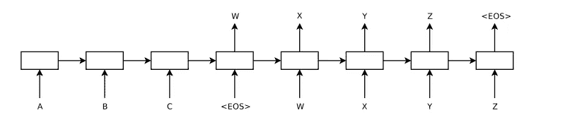

# 神经机器翻译:内部工作，Seq2Seq 和变压器

> 原文：<https://towardsdatascience.com/neural-machine-translation-inner-workings-seq2seq-and-transformers-229faff5895b?source=collection_archive---------6----------------------->

## 与传统的机器翻译模型相反，序列对序列模型能够在平行语料库的帮助下映射语言之间的关系。

翻译的注意力地图

# 介绍

最近，我有机会在一个学期项目中使用神经机器翻译(NMT)架构。玩最先进的模型很有趣。所以我决定写我的第一篇关于它的媒体文章，让对 NMT 感兴趣的人，或者更一般的机器学习+自然语言处理，受益并训练他们的定制模型。(对于西班牙语使用者，您可以参考参考资料中的链接。西班牙语词典:[7])

我将尽力涵盖以下主题:

*   什么是**机器翻译**？****NMT**如何尝试解决？**
*   ****序列到序列架构**是如何工作的？它能解决什么问题？**
*   **最先进的 NMT(实际上是序列对序列)模型，主要是带有注意机制的 **RNNs 和**变压器**(重点是**注意机制**和**自注意**)。****
*   **什么是**字节对编码** (BPE)？它如何帮助我们完成翻译任务？**
*   **如何评价 NMT 系统公司？注意力地图的可解释性。**
*   **最后，我将展示如何使用附带的存储库来训练您的定制模型。**

## **什么是**机器翻译？****NMT**如何尝试解决？**

**让我们首先确定我们试图与 NMT 解决的问题。我们可以将机器翻译任务视为对条件概率 **P(y|x)** 进行建模，其中 *x* 和 *y* 分别指输入和输出句子。我们本质上想要实现的是，对于语言 *X* 中的给定句子 *x* ，我们想要找到另一种语言 *Y* 中的最佳句子 *y* 。我们可以把这个目标正式写成 Eq。1，也就是我们要找到最大化条件概率 P 的输出句子*y*(*y*|*x*)。我们可以使用贝叶斯规则将这个目标重写为 P(*x*|*y*)P(*y*)。**

****

**等式 1**

**这里 P( *x* | *y* )模拟翻译模型，即单词和短语如何翻译，P( *y* )模拟目标语言模型，即 *Y* 。我们可以将后一种概率视为给输出句子一个*流畅性*分数，例如 P(“我正在学习”)> P(“我正在学习”)。我们可以使用一些方法来创建一个语言模型 P( *y* )。更困难的问题是如何构建翻译模型 P( *x* | *y* )。我们可以利用包含大量句子对的翻译语料库。有尝试找到翻译模型的统计机器翻译方法。但这是一个微妙的问题。一种语言本身是复杂而模糊的，然而我们试图用另一种语言来表达一个句子的意思，即使是简单的句子也是很棘手的。考虑以下土耳其语的例子*" yarn al ACA iam "*，翻译过来就是"我明天会学习"。图 1 展示了这两个句子之间的对齐。**

****

****图 1:** 多对一对齐**

**土耳其语是一种粘合性语言。因此，一个单词可能由几个后缀组成，这些后缀会显著影响句子的语义。在这个例子中，单词*“al ACA m”*可以分成以下记号:“al+acak+m”，对于简单的单词到单词的对应，分别指*学习、will 和 I* 。如你所见，提取这两个简单句子之间的关系甚至很困难。现在考虑一下，如果像中文这样更复杂的语言出现在游戏中会发生什么？**

**有一些统计机器翻译方法试图映射语言之间的关系。但这篇文章旨在解释神经机器翻译如何解决这个问题。提示:NMT 直接模拟 P( *y* | *x* )。**

## **神经机器翻译和序列到序列**

**2014 年，Sutskever 等人提出了自然语言处理应用的序列对序列架构[1]。最初的架构由一对递归神经网络组成:(1)第一个 RNN 负责对输入序列进行编码，称为**编码器**，(2)第二个 RNN 获取编码向量并生成目标序列。注意，我们把输入和输出称为序列，而不是句子。是为了防止我们把自己仅仅局限在自然语言相关的问题上。图 2 显示了相应的架构，其中输入序列“*A B C*”*被映射到“W *X Y Z* ”。***

******

*****图 2:** 序列对序列架构[1]***

***我们可以在许多情况下利用序列到序列架构，例如***

*   *****摘要:**给定一个长段落(例如，新闻、一本书的一章、一篇文章)，生成它的摘要。***
*   *****机器翻译**(咄！):给定一个来自源语言的句子，用另一种目标语言生成相应的句子。***
*   *****问答:**给定一段文字和一个关于它的问题，为这个问题生成一个答案。***
*   *****语法错误纠正:**给定一个可能有语法或拼写错误的句子，通过纠正错误来生成正确的句子。***
*   ***这个清单可以一直列下去。其他有趣的应用领域可以很容易地提出来，例如，给定一个哼唱→生成音乐，代码生成(不用担心软件人；模型产生的 bug 比我们多:p)。你可以提出的任何序列到序列的问题都可以用这个架构来建模。***

***我不会深入研究递归神经网络。因为有大量的资源解释它们是如何工作的。但简而言之，它们逐个符号地处理输入序列。"为什么不一次处理所有的代币？"你问。让我们继续讨论自然语言。显然，句子的顺序很重要。**递归**神经网络使我们能够对有序输入(如时间序列)进行建模。考虑下面这个函数:*h*= f(*x*t14】，h⁰ )其中 x 是第一个字，h⁰是初始隐藏状态。在处理下一个单词 x 时，我们有 *h* =f( *x，h* )。将先前的隐藏状态 *h* 考虑在内使得我们能够在对当前单词建模时使用过去的信息。你意识到我们传递给解码器的是什么了吗？如果输入的句子由 6 个单词组成，那么我们将通过第 6 个隐藏状态 h⁶。还有其他方法来增强这种表示，如双向 RNNs，长短期记忆，门控循环单位。但是让我们坚持最简单的情况。解码器现在有了可以用作初始隐藏向量 *h⁰* 的编码向量，并开始解码输出句子。起初可能不清楚，但在架构中存在瓶颈。假设我们使用 128 维向量来表示隐藏单元。这意味着传递给解码器的编码向量也是 *128-* 维的，参见图 3。现在考虑两个输入句子，一个有几个简单的单词，另一个有复杂的单词和子句。用相同的维数对这两句话进行编码公平吗？测评分数说不是。那么我们如何克服这个问题呢？***

******

*****图 3:** RNN 编码器和解码器***

## ***注意机制***

***如前所述，使用固定长度的向量会导致模型出现瓶颈。模型没有太多空间将信息从编码器传递到解码器，同时，反向传播不能完全向后传递梯度。为了缓解这种情况，Bahdanau 等人采用了**注意机制**，以便解码器可以在生成下一个令牌时查看相关的源令牌[2]。让我们用图 4 所示的例子来解释注意机制。根据前面的例子，我们有下面的输入句子*。该模型已经生成了前三个令牌:*【我将学习】*，现在我们期待它生成*【明天】*。我们使用解码器的最后一个隐藏表示 *u* 以及输入令牌的隐藏表示[ *h，h* ]并计算它们之间的点积。到底什么是点积？它告诉我们两个向量有多少指向相同的方向→它们有多少相关性→相应的记号彼此有多相关。在这个非常具体的例子中，单词 *tomorrow* 与输入标记*yarn*完全匹配，因此我们得到更高的点积分数。这些分数是未标准化的，因此我们通过一个 **softmax** 函数来传递它们，以获得输入令牌的最终概率分布。我们使用概率分布来获得输入令牌的**加权和。在这里，最相关的令牌是*亚龙*；因此与第二个输入令牌相比，它具有相对较高的分数。然后，我们使用这个加权和来预测下一个令牌，而不是直接使用解码器隐藏表示。******

********

******图 4:** 注意 RNN 编码器和解码器****

****注意机制显著提高了许多序列间应用的模型性能。但是人们并没有就此止步，更强有力的方法已经被提出。****

# ****变形金刚****

****Vaswani 等人看到了注意机制的效果，提出了神经机器翻译的这个模型[3](尽管它可以应用于其他 seq2seq 任务)。变换器在高层次上与前面的序列到序列模型相同，具有编码器-解码器对。编码器对输入序列进行编码，解码器生成输出序列。然而，他们发现了一种使用编码器内的注意力机制的方法，称为**自我注意力机制。我们已经看到，注意力机制帮助我们在编码器-解码器对之间双向有效地传递信息。**自我关注**此外，帮助编码器更有效地编码序列。******

********

******图 5:** 自我关注****

****图 5 说明了自我关注机制所需的步骤。让我们解释一下到底发生了什么:****

1.  ****我们有了输入序列*德米尔约鲁*，我们得到了标记*德米尔*和*约鲁*的嵌入。我们将这些嵌入投射到三个独立的空间，即**查询、键、**和**值**。(*项目*是用矩阵相乘的奇特说法)****
2.  ****我们获取特定令牌的查询向量，并计算该查询向量与所有关键向量之间的点积。这是对输入序列中所有标记的查询向量进行的。人们把这个过程称为****一个令牌的查询向量兼顾其他令牌*** 。你已经意识到什么了吗？我们不需要前一个令牌的隐藏状态来计算当前令牌的隐藏状态。这意味着我们可以为输入序列中的所有记号并行运行自我关注**和**。这大大加快了训练和推理时间。*****
3.  ****现在我们有了输入序列中每个标记对之间的原始分数。我们将它们通过 **softmax** 层，以便标准化分数。****
4.  ****softmax 层的输出是输入令牌的概率分布。我们使用这些标准化分数来获得**值**向量的加权和(为每个令牌单独计算)。****

****更具体地说，假设位置 *i* 处的令牌与位置 *j* 处的另一个令牌密切相关。我们期望令牌 *i* 的查询向量和令牌 *j* 的密钥向量之间的点乘积比其他无关令牌更大。这意味着在随后的步骤中，标记 *j* 将在构造标记 *i* 的输出表示时具有更大的影响。我们可以称输出表示为**上下文单词嵌入**。因为表示是相对于上下文创建的。理想情况下，我们会期望下面两句话中 ***键*** 这个词的上下文嵌入是不一样的:(1)我在开门的时候弄坏了*键*。(2)演讲中的*要点*不清楚。****

## ****字节对编码****

****在进入翻译部分之前，我认为先谈谈 BPE 的方法是有益的。NMT 系统面临的最大问题之一是词汇量不足(OOV)。我们知道我们对词汇表中的每个单词都使用了嵌入。假设我们使用 *512 维*向量来嵌入土耳其语单词。*与最先进的模型相比，512 维的*向量实际上并不算大。正如我们前面说过的，土耳其语是粘合性的，它在形态上相当复杂。通过引入后缀来派生新词是相当容易的。考虑下面这个单词"*凝胶"*，意思是"*来"*。我们可以很容易地生成以下词语:*“gel+ECEé+im”*表示*“我会来的”*。如果我们要引入一个全新的单词，每一次在一个现有的单词后面添加一个后缀，词汇量将很容易超过 *300K* 。假设我们使用单精度浮点格式来存储向量。那就意味着光是字嵌入矩阵就需要 *300，000 * 512 * 4* 字节或者 *~600 MB* 的存储空间，更不用说模型的其余部分了。BPE 方法在大型文本语料库的帮助下，以无监督的方式学习这些后缀和语素。BPE 方法最初是作为一种压缩算法提出的。但是森里奇等人有一个绝妙的主意，用它来解决 OOV 问题[4]。对于 BPE 来说，单词*“geleceim”*最好被标记为*“geleceim”。*****

## ******用自回归模型进行转换******

****到目前为止，我们已经了解了序列到序列模型的来龙去脉。但是实际的翻译是如何进行的呢？让我们使用图 6 所示的翻译示例。我们有输入序列*“d ark mak ijin hava souk deil mi？”。为了简化幻灯片，我合并了相关的 BPE 令牌。回到这个例子，我们用 Transformer 编码器对输入序列进行编码。一旦我们完成了，我们用一个人工令牌 *< start >* 给变压器解码器，让它生成下一个令牌。解码器使用初始令牌以及输入序列令牌来开始生成目标令牌。它生成的第一个令牌是“ *it”。*这一次我们使用解码器的输出，即*“it*”，并向它提供先前的令牌，并期望它生成下一个令牌。这个过程继续进行，直到模型生成另一个人工标记，即 *< eos >* (代表句尾)来指示翻译完成。*****

******

*****图 6:** *自回归*平移***

## ***注意力地图***

***现在，为什么箭头的粗细在平移过程中的每一步都会发生变化？这是注意力机制的优势之一。深度学习有如此多的内部机制有待解释清楚。大多数系统仍被视为黑匣子。我们知道他们擅长提取更高级更复杂的表示。但是我们不确定为什么他们在某些情况下决定了一些事情。注意力机制稍微缓解了这个问题，并为模型带来了一些可解释性。在翻译过程中的每一步，**我们都知道在特定时间步**生成令牌时，哪些输入令牌最有影响力。我们可以利用这些信息来推断单词之间的关系。***

******

*****图七**:注意地图***

***图 7 显示了图 6 所示翻译示例的注意力图。列对应于输入序列，行对应于生成的序列。每一行属于一个特定的时间步长。例如，对应于*“冷”*的 *4* 行主要受输入令牌*“hava souk”*的影响。正如我们将在结果部分看到的，Transformer 架构采用了多个注意力头。因此，我们最终得到了多个注意力地图。***

# ***结果***

***我们应该如何评价一个神经机器翻译系统？想想那个著名的例子*“我做了她的鸭子”。你会如何翻译这句话？以下是一些翻译:****

*   ***我给她做了一只鸭子。***
*   ***我做了一只属于她的鸭子。***
*   ***我做了一只(玩具)鸭子给她。***
*   ***我把她变成了一只鸭子。(魔法)***
*   ***我把她变成了鸭子(作为动词)。(有东西在靠近)***

***我想说的是，自然语言是模糊的。指望机器完全理解它，而人类却在努力相互理解，这是不公平的。回到问题，你会如何评价这个翻译？注释器本身是有偏见的，并假设在创建数据集时；她饿了。于是她用第一句话来翻译句子。我们的模型，后来，产生了一个其他的选项，都是正确的，因为我们不知道这里的上下文。显然，精确匹配是非常幼稚的，因为它甚至会因为一个不同的单词选择而惩罚整个翻译。或者，人们大多使用 BLEU(双语评价替角)评分。它在*【0，1】*，之间产生一个分数，在某些情况下，为了方便起见，我们用*乘以 100* 。它使用 n 元语法(主要是 1、2、3 和 4)来评估翻译，并使用一些额外的内部技巧。但是这个评估机制在这个例子中也可能会稍微失败。总的来说，评估一个 NMT 系统是一个微妙的问题，人们应该预料到 BLEU 分数的增加并不一定意味着翻译质量的提高。您可以在表 1 中找到在这个项目中所做的实验的结果，其中将带有 GRU 的 seq2seq 模型与 Transformer 模型进行了比较。数据集不包含很长的句子，所以任务相当简单。但是，即使只有一半的参数大小，Transformer 模型也能够比基线模型实现得更好。***

******

*****表 1**:seq 2 seq 与 RNNs 和变压器的对比***

## ***实验***

***这是我想象过的一些注意力地图。您可以查看不同的矩阵，以了解模型如何以不同的方式处理输入序列。***

*   *****输入:***gelemeyecekmiz。* ***输出:*** *我们来不了了。****
*   *****输入:***otobüsüka RS AK tren le gidebiliriz。* ***输出:*** *如果错过了公交车，我们可以坐火车去。****
*   *****输入:***Tom dün gece arabay ok hzl kulland。ecel ter leri dktüm* ***输出:*** *汤姆昨晚用车很快。我洒了很多黄油。:)****
*   *****输入:***Tom dün gece arabay ok hzl kulland。bu yüzden ona ok k \zd \u m .* ***输出:*** *汤姆昨晚用车很快，我很生他的气。****
*   *****输入:***geen gün park ta k pek gr dum . Bir an Bana sald racak sandm .* ***输出:*** *我昨天在公园看到一只狗，我以为它会攻击我。****

******

*****图 8:** 变压器注意图***

***写下一篇文章的每一个细节并不容易。但是如果你对这篇文章感兴趣，并且想更深入地了解这个话题，下面的列表将是一个很好的开始阅读的起点:***

1.  ***Sutskever 等人的 Seq2seq 论文“用神经网络进行序列间学习”[1]。***
2.  ***Bahdanau 等人的注意机制“通过联合学习对齐和翻译的神经机器翻译”[2]。***
3.  ***BPE 和子词单元，由森里奇等人所著，《带有子词单元的稀有词的神经机器翻译》[4].***
4.  ***瓦斯瓦尼等人的《变形金刚》，“注意力是你所需要的一切”[3]。***
5.  ***斯坦福 CS224n:深度学习的自然语言处理***

# ***训练自定义变压器 NMT 模型***

***我将提供源代码、使用的数据集、标记器和一个经过训练的模型，供对这个主题感兴趣的人使用。你可以在[https://github.com/azadyasar/NeuralMachineTranslation](https://github.com/azadyasar/NeuralMachineTranslation)知识库阅读更多关于如何培训、评估和翻译的细节。***

## ***资料组***

***一个英语-土耳其语平行语料库被用作数据集。数据集是由[5]从 Tatoeba 网站上提取的。数据集由大约 50 万对句子组成。我们有一个想法，如何通过使用电影字幕来扩大数据集的大小。但是我们没有足够的时间去做这件事。对于所有的实验，我们将数据集分别分成大小为 416，038，46，227 和 51，363 的训练集、验证集和测试集。***

***因为数据集不是很大；它包含在存储库中的*数据/* 文件夹下。当您解压缩压缩文件时，您将获得三个独立的 tsv 文件，分别对应于训练、验证和测试数据集。***

## ***字节对编码记号赋予器***

***这些记号赋予器是记号化输入和输出序列所必需的。我们也在*数据/* 文件夹中提供它们。以*结尾的文件。型号*是以*结尾的分词器型号和文件。vocab* 包含特定记号赋予器的词汇表。如果你有一个更大更相关的语料库并且愿意训练你的自定义标记器。使用 *train_bpe.py* 脚本。***

## ***培养***

***下面是训练自定义模型的命令。它会自动检测是否有可用的 GPU，并使用一个可用的。否则，它将使用不推荐的 CPU。***

***训练部***

***一旦模型顺利开始训练，您应该会看到以下日志。***

******

***培训日志***

## ***评估和翻译***

***您可以使用以下命令评估已训练的模型。我们需要模型超参数在加载前首先构建它。所以请确保它们与实际相符。***

***发出以下命令来交互式翻译句子。***

***运行翻译脚本时，系统会提示您键入一个句子，如下所示:***

******

*****互动翻译*****

## ***结论***

***我希望这篇文章是有帮助和信息的。我将很快在资源库中提供一个新的 RNN +注意力模型实现。如果你遇到任何错误，或者有什么不对劲的地方，让我知道，这样我也可以试着弥补它们。***

## ***参考***

1.  ***伊利亚·苏茨基弗、奥里奥尔·维尼亚尔斯和阔克·V·勒。用神经网络进行序列间学习。在 Z. Ghahramani、M. Welling、C. Cortes、N. Lawrence 和 K. Q. Weinberger 编辑的《神经信息处理系统进展》,第 27 卷，第 3104-3112 页。柯伦联合公司，2014 年。***
2.  ***Dzmitry Bahdanau、Kyunghyun Cho 和 Yoshua Bengio。通过联合学习对齐和翻译的神经机器翻译。更正，abs/1409.0473，2015 年。***
3.  ***Ashish Vaswani、Noam Shazeer、Niki Parmar、Jakob Uszkoreit、Llion Jones、Aidan Gomez、Lukasz Kaiser 和 Illia Polosukhin。你需要的只是关注。在 I. Guyon、U. V. Luxburg、S. Bengio、H. Wallach、R. Fergus、S. Vishwanathan 和 R. Garnett 编辑的《神经信息处理系统进展》,第 30 卷，第 5998-6008 页。柯伦联合公司，2017 年。***
4.  ***里科·森里奇、巴里·哈多和亚历山德拉·伯奇。具有子词单元的生僻字的神经机器翻译。《计算语言学协会第 54 届年会论文集》(第 1 卷:长篇论文)，第 1715-1725 页，德国柏林，2016 年 8 月。计算语言学协会。***
5.  ***雅各布·乌兹科雷特。制表符分隔的双语句子对【http://www.manythings.org/anki/,】于 2021 年 1 月 30 日到达。***
6.  ***https://github.com/azadyasar/NeuralMachineTranslation[NMT 变压器实施](https://github.com/azadyasar/NeuralMachineTranslation)***
7.  ***trad ucción a espa ol aquí:[https://www . ibidemgroup . com/edu/trad ucci on-automatica-neuron-seq 2 seq-transformers/](https://www.ibidemgroup.com/edu/traduccion-automatica-neuronal-seq2seq-transformers/)***