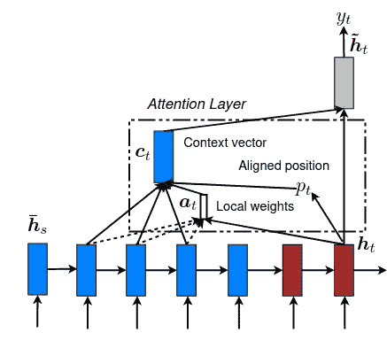
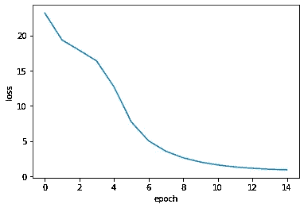

# 使用 Seq2Seq 架构和注意力的神经机器翻译

> 原文：<https://towardsdatascience.com/neural-machine-translation-using-a-seq2seq-architecture-and-attention-eng-to-por-fe3cc4191175?source=collection_archive---------23----------------------->

## [实践教程](https://towardsdatascience.com/tagged/hands-on-tutorials)

## 基于 Tensorflow 和 Keras 的深度学习应用

# 1.介绍

神经机器翻译(NMT)是一种用于自动翻译的端到端学习方法[【1】](https://arxiv.org/abs/1609.08144)。它的优势在于它直接学习从输入文本到相关输出文本的映射。它已被证明比传统的基于短语的机器翻译更有效，传统的基于短语的机器翻译需要更多的努力来设计模型。另一方面，NMT 模型的训练成本很高，尤其是在大规模翻译数据集上。由于使用了大量的参数，它们在推理时也要慢得多。其他限制是它在翻译罕见单词和无法翻译输入句子的所有部分时的鲁棒性。为了克服这些问题，已经有一些解决方案，比如利用注意机制复制生僻字[【2】](https://arxiv.org/abs/1412.2007)。

通常，NMT 模型遵循通用的序列到序列学习架构。它由一个编码器和一个解码器递归神经网络(RNN)组成(关于如何设置 RNN 的简单示例，请参见[【3】](/generating-text-with-recurrent-neural-networks-based-on-the-work-of-f-pessoa-1e804d88692d))。编码器将输入句子转换成向量列表，每个输入一个向量。给定这个列表，解码器一次产生一个输出，直到产生特殊的句子结束标记。

我们的任务是使用中等规模的示例对语料库，为英语输入句子生成葡萄牙语翻译。我们使用序列到序列架构来构建我们的 NMT 模型。对于编码器 RNN，我们使用一种预训练的嵌入，一种在英文 Google News 200B 语料库[【4】](https://tfhub.dev/google/tf2-preview/nnlm-en-dim128)上训练的基于令牌的文本嵌入。另一方面，我们在解码器 RNN 中训练自己的嵌入，词汇量设置为语料库中唯一葡萄牙语单词的数量。由于模型的复杂架构，我们实现了一个定制的训练循环来训练我们的模型。

本文使用了一个由 170，305 对英语和葡萄牙语句子组成的数据集[【5】](https://www.kaggle.com/luisroque/engpor-sentence-pairs)。这些数据来自 Tatoeba.org，一个由志愿者翻译成多种语言的大型例句数据库。

和往常一样，代码和数据也可以在我的 [GitHub](https://github.com/luisroque/deep-learning-articles) 上获得。

本文属于使用 TensorFlow 进行深度学习的系列文章:

*   [迁移学习和数据增强应用于辛普森图像数据集](/transfer-learning-and-data-augmentation-applied-to-the-simpsons-image-dataset-e292716fbd43)
*   [基于 F. Pessoa 的工作用递归神经网络生成文本](/generating-text-with-recurrent-neural-networks-based-on-the-work-of-f-pessoa-1e804d88692d)
*   [使用 Seq2Seq 架构和注意力的神经机器翻译(ENG to POR)](/neural-machine-translation-using-a-seq2seq-architecture-and-attention-eng-to-por-fe3cc4191175)
*   [残差网络从无到有应用于计算机视觉](/residual-networks-in-computer-vision-ee118d3be68f)

# 2.预处理

我们首先在葡萄牙语的每个句子中添加两个特殊的记号，一个`<start>`和`<end>`记号。它们被用来向解码 RNN 发送一个句子的开始和结束的信号。接下来，我们标记葡萄牙语句子，并用零填充句子的结尾。

```
import pandas as pd
import numpy as np
import tensorflow as tf
import tensorflow_hub as hub
from sklearn.model_selection import train_test_split
from tensorflow.keras.layers import Layer
import matplotlib.pyplot as pltNUM_EXAMPLES = 100000
data_examples = []
with open('por.txt', 'r', encoding='utf8') as f:
    for line in f.readlines():
        if len(data_examples) < NUM_EXAMPLES:
            data_examples.append(line)
        else:
            break

df = pd.DataFrame(data_examples, columns=['all'])
df = df['all'].str.split('\t', expand=True)

df.columns = columns=['english', 'portuguese', 'rest']

df = df[['english', 'portuguese']]

df['portuguese'] = df.apply(lambda row: "<start> " + row['portuguese'] + " <end>", axis=1)

tokenizer = tf.keras.preprocessing.text.Tokenizer(filters='')

tokenizer.fit_on_texts(df['portuguese'].to_list())

df['portuguese_tokens'] = df.apply(lambda row: 
                        tokenizer.texts_to_sequences([row['portuguese']])[0], axis=1)

# Print 5 examples from each language

idx = np.random.choice(df.shape[0],5)

for i in idx:
    print('English')
    print(df['english'][i])

    print('\nportuguese')
    print(df['portuguese'][i])
    print(df['portuguese_tokens'][i])
    print('\n----\n')

portuguese_tokens = tf.keras.preprocessing.sequence.pad_sequences(df['portuguese_tokens'].to_list(),
                                                 padding='post',
                                                 value=0)English
Have you ever taken singing lessons?

portuguese
<start> Você já fez aulas de canto? <end>
[1, 10, 60, 100, 1237, 8, 19950, 2]

----

English
Tom rode his bicycle to the beach last weekend.

portuguese
<start> O Tom foi à praia de bicicleta no último fim de semana. <end>
[1, 5, 3, 34, 61, 1243, 8, 696, 28, 869, 551, 8, 364, 2]

----

English
I have to go to sleep.

portuguese
<start> Tenho que ir dormir. <end>
[1, 45, 4, 70, 616, 2]

----

English
I have already told Tom that Mary isn't here.

portuguese
<start> Eu já disse a Tom que Maria não está aqui. <end>
[1, 7, 60, 50, 9, 3, 4, 106, 6, 13, 88, 2]

----

English
If Tom was hurt, I'd know it.

portuguese
<start> Se Tom estivesse ferido, eu o saberia. <end>
[1, 21, 3, 602, 10016, 7, 5, 16438, 2]

----
```

## 2.1 预训练嵌入层

对于编码器和解码器 rnn，我们需要定义嵌入层来将我们的单词索引转换成固定大小的密集向量。对于解码器 RNN，我们训练自己的嵌入。对于编码器 RNN，我们使用来自 Tensorflow Hub 的预训练英语单词 embedding。这是一个基于标记的文本嵌入，在英文谷歌新闻 200B 语料库上训练。它允许我们利用在非常大的语料库上训练的单词表示，遵循迁移学习的原则(参见[【6】](/transfer-learning-and-data-augmentation-applied-to-the-simpsons-image-dataset-e292716fbd43)的扩展定义和对计算机视觉的迁移学习应用)。在把英语句子输入 RNN 之前，我们对它们进行了填充。

```
# Load embedding module from Tensorflow Hub

embedding_layer = hub.KerasLayer("https://tfhub.dev/google/tf2-preview/nnlm-en-dim128/1", 
                                 output_shape=[128], input_shape=[], dtype=tf.string)maxlen = 13def split_english(dataset):
    dataset = dataset.map(lambda x, y: (tf.strings.split(x, sep=' '), y))
    return dataset

def filter_func(x,y):
    return (tf.math.less_equal(len(x),maxlen)) 

def map_maxlen(x, y):
    paddings = [[maxlen - tf.shape(x)[0], 0], [0, 0]]
    x = tf.pad(x, paddings, 'CONSTANT', constant_values=0)
    return (x, y)

def embed_english(dataset):
    dataset = dataset.map(lambda x, y: (embedding_layer(x), y))
    return datasetenglish_strings = df['english'].to_numpy()
english_string_train, english_string_valid, portuguese_token_train, portuguese_token_valid = train_test_split(english_strings, portuguese_tokens, train_size=0.8)

dataset_train = (embed_english(
                        split_english(
                            tf.data.Dataset.from_tensor_slices((english_string_train, portuguese_token_train)))
                                                                .filter(filter_func))
                                                                .map(map_maxlen)
                                                                .batch(16))
dataset_valid = (embed_english(
                        split_english(
                            tf.data.Dataset.from_tensor_slices((english_string_valid, portuguese_token_valid)))
                                                                .filter(filter_func))
                                                                .map(map_maxlen)
                                                                .batch(16))

dataset_train.element_spec(TensorSpec(shape=(None, None, 128), dtype=tf.float32, name=None),
 TensorSpec(shape=(None, 35), dtype=tf.int32, name=None))# shape of the English data example from the training Dataset
list(dataset_train.take(1).as_numpy_iterator())[0][0].shape(16, 13, 128)# shape of the portuguese data example Tensor from the validation Dataset
list(dataset_valid.take(1).as_numpy_iterator())[0][1].shape(16, 35)
```

# 3.编码器递归神经网络

编码器网络是一个 RNN，其工作是将一系列向量 **x** =(x_1，…，x_T)读入向量 *c* ，这样:


其中 *h_t* 为时间 *t* 的隐藏状态， *c* 为隐藏状态序列生成的向量， *f* 和 *q* 为非线性函数。

在定义我们的编码器网络之前，我们引入了一个学习英语语料库的结束标记的 128 维表示(嵌入空间的大小)的层。因此，RNN 的输入维数增加了 1。RNN 由 1024 个单位的长短期记忆(LSTM)层组成。填充值在 RNN 中被屏蔽，因此它们被忽略。编码器是一个多输出模型:它输出 LSTM 层的隐藏状态和单元状态。LSTM 层的输出不用于序列间架构。

```
class EndTokenLayer(Layer):

    def __init__(self, embedding_dim=128, **kwargs):
        super(EndTokenLayer, self).__init__(**kwargs)
        self.end_token_embedding = tf.Variable(initial_value=tf.random.uniform(shape=(embedding_dim,)), trainable=True)

    def call(self, inputs):
        end_token = tf.tile(tf.reshape(self.end_token_embedding, shape=(1, 1, self.end_token_embedding.shape[0])), [tf.shape(inputs)[0],1,1])
        return tf.keras.layers.concatenate([inputs, end_token], axis=1)end_token_layer = EndTokenLayer()inputs = tf.keras.Input(shape=(maxlen, 128))
x = end_token_layer(inputs)
x = tf.keras.layers.Masking(mask_value=0)(x)
whole_seq_output, final_memory_state, final_carry_state = tf.keras.layers.LSTM(512, return_sequences=True, return_state=True)(x)
outputs = (final_memory_state, final_carry_state)encoder_model = tf.keras.Model(inputs=inputs, outputs=outputs, name="encoder_model")
encoder_model.summary()Model: "encoder_model"
_________________________________________________________________
Layer (type)                 Output Shape              Param #   
=================================================================
input_1 (InputLayer)         [(None, 13, 128)]         0         
_________________________________________________________________
end_token_layer (EndTokenLay (None, 14, 128)           128       
_________________________________________________________________
masking (Masking)            (None, 14, 128)           0         
_________________________________________________________________
lstm (LSTM)                  [(None, 14, 512), (None,  1312768   
=================================================================
Total params: 1,312,896
Trainable params: 1,312,896
Non-trainable params: 0
_________________________________________________________________inputs_eng = list(dataset_train.take(1).as_numpy_iterator())[0][0]memory_state, carry_state = encoder_model(inputs_eng)
```

# 4.注意力

我们将要使用的注意力机制是由[【7】](https://arxiv.org/pdf/1409.0473.pdf)提出的。使用注意机制的主要区别在于，我们增加了模型的表达能力，尤其是编码器组件。它不再需要将源句子中的所有信息编码成一个固定长度的向量。上下文向量 *c_i* 然后被计算为:


权重 *α_ij* 计算如下


其中 *e_ij=a(s_i-1，h_j)* 是位置 *j* 周围的输入与位置 *i* 处的输出匹配程度的分数。



图 1:局部注意力模型——该模型首先预测当前目标单词的单个对齐位置 p_t 。然后，以源位置 p_t 为中心的窗口被用于计算上下文向量 c_t，即窗口中源隐藏状态的加权平均值。从当前目标状态 h_t 和窗口中的那些源状态 h_s 推断出权重 a_t。改编自[【8】](https://arxiv.org/pdf/1508.04025v5.pdf)。

```
**class** **Attention**(tf.keras.layers.Layer):
    **def** __init__(self, units):
        super(Attention, self).__init__()
        self.W1 = tf.keras.layers.Dense(units)
        self.W2 = tf.keras.layers.Dense(units)
        self.V = tf.keras.layers.Dense(1)

    **def** call(self, hidden_states, cell_states):
        hidden_states_with_time = tf.expand_dims(hidden_states, 1)

        score = self.V(tf.nn.tanh(
            self.W1(hidden_states_with_time) + self.W2(cell_states)))

        attention_weights = tf.nn.softmax(score, axis=1)

        context_vector = attention_weights * cell_states
        context_vector = tf.reduce_sum(context_vector, axis=1)

        **return** context_vector, attention_weights
```

# 5.解码器递归神经网络

给定上下文向量 *c* 和所有先前预测的字 *y_1，…，y_t-1* ，解码器被训练来预测下一个字 *y_t* ，使得:


其中 **y** =(y_1，…，y_T)。我们使用 RNN，这意味着每个条件概率被建模为


其中 *g* 是非线性函数 *s_t* 是 RNN 的隐藏状态。

对于解码器 RNN，我们定义了一个嵌入层，其词汇大小设置为唯一葡萄牙语标记的数量。在该嵌入层之后是具有 1024 个单元的 LSTM 层和具有与独特葡萄牙语令牌的数量相等的单元数量且没有激活功能的密集层。请注意，尽管网络相当浅，因为我们只使用了一个递归层，我们最终有近 24M 的参数进行训练。

```
import json
word_index = json.loads(tokenizer.get_config()['word_index'])

max_index_value = max(word_index.values())class decoder_RNN(tf.keras.Model):
    def __init__(self, **kwargs):
        super(decoder_RNN, self).__init__()
        self.embed = tf.keras.layers.Embedding(input_dim=max_index_value+1, output_dim=128, mask_zero=True)
        self.lstm_1 = tf.keras.layers.LSTM(1024, return_sequences=True, return_state=True)
        self.dense_1 = tf.keras.layers.Dense(max_index_value+1)
        self.attention = Attention(1024)def call(self, inputs, training=False, hidden_state=None, cell_state=None):
        context_vector, attention_weights = self.attention(hidden_state, cell_state)
        x = self.embed(inputs)
        x = tf.concat([tf.expand_dims(context_vector, 1), x], axis=-1)x, hidden_state, cell_state = self.lstm_1(x)
        x = self.dense_1(x)
        return xdecoder_model = decoder_RNN()decoder_model(inputs = tf.random.uniform((16, 1)), hidden_state = memory_state, cell_state = carry_state)
decoder_model.summary()Model: "decoder_rnn" _________________________________________________________________ Layer (type)                 Output Shape              Param #    ================================================================= embedding_1 (Embedding)      multiple                  1789568    _________________________________________________________________ lstm_3 (LSTM)                multiple                  6819840    _________________________________________________________________ dense_4 (Dense)              multiple                  14330525   _________________________________________________________________ attention_1 (Attention)      multiple                  1051649    ================================================================= Total params: 23,991,582 
Trainable params: 23,991,582 
Non-trainable params: 0 
_________________________________________________________________
```

# 6.培养

为了训练一个具有序列到序列架构的模型，我们需要定义一个定制的训练循环。首先，我们定义了一个函数，将葡萄牙语语料库分成输入和输出张量，然后输入到解码器模型。其次，我们创建了完整模型的向前和向后传递。我们将英文输入传递给编码器，以获得编码器 LSTM 的隐藏和单元格状态。这些隐藏和单元状态随后与葡萄牙语输入一起被传递到解码器。我们定义了损失函数，该函数是在解码器输出和先前分离的葡萄牙语输出之间计算的，并且计算了关于编码器和解码器可训练变量的梯度。最后，我们将训练循环运行了规定数量的时期。它遍历训练数据集，从葡萄牙语序列创建解码器输入和输出。然后，它计算梯度并相应地更新模型的参数。

模型训练起来相当慢，即使使用 GPU 也是如此。回想一下，我们甚至没有在任何 rnn 中堆叠层，这将减少我们的损失，但同时，使我们的模型更难训练。我们可以从下面的图中看到，训练和验证都随着时间的推移而稳步减少。

```
def portuguese_input_output(data):
    return (tf.cast(data[:,0:-1], tf.float32), tf.cast(data[:,1:], tf.float32))optimizer_obj = tf.keras.optimizers.Adam(learning_rate=0.001)
loss_obj = tf.keras.losses.SparseCategoricalCrossentropy(from_logits=True)[@tf](http://twitter.com/tf).function
def grad(encoder_model, decoder_model, english_input, portuguese_input, portuguese_output, loss):
    with tf.GradientTape() as tape:
        loss_value = 0
        hidden_state, cell_state = encoder_model(english_input)
        dec_input = tf.expand_dims([word_index['<start>']] * 16, 1)# Teacher forcing - feeding the target as the next input
        for t in range(1, portuguese_output.shape[1]):
            predictions = decoder_model(dec_input, hidden_state = hidden_state, cell_state = cell_state)loss_value += loss(portuguese_output[:, t], predictions)# using teacher forcing
            dec_input = tf.expand_dims(portuguese_output[:, t], 1)grads = tape.gradient(loss_value, encoder_model.trainable_variables + decoder_model.trainable_variables)
    return loss_value, gradsdef train_model(encoder_model, decoder_model, num_epochs, train_dataset, valid_dataset, optimizer, loss, grad_fn):
    inputs = (14,)
    train_loss_results = []
    train_loss_results_valid = []
    for epoch in range(num_epochs):
        start = time.time()epoch_loss_avg = tf.keras.metrics.Mean()

        for x, y in train_dataset:
            dec_inp, dec_out = portuguese_input_output(y)
            loss_value, grads = grad_fn(encoder_model, decoder_model, x, dec_inp, dec_out, loss)
            optimizer.apply_gradients(zip(grads, encoder_model.trainable_variables + decoder_model.trainable_variables))
            epoch_loss_avg(loss_value)train_loss_results.append(epoch_loss_avg.result())

        print("Epoch {:03d}: Loss: {:.3f}".format(epoch,
                                                  epoch_loss_avg.result()))
        print(f'Time taken for 1 epoch {time.time()-start:.2f} sec\n')
    return train_loss_resultsnum_epochs=15
train_loss_results = train_model(encoder_model, decoder_model, num_epochs, dataset_train, dataset_valid, optimizer_obj, loss_obj, grad)plt.plot(np.arange(num_epochs), train_loss_results)
plt.ylabel('loss')
plt.xlabel('epoch');
```



图 2:seq 2 seq 模型几个时期的损失演变。

# 7.结果

为了测试我们的模型，我们定义了一组英语句子。为了翻译句子，我们首先预处理和嵌入句子，就像我们处理训练集和验证集一样。接下来，我们通过编码器 RNN 传递嵌入的句子，以获得隐藏和单元格状态。从特殊的`"<start>"`令牌开始，我们使用该令牌和编码器网络的最终隐藏和单元状态从解码器获得一步预测和更新的隐藏和单元状态。之后，我们创建了一个循环来获得下一步预测，并使用最近的隐藏和单元状态从解码器更新隐藏和单元状态。当发出`"<end>"`标记或句子达到定义的最大长度时，循环终止。最后，我们将输出的令牌序列解码成葡萄牙语文本。

获得的翻译相当不错。一个有趣且更复杂的例子是输入*‘你还在家吗？’。*一个问题有非常清晰的语法规则，其中一些是特定于语言的。返回的翻译*‘你在家吗？’*表明该模型能够捕捉这些特异性。

```
english_test = ['that is not safe .',  
                'this is my life .',  
                'are you still at home ?',  
                'it is very cold here .']english_test_emb = embed_english(split_english(tf.data.Dataset.from_tensor_slices((english_test, portuguese_token_train[:len(english_test),:])))).map(map_maxlen).batch(1)total_output=[]

for x, y in english_test_emb:
    hidden_state, cell_state = encoder_model(x)
    output_decoder = decoder_model(inputs = np.tile(word_index['<start>'], (1, 1)), hidden_state = hidden_state, cell_state = cell_state)
    output=[]
    output.append(output_decoder)
    for i in range(13):
        if tf.math.argmax(output_decoder, axis=2).numpy()[0][0] == 2: # <end> character
            break
        output_decoder = decoder_model(inputs = tf.math.argmax(output_decoder, axis=2), hidden_state = hidden_state, cell_state = cell_state)
        output.append(output_decoder)
    total_output.append(output)total_output_trans = []
for j in range(test_size):
    output_trans = []
    for i in range(len(total_output[j])):
        output_trans.append(tf.math.argmax(total_output[j][i], axis=2).numpy()[0][0])
    total_output_trans.append(output_trans)output_trans = np.array([np.array(xi) for xi in total_output_trans], dtype=object)portuguese_trans_batch=[]
inv_word_index = {v: k for k, v in word_index.items()}
for i in range(output_trans.shape[0]):
    portuguese_trans_batch.append(' '.join(list(np.vectorize(inv_word_index.get)(output_trans[i]))))list(english_test)['that is not safe .',  
 'this is my life .',  
 'are you still at home ?',  
 'it is very cold here .']portuguese_trans_batch['nao e seguro .',  
 'e a minha vida .',  
 'ainda esta em casa ?',  
 'muito frio aqui .']
```

# 8.结论

NMT 模型的架构非常具有挑战性，需要大量的定制工作，例如在其培训过程中。当在非常大的语料库中使用预先训练的嵌入来嵌入英语序列时，我们使用迁移学习的原理。另一方面，我们为用作解码器网络输入的葡萄牙语开发了自己的嵌入功能。编码器和解码器 rnn 保持尽可能简单，因为训练该模型在计算上是昂贵的。

我们生成了从英语文本到葡萄牙语的翻译，除了提供英语和葡萄牙语的句子对来训练我们的模型之外，没有提供任何东西。该模型理解肯定和否定，重要的语法区别，如在建立一个疑问类型的从句时，并能够解释语法规则，如英语中常用的主语-助词倒装，不能直接翻译成葡萄牙语。

这种方法可以通过增加模型的深度和每层中单元的数量来扩展。可以调整批量大小等超参数来提高准确性。还可以测试更广泛的注意力策略。

保持联系: [LinkedIn](https://www.linkedin.com/in/luisbrasroque/)

# 9.参考

[【1】](https://arxiv.org/abs/1609.08144)【吴等人，2016】吴、y、舒斯特、m、陈、z、乐、qv、、m、马切里、w、克里昆、m、曹、y、高、q、马切里、k、克林纳、j、沙阿、a、约翰逊、m、刘、x、祖卡斯凯泽、Gouws、s、加藤、y、工藤、t、和泽、h、史蒂文斯、k、库连、g、帕蒂尔、n、王谷歌的神经机器翻译系统:弥合人类和机器翻译之间的差距。

[【2】](https://arxiv.org/abs/1412.2007)【让等人，2015】让，s .，乔，k .，梅米塞维奇，r .，本吉奥，Y. (2015)。使用超大目标词汇进行神经机器翻译。

[【3】](/generating-text-with-recurrent-neural-networks-based-on-the-work-of-f-pessoa-1e804d88692d)[https://towardsdatascience . com/generating-text-with-recurrent-neural-networks-on-the-work-of-f-pes SOA-1e 804d 88692d](/generating-text-with-recurrent-neural-networks-based-on-the-work-of-f-pessoa-1e804d88692d)

[【4】](https://tfhub.dev/google/tf2-preview/nnlm-en-dim128)[https://tfhub.dev/google/tf2-preview/nnlm-en-dim128](https://tfhub.dev/google/tf2-preview/nnlm-en-dim128)

[【5】](https://www.kaggle.com/luisroque/engpor-sentence-pairs)【https://www.kaggle.com/luisroque/engpor-sentence-pairs】T2

[【6】](/transfer-learning-and-data-augmentation-applied-to-the-simpsons-image-dataset-e292716fbd43)[https://towards data science . com/transfer-learning-and-data-augmentation-applied-to-the-Simpsons-image-dataset-e 292716 FBD 43](/transfer-learning-and-data-augmentation-applied-to-the-simpsons-image-dataset-e292716fbd43)

[7] [Bahdanau 等人，2016 年]bahda nau d . Cho k .和 beng io y .(2016 年)。通过联合学习对齐和翻译的神经机器翻译。

[8] [Luong 等人，2015 年] Luong，m-t .，Pham，h .和 Manning，C. D. (2015 年)。基于注意力的神经机器翻译的有效方法。